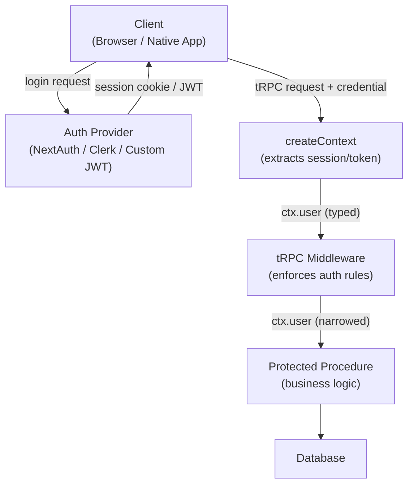

## Implementing Authentication End to End

Authentication in a tRPC application spans multiple layers — session management, context injection, middleware enforcement, and client-side token handling. Unlike REST frameworks where auth middleware is applied globally at the HTTP level, tRPC's authentication model is procedure-level, composable, and fully type-aware. This topic covers a complete implementation from session creation through protected procedure access.

---

### Authentication Architecture Overview



**Key Points**

- Authentication state enters tRPC exclusively through `createContext` — not through procedure arguments
- Middleware enforces rules on that context — it does not re-authenticate
- Type narrowing in middleware propagates into procedure bodies — `ctx.user` becomes non-nullable after an auth middleware runs
- [Inference] Passing auth tokens as procedure inputs rather than through context is an anti-pattern — it bypasses tRPC's middleware system and produces inconsistent enforcement

---

### Session vs Token-Based Authentication

tRPC is agnostic to the credential mechanism. The two dominant approaches each have different context integration patterns.

| Mechanism | Credential Location | Context Extraction |
|---|---|---|
| Session cookie (NextAuth, Lucia) | HTTP cookie | Read session from server store |
| JWT (custom, Auth.js JWT strategy) | `Authorization` header or cookie | Verify and decode token |
| Third-party token (Clerk, Supabase) | `Authorization` header or cookie | Verify via SDK |

---

### Setting Up the Context

The context is the single entry point for auth state. All credential extraction happens here.

#### NextAuth.js / Auth.js Session Context

```ts
// server/context.ts
import { getServerSession } from 'next-auth';
import { authOptions } from '~/server/auth';
import { db } from '~/server/db';
import type { CreateNextContextOptions } from '@trpc/server/adapters/next';
import type { inferAsyncReturnType } from '@trpc/server';

export async function createContext({ req, res }: CreateNextContextOptions) {
  const session = await getServerSession(req, res, authOptions);

  return {
    db,
    session,
    user: session?.user ?? null,
  };
}

export type Context = inferAsyncReturnType<typeof createContext>;
```

---

#### JWT Context (Custom or Auth.js JWT Strategy)

```ts
// server/context.ts
import { verifyJwt } from '~/lib/jwt';
import type { CreateNextContextOptions } from '@trpc/server/adapters/next';

export async function createContext({ req }: CreateNextContextOptions) {
  const token = req.headers.authorization?.replace('Bearer ', '') ?? null;

  let user: { id: string; email: string; role: string } | null = null;

  if (token) {
    try {
      user = await verifyJwt(token);
    } catch {
      // Invalid or expired token — user remains null
      // Do not throw here; unauthenticated procedures must still work
    }
  }

  return { db, user };
}
```

**Key Points**

- Context creation must never throw on invalid credentials — unauthenticated requests should produce `user: null`, not an error
- The error is thrown later, inside middleware, where it can be categorized as a `TRPCError` with the correct code
- Catching JWT errors silently here is intentional — it allows public procedures to function without a valid token

---

#### Clerk Context

```ts
// server/context.ts
import { getAuth } from '@clerk/nextjs/server';
import type { CreateNextContextOptions } from '@trpc/server/adapters/next';

export async function createContext({ req }: CreateNextContextOptions) {
  const { userId, orgId } = getAuth(req);

  return {
    db,
    auth: { userId, orgId },
  };
}
```

---

### Initializing tRPC with Context

```ts
// server/trpc.ts
import { initTRPC, TRPCError } from '@trpc/server';
import superjson from 'superjson';
import type { Context } from './context';

const t = initTRPC.context<Context>().create({
  transformer: superjson,
  errorFormatter({ shape, error }) {
    return {
      ...shape,
      data: {
        ...shape.data,
        zodError:
          error.cause instanceof ZodError ? error.cause.flatten() : null,
      },
    };
  },
});

export const router = t.router;
export const publicProcedure = t.procedure;
export const middleware = t.middleware;
export const mergeRouters = t.mergeRouters;
```

---

### Building Typed Procedure Builders

Procedure builders are the mechanism for encoding authentication requirements as reusable, composable TypeScript types.

#### Base Authenticated Procedure

```ts
// server/trpc.ts (continued)
const enforceAuth = t.middleware(({ ctx, next }) => {
  if (!ctx.user) {
    throw new TRPCError({
      code: 'UNAUTHORIZED',
      message: 'You must be signed in to perform this action',
    });
  }

  // Narrows ctx.user from `User | null` to `User`
  return next({
    ctx: {
      ...ctx,
      user: ctx.user,
    },
  });
});

export const authedProcedure = t.procedure.use(enforceAuth);
```

After `enforceAuth`, TypeScript knows `ctx.user` is non-null inside any procedure that uses `authedProcedure`. This is the core mechanism of tRPC's type-safe auth pattern.

---

#### Role-Based Procedure Builder

```ts
const enforceRole = (role: 'ADMIN' | 'MEMBER' | 'VIEWER') =>
  t.middleware(({ ctx, next }) => {
    if (!ctx.user) {
      throw new TRPCError({ code: 'UNAUTHORIZED' });
    }

    if (ctx.user.role !== role && ctx.user.role !== 'ADMIN') {
      throw new TRPCError({
        code: 'FORBIDDEN',
        message: `Requires role: ${role}`,
      });
    }

    return next({ ctx: { ...ctx, user: ctx.user } });
  });

export const adminProcedure = t.procedure.use(enforceRole('ADMIN'));
export const memberProcedure = t.procedure.use(enforceRole('MEMBER'));
```

**Key Points**

- `enforceRole` is a factory — it returns a middleware, not a procedure — enabling parametric reuse
- Admin bypass (`ctx.user.role !== 'ADMIN'`) is a common pattern — adjust to match your role hierarchy
- [Inference] Role hierarchies more complex than two or three levels benefit from a dedicated permission-checking utility rather than nested role comparisons in middleware

---

#### Resource Ownership Procedure

A common pattern enforces that the authenticated user owns or has access to the specific resource being operated on.

```ts
const enforceTaskOwnership = t.middleware(async ({ ctx, input, next }) => {
  if (!ctx.user) throw new TRPCError({ code: 'UNAUTHORIZED' });

  const taskId = (input as { id?: string }).id;
  if (!taskId) throw new TRPCError({ code: 'BAD_REQUEST' });

  const task = await ctx.db.task.findUnique({ where: { id: taskId } });

  if (!task) throw new TRPCError({ code: 'NOT_FOUND' });

  if (task.createdById !== ctx.user.id && ctx.user.role !== 'ADMIN') {
    throw new TRPCError({ code: 'FORBIDDEN' });
  }

  return next({ ctx: { ...ctx, user: ctx.user, task } });
});

export const taskOwnerProcedure = authedProcedure.use(enforceTaskOwnership);
```

Usage in a router:

```ts
delete: taskOwnerProcedure
  .input(z.object({ id: z.string().cuid() }))
  .mutation(async ({ ctx }) => {
    // ctx.task is the already-fetched task — no second DB call needed
    await ctx.db.task.delete({ where: { id: ctx.task.id } });
  }),
```

**Key Points**

- Ownership middleware fetches the resource as a side effect — passing it through context avoids a duplicate fetch in the procedure body
- The `input as { id?: string }` cast is a current limitation of tRPC middleware — the input type is unknown at the middleware level
- Behavior of this cast depends on runtime input shape — validate defensively

---

### Protecting Routers and Procedures

#### Protecting Individual Procedures

```ts
export const taskRouter = router({
  // Public — no auth required
  publicList: publicProcedure
    .input(z.object({ projectSlug: z.string() }))
    .query(({ input }) => getPublicTasks(input.projectSlug)),

  // Requires authentication
  create: authedProcedure
    .input(taskCreateSchema)
    .mutation(({ ctx, input }) => createTask(ctx.user.id, input)),

  // Requires admin role
  purge: adminProcedure
    .input(z.object({ projectId: z.string().cuid() }))
    .mutation(({ ctx, input }) => purgeProjectTasks(input.projectId)),
});
```

---

#### Protecting an Entire Router

Apply a middleware to a router using `.use()` on a base procedure, then use that procedure throughout the router:

```ts
// All procedures in this router require authentication
export const workspaceRouter = router({
  list: authedProcedure
    .query(({ ctx }) => getWorkspacesForUser(ctx.user.id)),

  create: authedProcedure
    .input(workspaceCreateSchema)
    .mutation(({ ctx, input }) => createWorkspace(ctx.user.id, input)),

  delete: adminProcedure
    .input(z.object({ id: z.string().cuid() }))
    .mutation(({ ctx, input }) => deleteWorkspace(input.id)),
});
```

tRPC does not support applying middleware to an entire router in one declaration — each procedure must explicitly use the appropriate procedure builder. [Inference] This is intentional: it makes per-procedure auth requirements explicit rather than implicit, reducing the risk of accidentally exposing procedures without enforcement.

---

### Middleware Chaining

Middleware chains execute in order, and each layer can narrow the context type further.


```ts
const enforceWorkspaceMember = t.middleware(async ({ ctx, input, next }) => {
  if (!ctx.user) throw new TRPCError({ code: 'UNAUTHORIZED' });

  const workspaceId = (input as { workspaceId?: string }).workspaceId;
  if (!workspaceId) throw new TRPCError({ code: 'BAD_REQUEST' });

  const membership = await ctx.db.workspaceMember.findUnique({
    where: {
      workspaceId_userId: { workspaceId, userId: ctx.user.id },
    },
    include: { workspace: true },
  });

  if (!membership) throw new TRPCError({ code: 'FORBIDDEN' });

  return next({
    ctx: { ...ctx, user: ctx.user, workspace: membership.workspace, membership },
  });
});

export const workspaceMemberProcedure = authedProcedure
  .use(enforceWorkspaceMember);
```

**Key Points**

- Each `.use()` call appends to the middleware chain — order matters
- Context is accumulated and narrowed at each layer — downstream middleware and procedures have access to everything added upstream
- Middleware that performs DB lookups adds latency — combine lookups where possible, or use a request-scoped cache (dataloader pattern)

---

### Client-Side Authentication Setup

#### Attaching Credentials (Cookie-Based Sessions)

For cookie-based sessions (NextAuth, Lucia), credentials are sent automatically by the browser. No client-side configuration is needed beyond ensuring `credentials: 'include'` is set on the fetch adapter if cross-origin.

```ts
// utils/trpc.ts
import { createTRPCReact } from '@trpc/react-query';
import { httpBatchLink } from '@trpc/client';
import superjson from 'superjson';
import type { AppRouter } from '~/server/routers/_app';

export const trpc = createTRPCReact<AppRouter>();

export function TRPCProvider({ children }: { children: React.ReactNode }) {
  const queryClient = new QueryClient();
  const trpcClient = trpc.createClient({
    links: [
      httpBatchLink({
        url: '/api/trpc',
        transformer: superjson,
        // Cookies sent automatically for same-origin; add headers for cross-origin
      }),
    ],
  });

  return (
    <trpc.Provider client={trpcClient} queryClient={queryClient}>
      <QueryClientProvider client={queryClient}>
        {children}
      </QueryClientProvider>
    </trpc.Provider>
  );
}
```

---

#### Attaching JWT in Authorization Header

For JWT-based auth, the token must be attached to each request explicitly.

```ts
import { httpBatchLink } from '@trpc/client';

function getAuthToken(): string | null {
  // Retrieve from localStorage, cookie, or in-memory store
  return localStorage.getItem('auth_token');
}

const trpcClient = trpc.createClient({
  links: [
    httpBatchLink({
      url: '/api/trpc',
      headers() {
        const token = getAuthToken();
        return token ? { Authorization: `Bearer ${token}` } : {};
      },
    }),
  ],
});
```

**Key Points**

- `headers` accepts a function — it is called per request, so token refreshes are reflected without recreating the client
- [Inference] Storing JWTs in `localStorage` is a common pattern but has XSS exposure risk — HttpOnly cookies are generally preferred for security-sensitive applications
- For React Native or non-browser clients, use a secure storage mechanism appropriate to the platform

---

#### Token Refresh Handling

When using short-lived JWTs, a refresh link can intercept `UNAUTHORIZED` errors and retry after refreshing.

```ts
import { TRPCClientError } from '@trpc/client';

const retryLink = retryLink({
  retry(opts) {
    const isUnauth =
      opts.error instanceof TRPCClientError &&
      opts.error.data?.code === 'UNAUTHORIZED';

    if (isUnauth && opts.attempts < 2) {
      // Refresh token, update stored credential
      return refreshAccessToken().then(() => true);
    }

    return false;
  },
});

const trpcClient = trpc.createClient({
  links: [retryLink, httpBatchLink({ url: '/api/trpc' })],
});
```

> Note: `retryLink` behavior and availability varies by tRPC version. Verify against the version in use. A custom link implementing retry logic may be required. Behavior may vary.

---

### Handling Authentication Errors on the Client

tRPC surfaces auth errors as `TRPCClientError` instances with typed `data.code` fields.

```tsx
// React Query + tRPC
const { data, error } = trpc.task.list.useQuery({ projectId });

if (error?.data?.code === 'UNAUTHORIZED') {
  return <SignInPrompt />;
}

if (error?.data?.code === 'FORBIDDEN') {
  return <AccessDeniedMessage />;
}
```

#### Global Error Handling

For application-wide handling of auth errors (e.g., redirecting to sign-in on any 401):

```ts
const queryClient = new QueryClient({
  defaultOptions: {
    queries: {
      retry(failureCount, error) {
        if (
          error instanceof TRPCClientError &&
          error.data?.code === 'UNAUTHORIZED'
        ) {
          // Redirect to sign-in without retrying
          window.location.href = '/sign-in';
          return false;
        }
        return failureCount < 2;
      },
    },
  },
});
```

**Key Points**

- Retry logic should explicitly exclude `UNAUTHORIZED` and `FORBIDDEN` errors — retrying auth failures wastes requests and delays user feedback
- Global redirect on `UNAUTHORIZED` is appropriate for fully authenticated applications; partially public applications should handle this per-component

---

### Server-Side Rendering with Authentication

When using tRPC with SSR (Next.js Pages Router or App Router), authentication must be resolved during the server render.

#### Next.js App Router — Server Components

```ts
// app/tasks/page.tsx
import { createCaller } from '~/server/routers/_app';
import { createContext } from '~/server/context';
import { headers } from 'next/headers';

export default async function TasksPage() {
  const ctx = await createContext({
    req: { headers: Object.fromEntries(headers()) } as any,
    res: {} as any,
  });

  const caller = createCaller(ctx);

  // Throws UNAUTHORIZED if not signed in — caught by error boundary
  const tasks = await caller.task.list({ projectId: 'proj_123' });

  return <TaskList tasks={tasks} />;
}
```

#### Next.js Pages Router — `getServerSideProps`

```ts
export const getServerSideProps: GetServerSideProps = async (ctx) => {
  const session = await getServerSession(ctx.req, ctx.res, authOptions);

  if (!session) {
    return { redirect: { destination: '/sign-in', permanent: false } };
  }

  const trpcCtx = await createContext(ctx);
  const caller = createCaller(trpcCtx);
  const tasks = await caller.task.list({ projectId: 'proj_123' });

  return { props: { tasks } };
};
```

**Key Points**

- `createCaller` bypasses HTTP entirely — no network round-trip occurs during SSR
- Auth enforcement still runs through the same middleware chain — the server-side caller is not a privileged bypass
- Redirect handling before calling tRPC is appropriate at the page level — let the SSR layer handle navigation, not tRPC error boundaries

---

### Testing Authenticated Procedures

Testing auth logic requires creating contexts with controlled user state.

```ts
// test/helpers/context.ts
import type { Context } from '~/server/context';

export function createMockContext(
  overrides: Partial<Context> = {}
): Context {
  return {
    db: mockDb, // jest mock or in-memory DB
    user: null,
    session: null,
    ...overrides,
  };
}

export function createAuthedContext(
  userOverrides: Partial<Context['user']> = {}
): Context {
  return createMockContext({
    user: {
      id: 'user_test_123',
      email: 'test@example.com',
      role: 'MEMBER',
      ...userOverrides,
    },
    session: { user: { id: 'user_test_123' }, expires: '' },
  });
}
```

```ts
// test/routers/task.test.ts
import { createCaller } from '~/server/routers/_app';
import { createAuthedContext, createMockContext } from '../helpers/context';

describe('task.create', () => {
  it('throws UNAUTHORIZED for unauthenticated requests', async () => {
    const caller = createCaller(createMockContext());
    await expect(
      caller.task.create({ title: 'Test', projectId: 'proj_123' })
    ).rejects.toMatchObject({ code: 'UNAUTHORIZED' });
  });

  it('creates a task for authenticated users', async () => {
    const caller = createCaller(createAuthedContext());
    const task = await caller.task.create({
      title: 'Test task',
      projectId: 'proj_123',
    });
    expect(task.title).toBe('Test task');
  });

  it('throws FORBIDDEN for non-admin delete', async () => {
    const caller = createCaller(createAuthedContext({ role: 'MEMBER' }));
    await expect(
      caller.task.purge({ projectId: 'proj_123' })
    ).rejects.toMatchObject({ code: 'FORBIDDEN' });
  });
});
```

**Key Points**

- `createCaller` is the correct testing primitive — it exercises the full middleware chain without an HTTP layer
- Mock contexts allow deterministic auth state without running a real auth provider
- Testing both the authenticated and unauthenticated paths for every protected procedure is advisable — auth enforcement is easy to accidentally omit

---

### Common Authentication Mistakes

| Mistake | Consequence | Correction |
|---|---|---|
| Throwing in `createContext` on invalid token | Public procedures become inaccessible | Return `user: null` on invalid credentials |
| Checking `ctx.user` inside procedure body instead of middleware | Auth logic is duplicated and easily forgotten | Move to a reusable procedure builder |
| Using `query` for sign-in or sign-out | Breaks HTTP semantics, caching issues | Sign-in/out must be `mutation` procedures |
| Passing `userId` as a procedure input | Users can impersonate others | Derive identity from `ctx.user` only |
| Forgetting to upgrade `authedProcedure` after adding a new router | New router procedures default to `publicProcedure` | Explicit procedure builder per procedure |
| Not running `tsc` after adding a new middleware | Context narrowing regressions are invisible at runtime | Include `tsc --noEmit` in CI |

---

**Related Topics**

- Auth.js (NextAuth v5) integration with tRPC — session strategies, JWT callbacks, and database adapters
- Clerk + tRPC — organization-level authorization with `orgId` in context
- Lucia auth integration — session-based auth without a third-party provider
- Fine-grained access control — attribute-based access control (ABAC) patterns in tRPC middleware
- `trpc-shield` — composable permission rules for complex authorization trees
- Refresh token rotation with tRPC custom links
- Multi-tenant authentication — workspace and organization scoping in tRPC context
- Testing tRPC authentication — integration tests with a real database and mock sessions