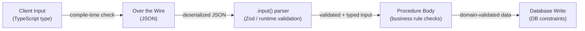

## Building CRUD Procedures with Validation

CRUD procedures form the operational backbone of most tRPC applications. Building them well means more than mapping database operations to procedures — it means designing input contracts, enforcing constraints, handling edge cases, and producing output shapes that are predictable across the entire stack. This topic covers the complete implementation of Create, Read, Update, and Delete procedures with rigorous validation at every layer.

---

### Validation Architecture in tRPC

tRPC integrates validation at three distinct points, each serving a different purpose.



**Key Points**

- `.input()` handles structural and format validation — shape, type coercion, string length, regex patterns
- The procedure body handles semantic validation — business rules that require DB lookups or cross-field logic
- Database constraints are a last-resort safety net, not a substitute for application-level validation
- [Inference] Relying solely on database constraints for validation produces errors that are harder to translate into user-facing messages

---

### Zod Fundamentals for tRPC Validation

Zod is the most widely used validation library in the tRPC ecosystem. Understanding its composition patterns is prerequisite to building robust CRUD procedures.

#### Primitive Schemas and Constraints

```ts
import { z } from 'zod';

// String constraints
const titleSchema = z
  .string()
  .min(1, 'Title is required')
  .max(256, 'Title must be 256 characters or fewer')
  .trim(); // strips surrounding whitespace before validation

// Number constraints
const prioritySchema = z
  .number()
  .int('Priority must be an integer')
  .min(1)
  .max(5);

// Enum
const statusSchema = z.enum(['DRAFT', 'ACTIVE', 'ARCHIVED']);

// Optional vs nullable
const dueDateSchema = z.coerce.date().optional(); // undefined accepted
const assigneeSchema = z.string().cuid().nullable(); // null accepted
```

---

#### Object Schemas and Composition

```ts
// Base schema — the canonical shape of a domain entity's writable fields
const taskBase = z.object({
  title: z.string().min(1).max(256).trim(),
  description: z.string().max(4096).trim().optional(),
  priority: z.enum(['LOW', 'MEDIUM', 'HIGH']).default('MEDIUM'),
  dueDate: z.coerce.date().optional(),
  projectId: z.string().cuid(),
  assignedToId: z.string().cuid().nullable().optional(),
});

// Create schema — derives from base
export const taskCreateSchema = taskBase;

// Update schema — all fields optional, id required
export const taskUpdateSchema = taskBase
  .partial()
  .required({ title: true }) // title can't be cleared on update
  .extend({ id: z.string().cuid() });

// List/filter schema — query parameters
export const taskListSchema = z.object({
  projectId: z.string().cuid(),
  status: z.enum(['DRAFT', 'ACTIVE', 'ARCHIVED']).optional(),
  assignedToId: z.string().cuid().optional(),
  page: z.number().int().min(1).default(1),
  pageSize: z.number().int().min(1).max(100).default(20),
});

// ID-only schema — reused across byId, delete, etc.
export const byIdSchema = z.object({ id: z.string().cuid() });
```

**Key Points**

- `.default()` transforms the input, inserting the default value if the field is absent — the procedure body receives the default, not `undefined`
- `.coerce.date()` handles string-to-Date conversion, which is necessary after JSON deserialization — plain `z.date()` will reject ISO strings from the wire
- `.trim()` runs before length validation — `'  a  '` becomes `'a'` before `.min(1)` is checked
- [Inference] Using `.required()` after `.partial()` requires Zod v3.22+ — verify against the version in use

---

#### Cross-Field Validation with `.refine()` and `.superRefine()`

```ts
// Single condition
export const taskUpdateSchema = taskBase
  .partial()
  .extend({ id: z.string().cuid() })
  .refine(
    (data) => {
      const { id, ...rest } = data;
      return Object.values(rest).some((v) => v !== undefined);
    },
    { message: 'At least one field must be provided for update' }
  );

// Multiple conditions with field-level errors
export const dateRangeSchema = z
  .object({
    startDate: z.coerce.date(),
    endDate: z.coerce.date(),
  })
  .superRefine((data, ctx) => {
    if (data.endDate <= data.startDate) {
      ctx.addIssue({
        code: z.ZodIssueCode.custom,
        message: 'End date must be after start date',
        path: ['endDate'],
      });
    }
  });
```

**Key Points**

- `.refine()` adds a single boolean predicate — use it for simple cross-field checks
- `.superRefine()` provides full control over error paths and multiple issues — use it when different fields should receive different error messages
- Errors from `.refine()` and `.superRefine()` surface in the `ZodError` and are accessible via the `errorFormatter` configured in `initTRPC`

---

### Create Procedures

A create procedure receives validated input, applies business rules, persists the entity, and returns the created record.

#### Basic Create

```ts
// server/routers/task.ts
import { z } from 'zod';
import { TRPCError } from '@trpc/server';
import { router, authedProcedure } from '../trpc';
import { taskCreateSchema } from '~/lib/validators/task';

export const taskRouter = router({
  create: authedProcedure
    .input(taskCreateSchema)
    .mutation(async ({ ctx, input }) => {
      // Semantic validation: verify the project exists and user is a member
      const project = await ctx.db.project.findUnique({
        where: { id: input.projectId },
        include: {
          members: { where: { userId: ctx.user.id } },
        },
      });

      if (!project) {
        throw new TRPCError({
          code: 'NOT_FOUND',
          message: 'Project not found',
        });
      }

      if (project.members.length === 0) {
        throw new TRPCError({
          code: 'FORBIDDEN',
          message: 'You are not a member of this project',
        });
      }

      return ctx.db.task.create({
        data: {
          title: input.title,
          description: input.description,
          priority: input.priority,
          dueDate: input.dueDate,
          projectId: input.projectId,
          assignedToId: input.assignedToId ?? null,
          createdById: ctx.user.id,
        },
        include: {
          assignedTo: { select: { id: true, name: true, image: true } },
          createdBy: { select: { id: true, name: true } },
        },
      });
    }),
});
```

---

#### Create with Uniqueness Check

```ts
createWorkspace: authedProcedure
  .input(
    z.object({
      name: z.string().min(1).max(64).trim(),
      slug: z
        .string()
        .min(1)
        .max(64)
        .regex(/^[a-z0-9-]+$/, 'Slug may only contain lowercase letters, numbers, and hyphens'),
    })
  )
  .mutation(async ({ ctx, input }) => {
    const existing = await ctx.db.workspace.findUnique({
      where: { slug: input.slug },
    });

    if (existing) {
      throw new TRPCError({
        code: 'CONFLICT',
        message: 'A workspace with this slug already exists',
      });
    }

    return ctx.db.workspace.create({
      data: { ...input, ownerId: ctx.user.id },
    });
  }),
```

**Key Points**

- `CONFLICT` (HTTP 409) is the correct tRPC error code for uniqueness violations — prefer it over `BAD_REQUEST` for duplicate resource errors
- [Inference] A race condition exists between the uniqueness check and the insert — for high-contention scenarios, rely on a database unique constraint and catch the constraint error
- Slug validation via regex belongs in `.input()` — it is structural, not semantic

---

#### Bulk Create

```ts
createMany: authedProcedure
  .input(
    z.object({
      projectId: z.string().cuid(),
      tasks: z
        .array(
          z.object({
            title: z.string().min(1).max(256).trim(),
            priority: z.enum(['LOW', 'MEDIUM', 'HIGH']).default('MEDIUM'),
          })
        )
        .min(1)
        .max(50, 'Cannot create more than 50 tasks at once'),
    })
  )
  .mutation(async ({ ctx, input }) => {
    return ctx.db.task.createMany({
      data: input.tasks.map((task) => ({
        ...task,
        projectId: input.projectId,
        createdById: ctx.user.id,
      })),
    });
  }),
```

---

### Read Procedures

Read procedures cover single-record fetch, collection listing with filtering and pagination, and aggregate queries.

#### Fetch by ID

```ts
byId: authedProcedure
  .input(z.object({ id: z.string().cuid() }))
  .query(async ({ ctx, input }) => {
    const task = await ctx.db.task.findUnique({
      where: { id: input.id },
      include: {
        assignedTo: { select: { id: true, name: true, image: true } },
        project: { select: { id: true, name: true } },
        comments: {
          orderBy: { createdAt: 'desc' },
          take: 10,
          include: {
            author: { select: { id: true, name: true } },
          },
        },
      },
    });

    if (!task) {
      throw new TRPCError({
        code: 'NOT_FOUND',
        message: `Task with id '${input.id}' not found`,
      });
    }

    return task;
  }),
```

---

#### List with Filtering and Cursor Pagination

```ts
list: authedProcedure
  .input(
    z.object({
      projectId: z.string().cuid(),
      status: z.enum(['DRAFT', 'ACTIVE', 'ARCHIVED']).optional(),
      priority: z.enum(['LOW', 'MEDIUM', 'HIGH']).optional(),
      assignedToId: z.string().cuid().optional(),
      search: z.string().max(128).trim().optional(),
      cursor: z.string().cuid().optional(), // last item id from previous page
      limit: z.number().int().min(1).max(100).default(20),
    })
  )
  .query(async ({ ctx, input }) => {
    const { cursor, limit, search, projectId, ...filters } = input;

    const items = await ctx.db.task.findMany({
      where: {
        projectId,
        ...filters,
        ...(search
          ? {
              OR: [
                { title: { contains: search, mode: 'insensitive' } },
                { description: { contains: search, mode: 'insensitive' } },
              ],
            }
          : {}),
      },
      take: limit + 1, // fetch one extra to determine if next page exists
      cursor: cursor ? { id: cursor } : undefined,
      skip: cursor ? 1 : 0,
      orderBy: { createdAt: 'desc' },
      include: {
        assignedTo: { select: { id: true, name: true, image: true } },
      },
    });

    const hasNextPage = items.length > limit;
    const page = hasNextPage ? items.slice(0, -1) : items;

    return {
      items: page,
      nextCursor: hasNextPage ? page[page.length - 1]?.id : undefined,
    };
  }),
```

**Key Points**

- Cursor pagination (`take + 1` pattern) avoids the offset drift problem that affects `skip`/`take` pagination on live data
- `nextCursor` being `undefined` signals the last page to the client — `useInfiniteQuery` in React Query uses this value for the next request
- The `limit + 1` fetch means `items.length > limit` is a reliable has-next-page check without a separate `COUNT` query
- Search via `contains` with `mode: 'insensitive'` is Prisma-specific — behavior and performance vary by database engine

---

#### Offset Pagination (Alternative)

```ts
listPaged: authedProcedure
  .input(
    z.object({
      projectId: z.string().cuid(),
      page: z.number().int().min(1).default(1),
      pageSize: z.number().int().min(1).max(100).default(20),
    })
  )
  .query(async ({ ctx, input }) => {
    const { projectId, page, pageSize } = input;
    const skip = (page - 1) * pageSize;

    const [items, total] = await ctx.db.$transaction([
      ctx.db.task.findMany({
        where: { projectId },
        skip,
        take: pageSize,
        orderBy: { createdAt: 'desc' },
      }),
      ctx.db.task.count({ where: { projectId } }),
    ]);

    return {
      items,
      total,
      page,
      pageSize,
      totalPages: Math.ceil(total / pageSize),
    };
  }),
```

**Key Points**

- Offset pagination is simpler to implement and supports random page access — cursor pagination is more efficient for large datasets and real-time data
- Wrapping both queries in `$transaction` keeps the count consistent with the fetch — behavior may vary under high concurrency

---

### Update Procedures

Update procedures must handle partial updates, validate that the record exists, verify ownership, and return the updated state.

#### Standard Update

```ts
update: authedProcedure
  .input(taskUpdateSchema) // partial fields + required id
  .mutation(async ({ ctx, input }) => {
    const { id, ...data } = input;

    // Verify existence and ownership
    const existing = await ctx.db.task.findUnique({ where: { id } });

    if (!existing) {
      throw new TRPCError({ code: 'NOT_FOUND', message: 'Task not found' });
    }

    if (
      existing.createdById !== ctx.user.id &&
      ctx.user.role !== 'ADMIN'
    ) {
      throw new TRPCError({ code: 'FORBIDDEN' });
    }

    return ctx.db.task.update({
      where: { id },
      data,
      include: {
        assignedTo: { select: { id: true, name: true, image: true } },
      },
    });
  }),
```

---

#### Optimistic Locking (Version-Based Conflict Detection)

For resources subject to concurrent edits, version-based conflict detection prevents lost updates.

```ts
update: authedProcedure
  .input(
    taskUpdateSchema.extend({
      version: z.number().int().min(0),
    })
  )
  .mutation(async ({ ctx, input }) => {
    const { id, version, ...data } = input;

    const result = await ctx.db.task.updateMany({
      where: { id, version }, // only update if version matches
      data: { ...data, version: { increment: 1 } },
    });

    if (result.count === 0) {
      // Either not found, or version mismatch (concurrent edit)
      const exists = await ctx.db.task.findUnique({ where: { id } });
      throw new TRPCError({
        code: exists ? 'CONFLICT' : 'NOT_FOUND',
        message: exists
          ? 'This record has been modified by another user. Reload and try again.'
          : 'Task not found',
      });
    }

    return ctx.db.task.findUniqueOrThrow({ where: { id } });
  }),
```

**Key Points**

- `updateMany` with a version condition is an atomic check-and-update — `result.count === 0` means either the record is gone or the version is stale
- The follow-up `findUnique` distinguishes `NOT_FOUND` from `CONFLICT` — two distinct user-facing situations
- [Inference] This pattern requires a `version` column on the database model — adding it to an existing schema is a migration task
- `CONFLICT` (HTTP 409) is the appropriate code for optimistic lock failures

---

#### Status Transition Validation

Domain entities often have constrained state machines. Validate transitions explicitly.

```ts
const VALID_TRANSITIONS: Record<string, string[]> = {
  DRAFT: ['ACTIVE'],
  ACTIVE: ['ARCHIVED', 'DRAFT'],
  ARCHIVED: [],
};

updateStatus: authedProcedure
  .input(
    z.object({
      id: z.string().cuid(),
      status: z.enum(['DRAFT', 'ACTIVE', 'ARCHIVED']),
    })
  )
  .mutation(async ({ ctx, input }) => {
    const task = await ctx.db.task.findUnique({ where: { id: input.id } });
    if (!task) throw new TRPCError({ code: 'NOT_FOUND' });

    const allowed = VALID_TRANSITIONS[task.status] ?? [];
    if (!allowed.includes(input.status)) {
      throw new TRPCError({
        code: 'BAD_REQUEST',
        message: `Cannot transition from ${task.status} to ${input.status}`,
      });
    }

    return ctx.db.task.update({
      where: { id: input.id },
      data: { status: input.status },
    });
  }),
```

---

### Delete Procedures

Delete procedures require existence checks, authorization, and — for destructive operations — consideration of soft delete vs hard delete.

#### Hard Delete

```ts
delete: authedProcedure
  .input(z.object({ id: z.string().cuid() }))
  .mutation(async ({ ctx, input }) => {
    const task = await ctx.db.task.findUnique({ where: { id: input.id } });

    if (!task) throw new TRPCError({ code: 'NOT_FOUND' });

    if (task.createdById !== ctx.user.id && ctx.user.role !== 'ADMIN') {
      throw new TRPCError({ code: 'FORBIDDEN' });
    }

    await ctx.db.task.delete({ where: { id: input.id } });

    // Return the id so the client can remove it from local cache
    return { id: input.id };
  }),
```

**Key Points**

- Returning `{ id }` after deletion allows the client to optimistically remove the item from React Query cache using `queryClient.setQueryData`
- [Inference] Returning the deleted record is also common — choose based on what the client needs for cache invalidation

---

#### Soft Delete

```ts
archive: authedProcedure
  .input(z.object({ id: z.string().cuid() }))
  .mutation(async ({ ctx, input }) => {
    const task = await ctx.db.task.findUnique({
      where: { id: input.id, deletedAt: null }, // exclude already-deleted
    });

    if (!task) throw new TRPCError({ code: 'NOT_FOUND' });
    if (task.createdById !== ctx.user.id && ctx.user.role !== 'ADMIN') {
      throw new TRPCError({ code: 'FORBIDDEN' });
    }

    return ctx.db.task.update({
      where: { id: input.id },
      data: { deletedAt: new Date() },
    });
  }),
```

**Key Points**

- Soft delete requires all read queries to filter `{ deletedAt: null }` — this is easy to forget and can be enforced via a Prisma middleware or query extension
- [Inference] Prisma's `$extends` query extension is well-suited for automatically appending `deletedAt: null` filters globally — behavior depends on Prisma version and extension configuration

---

#### Bulk Delete

```ts
deleteMany: authedProcedure
  .input(
    z.object({
      ids: z
        .array(z.string().cuid())
        .min(1)
        .max(100, 'Cannot delete more than 100 records at once'),
    })
  )
  .mutation(async ({ ctx, input }) => {
    // Verify all records exist and belong to the user
    const tasks = await ctx.db.task.findMany({
      where: {
        id: { in: input.ids },
        createdById: ctx.user.id,
      },
      select: { id: true },
    });

    const authorizedIds = new Set(tasks.map((t) => t.id));
    const unauthorized = input.ids.filter((id) => !authorizedIds.has(id));

    if (unauthorized.length > 0) {
      throw new TRPCError({
        code: 'FORBIDDEN',
        message: `Not authorized to delete ${unauthorized.length} of the requested records`,
      });
    }

    await ctx.db.task.deleteMany({ where: { id: { in: input.ids } } });

    return { deletedIds: input.ids };
  }),
```

---

### Output Schemas and Response Shaping

Defining output schemas makes return types explicit and strips fields that should not leave the server.

```ts
import { z } from 'zod';

export const taskOutputSchema = z.object({
  id: z.string(),
  title: z.string(),
  description: z.string().nullable(),
  priority: z.enum(['LOW', 'MEDIUM', 'HIGH']),
  status: z.enum(['DRAFT', 'ACTIVE', 'ARCHIVED']),
  dueDate: z.date().nullable(),
  createdAt: z.date(),
  updatedAt: z.date(),
  assignedTo: z
    .object({ id: z.string(), name: z.string().nullable() })
    .nullable(),
});

// Applied to a procedure
byId: authedProcedure
  .input(z.object({ id: z.string().cuid() }))
  .output(taskOutputSchema)
  .query(async ({ ctx, input }) => {
    const task = await ctx.db.task.findUnique({
      where: { id: input.id },
      include: { assignedTo: true },
    });
    if (!task) throw new TRPCError({ code: 'NOT_FOUND' });
    return task; // Zod strips fields not in the output schema
  }),
```

**Key Points**

- Zod's `.parse()` (used by the output schema) strips unknown keys by default — sensitive fields not listed in the schema are removed before serialization
- Output schemas add a parse cost on the server — apply them selectively to high-trust-boundary procedures
- Without an output schema, the inferred return type is derived from what the procedure actually returns — which may include unintended fields from ORM includes

---

### Error Handling Patterns

#### Standardized Error Formatting

Configure `errorFormatter` in `initTRPC` to expose Zod validation errors in a structured way:

```ts
import { initTRPC } from '@trpc/server';
import { ZodError } from 'zod';

const t = initTRPC.context<Context>().create({
  errorFormatter({ shape, error }) {
    return {
      ...shape,
      data: {
        ...shape.data,
        zodError:
          error.cause instanceof ZodError
            ? error.cause.flatten()
            : null,
      },
    };
  },
});
```

Consuming on the client:

```ts
const { error } = trpc.task.create.useMutation();

if (error?.data?.zodError) {
  const fieldErrors = error.data.zodError.fieldErrors;
  // { title: ['Title is required'], dueDate: ['Invalid date'] }
}
```

---

#### Semantic Error Mapping

Map database errors to appropriate `TRPCError` codes:

```ts
import { Prisma } from '@prisma/client';

function handleDbError(error: unknown): never {
  if (error instanceof Prisma.PrismaClientKnownRequestError) {
    if (error.code === 'P2002') {
      throw new TRPCError({
        code: 'CONFLICT',
        message: 'A record with this value already exists',
        cause: error,
      });
    }
    if (error.code === 'P2025') {
      throw new TRPCError({
        code: 'NOT_FOUND',
        message: 'Record not found',
        cause: error,
      });
    }
  }
  throw new TRPCError({
    code: 'INTERNAL_SERVER_ERROR',
    message: 'An unexpected error occurred',
    cause: error,
  });
}

// Usage in a procedure
.mutation(async ({ ctx, input }) => {
  try {
    return await ctx.db.task.create({ data: input });
  } catch (error) {
    handleDbError(error);
  }
})
```

---

### Complete CRUD Router

Assembling everything into a single coherent router:

```ts
// server/routers/task.ts
export const taskRouter = router({
  // READ
  byId:       authedProcedure.input(byIdSchema).query(/* ... */),
  list:       authedProcedure.input(taskListSchema).query(/* ... */),

  // CREATE
  create:     authedProcedure.input(taskCreateSchema).mutation(/* ... */),
  createMany: authedProcedure.input(taskBulkCreateSchema).mutation(/* ... */),

  // UPDATE
  update:       authedProcedure.input(taskUpdateSchema).mutation(/* ... */),
  updateStatus: authedProcedure.input(taskStatusSchema).mutation(/* ... */),

  // DELETE
  delete:     taskOwnerProcedure.input(byIdSchema).mutation(/* ... */),
  deleteMany: authedProcedure.input(taskBulkDeleteSchema).mutation(/* ... */),
});
```

---

### Testing CRUD Procedures

```ts
// test/routers/task.test.ts
describe('task CRUD', () => {
  describe('create', () => {
    it('rejects empty title', async () => {
      const caller = createCaller(createAuthedContext());
      await expect(
        caller.task.create({ title: '', projectId: 'proj_123' })
      ).rejects.toMatchObject({ code: 'BAD_REQUEST' });
    });

    it('rejects title exceeding max length', async () => {
      const caller = createCaller(createAuthedContext());
      await expect(
        caller.task.create({ title: 'a'.repeat(257), projectId: 'proj_123' })
      ).rejects.toMatchObject({ code: 'BAD_REQUEST' });
    });
  });

  describe('update', () => {
    it('rejects update with no fields', async () => {
      const caller = createCaller(createAuthedContext());
      await expect(
        caller.task.update({ id: 'task_123' })
      ).rejects.toMatchObject({ code: 'BAD_REQUEST' });
    });

    it('throws NOT_FOUND for non-existent task', async () => {
      const caller = createCaller(createAuthedContext());
      await expect(
        caller.task.update({ id: 'nonexistent', title: 'New title' })
      ).rejects.toMatchObject({ code: 'NOT_FOUND' });
    });
  });

  describe('delete', () => {
    it('throws FORBIDDEN for non-owner', async () => {
      const caller = createCaller(createAuthedContext({ id: 'other_user' }));
      await expect(
        caller.task.delete({ id: 'task_owned_by_someone_else' })
      ).rejects.toMatchObject({ code: 'FORBIDDEN' });
    });
  });
});
```

---

**Related Topics**

- Infinite query patterns — integrating cursor pagination with `useInfiniteQuery`
- Optimistic updates on the client — updating React Query cache before server confirmation
- Zod advanced patterns — discriminated unions, branded types, and `.transform()` in tRPC schemas
- Input sanitization — XSS prevention and HTML stripping in string fields
- Transactions in tRPC — wrapping multi-step mutations in database transactions
- File upload procedures — handling `multipart/form-data` alongside tRPC mutations
- Soft delete patterns — Prisma query extensions for transparent `deletedAt` filtering
- Rate limiting CRUD procedures — per-user and per-resource throttling strategies