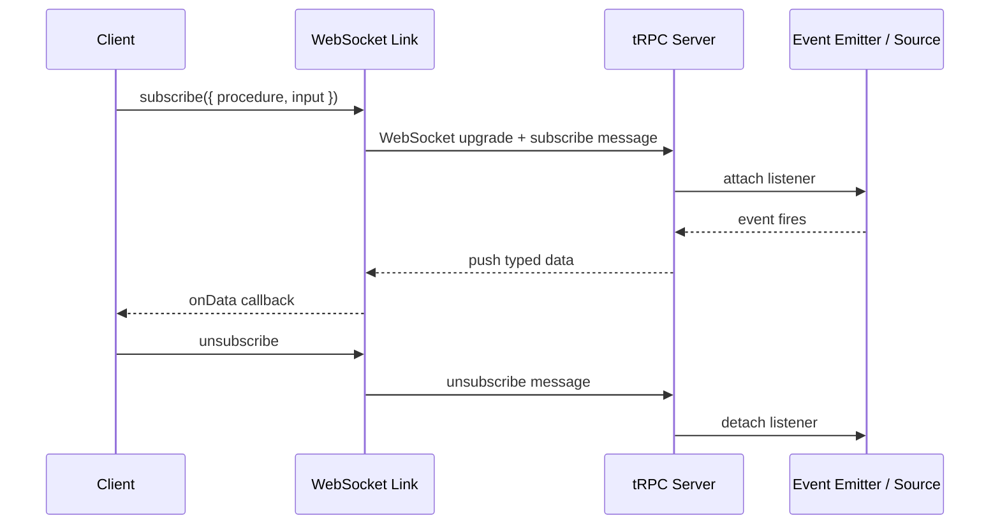
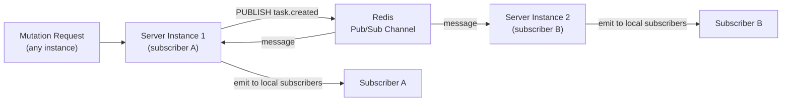
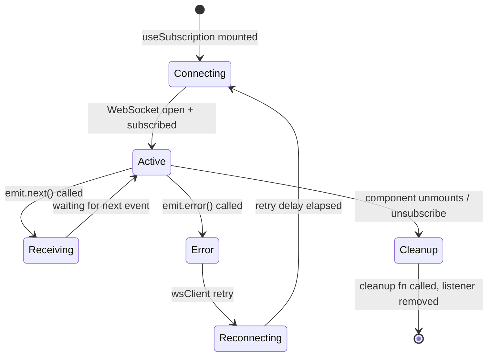

## Adding Real-Time Features with Subscriptions

tRPC subscriptions bring real-time capabilities into the same type-safe, procedure-based model used for queries and mutations. Rather than reaching for a separate WebSocket library or a different API layer, subscriptions extend the existing router with observable-based procedures that push updates to connected clients. This topic covers the complete implementation — from server-side observable setup through client-side consumption and production considerations.

---

### How tRPC Subscriptions Work

tRPC subscriptions are built on the observable pattern. A subscription procedure returns an `observable` that emits values over time. The client maintains a persistent connection and receives each emitted value as a typed event.



**Key Points**

- Subscriptions require a stateful transport — WebSockets or SSE (Server-Sent Events)
- The `httpBatchLink` used for queries and mutations does not support subscriptions — a `wsLink` or `httpSubscriptionLink` must be added
- tRPC's type inference applies to subscription data — the emitted value type is inferred from the observable's generic parameter
- Each subscription procedure call creates an independent observable instance — cleanup logic runs when the client unsubscribes or disconnects
- [Inference] Subscriptions are stateful on the server — they consume memory and a connection slot for each active subscriber; capacity planning differs from stateless HTTP procedures

---

### Transport Options

tRPC supports two transports for subscriptions, each with different trade-offs.

| Transport | Protocol | Bidirectional | Reconnection | Infrastructure |
|---|---|---|---|---|
| WebSockets (`wsLink`) | WS / WSS | Yes | Manual or library | Requires WS-capable server |
| Server-Sent Events (`httpSubscriptionLink`) | HTTP/SSE | Server→Client only | Browser-native | Standard HTTP server |

**Key Points**

- SSE (`httpSubscriptionLink`) was introduced in tRPC v11 — verify availability against the version in use
- WebSockets support bidirectional messaging — SSE is unidirectional (server to client only)
- SSE works over standard HTTP/2, making it compatible with more hosting environments including serverless with long-running response support
- [Inference] For most notification and live-update use cases, SSE is sufficient and simpler to deploy; WebSockets are better suited for chat, collaborative editing, or cases where the client needs to send frequent messages over the persistent connection

---

### Server Setup — WebSocket Transport

#### Install Dependencies

```bash
npm install ws
npm install -D @types/ws
```

#### Standalone WebSocket Server

```ts
// server/wsServer.ts
import { createWSServer } from '@trpc/server/adapters/ws';
import { WebSocketServer } from 'ws';
import { appRouter } from './routers/_app';
import { createContext } from './context';

const wss = new WebSocketServer({ port: 3001 });

const handler = createWSServer({
  wss,
  router: appRouter,
  createContext,
});

wss.on('listening', () => {
  console.log('WebSocket server listening on ws://localhost:3001');
});

process.on('SIGTERM', () => {
  handler.broadcastReconnectNotification();
  wss.close();
});
```

---

#### Combined HTTP + WebSocket Server (Node.js)

```ts
// server/index.ts
import http from 'http';
import { createHTTPHandler } from '@trpc/server/adapters/standalone';
import { applyWSSHandler } from '@trpc/server/adapters/ws';
import { WebSocketServer } from 'ws';
import { appRouter } from './routers/_app';
import { createContext } from './context';

const httpHandler = createHTTPHandler({
  router: appRouter,
  createContext,
});

const server = http.createServer((req, res) => {
  // Handle CORS preflight or route to tRPC HTTP handler
  httpHandler(req, res);
});

const wss = new WebSocketServer({ server }); // share the same port

applyWSSHandler({
  wss,
  router: appRouter,
  createContext,
  keepAlive: {
    enabled: true,
    pingMs: 30_000,   // ping every 30s
    pongWaitMs: 5_000, // disconnect if pong not received within 5s
  },
});

server.listen(3000, () => {
  console.log('Server listening on http://localhost:3000');
});
```

**Key Points**

- Sharing a port between HTTP and WebSocket is done by passing the `http.Server` instance to `WebSocketServer` — the WS upgrade handshake is handled automatically
- `keepAlive` ping/pong prevents silent disconnections on idle connections, particularly behind load balancers with connection timeouts
- `broadcastReconnectNotification()` signals all connected clients to reconnect — call this during graceful shutdown so clients re-establish connections against the new server instance

---

### Server Setup — SSE Transport (tRPC v11+)

SSE subscriptions use the standard HTTP adapter and require no WebSocket server:

```ts
// app/api/trpc/[trpc]/route.ts (Next.js App Router)
import { fetchRequestHandler } from '@trpc/server/adapters/fetch';
import { appRouter } from '~/server/routers/_app';
import { createContext } from '~/server/context';

const handler = (req: Request) =>
  fetchRequestHandler({
    endpoint: '/api/trpc',
    req,
    router: appRouter,
    createContext: () => createContext(req),
  });

export const GET = handler;
export const POST = handler;
```

No additional server configuration is needed for SSE — the subscription response is a long-lived HTTP response with `Content-Type: text/event-stream`.

---

### Writing Subscription Procedures

Subscription procedures return an `observable` from `@trpc/server/observable`.

#### Basic Subscription

```ts
// server/routers/task.ts
import { observable } from '@trpc/server/observable';
import { EventEmitter } from 'events';
import { z } from 'zod';
import { router, authedProcedure } from '../trpc';

// Module-level emitter — shared across all subscribers
// In production, replace with Redis pub/sub or similar
const taskEmitter = new EventEmitter();
taskEmitter.setMaxListeners(100); // increase for many concurrent subscribers

export const taskRouter = router({
  // ... existing CRUD procedures

  onCreate: authedProcedure
    .input(z.object({ projectId: z.string().cuid() }))
    .subscription(({ input, ctx }) => {
      return observable<{ id: string; title: string; createdById: string }>(
        (emit) => {
          const onTaskCreated = (task: Task) => {
            if (task.projectId === input.projectId) {
              emit.next(task);
            }
          };

          taskEmitter.on('task.created', onTaskCreated);

          // Cleanup: called when client unsubscribes or disconnects
          return () => {
            taskEmitter.off('task.created', onTaskCreated);
          };
        }
      );
    }),
});
```

**Emitting from a mutation:**

```ts
create: authedProcedure
  .input(taskCreateSchema)
  .mutation(async ({ ctx, input }) => {
    const task = await ctx.db.task.create({ data: { ...input, createdById: ctx.user.id } });

    // Notify subscribers
    taskEmitter.emit('task.created', task);

    return task;
  }),
```

**Key Points**

- The cleanup function returned from the observable factory is critical — failure to remove event listeners causes memory leaks as subscribers accumulate
- The emitter is module-level — it is shared across all requests in the same process, which is intentional for fan-out
- Filtering inside the observable (`task.projectId === input.projectId`) ensures each subscriber only receives events relevant to their input
- [Inference] In multi-process or multi-instance deployments, a module-level `EventEmitter` only reaches subscribers on the same process — a distributed pub/sub layer is required for multi-instance fan-out

---

#### Typed Event System

For larger applications, a typed event emitter reduces the risk of mismatched event names and payloads:

```ts
// server/lib/emitter.ts
import { EventEmitter } from 'events';

type TaskEvents = {
  'task.created': [task: Task];
  'task.updated': [task: Task];
  'task.deleted': [payload: { id: string; projectId: string }];
  'task.assigned': [payload: { taskId: string; userId: string }];
};

class TypedEmitter extends EventEmitter {
  emit<K extends keyof TaskEvents>(event: K, ...args: TaskEvents[K]): boolean {
    return super.emit(event, ...args);
  }

  on<K extends keyof TaskEvents>(
    event: K,
    listener: (...args: TaskEvents[K]) => void
  ): this {
    return super.on(event, listener);
  }

  off<K extends keyof TaskEvents>(
    event: K,
    listener: (...args: TaskEvents[K]) => void
  ): this {
    return super.off(event, listener);
  }
}

export const ee = new TypedEmitter();
ee.setMaxListeners(200);
```

---

#### Subscription with Initial State

A common pattern emits the current state immediately upon subscription, followed by live updates:

```ts
onTasksChange: authedProcedure
  .input(z.object({ projectId: z.string().cuid() }))
  .subscription(({ input, ctx }) => {
    return observable<{ type: 'snapshot' | 'update'; tasks: Task[] }>(
      (emit) => {
        // Emit current state immediately
        ctx.db.task
          .findMany({ where: { projectId: input.projectId } })
          .then((tasks) => emit.next({ type: 'snapshot', tasks }))
          .catch((err) => emit.error(err));

        const onChange = (task: Task) => {
          if (task.projectId === input.projectId) {
            // Emit a full refresh — simpler than partial patch reconciliation
            ctx.db.task
              .findMany({ where: { projectId: input.projectId } })
              .then((tasks) => emit.next({ type: 'update', tasks }))
              .catch((err) => emit.error(err));
          }
        };

        ee.on('task.created', onChange);
        ee.on('task.updated', onChange);
        ee.on('task.deleted', onChange);

        return () => {
          ee.off('task.created', onChange);
          ee.off('task.updated', onChange);
          ee.off('task.deleted', onChange);
        };
      }
    );
  }),
```

**Key Points**

- Emitting a full snapshot on change is simpler than computing and applying diffs — appropriate when the list is small
- For large datasets, emitting only the changed record and handling patch logic on the client is more efficient
- [Inference] Concurrent mutations during the snapshot fetch may produce a race — for strict consistency, use a database-level change notification rather than application-level events

---

#### Error Handling in Subscriptions

```ts
onTaskUpdate: authedProcedure
  .input(z.object({ taskId: z.string().cuid() }))
  .subscription(({ input, ctx }) => {
    return observable<Task>((emit) => {
      const onUpdate = async (task: Task) => {
        if (task.id !== input.taskId) return;

        try {
          // Re-fetch to apply output schema and access control
          const fresh = await ctx.db.task.findUniqueOrThrow({
            where: { id: task.id },
          });
          emit.next(fresh);
        } catch (err) {
          emit.error(
            new TRPCError({
              code: 'INTERNAL_SERVER_ERROR',
              message: 'Failed to fetch updated task',
              cause: err,
            })
          );
        }
      };

      ee.on('task.updated', onUpdate);
      return () => ee.off('task.updated', onUpdate);
    });
  }),
```

**Key Points**

- `emit.error()` terminates the subscription and delivers the error to the client's `onError` callback
- Re-fetching from the database inside the subscription handler (rather than passing the emitted object directly) applies access control and output shaping consistently
- [Inference] `emit.error()` followed by continued `emit.next()` calls may produce undefined behavior — treat `emit.error()` as terminal

---

### Client Setup — WebSocket Link

#### Installing the WebSocket Client

```bash
npm install @trpc/client
```

#### Configuring the Split Link

Queries and mutations go over HTTP; subscriptions go over WebSocket.

```ts
// utils/trpc.ts
import { createTRPCReact, splitLink, unstable_httpBatchStreamLink } from '@trpc/react-query';
import { createWSClient, wsLink } from '@trpc/client';
import superjson from 'superjson';
import type { AppRouter } from '~/server/routers/_app';

export const trpc = createTRPCReact<AppRouter>();

function getBaseUrl() {
  if (typeof window !== 'undefined') return '';
  return `http://localhost:${process.env.PORT ?? 3000}`;
}

function getWsUrl() {
  return process.env.NEXT_PUBLIC_WS_URL ?? 'ws://localhost:3001';
}

export function createTRPCClient() {
  const wsClient = createWSClient({ url: getWsUrl() });

  return trpc.createClient({
    links: [
      splitLink({
        condition: (op) => op.type === 'subscription',
        true: wsLink({ client: wsClient, transformer: superjson }),
        false: unstable_httpBatchStreamLink({
          url: `${getBaseUrl()}/api/trpc`,
          transformer: superjson,
        }),
      }),
    ],
  });
}
```

**Key Points**

- `splitLink` routes operations by type — `subscription` operations go to `wsLink`, everything else to the HTTP link
- `createWSClient` manages the WebSocket lifecycle — including reconnection — independently of the tRPC client
- The `wsClient` instance should be stable across renders — create it outside the component tree or inside a ref

---

#### Client Setup — SSE Link (tRPC v11+)

```ts
import { httpSubscriptionLink, splitLink, httpBatchLink } from '@trpc/client';

const trpcClient = trpc.createClient({
  links: [
    splitLink({
      condition: (op) => op.type === 'subscription',
      true: httpSubscriptionLink({
        url: '/api/trpc',
        transformer: superjson,
      }),
      false: httpBatchLink({
        url: '/api/trpc',
        transformer: superjson,
      }),
    }),
  ],
});
```

---

### Consuming Subscriptions in React

#### `useSubscription` Hook

```tsx
// components/TaskFeed.tsx
import { trpc } from '~/utils/trpc';

interface Props {
  projectId: string;
}

export function TaskFeed({ projectId }: Props) {
  const [tasks, setTasks] = useState<Task[]>([]);
  const [error, setError] = useState<string | null>(null);

  trpc.task.onCreate.useSubscription(
    { projectId },
    {
      onData(task) {
        setTasks((prev) => [task, ...prev]);
      },
      onError(err) {
        setError(err.message);
        console.error('Subscription error:', err);
      },
      // Subscription is re-established when enabled flips from false to true
      enabled: true,
    }
  );

  return (
    <ul>
      {tasks.map((task) => (
        <li key={task.id}>{task.title}</li>
      ))}
    </ul>
  );
}
```

---

#### Combining Subscriptions with Queries

A common pattern uses a query for the initial data load and a subscription to apply incremental updates:

```tsx
// components/LiveTaskList.tsx
export function LiveTaskList({ projectId }: { projectId: string }) {
  const utils = trpc.useUtils();

  // Initial data fetch
  const { data: tasks } = trpc.task.list.useQuery({ projectId });

  // Invalidate the query cache when a task is created
  trpc.task.onCreate.useSubscription(
    { projectId },
    {
      onData(newTask) {
        // Append to the existing query cache
        utils.task.list.setData({ projectId }, (prev) =>
          prev ? [newTask, ...prev.items] : prev
        );
      },
    }
  );

  return (
    <ul>
      {tasks?.items.map((task) => (
        <li key={task.id}>{task.title}</li>
      ))}
    </ul>
  );
}
```

**Key Points**

- `utils.task.list.setData` directly updates the React Query cache without a network request — the subscription event becomes the cache update trigger
- `utils.task.list.invalidate()` is an alternative — it triggers a refetch rather than a direct cache update; use it when you want the server to be the source of truth after each event
- [Inference] Direct cache mutation (`setData`) is more efficient but requires the client to correctly apply the update logic — incorrect updates can cause UI/data divergence

---

### Distributed Subscriptions with Redis Pub/Sub

The module-level `EventEmitter` approach only works within a single process. For multi-instance deployments, replace it with a Redis pub/sub channel.



```ts
// server/lib/redisEmitter.ts
import { createClient } from 'redis';
import { EventEmitter } from 'events';

const publisher = createClient({ url: process.env.REDIS_URL });
const subscriber = createClient({ url: process.env.REDIS_URL });

await publisher.connect();
await subscriber.connect();

// Local emitter for in-process fan-out
export const localEe = new EventEmitter();
localEe.setMaxListeners(500);

// Subscribe to Redis channel and re-emit locally
await subscriber.subscribe('trpc:events', (message) => {
  const { event, payload } = JSON.parse(message);
  localEe.emit(event, payload);
});

// Publish through Redis (reaches all instances)
export async function publishEvent(event: string, payload: unknown) {
  await publisher.publish('trpc:events', JSON.stringify({ event, payload }));
}
```

```ts
// In a mutation
create: authedProcedure
  .input(taskCreateSchema)
  .mutation(async ({ ctx, input }) => {
    const task = await ctx.db.task.create({ data: input });
    await publishEvent('task.created', task); // fan-out via Redis
    return task;
  }),

// In a subscription
onCreate: authedProcedure
  .input(z.object({ projectId: z.string().cuid() }))
  .subscription(({ input }) => {
    return observable<Task>((emit) => {
      const handler = (task: Task) => {
        if (task.projectId === input.projectId) emit.next(task);
      };
      localEe.on('task.created', handler);
      return () => localEe.off('task.created', handler);
    });
  }),
```

**Key Points**

- Each server instance subscribes to the Redis channel and maintains its own local `EventEmitter` for connected clients
- Published events reach all instances simultaneously — each instance forwards to its own subscribers
- Redis connection errors must be handled — a disconnected subscriber will miss events silently [Inference: behavior depends on Redis client library and configuration]
- Channel naming conventions (`trpc:events` vs per-entity channels) affect granularity and filtering overhead

---

### Reconnection and Resilience

WebSocket connections drop. The client must handle reconnection gracefully without losing state.

#### Automatic Reconnection via `createWSClient`

```ts
const wsClient = createWSClient({
  url: getWsUrl(),
  retryDelayMs: (attempt) => Math.min(1000 * 2 ** attempt, 30_000), // exponential backoff, max 30s
  onOpen() {
    console.log('WebSocket connected');
  },
  onClose(cause) {
    console.warn('WebSocket closed', cause);
  },
});
```

---

#### Handling Reconnection in the UI

```tsx
const [connected, setConnected] = useState(true);

trpc.task.onCreate.useSubscription(
  { projectId },
  {
    onData(task) {
      setConnected(true);
      setTasks((prev) => [task, ...prev]);
    },
    onError(err) {
      setConnected(false);
      // Subscription will reconnect automatically via wsClient retry logic
    },
  }
);

// After reconnection, refetch to catch missed events
const utils = trpc.useUtils();
useEffect(() => {
  if (connected) {
    utils.task.list.invalidate({ projectId });
  }
}, [connected]);
```

**Key Points**

- Events emitted during a disconnection are lost — refetching the query on reconnection recovers the missed state
- [Inference] For applications where missing events is unacceptable (financial updates, audit logs), a sequence number or timestamp-based catch-up mechanism is needed — the client requests all events since its last received sequence on reconnect
- The `broadcastReconnectNotification()` call during server shutdown signals clients to reconnect, triggering their retry logic cleanly

---

### Common Real-Time Patterns

#### Live Notification Counter

```tsx
function NotificationBadge({ userId }: { userId: string }) {
  const [count, setCount] = useState(0);

  trpc.notification.onNew.useSubscription(
    { userId },
    { onData: () => setCount((c) => c + 1) }
  );

  return count > 0 ? <span className="badge">{count}</span> : null;
}
```

---

#### Presence / Online Status

```ts
// server/routers/presence.ts
onlineUsers: authedProcedure
  .input(z.object({ workspaceId: z.string().cuid() }))
  .subscription(({ input, ctx }) => {
    return observable<{ userId: string; online: boolean }>((emit) => {
      // Mark user online
      presenceStore.set(ctx.user.id, { workspaceId: input.workspaceId, online: true });
      ee.emit('presence.changed', { userId: ctx.user.id, online: true });

      const onPresenceChange = (payload: { userId: string; online: boolean }) => {
        emit.next(payload);
      };

      ee.on('presence.changed', onPresenceChange);

      return () => {
        // Mark user offline on disconnect
        presenceStore.delete(ctx.user.id);
        ee.emit('presence.changed', { userId: ctx.user.id, online: false });
        ee.off('presence.changed', onPresenceChange);
      };
    });
  }),
```

---

#### Live Collaborative Cursor (Illustrative)

```ts
onCursorMove: authedProcedure
  .input(z.object({ documentId: z.string().cuid() }))
  .subscription(({ input, ctx }) => {
    return observable<{ userId: string; x: number; y: number }>((emit) => {
      const onMove = (data: { userId: string; documentId: string; x: number; y: number }) => {
        if (data.documentId === input.documentId && data.userId !== ctx.user.id) {
          emit.next({ userId: data.userId, x: data.x, y: data.y });
        }
      };

      ee.on('cursor.moved', onMove);
      return () => ee.off('cursor.moved', onMove);
    });
  }),
```

---

### Performance Considerations

| Concern | Mitigation |
|---|---|
| Too many subscribers per emitter | Increase `maxListeners`; use Redis fan-out for scale |
| Large payloads per event | Emit minimal identifiers; let client refetch full data |
| Thundering herd on reconnect | Stagger refetches with jitter; use exponential backoff |
| Memory leaks from missing cleanup | Always return cleanup function; test with deliberate disconnects |
| CPU spike from many subscriptions filtering the same event | Pre-filter at the emitter level using per-channel topics |
| Cold start latency on first subscription | Pre-warm emitter connections; emit initial snapshot immediately |

---

### Diagram: Subscription Lifecycle



---

**Related Topics**

- `useInfiniteQuery` with cursor pagination — combining paginated queries with subscription-driven cache updates
- Custom tRPC links — building a retry link and an event-buffering link for offline resilience
- Redis Streams vs Pub/Sub for tRPC event sourcing — ordering guarantees and replay on reconnect
- tRPC with Cloudflare Durable Objects — stateful WebSocket handlers at the edge
- Presence systems — distributed online/offline tracking with heartbeat timeouts
- Optimistic updates and subscription reconciliation — handling conflicts between client-side speculation and server events
- Rate limiting subscriptions — preventing abuse of long-lived connections
- Testing tRPC subscriptions — asserting observable emissions with Jest and fake timers