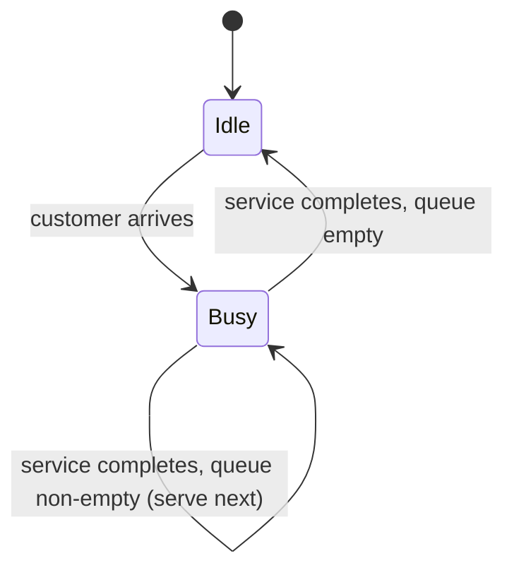

## Introductory Concepts — Modelling and Simulation Defined

### Overview

Modelling and Simulation (M&S) is a discipline concerned with representing real-world or hypothetical systems through abstract constructs (models) and exercising those constructs over time (simulation) to study behavior, predict outcomes, or support decision-making. It spans engineering, physical sciences, social sciences, economics, military operations, healthcare, and computing, forming a common methodological backbone across otherwise unrelated fields.

### Defining a Model

A model is a simplified representation of a system, process, or phenomenon, constructed to capture the features relevant to a specific purpose while deliberately omitting details judged irrelevant to that purpose.

**Key Points**
- A model is always built *for a purpose*; there is no such thing as a universally "correct" model, only one that is fit or unfit for a given question.
- Models trade fidelity for tractability — more detail generally increases accuracy but also increases computational and cognitive cost.
- The same real-world system can have multiple valid models, each emphasizing different aspects (e.g., a car can be modeled as a point mass for traffic flow studies, or as a multi-body rigid system for crash analysis).

Formally, a model can be described as a mapping between a system's inputs and outputs, mediated by an internal state:

$$
\dot{x}(t) = f(x(t), u(t), t)
$$
$$
y(t) = g(x(t), u(t), t)
$$

where $x(t)$ is the state vector, $u(t)$ the input vector, $y(t)$ the output vector, and $f$, $g$ are functions describing state evolution and observation, respectively. This is the standard state-space formulation used throughout continuous system modelling.

### Defining a Simulation

A simulation is the act of executing a model over time — analytically, numerically, or through logical event progression — to observe how the system's state and outputs evolve under specified inputs, initial conditions, and parameters.

**Key Points**
- Simulation is the *operational* counterpart to modelling: the model is the static description; the simulation is the dynamic exercise of that description.
- Simulation is typically necessary when a model has no closed-form analytical solution, which is common for nonlinear, stochastic, or high-dimensional systems.
- A single model can be simulated multiple times under varying inputs, parameters, or random seeds to explore a space of possible outcomes (as in Monte Carlo studies).

### The Modelling–Simulation Relationship

Modelling and simulation are often spoken of as one phrase, but they represent distinct intellectual activities joined in a pipeline.

<svg xmlns="http://www.w3.org/2000/svg" viewBox="0 0 900 260">
  <title>Modelling to Simulation Pipeline (svg_diagram)</title>
  <rect x="20" y="90" width="160" height="80" rx="8" fill="#eef3fb" stroke="#33547a" stroke-width="1.5" />
  <text x="100" y="125" font-size="14" text-anchor="middle" fill="#1c2b3a">Real-World</text>
  <text x="100" y="143" font-size="14" text-anchor="middle" fill="#1c2b3a">System</text>

  <line x1="180" y1="130" x2="250" y2="130" stroke="#333" stroke-width="1.5" marker-end="url(#arrow)" />
  <text x="215" y="118" font-size="11" text-anchor="middle" fill="#444">abstraction</text>

  <rect x="250" y="90" width="160" height="80" rx="8" fill="#eef3fb" stroke="#33547a" stroke-width="1.5" />
  <text x="330" y="125" font-size="14" text-anchor="middle" fill="#1c2b3a">Conceptual</text>
  <text x="330" y="143" font-size="14" text-anchor="middle" fill="#1c2b3a">Model</text>

  <line x1="410" y1="130" x2="480" y2="130" stroke="#333" stroke-width="1.5" marker-end="url(#arrow)" />
  <text x="445" y="118" font-size="11" text-anchor="middle" fill="#444">formalization</text>

  <rect x="480" y="90" width="160" height="80" rx="8" fill="#eef3fb" stroke="#33547a" stroke-width="1.5" />
  <text x="560" y="125" font-size="14" text-anchor="middle" fill="#1c2b3a">Mathematical /</text>
  <text x="560" y="143" font-size="14" text-anchor="middle" fill="#1c2b3a">Logical Model</text>

  <line x1="640" y1="130" x2="710" y2="130" stroke="#333" stroke-width="1.5" marker-end="url(#arrow)" />
  <text x="675" y="118" font-size="11" text-anchor="middle" fill="#444">implementation</text>

  <rect x="710" y="90" width="170" height="80" rx="8" fill="#fbeeee" stroke="#7a3333" stroke-width="1.5" />
  <text x="795" y="125" font-size="14" text-anchor="middle" fill="#3a1c1c">Executable</text>
  <text x="795" y="143" font-size="14" text-anchor="middle" fill="#3a1c1c">Simulation</text>

  <line x1="795" y1="170" x2="795" y2="215" stroke="#333" stroke-width="1.5" marker-end="url(#arrow)" />
  <text x="795" y="235" font-size="12" text-anchor="middle" fill="#444">Results / Inference</text>
</svg>

The pipeline above shows the typical progression: a real-world system is abstracted into a conceptual model (informal, often diagrammatic), which is then formalized into a mathematical or logical model (equations, rules, state machines), which is finally implemented as an executable simulation (code that computes trajectories or events).

### Purposes of Modelling and Simulation

**Key Points**
- **Prediction** — estimating future system states given current conditions (e.g., weather forecasting, orbital mechanics).
- **Explanation** — understanding causal mechanisms behind observed behavior (e.g., epidemiological spread models).
- **Design and optimization** — evaluating candidate designs before physical construction (e.g., aircraft wing simulation).
- **Training** — providing realistic but safe environments for skill acquisition (e.g., flight simulators, surgical simulators).
- **Testing and verification** — validating system behavior under conditions too costly, dangerous, or rare to test physically (e.g., nuclear reactor fault scenarios).
- **Policy and decision analysis** — exploring the consequences of interventions before real-world commitment (e.g., traffic policy, economic policy).

### Why Simulate Instead of Experimenting Directly

Direct experimentation on real systems is frequently infeasible. M&S offers a substitute when:

- The real system does not yet exist (e.g., a spacecraft still in design).
- Experiments would be destructive, dangerous, or unethical (e.g., crash testing every vehicle unit, epidemic containment strategies).
- The time scale is inconvenient (e.g., geological or astronomical processes spanning millennia, compressed into seconds of simulated time).
- The cost of physical experimentation is prohibitive (e.g., full-scale wind tunnel testing for every design iteration).
- The system is inaccessible or hazardous to instrument directly (e.g., interior of a nuclear reactor core, deep-sea environments).

[Inference] The relative cost savings of simulation versus physical prototyping vary substantially by industry and are typically reported as case-specific figures rather than a fixed, generalizable ratio.

### Classification of Models

Models are commonly classified along several independent axes, and a single real system can be represented by combinations of these categories depending on the modelling objective.

**By Determinism**
- **Deterministic** — output is fully determined by input and initial state, with no randomness (e.g., an ideal pendulum's motion).
- **Stochastic** — incorporates randomness, so repeated runs with identical initial conditions can yield different outputs (e.g., queueing systems with random arrival times).

**By Time Representation**
- **Continuous-time** — state changes smoothly and is described by differential equations.
- **Discrete-time** — state is updated at fixed time steps, described by difference equations.
- **Discrete-event** — state changes only at specific event instants, which may be irregularly spaced in time (e.g., a customer arriving at a bank).

**By Linearity**
- **Linear** — obeys superposition; outputs scale proportionally with inputs.
- **Nonlinear** — does not obey superposition; often requires numerical rather than analytical solution methods.

**By State-Space Nature**
- **Static** — output depends only on current input, with no memory of past states (e.g., a resistor's I-V relationship).
- **Dynamic** — output depends on the history of the system, requiring state variables (e.g., a capacitor's charging behavior).

**By Knowledge Origin**
- **White-box (mechanistic)** — built from first principles or known physical laws.
- **Black-box (empirical)** — built from observed input-output data with no assumed internal structure, such as a fitted regression or neural network.
- **Grey-box (hybrid)** — combines known structural relationships with empirically estimated parameters.

### Classification of Simulations

**By System Behavior**
- **Continuous simulation** — numerically integrates differential equations over time (e.g., Runge-Kutta methods for orbital mechanics).
- **Discrete-event simulation (DES)** — advances simulated time from one event to the next, skipping periods of inactivity (e.g., manufacturing line simulation).
- **Hybrid simulation** — combines continuous and discrete-event elements (e.g., a chemical process with continuous flow and discrete valve switching).

**By Interaction with Reality**
- **Live simulation** — real people operating real systems (e.g., a live military field exercise).
- **Virtual simulation** — real people operating simulated systems (e.g., a pilot in a flight simulator).
- **Constructive simulation** — simulated people operating simulated systems, with no direct human control of individual entities (e.g., an agent-based crowd model).

**By Time Handling**
- **Real-time simulation** — simulated time progresses at the same rate as wall-clock time, often required for human-in-the-loop training.
- **Faster-than-real-time simulation** — used for rapid forecasting or scenario exploration.
- **Slower-than-real-time simulation** — used when computational complexity per simulated time unit is very high (e.g., detailed climate models).

### A Basic Discrete-Event Concept Illustration

Consider a single-server queue, one of the canonical introductory examples in discrete-event simulation, where entities (customers) arrive, wait if the server is busy, are served, and depart.

**Example**
Suppose customers arrive following a Poisson process with rate $\lambda$, and service times are exponentially distributed with rate $\mu$. The system can be modeled analytically as an M/M/1 queue, with the expected number of customers in the system given by:

$$
L = \frac{\lambda}{\mu - \lambda}, \quad \text{for } \lambda < \mu
$$

A discrete-event simulation of the same system would instead generate individual random arrival and service times, advance a simulation clock from event to event, and track queue length numerically — useful when the analytical formula's underlying assumptions (Poisson arrivals, exponential service, single server) do not hold in a more realistic scenario.

### Terminology Distinctions Worth Fixing Early

**Key Points**
- **Model ≠ Simulation** — the model is the description; the simulation is the execution of that description.
- **Simulation ≠ Emulation** — a simulation approximates behavior at a chosen level of abstraction; an emulation typically aims to exactly reproduce the external interface/behavior of a system, often for interoperability purposes (e.g., a hardware emulator).
- **Verification ≠ Validation** — verification asks "did we build the model right?" (implementation correctness relative to specification); validation asks "did we build the right model?" (adequacy relative to the real system for the intended purpose). This distinction is elaborated in later topics on M&S methodology (V&V).
- **Simulation ≠ Animation** — a visual animation may accompany a simulation for human interpretability, but the animation itself is not the computational model; a simulation can run entirely without any graphical rendering.

### Common Application Domains

- **Engineering** — structural analysis, control systems, aerodynamics, robotics.
- **Physical sciences** — climate modelling, astrophysics, molecular dynamics.
- **Operations research** — supply chain, logistics, manufacturing throughput.
- **Healthcare** — epidemiological modelling, pharmacokinetics, hospital resource planning.
- **Economics and finance** — market simulations, agent-based economic models, risk modelling.
- **Defense and training** — wargaming, mission rehearsal, live-virtual-constructive exercises.
- **Computing** — network traffic simulation, hardware/software co-design, digital twins.

### Conclusion

Modelling and Simulation forms a unified methodology in which a model provides the abstracted, purpose-driven representation of a system, and simulation provides the mechanism by which that representation is exercised to generate insight. Rather than being a single fixed technique, M&S encompasses a broad taxonomy of model types (deterministic/stochastic, continuous/discrete, linear/nonlinear, white/black/grey-box) and simulation types (continuous, discrete-event, hybrid; live, virtual, constructive), each suited to different classes of problems. Mastery of the field begins with recognizing that no model is universally correct — only appropriately matched to its intended purpose — and that simulation's value lies in making otherwise inaccessible, costly, dangerous, or intractable systems available for study.

**Related Topics**
- System Boundaries, Abstraction Levels, and Scope Definition in Modelling
- Conceptual Modelling Techniques (IDEF, SysML, Rich Pictures)
- Verification and Validation (V&V) Methodology
- Continuous Simulation and Numerical Integration Methods (Euler, Runge-Kutta)
- Discrete-Event Simulation Mechanics (Event Scheduling, Time Advance Algorithms)
- Monte Carlo Methods and Stochastic Simulation
- Agent-Based Modelling Fundamentals
- Model Calibration and Parameter Estimation
- Sensitivity Analysis and Uncertainty Quantification
- Simulation Software Architectures and Frameworks (e.g., DEVS formalism)