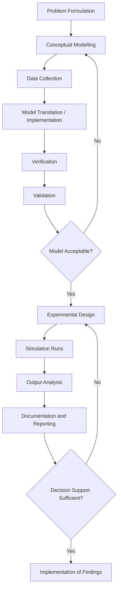
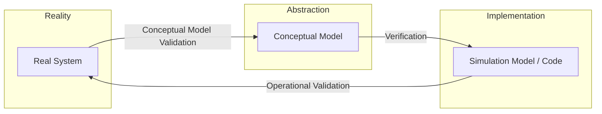

## Modelling and Simulation Process

### Overview

The Modelling and Simulation (M&S) process is the structured sequence of activities by which a real-world problem is translated into a conceptual model, formalized into a mathematical or logical representation, implemented as executable code, and exercised to produce results that inform decisions. While specific methodologies vary by domain and author, the overall lifecycle is broadly consistent across engineering, operations research, and scientific simulation practice.

### The Overall Lifecycle

**Key Points**
- The process is iterative rather than strictly linear; findings at later stages routinely send the practitioner back to revise earlier stages.
- Each stage has a distinct deliverable and a distinct set of questions it is meant to answer.
- Skipping or compressing early stages (particularly problem formulation) is a common source of simulation studies that produce technically correct but practically useless results.

### Stage 1 — Problem Formulation

Problem formulation establishes why the study is being conducted, what questions it must answer, and what would constitute a satisfactory outcome.

**Key Points**
- A clearly stated objective determines the required level of model detail; vague objectives tend to produce over- or under-engineered models.
- Deliverables typically include a problem statement, a list of specific questions the study must answer, and success criteria.
- Stakeholder input at this stage is critical, since the analyst and the decision-maker may have different implicit assumptions about scope.

**Example**
A poorly formulated objective: "Simulate the factory to see how it performs."
A well-formulated objective: "Determine whether adding a second packaging line reduces average order fulfillment time below 24 hours for at least 95% of orders, under projected demand growth of 15% over the next two years."

### Stage 2 — System and Objective Definition (Scoping)

This stage delineates the boundary of the system to be modeled, distinguishing endogenous elements (represented explicitly) from exogenous elements (treated as external inputs or ignored).

**Key Points**
- Boundary decisions directly control model complexity; including too much reduces tractability, excluding too much reduces validity.
- Assumptions and simplifications made here should be explicitly recorded, since they become the basis for later validation judgments.
- The level of resolution (aggregate vs. detailed) should match the granularity of the questions posed in Stage 1.

### Stage 3 — Conceptual Modelling

The conceptual model is an abstract, often non-mathematical or semi-formal description of the system's structure, logic, and behavior, expressed in a form understandable to both technical and non-technical stakeholders before committing to implementation.

**Key Points**
- Common conceptual modelling artifacts include process flow diagrams, activity cycle diagrams, entity-relationship descriptions, and state charts.
- The conceptual model should specify entities, attributes, activities, events, and the logical relationships governing state transitions.
- Errors caught at the conceptual stage are substantially cheaper to fix than errors discovered after implementation. [Inference] The precise cost differential is frequently cited in software and simulation engineering literature but varies by project and is not a fixed universal multiplier.

### Stage 4 — Data Collection and Analysis

Data collection gathers the empirical inputs — parameters, distributions, historical records — needed to populate and calibrate the model.

**Key Points**
- Data needs are identified from the conceptual model, not gathered speculatively; each data element should map to a specific model input.
- Where empirical data is sparse, distributions may be fitted from limited samples, derived from expert judgment, or drawn from published reference values.
- Data quality issues (missing values, measurement error, non-stationarity) discovered here often force revision of the conceptual model's assumptions.

**Example**
If a conceptual model assumes customer arrivals follow a Poisson process, the data collection stage would gather timestamped arrival records and test the Poisson assumption (e.g., via a chi-square goodness-of-fit test) before accepting the assumption for the formal model.

### Stage 5 — Model Translation (Implementation)

Translation converts the conceptual model into an executable form using a simulation language, general-purpose programming language, or simulation software package.

**Key Points**
- Implementation choices (discrete-event engine, system dynamics package, custom code, agent-based framework) should follow from the model classification established earlier, not the other way around.
- Modular implementation — separating entity logic, event scheduling, and statistics collection — improves maintainability and eases verification.
- Random number generation and variate generation (for stochastic models) require careful implementation to avoid correlation artifacts and ensure statistically valid streams.

### Stage 6 — Verification

Verification confirms that the implemented simulation correctly reflects the conceptual and mathematical model — i.e., that the code has been built correctly, independent of whether the model itself is a good representation of reality.

**Key Points**
- Common verification techniques include structured walkthroughs, unit testing of individual model components, tracing (following a single entity through the system step by step), and comparison against simplified analytical cases.
- A useful verification check is degenerate-case testing: setting parameters to trivial values (e.g., zero arrival rate) and confirming the simulation produces the expected trivial output.
- Verification answers: "Did we build the model right?"

### Stage 7 — Validation

Validation confirms that the model, as built, adequately represents the real system for the purposes defined in Stage 1 — i.e., whether the model is a good enough representation of reality, independent of whether the code is bug-free.

**Key Points**
- Common validation techniques include comparing simulation output against historical real-system data, expert review of model behavior ("face validation"), and sensitivity analysis to confirm the model responds to parameter changes in plausible directions.
- A model can be verified (bug-free relative to its specification) yet invalid (a poor representation of reality) if the conceptual model itself was flawed.
- Validation answers: "Did we build the right model?"
- Validation is rarely absolute; it is typically framed as "valid for the intended purpose within a stated operating range," since no model is validated for all possible uses. [Inference] The degree of validation rigor required is generally proportional to the consequences of decisions based on the model, though this is a practical norm rather than a universally codified rule.

### Stage 8 — Experimental Design

Experimental design determines which scenarios to simulate, how many replications are needed, and how outputs will be measured and compared.

**Key Points**
- Design decisions include: number of independent replications, simulation run length, treatment of warm-up periods (to remove initialization bias in steady-state studies), and factor/level combinations for scenario comparison.
- Techniques from classical design of experiments (factorial designs, Latin hypercube sampling, response surface methodology) are commonly applied to simulation studies to reduce the number of runs needed for a given level of insight.
- Variance reduction techniques (common random numbers, antithetic variates, control variates) may be applied at this stage to improve the precision of comparative results without proportionally increasing computational cost.

### Stage 9 — Simulation Runs (Production Runs)

This stage executes the simulation according to the experimental design, generating the raw output data for analysis.

**Key Points**
- Sufficient replications are needed to characterize output variability, particularly for stochastic models where a single run is not representative.
- Computational considerations (run time, parallelization, random seed management) become practically significant at scale.
- Intermediate outputs should be logged in a form that supports the specific statistical analysis planned in the next stage, rather than being decided ad hoc afterward.

### Stage 10 — Output Analysis

Output analysis applies statistical methods to interpret simulation results, quantify uncertainty, and support comparison between scenarios.

**Key Points**
- For stochastic simulations, point estimates should be accompanied by confidence intervals, not reported as single deterministic values.
- Common analyses include comparison of means across scenarios (e.g., paired-t confidence intervals using common random numbers), regression metamodeling, and sensitivity/scenario analysis.
- Steady-state studies require careful handling of the initial transient (warm-up) period, often identified via methods such as Welch's graphical procedure, to avoid biasing long-run estimates.

**Example**
If comparing average waiting time between two staffing policies, an analyst would run both scenarios under multiple replications with common random numbers, then construct a confidence interval on the difference in means to determine whether the observed improvement is statistically distinguishable from noise.

### Stage 11 — Documentation and Reporting

Documentation records assumptions, data sources, model structure, verification and validation evidence, and results in a form that supports both immediate decision-making and future reuse or audit of the model.

**Key Points**
- Documentation should be sufficient for an independent analyst to understand what the model does and does not represent, without requiring access to the original developer.
- Clear communication of model limitations and validated operating range is as important as reporting the favorable results.
- Reproducibility (random seeds, software versions, parameter files) is increasingly expected, particularly in scientific and regulatory contexts.

### Stage 12 — Implementation of Findings

The final stage applies study conclusions to the real-world decision, and — in mature practice — monitors real-system outcomes against the model's predictions to inform future model refinement.

**Key Points**
- Discrepancies between predicted and observed real-world outcomes after implementation provide valuable feedback for recalibrating or revalidating the model for future studies.
- Some organizations maintain simulation models as living tools that are periodically re-validated and reused, rather than treating each study as a one-off exercise.

### Iteration and Feedback Loops

**Key Points**
- Validation failure sends the process back to conceptual modelling (Stage 3) or even problem formulation (Stage 1), not merely back to coding.
- Output analysis revealing insufficient statistical precision sends the process back to experimental design (Stage 8) to add replications or refine scenarios.
- This non-linearity is the reason M&S process diagrams are typically drawn with feedback arrows rather than as a strict waterfall.

### Common Pitfalls Across the Process

- **Model creep** — continually expanding scope mid-project without revisiting the original objective, leading to schedule overrun and unnecessary complexity.
- **Premature coding** — implementing before the conceptual model is stable, resulting in costly rework.
- **Insufficient replications** — drawing conclusions from too few stochastic runs, mistaking random variation for a genuine scenario effect.
- **Validation neglect** — treating a verified (bug-free) model as though it were automatically validated (representative of reality).
- **Undocumented assumptions** — losing track of simplifications made early in the process, leading to misapplication of the model outside its valid range later.

### Conclusion

The Modelling and Simulation process is a disciplined, iterative pipeline running from problem formulation through conceptual modelling, data collection, implementation, verification, validation, experimentation, analysis, and reporting, with feedback loops connecting later stages back to earlier ones whenever a mismatch is discovered. Its rigor lies not in any single stage but in the discipline of treating verification and validation as distinct checks, documenting assumptions as they are made, and matching model detail and experimental design to the specific decision the study is meant to support.

**Related Topics**
- Conceptual Modelling Techniques (Activity Cycle Diagrams, IDEF, SysML)
- Verification and Validation (V&V) Methods in Depth
- Design of Experiments for Simulation Studies
- Output Analysis: Confidence Intervals, Warm-Up Periods, and Steady-State Estimation
- Variance Reduction Techniques (Common Random Numbers, Antithetic Variates)
- Random Number and Random Variate Generation
- Simulation Documentation Standards and Reproducibility
- Model Credibility, Accreditation, and Regulatory Acceptance