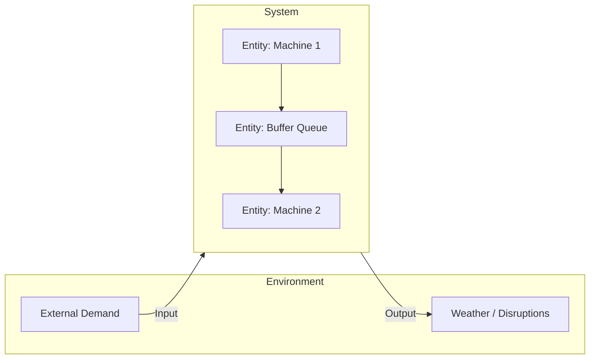

## System and Its Models

### Overview

A system, in the context of Modelling and Simulation, is a collection of interrelated entities that interact with one another and, collectively, exhibit behavior directed toward a purpose or pattern of activity. The system concept underlies every model, since modelling begins with identifying which entities and interactions belong "inside" the boundary being studied and which are treated as external influences.

### Defining a System

A system is formally characterized as a set of entities, their attributes, and the relationships among them, evolving through activities and events over time.

**Key Points**
- A system exists relative to an observer's purpose; the same physical arrangement of objects may be considered several different systems depending on what behavior is of interest.
- Systems are typically bounded by a defined frontier separating what is modeled explicitly (endogenous) from what is treated as external input (exogenous).
- The behavior of a system emerges from the interaction of its components, not merely from summing their individual behaviors — a property often referred to as emergence.

### Core System Terminology

**Key Points**
- **Entity** — an object of interest within the system (e.g., a customer, a machine, a vehicle).
- **Attribute** — a property describing an entity (e.g., a customer's arrival time, a machine's processing rate).
- **Activity** — a duration of time during which specified entity states are maintained or a process occurs (e.g., "being served," "being machined").
- **Event** — an instantaneous occurrence that changes the state of the system (e.g., "customer arrives," "machine breaks down").
- **State** — the collection of variables necessary to describe the system at a particular point in time, sufficient to determine its future behavior given future inputs.
- **System state variables** — the minimal set of variables that fully characterizes the system for the purposes of the study.

**Example**
In a bank queueing system: entities are customers and tellers; attributes include each customer's arrival time and service requirement; an activity is "customer being served"; events include "customer arrival" and "service completion"; the state might be the number of customers currently in the system and the status (busy/idle) of each teller.

### System Environment and Boundary

**Key Points**
- The **environment** consists of elements outside the system boundary that affect the system but are not themselves affected by it (or whose effects on the system are the focus, while their own internal dynamics are ignored).
- Defining the boundary is a modelling decision, not an objective fact about the world — different studies of the "same" real system may draw the boundary differently.
- Interactions crossing the boundary are represented as inputs (from environment to system) and outputs (from system to environment).

### System State and Its Role in Modelling

The concept of state is central to dynamic modelling, since it is the mechanism by which a system's history influences its future without requiring the entire history to be retained explicitly.

**Key Points**
- A well-chosen state representation satisfies the Markov property when possible: future behavior depends only on the current state and future inputs, not on the specific path taken to reach that state.
- Systems lacking a convenient Markovian state representation (e.g., systems with significant memory effects) may require augmented state variables or historical terms to be added to preserve tractability.
- The dimensionality of the state space directly affects computational cost, particularly for simulation methods that must store, update, and search over state (e.g., discrete-event simulation with complex entity attributes).

### Classification of Systems for Modelling Purposes

**By Change Over Time**
- **Static system** — properties do not change with time within the scope of study, or time is not a relevant modelling dimension (e.g., a network's fixed topology at a single instant).
- **Dynamic system** — state evolves over time in response to internal dynamics and external inputs (e.g., an inventory system with continuous stock depletion and periodic replenishment).

**By State Space Continuity**
- **Continuous system** — state variables change continuously with time (e.g., fluid levels, temperatures, velocities).
- **Discrete system** — state variables change only at countable points in time (e.g., number of items in a queue, which changes only at arrival/departure events).

**By Predictability**
- **Deterministic system** — given the current state and inputs, the future state is uniquely determined.
- **Stochastic system** — future state involves randomness even given complete knowledge of the current state and inputs.

**By Interaction Complexity**
- **Linear system** — satisfies superposition (the response to a sum of inputs equals the sum of responses to each input individually).
- **Nonlinear system** — does not satisfy superposition; typically exhibits phenomena unavailable to linear systems, such as chaos, multiple equilibria, or saturation effects.

**By Openness**
- **Open system** — exchanges matter, energy, or information with its environment.
- **Closed system** — does not exchange with its environment, an idealization rarely fully realized but often useful for bounding analysis.

### From System to Model: The Abstraction Relationship

**Key Points**
- A model is always a simplification of a system; no model captures every attribute, interaction, or state variable of the real system, nor should it attempt to.
- The modeller's central task is selecting which entities, attributes, activities, and events are relevant to the study's objective, and which can be abstracted away or replaced by simplified surrogate representations.
- Over-inclusion (modelling irrelevant detail) wastes development and computational effort; under-inclusion (omitting relevant detail) risks invalidating the model for its intended purpose.

$$
\text{System } S = \langle E, A, R, \Sigma \rangle \;\longrightarrow\; \text{Model } M = \langle E', A', R', \Sigma' \rangle
$$

where $E' \subseteq E$, $A' \subseteq A$, and $R' \subseteq R$ represent the subset of entities, attributes, and relationships retained in the model, and $\Sigma'$ is the corresponding reduced state space.

### System Structure Representations

**Key Points**
- **Block diagrams** — represent systems as interconnected functional blocks with signal flow between them, common in control systems modelling.
- **Entity-relationship diagrams** — represent entities and their attributes/relationships, common in data-oriented and discrete-event modelling.
- **State transition diagrams** — represent the system as a finite (or countable) set of states with defined transitions triggered by events or conditions.
- **Network/graph representations** — represent systems as nodes and edges, useful for systems where connectivity and flow are central (e.g., transportation networks, communication networks).

<svg xmlns="http://www.w3.org/2000/svg" viewBox="0 0 820 300">
  <title>System Structure Representation Styles (svg_diagram)</title>
  <rect x="20" y="20" width="180" height="110" rx="8" fill="#eef3fb" stroke="#33547a" stroke-width="1.5" />
  <text x="110" y="45" font-size="13" text-anchor="middle" fill="#1c2b3a" font-weight="bold">Block Diagram</text>
  <rect x="35" y="60" width="55" height="35" fill="#ffffff" stroke="#33547a" />
  <text x="62" y="82" font-size="10" text-anchor="middle">Controller</text>
  <rect x="130" y="60" width="55" height="35" fill="#ffffff" stroke="#33547a" />
  <text x="157" y="82" font-size="10" text-anchor="middle">Plant</text>
  <line x1="90" y1="77" x2="130" y2="77" stroke="#333" stroke-width="1.5" />

  <rect x="220" y="20" width="180" height="110" rx="8" fill="#eef3fb" stroke="#33547a" stroke-width="1.5" />
  <text x="310" y="45" font-size="13" text-anchor="middle" fill="#1c2b3a" font-weight="bold">Entity-Relationship</text>
  <rect x="235" y="60" width="60" height="30" fill="#ffffff" stroke="#33547a" />
  <text x="265" y="79" font-size="9" text-anchor="middle">Customer</text>
  <rect x="325" y="60" width="60" height="30" fill="#ffffff" stroke="#33547a" />
  <text x="355" y="79" font-size="9" text-anchor="middle">Order</text>
  <line x1="295" y1="75" x2="325" y2="75" stroke="#333" stroke-width="1.5" />
  <text x="310" y="70" font-size="8" text-anchor="middle">places</text>

  <rect x="420" y="20" width="180" height="110" rx="8" fill="#eef3fb" stroke="#33547a" stroke-width="1.5" />
  <text x="510" y="45" font-size="13" text-anchor="middle" fill="#1c2b3a" font-weight="bold">State Transition</text>
  <circle cx="460" cy="80" r="20" fill="#ffffff" stroke="#33547a" />
  <text x="460" y="84" font-size="9" text-anchor="middle">Idle</text>
  <circle cx="555" cy="80" r="20" fill="#ffffff" stroke="#33547a" />
  <text x="555" y="84" font-size="9" text-anchor="middle">Busy</text>
  <line x1="480" y1="75" x2="535" y2="75" stroke="#333" stroke-width="1.5" />
  <line x1="535" y1="88" x2="480" y2="88" stroke="#333" stroke-width="1.5" />

  <rect x="620" y="20" width="180" height="110" rx="8" fill="#eef3fb" stroke="#33547a" stroke-width="1.5" />
  <text x="710" y="45" font-size="13" text-anchor="middle" fill="#1c2b3a" font-weight="bold">Network / Graph</text>
  <circle cx="650" cy="90" r="8" fill="#ffffff" stroke="#33547a" />
  <circle cx="710" cy="60" r="8" fill="#ffffff" stroke="#33547a" />
  <circle cx="770" cy="90" r="8" fill="#ffffff" stroke="#33547a" />
  <line x1="656" y1="86" x2="704" y2="64" stroke="#333" stroke-width="1.5" />
  <line x1="716" y1="64" x2="764" y2="86" stroke="#333" stroke-width="1.5" />
  <line x1="658" y1="93" x2="762" y2="93" stroke="#333" stroke-width="1.5" />
</svg>

### Subsystems and Hierarchical Decomposition

**Key Points**
- Complex systems are frequently decomposed into subsystems, each modeled with its own boundary, state, and interface, then composed to form the overall system model.
- Hierarchical decomposition supports manageable model development and independent validation of subsystem components before integration.
- Interfaces between subsystems must be carefully specified (data types, timing, units) since inconsistent interfaces are a common source of integration errors in composed simulations.
- This decomposition principle underlies modular simulation architectures and standards such as distributed and federated simulation frameworks, addressed separately in later topics.

### Coupled Systems and Interaction Effects

**Key Points**
- In coupled systems, the output of one subsystem serves as the input to another, potentially creating feedback loops that produce behavior not predictable from any subsystem in isolation.
- Feedback loops can be **reinforcing** (amplifying a change, potentially leading to instability or exponential growth) or **balancing** (counteracting a change, tending toward equilibrium).
- Correctly identifying feedback structure is essential in systems where the primary behavior of interest is emergent — a recurring theme in system dynamics modelling, addressed in a dedicated later topic.

### Practical Implications for Model Building

**Key Points**
- Before writing any equations or code, a modeller should explicitly enumerate: system entities, their relevant attributes, the events that change state, and the boundary separating system from environment.
- Ambiguity about system boundary is a frequent source of scope disagreement between stakeholders and should be resolved and documented during the problem formulation and scoping stages of the M&S process.
- The classification of the system (deterministic/stochastic, continuous/discrete, linear/nonlinear) determines which mathematical and computational tools are appropriate for the resulting model, directly shaping tool and method selection in subsequent stages.

### Conclusion

A system is the real-world or conceptual object of study, characterized by its entities, attributes, relationships, and state, bounded against an external environment. Modelling is fundamentally the act of abstracting a chosen subset of this system's structure and behavior into a tractable representation aligned with a specific purpose. Understanding system concepts — boundary, state, entity, event, activity, and classification along axes such as determinism, continuity, and linearity — provides the conceptual vocabulary necessary for every subsequent modelling and simulation technique, from simple analytical models to large-scale distributed simulations.

**Related Topics**
- System Boundaries, Scope Definition, and Environment Specification
- State-Space Representation and the Markov Property
- Entity-Attribute-Event Formalisms in Discrete-Event Systems
- Feedback Loops and System Dynamics Modelling
- Hierarchical and Modular Model Composition
- Continuous vs. Discrete System Representations
- Subsystem Interfaces and Federated Simulation Architectures