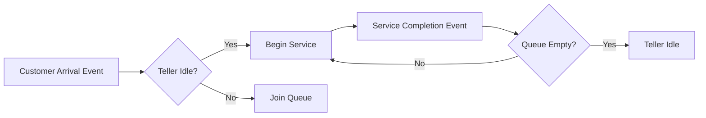

## Examples of Systems and Models

### Overview

This topic surveys concrete systems drawn from multiple domains and shows how each can be translated into one or more models, illustrating how the same underlying system can yield different models depending on the objective, the level of abstraction chosen, and the classification (deterministic/stochastic, continuous/discrete) adopted. The intent is to make the abstract system and model concepts from prior topics tangible through worked examples.

### Example 1 — A Single-Server Queueing System (Bank Teller)

**Key Points**
- **System**: customers arriving at a bank with one teller providing service.
- **Entities**: customers, teller.
- **Attributes**: customer arrival time, required service time; teller status (busy/idle).
- **Events**: customer arrival, service start, service completion, customer departure.
- **State variables**: number of customers in the system, teller status.

**Model 1 — Analytical (M/M/1 Queue)**
Assuming Poisson arrivals with rate $\lambda$ and exponential service times with rate $\mu$, the steady-state expected number of customers in the system is:

$$
L = \frac{\rho}{1 - \rho}, \quad \rho = \frac{\lambda}{\mu} < 1
$$

This is a deterministic, closed-form model of an inherently stochastic system — it describes long-run *average* behavior rather than any specific realization.

**Model 2 — Discrete-Event Simulation**
The same system can instead be modeled as a discrete-event simulation that generates individual random arrival and service times, advances a simulation clock event-by-event, and tracks queue length directly. This model is used when arrival/service distributions deviate from the Poisson/exponential assumptions, or when transient (non-steady-state) behavior is of interest — cases the analytical formula above cannot address.

### Example 2 — A Falling Object Under Gravity

**Key Points**
- **System**: a single rigid body falling near Earth's surface.
- **Entities**: the object.
- **Attributes**: mass, position, velocity.
- **State variables**: position $x(t)$, velocity $v(t)$.

**Model 1 — Simplified Continuous Deterministic Model (No Air Resistance)**

$$
\frac{d^2x}{dt^2} = -g
$$

This model is appropriate when air resistance is negligible relative to the objective (e.g., estimating fall time for a dense object over a short distance).

**Model 2 — Refined Continuous Model (With Air Resistance)**

$$
m\frac{dv}{dt} = mg - \tfrac{1}{2} C_d \rho A v^2
$$

where $C_d$ is the drag coefficient, $\rho$ is air density, and $A$ is cross-sectional area. This nonlinear differential equation generally has no simple closed-form solution and is typically solved numerically — illustrating how adding a single relevant factor (drag) can shift a model from analytically solvable to requiring computational simulation.

### Example 3 — Predator-Prey Population Dynamics

**Key Points**
- **System**: an ecosystem with one predator species and one prey species.
- **Entities**: predator population, prey population (treated in aggregate, not as individual agents, in this model).
- **State variables**: prey population $x(t)$, predator population $y(t)$.

**Model — Lotka-Volterra Equations**

$$
\frac{dx}{dt} = \alpha x - \beta x y
$$
$$
\frac{dy}{dt} = \delta x y - \gamma y
$$

This is a continuous, deterministic, nonlinear model that exhibits oscillatory behavior without requiring any external periodic forcing — a classic illustration of emergent dynamics arising purely from the interaction terms $\beta xy$ and $\delta xy$. [Inference] Real ecological systems typically show additional irregularity relative to this idealized model, generally attributed to factors such as environmental stochasticity, spatial heterogeneity, and additional species interactions not captured in the two-variable formulation.

An **agent-based alternative model** of the same system would instead represent individual predators and prey as discrete agents with their own positions, energy levels, and behavioral rules, allowing spatial effects and individual variation to emerge — a fundamentally different modelling choice suited to different research questions (population-level trends vs. individual/spatial dynamics).

### Example 4 — An Electrical RC Circuit

**Key Points**
- **System**: a resistor-capacitor circuit driven by a voltage source.
- **Entities**: resistor, capacitor, voltage source.
- **State variable**: capacitor voltage $v_C(t)$.

**Model — First-Order Linear Differential Equation**

$$
RC \frac{dv_C}{dt} + v_C = V_{in}(t)
$$

This is a continuous, deterministic, linear system — one of the few cases in this list with a general closed-form solution for arbitrary input $V_{in}(t)$ via convolution with the system's impulse response. This model illustrates a case where analytical tractability persists even for time-varying inputs, in contrast to Example 2's drag-augmented case.

### Example 5 — A Manufacturing Production Line

**Key Points**
- **System**: a sequence of workstations processing parts, separated by buffers.
- **Entities**: parts, machines, buffers.
- **Attributes**: machine processing time, buffer capacity, machine failure/repair rates.
- **Events**: part arrival at a station, processing start, processing completion, machine failure, machine repair.

**Model — Discrete-Event Simulation with Stochastic Failures**
Processing times may be modeled as random variables (e.g., triangular or lognormal distributions fitted to observed cycle times), and machine failures modeled as a stochastic process (e.g., time-to-failure drawn from a Weibull distribution). This model is typically used to estimate throughput, bottleneck location, and the effect of buffer sizing — questions that cannot be answered by a simple deterministic average-cycle-time calculation because it would ignore variability-induced blocking and starving effects between stations.

<svg xmlns="http://www.w3.org/2000/svg" viewBox="0 0 820 200">
  <title>Production Line with Buffers (svg_diagram)</title>
  <rect x="20" y="70" width="100" height="60" rx="6" fill="#eef3fb" stroke="#33547a" stroke-width="1.5" />
  <text x="70" y="105" font-size="12" text-anchor="middle">Machine 1</text>
  <rect x="150" y="85" width="60" height="30" fill="#fdf3e0" stroke="#8a6d1f" stroke-width="1.5" />
  <text x="180" y="105" font-size="10" text-anchor="middle">Buffer</text>
  <rect x="240" y="70" width="100" height="60" rx="6" fill="#eef3fb" stroke="#33547a" stroke-width="1.5" />
  <text x="290" y="105" font-size="12" text-anchor="middle">Machine 2</text>
  <rect x="370" y="85" width="60" height="30" fill="#fdf3e0" stroke="#8a6d1f" stroke-width="1.5" />
  <text x="400" y="105" font-size="10" text-anchor="middle">Buffer</text>
  <rect x="460" y="70" width="100" height="60" rx="6" fill="#eef3fb" stroke="#33547a" stroke-width="1.5" />
  <text x="510" y="105" font-size="12" text-anchor="middle">Machine 3</text>
  <line x1="120" y1="100" x2="150" y2="100" stroke="#333" stroke-width="1.5" />
  <line x1="210" y1="100" x2="240" y2="100" stroke="#333" stroke-width="1.5" />
  <line x1="340" y1="100" x2="370" y2="100" stroke="#333" stroke-width="1.5" />
  <line x1="430" y1="100" x2="460" y2="100" stroke="#333" stroke-width="1.5" />
  <line x1="560" y1="100" x2="600" y2="100" stroke="#333" stroke-width="1.5" marker-end="url(#a1)" />
  <text x="600" y="90" font-size="11">Output</text>
  </svg>

### Example 6 — Epidemic Spread (SIR Model)

**Key Points**
- **System**: a population in which an infectious disease can spread.
- **Entities**: individuals, aggregated into compartments by infection status.
- **State variables**: susceptible $S(t)$, infected $I(t)$, recovered $R(t)$.

**Model — Compartmental Continuous Deterministic Model**

$$
\frac{dS}{dt} = -\beta \frac{SI}{N}, \quad \frac{dI}{dt} = \beta \frac{SI}{N} - \gamma I, \quad \frac{dR}{dt} = \gamma I
$$

where $\beta$ is the transmission rate, $\gamma$ is the recovery rate, and $N = S + I + R$ is the total population. This model treats the population as perfectly mixed and infinitely divisible, which is a reasonable approximation for large populations but breaks down for small populations or where contact structure is highly non-uniform.

**Agent-Based Alternative**: representing each individual explicitly, with an underlying contact network, allows the model to capture heterogeneous mixing, superspreading events, and spatial clustering — effects the compartmental model averages away. The choice between the two reflects the same system yielding different valid models depending on whether population-level trends or individual/network-level detail is the objective.

### Example 7 — A Simple Digital Logic Circuit

**Key Points**
- **System**: a combinational logic circuit (e.g., an AND-OR network).
- **Entities**: logic gates, signal wires.
- **State variables**: none, if purely combinational (output is a pure function of current inputs) — illustrating a static rather than dynamic system, in contrast to every prior example.

**Model — Boolean Function**

$$
Y = (A \wedge B) \vee (\lnot C)
$$

This is a discrete, deterministic, static model — output depends only on current input values, with no memory of past states, and no differential or difference equation is required.

### Cross-Example Comparison

| System | Model Type | Continuity | Determinism | Typical Solution Method |
|---|---|---|---|---|
| Bank queue | Queueing / DES | Discrete-event | Stochastic | Analytical (M/M/1) or simulation |
| Falling object | Differential equation | Continuous | Deterministic | Analytical or numerical integration |
| Predator-prey | Differential equation | Continuous | Deterministic | Numerical integration |
| RC circuit | Differential equation | Continuous | Deterministic | Analytical (convolution) |
| Production line | DES | Discrete-event | Stochastic | Simulation |
| Epidemic (SIR) | Differential equation | Continuous | Deterministic | Numerical integration |
| Logic circuit | Boolean function | Discrete, static | Deterministic | Direct evaluation |

### Key Lessons From the Examples

**Key Points**
- The same real-world system (e.g., an ecosystem, a population) can be legitimately modeled at different resolutions (aggregate/compartmental vs. individual/agent-based), and the correct choice depends on the study's objective rather than on one representation being universally superior.
- Adding a single additional physical effect (e.g., air resistance in Example 2) can change a model's class from analytically solvable to requiring numerical or simulation-based solution.
- Not all systems are dynamic; static systems (Example 7) are valid modelling targets and require no time-evolution formalism at all.
- Stochastic elements (queueing, manufacturing, agent-based epidemic contacts) generally push the model toward simulation-based rather than closed-form analytical solution, particularly as the number of interacting random elements grows.

### Conclusion

These examples demonstrate that modelling is not a mechanical translation from system to equations but a deliberate choice among valid alternatives, shaped by the objective of the study, the acceptable level of abstraction, and the mathematical tractability required. The same system — a population, a circuit, a production line — can support multiple legitimate models differing in continuity, determinism, and resolution, and recognizing this range of options is a prerequisite for selecting an appropriate modelling approach in later, more specialized topics.

**Related Topics**
- Differential Equation Models and Numerical Integration Methods
- Discrete-Event Simulation Mechanics
- Compartmental Modelling in Epidemiology
- Agent-Based Modelling Fundamentals
- Queueing Theory Fundamentals (M/M/1, M/M/c, M/G/1)
- Model Selection Criteria: Aggregate vs. Individual-Level Representation
- Static vs. Dynamic System Modelling