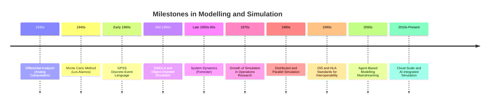

## History and Evolution of Modelling and Simulation

### Overview

The history of Modelling and Simulation traces a progression from purely analytical and physical modelling techniques to computer-based numerical and discrete-event simulation, driven largely by advances in mathematics, computing hardware, and the demands of military, aerospace, and industrial applications. Understanding this evolution clarifies why certain methods (analytical solutions, physical scale models, analog computation, digital simulation) coexist today rather than one having fully superseded the others.

### Pre-Computational Era — Analytical and Physical Modelling

**Key Points**
- Long before digital computers, modelling relied on closed-form mathematical analysis and physical scale models to predict system behavior.
- Classical mechanics (Newton, Euler, Lagrange) provided the differential-equation foundations still used in continuous system modelling today.
- Physical scale models — such as ship hull models tested in towing tanks, or wind tunnel models of aircraft — served as the primary "simulation" method for systems too complex for closed-form analysis, relying on dimensional analysis and similarity laws (e.g., Reynolds number scaling) to relate model behavior to full-scale behavior.
- Actuarial and statistical tables, developed from the 17th century onward, represent an early form of empirical (black-box) modelling applied to risk and demographic prediction.

### Early 20th Century — Analog Computation

**Key Points**
- Analog computers, prominent from the 1930s through the 1960s, used continuously variable physical quantities (typically electrical voltages) to represent and solve differential equations in real time, making them well suited to continuous system simulation.
- Vannevar Bush's differential analyzer (1930s) is a widely cited early analog computing device, used to solve systems of differential equations mechanically. [Unverified] Specific performance figures and comparative claims about early analog machines vary across historical sources and are not treated here as precisely quantified.
- Analog simulation was heavily used in aerospace and control system design, where continuous dynamics (aircraft flight, missile guidance) could be represented directly by analog circuit behavior without discretization error.
- Analog computers' key limitation — susceptibility to component drift, noise, and limited precision — motivated the eventual shift toward digital methods as digital hardware matured.

### Mid-20th Century — Emergence of Digital Computing and Monte Carlo Methods

**Key Points**
- The development of stored-program digital computers in the 1940s–1950s (e.g., ENIAC) enabled numerical simulation of systems that had no closed-form solution, using discretized time-stepping methods.
- The **Monte Carlo method**, formalized by Stanislaw Ulam, John von Neumann, and colleagues at Los Alamos in the late 1940s during nuclear weapons research, introduced systematic random sampling as a computational technique for solving problems intractable by deterministic analytical or numerical methods.
- Monte Carlo methods became foundational to stochastic simulation broadly, extending far beyond their original nuclear physics application into operations research, finance, and reliability engineering.
- Early digital simulations were constrained by extremely limited memory and processing speed relative to modern hardware, restricting model scale and run counts substantially compared to contemporary practice.

### 1960s — Formalization of Simulation Languages and Discrete-Event Simulation

**Key Points**
- The 1960s saw the introduction of dedicated simulation programming languages designed to reduce the effort of building discrete-event models compared to general-purpose programming languages.
- **GPSS (General Purpose Simulation System)**, developed by Geoffrey Gordon at IBM in the early 1960s, provided a block-diagram-oriented approach to discrete-event simulation aimed at making the technique accessible to non-programmers.
- **SIMULA**, developed by Ole-Johan Dahl and Kristen Nygaard in Norway in the mid-1960s, introduced object-oriented programming concepts specifically to support simulation modelling, and is widely recognized as a foundational influence on later object-oriented languages generally.
- **System Dynamics**, developed by Jay Forrester at MIT starting in the late 1950s, introduced a distinct modelling paradigm based on stocks, flows, and feedback loops, initially applied to industrial and corporate management problems and later extended to urban and global-scale modelling.
- These developments reflect a broader shift: simulation was moving from an ad hoc application of general computing toward a distinct engineering discipline with its own specialized tools and formal methods.

### 1970s — Expansion into Operations Research and Industry

**Key Points**
- Growing computational power made simulation increasingly practical for industrial applications such as manufacturing systems analysis, logistics, and queueing-based service system design.
- Statistical methodologies for simulation output analysis — confidence interval estimation, variance reduction techniques, and experimental design for simulation — matured substantially during this period, formalizing simulation as a rigorous quantitative methodology rather than an ad hoc programming exercise.
- Verification and validation began to be treated as formal, distinct methodological steps rather than implicit assumptions, reflecting growing awareness that a running simulation program does not by itself guarantee a credible model.

### 1980s — Distributed and Parallel Simulation

**Key Points**
- As simulations grew in scale and complexity, particularly in military training applications, techniques for distributing simulation execution across multiple processors or networked computers were developed.
- Parallel and distributed discrete-event simulation introduced new technical challenges around synchronizing simulated time across independently executing components, giving rise to formal synchronization algorithms (conservative and optimistic approaches) addressed in later specialized topics.
- Military simulation, in particular, drove early distributed simulation architectures intended to link geographically separated live, virtual, and constructive training assets.

### 1990s — Standardization for Interoperability

**Key Points**
- **DIS (Distributed Interactive Simulation)**, standardized in the early 1990s, defined protocols allowing separately developed simulators to interact in real time over a network, primarily for military training exercises.
- The **High Level Architecture (HLA)**, developed by the U.S. Department of Defense and later adopted as an IEEE standard (IEEE 1516), generalized and superseded DIS-era approaches by defining a more flexible framework (the Runtime Infrastructure, Federation Object Model, and associated rules) for composing independently developed simulations into a single federation.
- These standardization efforts reflect the field's transition from isolated, purpose-built simulations toward composable, interoperable simulation systems capable of large-scale, multi-organization exercises.

### 2000s — Agent-Based Modelling and Broader Adoption

**Key Points**
- Agent-based modelling, while conceptually present earlier (e.g., cellular automata work by von Neumann and Conway in earlier decades), moved into mainstream use across social science, economics, epidemiology, and ecology during the 2000s, aided by increased computing power and accessible modelling platforms.
- Simulation adoption broadened well beyond its traditional military, aerospace, and manufacturing strongholds into healthcare systems planning, financial risk modelling, and public policy analysis.
- Commercial and open-source simulation software matured substantially during this period, lowering the technical barrier to building credible discrete-event, system dynamics, and agent-based models without requiring custom low-level programming.

### 2010s–Present — Cloud Computing, Big Data, and AI Integration

**Key Points**
- Cloud computing enabled simulation studies requiring very large numbers of replications or very large-scale models to be executed without dedicated on-premises high-performance computing infrastructure.
- The proliferation of sensor data and "digital twin" concepts extended simulation from a design-time and planning tool into an operational tool, where live data streams continuously update and recalibrate a running simulation model of a physical asset or system.
- Machine learning techniques have increasingly been integrated with traditional M&S, both as a component within hybrid models (e.g., learned surrogate models replacing computationally expensive simulation components) and as a tool for calibrating and analyzing simulation output. [Inference] The long-term methodological role of machine learning within classical M&S practice is still an active area of development, and its eventual maturity and standardization relative to established V&V practice remains an evolving question rather than a settled matter.

### Recurring Themes Across the History

**Key Points**
- Each major advance in computing hardware (analog circuits, digital computers, parallel/distributed systems, cloud infrastructure) has directly expanded the scale and class of systems that could be feasibly simulated.
- Military and aerospace applications have repeatedly served as early drivers of methodological and standardization advances (analog flight simulation, DIS/HLA interoperability standards), with techniques subsequently diffusing into civilian industry.
- The field has consistently moved toward greater formalization — from ad hoc physical models, to dedicated simulation languages, to standardized interoperability architectures, to today's emphasis on reproducibility and rigorous V&V.
- Older techniques (analytical solutions, physical scale modelling, system dynamics) have not been discarded but persist alongside newer computational methods, each remaining appropriate for particular classes of problems.

### Conclusion

The history of Modelling and Simulation reflects a steady broadening of capability and formalization: from pre-computational analytical and physical models, through analog computation, to digital numerical and Monte Carlo methods, to dedicated discrete-event and system dynamics languages, to distributed and standardized interoperable simulation architectures, and finally to today's cloud-scale, data-integrated, and AI-augmented simulation practice. This trajectory was driven largely by advances in computing hardware and by demanding early-adopter domains — particularly nuclear research, aerospace, and military training — whose requirements repeatedly pushed simulation methodology forward before it diffused into broader industrial and scientific use.

**Related Topics**
- Monte Carlo Methods: Theory and Applications
- Simulation Languages and Software Evolution (GPSS, SIMULA, Modern Platforms)
- System Dynamics: Origins and Methodology (Forrester)
- Distributed Simulation Architectures (HLA, DIS)
- Parallel and Distributed Discrete-Event Simulation Synchronization
- Digital Twins and Real-Time Data-Integrated Simulation
- Agent-Based Modelling: Origins and Modern Applications
- Machine Learning Integration in Simulation Practice