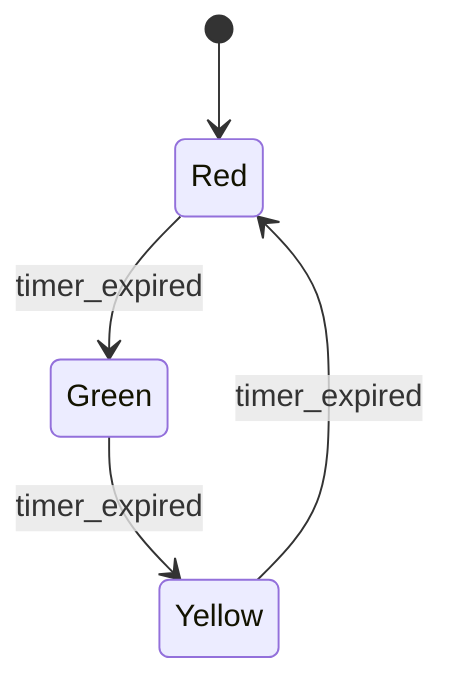

## Types of Models: Physical, Mathematical, Logical

### Overview

Models can be classified by the medium and formalism used to represent the system, independent of the domain being studied. The three broad categories — physical, mathematical, and logical — represent fundamentally different approaches to abstraction: physical models represent a system through another tangible object, mathematical models represent it through symbolic and numerical relationships, and logical models represent it through rules, structures, and state-transition semantics. Most modern simulation work builds on mathematical and logical models, but physical models retain an important role and provide useful conceptual grounding for the other two.

### Physical Models

A physical model represents a system using a tangible, often scaled-down or simplified, physical analog rather than symbols or equations.

**Key Points**
- Physical models rely on principles of similarity — geometric, kinematic, and dynamic similarity — to ensure that behavior observed in the model corresponds predictably to behavior in the full-scale system.
- Dimensionless numbers (e.g., Reynolds number, Froude number, Mach number) are used to determine the scaling relationships required for a physical model's behavior to be representative of the real system.
- Physical models are typically used when the underlying phenomena are too complex, too poorly understood mathematically, or too sensitive to fine-grained physical detail to be captured adequately by a symbolic model alone.

**Example**
A scaled model of a ship hull tested in a towing tank allows engineers to measure drag and wave-making resistance experimentally, using Froude number scaling to relate the model's behavior to the full-scale vessel's expected performance — a technique still used to complement rather than fully replace computational fluid dynamics simulation.

**Subtypes of Physical Models**
- **Iconic models** — resemble the real system in appearance but are typically at a different scale (e.g., a model airplane, an architectural scale model of a building).
- **Analog models** — use a different physical medium to represent system behavior via analogous mathematical relationships (e.g., an electrical circuit used to represent a mechanical or fluid system, exploiting the shared differential-equation structure).

**Key Points**
- Iconic models emphasize visual/structural resemblance and are often used for spatial, aesthetic, or basic geometric evaluation (e.g., wind tunnel testing, architectural review).
- Analog models exploit mathematical equivalence between physically different systems, historically important for analog computation, as discussed in the history topic.
- Physical models are generally the least flexible of the three types once built — modifying a physical model to explore a different configuration typically requires substantial rework, unlike mathematical or logical models.

### Mathematical Models

A mathematical model represents system behavior using symbolic relationships — equations, inequalities, and functions — relating variables that describe the system's state, inputs, and outputs.

**Key Points**
- Mathematical models are the dominant form used in engineering and scientific simulation, since they can be manipulated analytically, solved numerically, and embedded directly into computational software.
- They range from simple algebraic relationships to systems of coupled nonlinear differential equations, depending on the complexity of the underlying system.
- Mathematical models can often be solved analytically for simple cases, but generally require numerical methods (covered in dedicated later topics) once nonlinearity, high dimensionality, or complex boundary conditions are introduced.

**Subtypes of Mathematical Models**

- **Algebraic models** — relate variables through equations with no time-dependence (e.g., Ohm's law, $V = IR$).
- **Differential equation models** — describe how state variables change continuously with time (ordinary differential equations for lumped-parameter systems, partial differential equations for distributed/spatial systems).
- **Difference equation models** — describe how state variables change at discrete time steps, often used when time is naturally or computationally discretized (e.g., $x_{k+1} = f(x_k, u_k)$).
- **Statistical/probabilistic models** — describe system behavior in terms of probability distributions rather than deterministic relationships (e.g., regression models, Markov chains).

**Example**
The RC circuit model introduced in the systems examples topic:

$$
RC\frac{dv_C}{dt} + v_C = V_{in}(t)
$$

is a continuous, deterministic, linear differential equation model — one specific subtype within the broader mathematical model category.

**Key Points**
- The choice among algebraic, differential, difference, and statistical formulations depends on whether the system is static or dynamic, continuous or discrete in time, and deterministic or stochastic — the classification axes introduced in the earlier systems topic directly determine which mathematical model subtype is appropriate.
- Mathematical models are generally the most portable and reusable of the three categories, since the same equation set can be re-solved under different parameter values or boundary conditions without physical reconstruction.

### Logical Models

A logical model represents system behavior using structured rules, conditions, and state-transition semantics rather than continuous mathematical relationships — often the natural representation for systems whose behavior is governed by discrete decisions, sequencing, and branching logic rather than smooth quantitative laws.

**Key Points**
- Logical models are the typical foundation for discrete-event simulation, where system behavior is defined by conditional rules governing when events occur and how state changes as a result.
- They are especially suited to systems involving decision logic, scheduling, resource allocation, and sequencing — domains where the "physics" of the system is procedural rather than continuous.
- Logical models are commonly expressed as flowcharts, state-transition diagrams, decision tables, or direct programming logic (conditionals, finite state machines).

**Example**
A traffic light controller can be represented as a logical model using a finite state machine, where transitions between states (Red, Green, Yellow) are governed by timers and, in more advanced designs, sensor-triggered conditions rather than any differential equation.

**Key Points**
- Logical models can be combined with mathematical models within a single simulation — for example, a manufacturing simulation might use logical rules for machine scheduling decisions while using mathematical (statistical) models for stochastic processing time generation.
- Decision tables and rule-based representations are especially useful for capturing expert knowledge or policy logic in a form that is both human-readable and directly executable.

### Comparison Across the Three Types

| Aspect | Physical | Mathematical | Logical |
|---|---|---|---|
| Representation medium | Tangible physical analog | Equations/symbols | Rules/state structures |
| Flexibility to modify | Low (requires rebuilding) | High (re-parameterize/re-solve) | High (redefine rules/states) |
| Typical use case | Aerodynamics, structural testing | Continuous dynamics, physical laws | Scheduling, decision logic, event sequencing |
| Computational execution | N/A (physically realized) | Analytical or numerical solution | Direct rule evaluation / state machine execution |
| Common tools | Scale models, wind tunnels, towing tanks | Differential equation solvers, algebra | Discrete-event engines, finite state machines, decision tables |

### Hybrid and Combined Model Types

**Key Points**
- Most real-world simulation studies do not rely on a single pure type; a manufacturing simulation typically combines logical models (scheduling rules, routing decisions) with mathematical models (statistical distributions for processing times and failures).
- A digital twin of a physical asset may combine a mathematical model (physics-based equations describing component behavior) with a logical model (operational rules and maintenance triggers) and, in earlier design stages, a physical prototype used for validation.
- Recognizing which category a given sub-component of a system naturally falls into helps a modeller select the appropriate formalism and tool for that component, rather than forcing an entire complex system into a single modelling paradigm.

### Practical Guidance for Model Type Selection

**Key Points**
- Favor a **mathematical model** when system behavior is governed by continuous physical laws with known or well-approximated functional relationships.
- Favor a **logical model** when system behavior is governed by discrete decisions, sequencing, resource contention, or conditional branching.
- Reserve a **physical model** for cases where the phenomena are too complex or poorly understood to model symbolically with adequate confidence, or where physical validation of a mathematical/logical model is itself required as part of the overall study.
- In practice, complex simulation studies often require an explicit decomposition step (introduced in the systems topic) to identify which subsystems warrant which model type before implementation begins.

### Conclusion

Physical, mathematical, and logical models represent three distinct formalisms for capturing system behavior — a tangible analog, a symbolic/quantitative relationship, or a rule-based/state-transition structure, respectively. While mathematical and logical models dominate modern computational simulation due to their flexibility and direct executability, physical models remain relevant where physical phenomena resist adequate symbolic characterization. Most substantial simulation studies combine elements of more than one type, and recognizing which formalism best matches each part of a system is a foundational skill for effective model construction.

**Related Topics**
- Dimensional Analysis and Similarity Laws in Physical Modelling
- Differential and Difference Equation Modelling Techniques
- Finite State Machines and Decision Table Design
- Discrete-Event Simulation Logic and Rule Structures
- Hybrid Modelling: Combining Continuous and Discrete-Event Paradigms
- Digital Twins: Combining Physical, Mathematical, and Logical Representations