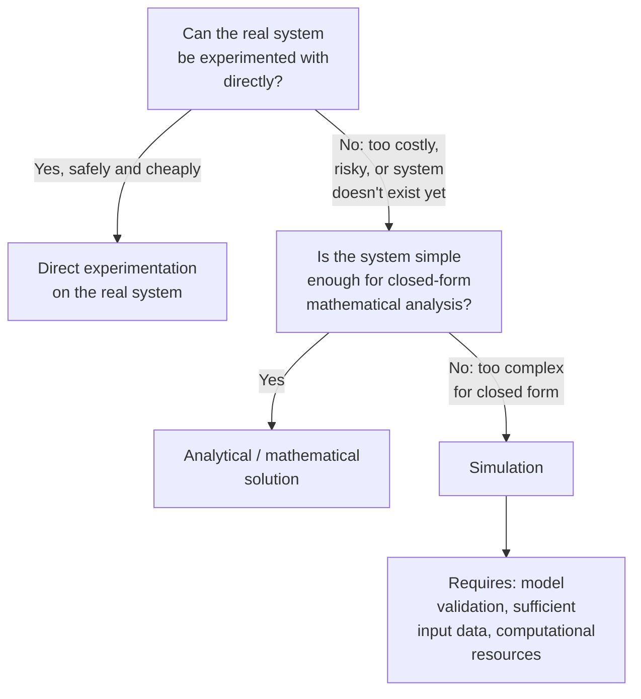

## Advantages and Limitations of Simulation

### Definition

Simulation is the process of executing a model over time (or over a sequence of states) to observe and analyze the behavior it produces, typically as a substitute for experimenting with, observing, or predicting the real system directly. Its value rests entirely on how well the underlying model captures the aspects of the real system relevant to the questions being asked — a point that governs both the advantages and the limitations discussed below.

### Advantages of Simulation

**Key Points**

- **Safety**: allows study of hazardous, destructive, or high-consequence scenarios (nuclear reactor accidents, structural failure, disease outbreaks) without real-world risk to people, equipment, or the environment.
- **Cost**: avoids the expense of building physical prototypes, conducting live experiments, or disrupting operational systems to test changes.
- **Time compression or expansion**: processes that take years in reality (e.g., population dynamics, climate change) can be simulated in minutes; conversely, extremely fast processes (e.g., combustion, structural impact) can be examined in expanded, step-by-step detail.
- **Controllability and repeatability**: parameters can be varied one at a time under otherwise identical conditions — a level of experimental control often impossible to achieve in the field, where confounding factors cannot be fully isolated.
- **Access to inaccessible or hypothetical systems**: systems that don't yet exist (a proposed factory layout, an unbuilt bridge design) or can't be directly manipulated (a national economy, a planet's climate) can still be studied.
- **What-if analysis**: multiple alternative scenarios, policies, or designs can be compared systematically before committing resources to one.
- **Insight into system behavior**: building the model itself often exposes assumptions, dependencies, and interactions that were not obvious from the system's real-world operation, independent of the simulation results.

**Example**

Evaluating a proposed change to a hospital emergency department's staffing schedule: rather than implementing the change and risking degraded patient care if it performs poorly, a discrete-event simulation of patient arrivals, triage, and treatment can estimate the effect on wait times and resource utilization under the proposed schedule versus the current one, at no risk to actual patients.

### Limitations of Simulation

**Key Points**

- **Model validity is a precondition, not a guarantee**: a simulation's output is only as trustworthy as the model's fidelity to the real system for the question being asked; a flawed or poorly validated model produces confident-looking output that may not correspond to real-system behavior.
- **Garbage in, garbage out**: simulation results are highly sensitive to the quality of input data and parameter estimates; inaccurate inputs propagate into inaccurate outputs regardless of how correctly the model logic is implemented.
- **Computational cost**: high-fidelity models, especially stochastic models requiring many replications, or models with fine spatial/temporal resolution, can require substantial computing time and resources.
- **False sense of precision**: numerical output (e.g., "average wait time: 14.3 minutes") can convey more confidence than is warranted, especially when uncertainty in inputs or model structure is not communicated alongside the result.
- **Verification and validation effort**: confirming that a simulation is both correctly implemented (verification) and an adequate representation of the real system (validation) is itself a substantial undertaking, and is easy to under-invest in relative to building the model itself.
- **Cannot capture unmodeled phenomena**: a simulation can only produce behavior arising from what was explicitly built into the model; emergent real-world effects outside the model's scope will not appear in the output, and their absence is not flagged by the simulation itself.
- **Analyst and stakeholder overconfidence**: the polished, quantitative nature of simulation output can lead decision-makers to treat results as more authoritative than the model's assumptions justify, particularly when the model's limitations are not communicated clearly alongside the results.

**Example**

A supply-chain simulation that assumes supplier lead times are fixed and known will produce optimistic, misleadingly stable inventory projections if real lead times are, in fact, variable and occasionally subject to major disruption — the simulation's output looks precise, but the precision reflects the simplifying assumption, not a validated property of the real supply chain.

### Diagram: Where Simulation Fits Relative to Other Study Methods

### Advantages versus Limitations, Side by Side

| Dimension | Advantage | Corresponding Limitation |
|---|---|---|
| Risk | Safe exploration of hazardous scenarios | Output only as safe/valid as model fidelity |
| Cost | Cheaper than physical prototyping | Can still be computationally expensive at high fidelity |
| Control | Precise, repeatable experimental conditions | Real-world confounds may be absent, limiting realism |
| Time | Compress or expand timescales freely | Verification/validation takes real time and effort regardless |
| Scope | Access to hypothetical or inaccessible systems | Cannot reveal behavior the model wasn't built to represent |
| Output | Quantitative, seemingly precise results | Precision can mislead if uncertainty isn't communicated |

### When Simulation Is (and Is Not) the Appropriate Method

**Key Points**
- Simulation is most justified when the system is too complex for closed-form analytical solution, and direct experimentation on the real system is infeasible, unsafe, or prohibitively costly.
- If a system is simple enough to solve analytically (see the static, closed-form models discussed earlier), an analytical solution is typically preferable to simulation, since it is exact rather than subject to model and numerical approximation error, and does not require the same validation burden.
- If direct experimentation on the real system is feasible, safe, and affordable, real-world data usually carries higher evidentiary weight than simulated data for the same question, since it does not depend on the correctness of a model's assumptions.
- [Inference] In practice, simulation is often used as a complement to, rather than a replacement for, analytical methods and real-world experimentation — using closed-form results to validate simplified cases of a simulation, and using limited real-world data to calibrate and validate the model — though the specific combination depends on the resources and constraints of the particular study.

### Common Pitfalls

- Treating a single simulation run (particularly of a stochastic model) as a definitive answer rather than one sample from a distribution of possible outcomes.
- Skipping or under-investing in validation because the simulation "looks reasonable," without checking output against known real-world benchmarks or analytical special cases.
- Presenting simulation results without accompanying uncertainty ranges, sensitivity analysis, or a statement of the model's known limitations and assumptions.
- Using simulation to answer a question that a direct analytical solution could answer exactly and more cheaply.
- Extrapolating simulation results beyond the range of conditions for which the model was validated, on the assumption that a model correct in one regime remains correct in another.

**Related Topics**
- Model verification and validation methodology
- Sensitivity and uncertainty analysis
- Simulation output analysis and statistical inference
- Discrete-event simulation fundamentals
- Analytical versus numerical solution methods
- Model calibration using real-world data
- Communicating simulation results to decision-makers