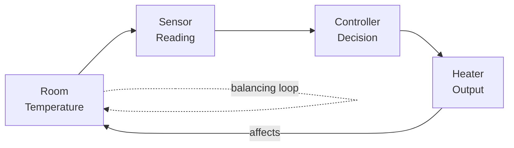

## System Structure and Behavior

### Definitions

**Structure** refers to the arrangement of a system's components and the relationships (connections, dependencies, information and material flows) between them — essentially, the system's static architecture at a given point in time. Structure answers "what is connected to what, and how."

**Behavior** refers to the pattern of change a system exhibits over time as its components interact according to that structure. Behavior answers "what happens as a result of the structure operating."

The relationship between the two is directional but not one-to-one: a given structure produces behavior when driven by inputs and initial conditions, but the same structure can produce qualitatively different behavior under different parameter values, and — particularly in nonlinear systems — small structural changes can produce disproportionately large behavioral changes.

### Elements of System Structure

**Key Points**
- **Components/entities**: the individual parts of the system (introduced in the prior discussion of system boundaries).
- **Relationships/couplings**: the connections between components — physical (a pipe connecting two tanks), informational (a sensor feeding a controller), or logical (a precedence constraint between tasks).
- **Flows**: the material, energy, or information that moves along relationships (fluid through a pipe, messages between processes, parts moving along a production line).
- **Feedback loops**: structural paths where a component's output eventually influences its own future input, either directly or through a chain of intermediate components.
- **Hierarchy**: many systems are structured as subsystems nested within larger systems, each level potentially modelled at a different level of abstraction.

**Example**

A thermostat-controlled heating system has the following structure: a temperature sensor connected to a controller, the controller connected to a heater, and the heater connected back to the room whose temperature the sensor measures. This closes a feedback loop: room temperature → sensor reading → controller decision → heater output → room temperature.

### Feedback Loops: Reinforcing versus Balancing

**Key Points**
- A **balancing (negative) feedback loop** counteracts change: an increase in some quantity triggers a response that decreases it (or vice versa), driving the system toward a setpoint or equilibrium. The thermostat example above is balancing — if room temperature rises above the setpoint, the heater output decreases.
- A **reinforcing (positive) feedback loop** amplifies change: an increase in some quantity triggers a response that further increases it, driving the system away from its current state, often toward growth or collapse.
- The presence and arrangement of feedback loops in a system's structure is often the primary determinant of qualitative behavior — oscillation, stability, exponential growth, or collapse frequently trace directly to specific loops in the structure, rather than to the properties of individual components in isolation.

**Example**

Population growth without resource constraints, $\frac{dP}{dt} = rP$, is a reinforcing loop: more population produces more births, which produces more population. Once a carrying capacity constraint is added (as in the earlier logistic growth example), a balancing loop is introduced that counteracts growth as $P$ approaches $K$, producing the characteristic S-shaped behavior instead of unbounded exponential growth.

### Diagram: Feedback Loop Structure

### From Structure to Behavior

**Key Points**
- Behavior emerges from the interaction of structure, parameter values, initial conditions, and (where applicable) external inputs over time — it is not a property that can be read off the structure diagram alone, except in qualitative terms (e.g., identifying that a loop exists and its polarity).
- Characteristic behavior patterns commonly observed in dynamic systems include: exponential growth or decay, goal-seeking (asymptotic approach to a setpoint), oscillation, S-shaped growth, and overshoot-and-collapse.
- The same structural class (e.g., a system with one balancing loop and a delay) can produce different behavior patterns — stable approach to equilibrium versus sustained oscillation — depending on parameter values, particularly the relationship between loop gain and delay length.

**Example**

A balancing loop with a significant time delay (e.g., a shower with a delayed response between adjusting the tap and feeling the temperature change) can produce oscillation rather than smooth convergence to the setpoint, because corrective action continues to be applied based on outdated information, causing overshoot in both directions. The underlying structure is still a single balancing loop — the qualitative behavior shift comes from the delay parameter.

### Structure-Behavior Relationships, Summarized

| Structural Feature | Typical Associated Behavior |
|---|---|
| Single balancing loop, no significant delay | Smooth convergence to setpoint (goal-seeking) |
| Single balancing loop, significant delay | Oscillation, possible overshoot |
| Single reinforcing loop | Exponential growth or decay |
| Reinforcing loop constrained by balancing loop | S-shaped (logistic) growth |
| Reinforcing loop dominant, balancing loop insufficient or delayed | Overshoot and collapse |
| Multiple interacting loops | Complex, potentially chaotic or regime-shifting behavior |

[Inference] This table describes commonly observed associations documented in system dynamics literature rather than strict causal laws; the exact behavior produced by a given structure depends on the specific parameter values, and identical loop structures can still produce different behavior classes depending on those values, particularly near threshold or bifurcation points.

### Structural Analysis as a Diagnostic Tool

**Key Points**
- When a simulation produces unexpected behavior, tracing that behavior back to the specific structural feature responsible (a particular feedback loop, a missing balancing mechanism, an unmodelled delay) is a standard diagnostic approach, since behavior patterns are often characteristic of identifiable structural causes.
- Structural diagrams (causal loop diagrams, stock-and-flow diagrams) are commonly used as a conceptual modelling step prior to writing simulation equations, specifically to reason about likely qualitative behavior before committing to detailed implementation.
- Understanding which structural elements are responsible for observed behavior supports identifying effective intervention points — in general, altering a system's structure (adding, removing, or rebalancing a feedback loop) tends to produce more durable behavioral change than adjusting parameter values within an unchanged structure, though the appropriate intervention depends on the specific system and what change is being sought.

### Common Pitfalls

- Assuming behavior can be predicted from structure alone without considering parameter values, particularly the relationship between loop gain and any delays present.
- Treating oscillatory or unstable behavior as an error in simulation implementation when it may be an accurate representation of the modelled structure's actual dynamics (e.g., a genuinely under-damped system).
- Focusing model interventions on individual components in isolation while overlooking the feedback loop structure connecting them, missing the actual driver of observed behavior.
- Omitting delays when they are structurally present in the real system, which can eliminate oscillatory behavior from the model that would occur in reality — producing a model that appears more stable than the system it represents.
- Conflating correlation of behavior patterns with confirmation of the underlying structural cause, without verifying the specific loop or delay responsible.

**Related Topics**
- Causal loop diagrams and stock-and-flow modelling
- System dynamics methodology
- Delays and their effect on system stability
- Bifurcation and threshold behavior in nonlinear systems
- Model conceptualization techniques
- Sensitivity analysis of structural parameters
- Chaos and complex system behavior