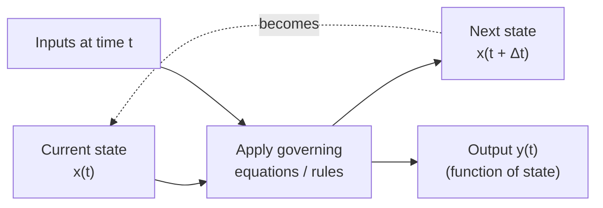

## System State Variables

### Definition

A **state variable** is a variable whose values, taken together at a given instant, contain all the information necessary to determine the system's future behavior from that instant onward, given the future inputs and the model's governing equations or rules. The complete collection of state variables at time $t$ is called the **state** of the system at $t$, often written as a state vector:

$$\mathbf{x}(t) = \begin{bmatrix} x_1(t) \\ x_2(t) \\ \vdots \\ x_n(t) \end{bmatrix}$$

The defining property of a state variable is **sufficiency**: knowing the state at time $t$, together with the inputs from $t$ onward, is enough to determine the system's trajectory for $t' > t$ — no additional knowledge of the system's history before $t$ is required. This property directly distinguishes dynamic models (introduced earlier) from static models: a dynamic model's defining feature is that it carries state forward across time, and the state variables are precisely what is carried.

### Distinguishing State Variables from Other Quantities

**Key Points**
- A state variable is not the same as an **input**: inputs are determined externally (by the environment, crossing the system boundary), while state variables evolve according to the system's own internal dynamics in response to those inputs.
- A state variable is not the same as an **output**: outputs are typically a function of the state (and sometimes the inputs) that is of interest to observe, but the state may include internal variables that are never directly observed as outputs.
- As discussed in the prior topic, an entity **attribute** is often the specific form a state variable takes when the state is decomposed per-entity; some state variables (system-level quantities like "number of customers currently in queue") are not attributes of any single entity but are still part of the overall system state.
- A **parameter** is not a state variable: parameters (e.g., $R$ and $C$ in the RC circuit example, or $r$ and $K$ in the logistic growth example) are typically fixed for the duration of a given simulation run and characterize the system's structure, while state variables change during the run as a consequence of that structure operating.

### The Sufficiency Property, Illustrated

**Example**

In the RC circuit model introduced earlier,

$$\frac{dV(t)}{dt} = \frac{1}{RC}\left(V_{source} - V(t)\right)$$

$V(t)$ is the state variable. Knowing $V(t_0)$ at any starting instant $t_0$, together with $V_{source}$ for $t \geq t_0$, is sufficient to determine $V(t)$ for all $t > t_0$ — no information about the voltage's history before $t_0$ is needed. This is precisely why an initial condition alone (not a full history) is required to solve a dynamic model, as noted in the earlier discussion of static versus dynamic models.

By contrast, consider a hypothetical variable such as "average voltage over the last 10 seconds." This is a function of the system's history, not a state variable in the strict sense — unless it is itself tracked and updated as part of the state (for example, by introducing it as an explicit auxiliary state variable with its own update rule), the system as defined by $V(t)$ alone does not carry enough information to reconstruct it.

### Choosing an Adequate Set of State Variables

**Key Points**
- The set of state variables chosen must be **sufficient**: too few state variables, and the model cannot determine future behavior from the state alone, silently violating the model's own defining assumption.
- The set should also avoid unnecessary **redundancy**: including a variable that is fully determined by other state variables at all times adds no information and increases model complexity without benefit.
- The appropriate state variables are not unique — the same system can often be described by different but equivalent sets of state variables (a change of coordinates), provided each set individually satisfies the sufficiency property.
- The number of independent state variables required is often called the system's **order** (e.g., a "second-order system" has two independent state variables) and directly affects the mathematical and computational complexity of solving the model.

**Example**

A simple mechanical system — a mass on a spring with damping — requires **two** state variables to satisfy sufficiency: position $x(t)$ and velocity $v(t) = \dot{x}(t)$. Position alone is not sufficient, because two systems with identical position but different velocity at the same instant will evolve differently afterward (one moving toward increasing $x$, one toward decreasing $x$). The governing second-order differential equation

$$m\ddot{x} + c\dot{x} + kx = 0$$

is accordingly rewritten as a first-order system in the state vector $\begin{bmatrix} x \\ v \end{bmatrix}$:

$$\frac{d}{dt}\begin{bmatrix} x \\ v \end{bmatrix} = \begin{bmatrix} v \\ -\frac{k}{m}x - \frac{c}{m}v \end{bmatrix}$$

### Diagram: State Variables in the Simulation Cycle

### State Variables Under Continuous versus Discrete Formulations

| Aspect | Continuous-Time State | Discrete-Time / Discrete-Event State |
|---|---|---|
| Update mechanism | Governed by differential equations, evolving continuously | Governed by difference equations (fixed step) or updated only at discrete event times |
| Notation | $\mathbf{x}(t)$, $t \in \mathbb{R}$ | $\mathbf{x}_n$ or $\mathbf{x}(t_k)$ at discrete indices/event times |
| Between updates | State is defined at every instant | State is held constant between updates (piecewise constant) |
| Example from earlier topics | RC circuit voltage $V(t)$ | Population model $P_n$; entity attributes updated at event times |

This connects directly to the entity/attribute/event/activity discussion in the prior topic: in discrete-event simulation, the system state changes only at event instants and is piecewise constant between them, which is why events (not continuous time) drive state updates in that modelling paradigm.

### State Space

**Key Points**
- The **state space** is the set of all possible values the state vector can take — for the mass-spring-damper example, the state space is the $(x, v)$ plane.
- A system's trajectory through time traces a path (a **trajectory** or **orbit**) through this state space, and qualitative behavior patterns (discussed in the prior topic on structure and behavior — convergence, oscillation, growth) correspond to characteristic shapes of this trajectory, such as spiraling into a fixed point (damped oscillation) or approaching a closed loop (sustained oscillation).
- [Inference] State-space analysis is a standard tool for studying system stability and behavior class without necessarily solving the equations explicitly for $\mathbf{x}(t)$, though the specific analytical techniques used (eigenvalue analysis, phase portraits, Lyapunov methods) depend on whether the system is linear or nonlinear and are not universally applicable in the same form across all system types.

### Common Pitfalls

- Choosing a state variable set that is insufficient, then attempting to compensate by referencing past history directly in the model's update rules — this typically indicates a missing state variable rather than a genuine need for history-dependence, and is best resolved by augmenting the state.
- Confusing parameters with state variables, leading to models where quantities intended to be fixed for a run are inadvertently allowed to evolve, or vice versa.
- Failing to recognize that a system is higher-order than initially assumed (as in the mass-spring-damper example, where position alone is insufficient), producing a model that cannot reproduce correct dynamic behavior even though each individual equation may be correctly formulated.
- Treating outputs as if they were the full state, and consequently underestimating how many internal variables the system actually requires to be modelled correctly.
- Assuming state variables are unique, and treating a specific choice of state representation as the only valid one, when equivalent alternative formulations may be more tractable for a particular analysis or simulation method.

**Related Topics**
- State-space representation and matrix formulation of dynamic systems
- Phase portraits and trajectory analysis
- System order and degrees of freedom
- Eigenvalue analysis and stability
- Discrete-event state updates versus continuous-time integration
- Observability and controllability of state variables
- Numerical methods for solving state-space equations