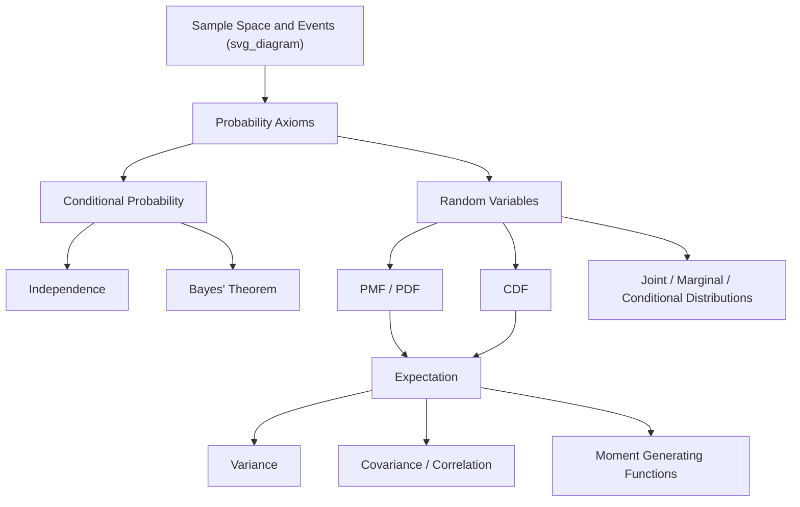

## Probability Theory Review

### Purpose in Modelling and Simulation

Probability theory provides the mathematical language for representing uncertainty in simulated systems — arrival times, service durations, failure events, noisy measurements, and stochastic decision outcomes. Every discrete-event simulation, Monte Carlo method, and stochastic model built later in this course rests on the concepts reviewed here.

### Sample Spaces and Events

**Sample Space**

The sample space $\Omega$ is the set of all possible outcomes of a random experiment.

- Discrete example: rolling a die, $\Omega = \{1,2,3,4,5,6\}$
- Continuous example: time until a machine fails, $\Omega = [0, \infty)$

**Events**

An event $A$ is a subset of $\Omega$, $A \subseteq \Omega$. Events can be combined using set operations:

- Union $A \cup B$ — A or B occurs
- Intersection $A \cap B$ — A and B both occur
- Complement $A^c$ — A does not occur

Two events are **mutually exclusive** if $A \cap B = \emptyset$.

### Axioms of Probability

For any event $A$ in sample space $\Omega$, a probability function $P$ must satisfy the Kolmogorov axioms:

$$P(A) \geq 0 \quad \text{for all } A$$

$$P(\Omega) = 1$$

$$P\left(\bigcup_{i=1}^{\infty} A_i\right) = \sum_{i=1}^{\infty} P(A_i) \quad \text{if } A_i \text{ are pairwise disjoint}$$

From these axioms, several standard results follow directly:

- $P(A^c) = 1 - P(A)$
- $P(\emptyset) = 0$
- $P(A \cup B) = P(A) + P(B) - P(A \cap B)$ (inclusion-exclusion for non-disjoint events)
- If $A \subseteq B$, then $P(A) \leq P(B)$

### Conditional Probability

Conditional probability quantifies how the probability of an event updates given knowledge that another event occurred:

$$P(A \mid B) = \frac{P(A \cap B)}{P(B)}, \quad P(B) > 0$$

**Example**

A simulation of network packet transmission has $P(\text{corrupted}) = 0.05$ and $P(\text{corrupted} \cap \text{retransmitted}) = 0.045$. The conditional probability that a corrupted packet is retransmitted is:

$$P(\text{retransmitted} \mid \text{corrupted}) = \frac{0.045}{0.05} = 0.90$$

### Independence

Events $A$ and $B$ are **independent** if the occurrence of one does not affect the probability of the other:

$$P(A \cap B) = P(A) \, P(B)$$

Equivalently, when $P(B) > 0$: $P(A \mid B) = P(A)$.

Independence is a modelling assumption, not a property that can be assumed automatically — many simulation errors arise from treating correlated events (e.g., successive failures of components sharing a power supply) as independent.

**Mutual independence** for a set of events requires the product rule to hold for every subset, not just pairwise. Pairwise independence does not imply mutual independence.

### Law of Total Probability

If $B_1, B_2, \dots, B_n$ form a partition of $\Omega$ (mutually exclusive, collectively exhaustive, each with $P(B_i) > 0$), then for any event $A$:

$$P(A) = \sum_{i=1}^{n} P(A \mid B_i) \, P(B_i)$$

This is heavily used in simulation when an outcome depends on which of several discrete states or scenarios occurred first.

### Bayes' Theorem

Bayes' theorem inverts conditional probabilities, forming the basis of Bayesian updating used in calibration and parameter estimation for simulation models:

$$P(B_i \mid A) = \frac{P(A \mid B_i) \, P(B_i)}{\sum_{j=1}^{n} P(A \mid B_j) \, P(B_j)}$$

**Example**

A machine draws parts from two suppliers: Supplier 1 (60% of parts, 2% defect rate) and Supplier 2 (40% of parts, 5% defect rate). Given a randomly inspected part is defective, the probability it came from Supplier 2:

$$P(S_2 \mid D) = \frac{(0.05)(0.40)}{(0.02)(0.60) + (0.05)(0.40)} = \frac{0.020}{0.032} = 0.625$$

### Random Variables

A random variable $X$ is a function mapping outcomes in $\Omega$ to real numbers, $X: \Omega \to \mathbb{R}$.

- **Discrete random variable** — takes countable values (e.g., number of customer arrivals per hour)
- **Continuous random variable** — takes values over an interval (e.g., time between arrivals)

### Probability Mass and Density Functions

**Discrete case — Probability Mass Function (PMF)**

$$p_X(x) = P(X = x), \quad \sum_{x} p_X(x) = 1$$

**Continuous case — Probability Density Function (PDF)**

$$f_X(x) \geq 0, \quad \int_{-\infty}^{\infty} f_X(x)\, dx = 1$$

For continuous variables, $P(X = x) = 0$ for any single point; probabilities are only meaningful over intervals:

$$P(a \leq X \leq b) = \int_a^b f_X(x)\, dx$$

### Cumulative Distribution Function

The CDF applies to both discrete and continuous random variables:

$$F_X(x) = P(X \leq x)$$

Properties:

- Non-decreasing
- $\lim_{x \to -\infty} F_X(x) = 0$, $\lim_{x \to \infty} F_X(x) = 1$
- Right-continuous

The CDF is central to simulation because the **inverse transform method** for generating random variates relies on inverting $F_X$.

### Expectation

The expected value describes the long-run average of a random variable.

Discrete:
$$E[X] = \sum_{x} x \, p_X(x)$$

Continuous:
$$E[X] = \int_{-\infty}^{\infty} x \, f_X(x)\, dx$$

**Properties of Expectation**

- Linearity: $E[aX + bY] = aE[X] + bE[Y]$, regardless of independence
- $E[c] = c$ for constant $c$
- $E[g(X)] = \sum_x g(x)p_X(x)$ or $\int g(x)f_X(x)\,dx$ (law of the unconscious statistician)

### Variance and Standard Deviation

Variance measures the spread of a random variable around its mean:

$$\text{Var}(X) = E[(X - E[X])^2] = E[X^2] - (E[X])^2$$

Standard deviation:

$$\sigma_X = \sqrt{\text{Var}(X)}$$

**Properties**

- $\text{Var}(aX + b) = a^2 \text{Var}(X)$
- If $X, Y$ independent: $\text{Var}(X + Y) = \text{Var}(X) + \text{Var}(Y)$
- If not independent: $\text{Var}(X+Y) = \text{Var}(X) + \text{Var}(Y) + 2\text{Cov}(X,Y)$

### Covariance and Correlation

Covariance measures how two random variables vary together:

$$\text{Cov}(X,Y) = E[(X - E[X])(Y - E[Y])] = E[XY] - E[X]E[Y]$$

Correlation normalizes covariance to the range $[-1, 1]$:

$$\rho_{X,Y} = \frac{\text{Cov}(X,Y)}{\sigma_X \sigma_Y}$$

If $X$ and $Y$ are independent, $\text{Cov}(X,Y) = 0$; the converse is not generally true — zero covariance does not imply independence, except under special cases such as joint normality. [Inference: this exception is a well-known mathematical result, stated here as a caveat rather than something requiring empirical verification.]

### Joint, Marginal, and Conditional Distributions

**Joint distribution** describes the combined behavior of two or more random variables:

- Discrete: $p_{X,Y}(x,y) = P(X=x, Y=y)$
- Continuous: $f_{X,Y}(x,y)$ with $\iint f_{X,Y}(x,y)\,dx\,dy = 1$

**Marginal distribution** recovers the distribution of a single variable from the joint:

$$p_X(x) = \sum_y p_{X,Y}(x,y), \qquad f_X(x) = \int f_{X,Y}(x,y)\, dy$$

**Conditional distribution**:

$$f_{X \mid Y}(x \mid y) = \frac{f_{X,Y}(x,y)}{f_Y(y)}, \quad f_Y(y) > 0$$

### Moment Generating Functions

The moment generating function (MGF), when it exists, encodes all moments of a distribution:

$$M_X(t) = E[e^{tX}]$$

Moments are obtained via derivatives evaluated at $t=0$:

$$E[X^n] = M_X^{(n)}(0)$$

MGFs are useful in simulation theory for deriving distributions of sums of independent random variables, since the MGF of a sum equals the product of individual MGFs.

### Relationship Diagram

### Relevance to Simulation Practice

- **Input modelling** relies on PMFs/PDFs to characterize real-world randomness (arrival processes, demand, failure times).
- **Random variate generation** (e.g., inverse transform, acceptance-rejection) depends directly on CDF properties.
- **Output analysis** of simulation results uses expectation, variance, and confidence intervals derived from these foundations.
- **Correlated inputs** in multi-variable simulations require joint distributions and covariance structure rather than independent sampling. [Inference: whether independence is a safe assumption depends on the specific system being modelled and should be validated against domain data rather than assumed by default.]

**Related Topics**

- Common Discrete Distributions (Bernoulli, Binomial, Poisson, Geometric)
- Common Continuous Distributions (Uniform, Exponential, Normal, Gamma, Weibull)
- Random Variate Generation Techniques (Inverse Transform, Acceptance-Rejection, Composition)
- Stochastic Processes (Markov Chains, Poisson Processes)
- Limit Theorems (Law of Large Numbers, Central Limit Theorem) and Their Role in Monte Carlo Simulation
- Estimation Theory (Point Estimation, Confidence Intervals) for Simulation Output Analysis