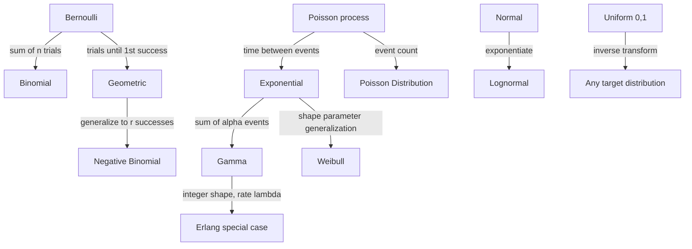

## Probabilistic Distributions

### Overview

Probability distributions are the mathematical objects that describe how likely different outcomes are for a random variable, and they form the direct input to nearly every stochastic simulation model. Selecting the correct distribution — and correctly parameterizing it — determines whether a simulation faithfully represents the real system it models or produces systematically misleading output. This topic surveys the discrete and continuous distributions most frequently used in modeling and simulation, their parameters, shapes, and typical applications.

### Discrete vs. Continuous Distributions

- **Discrete distributions** apply to random variables that take a countable set of values (e.g., number of arrivals, number of defective items). They are described by a probability mass function (PMF), $p(x) = P(X=x)$.
- **Continuous distributions** apply to random variables that take any value within an interval (e.g., time between failures, service duration). They are described by a probability density function (PDF), $f(x)$, where $P(a \leq X \leq b) = \int_a^b f(x)\,dx$.

### Discrete Distributions

#### Bernoulli Distribution

Models a single trial with two possible outcomes (success/failure), with success probability $p$.

$$p(x) = p^x(1-p)^{1-x}, \quad x \in \{0,1\}$$

Mean: $p$. Variance: $p(1-p)$.

**Example**

Simulating whether a single machine fails during a shift (fail = 1 with probability $p$, operates normally = 0 with probability $1-p$).

#### Binomial Distribution

Models the number of successes in $n$ independent Bernoulli trials, each with success probability $p$.

$$p(x) = \binom{n}{x}p^x(1-p)^{n-x}, \quad x = 0,1,\ldots,n$$

Mean: $np$. Variance: $np(1-p)$.

**Example**

Simulating the number of defective units in a batch of $n$ items, where each item independently has defect probability $p$.

#### Poisson Distribution

Models the number of events occurring in a fixed interval of time or space, given a constant average rate $\lambda$ and independence between events.

$$p(x) = \frac{e^{-\lambda}\lambda^x}{x!}, \quad x = 0,1,2,\ldots$$

Mean: $\lambda$. Variance: $\lambda$.

**Example**

Simulating the number of customer arrivals at a service counter in a one-hour period, when arrivals occur independently at a known average rate.

The Poisson distribution is closely linked to the exponential distribution: if event counts per interval follow a Poisson distribution, the time between consecutive events follows an exponential distribution.

#### Geometric Distribution

Models the number of trials needed to obtain the first success in a sequence of independent Bernoulli trials.

$$p(x) = (1-p)^{x-1}p, \quad x = 1,2,3,\ldots$$

Mean: $1/p. Variance: $(1-p)/p^2
.

**Example**

Simulating the number of inspection attempts required before finding the first defective item, given a constant defect probability per item.

#### Negative Binomial Distribution

Generalizes the geometric distribution to model the number of trials needed to achieve $r$ successes.

$$p(x) = \binom{x-1}{r-1}p^r(1-p)^{x-r}, \quad x = r, r+1,\ldots$$

Mean: $r/p$. Variance: $r(1-p)/p^2$.

#### Discrete Uniform Distribution

Assigns equal probability to each of a finite set of consecutive integer values.

$$p(x) = \frac{1}{n}, \quad x = a, a+1, \ldots, b$$

**Example**

Simulating the outcome of a fair die roll, where each face has equal probability.

### Continuous Distributions

#### Uniform Distribution

Assigns equal probability density across an interval $[a,b]$.

$$f(x) = \frac{1}{b-a}, \quad a \leq x \leq b$$

Mean: $(a+b)/2$. Variance: $(b-a)^2/12$.

The uniform distribution is also the foundation of random number generation itself, since PRNGs are designed to approximate $\text{Uniform}(0,1)$.

#### Exponential Distribution

Models the time between independent events occurring at a constant average rate $\lambda$; possesses the memoryless property.

$$f(x) = \lambda e^{-\lambda x}, \quad x \geq 0$$

Mean: $1/\lambda. Variance: $1/\lambda^2
.

**Example**

Simulating the time between successive customer arrivals or the time to failure of a component with a constant failure rate.

#### Normal (Gaussian) Distribution

Models quantities that result from the sum of many independent small effects, per the Central Limit Theorem.

$$f(x) = \frac{1}{\sigma\sqrt{2\pi}}e^{-(x-\mu)^2/2\sigma^2}, \quad -\infty < x < \infty$$

Mean: $\mu$. Variance: $\sigma^2$.

**Example**

Simulating measurement error, natural variation in physical dimensions, or aggregated demand across many independent customers.

[Inference] The normal distribution technically permits negative values, which can be inappropriate for modeling inherently non-negative quantities such as time or count; in those cases, alternative distributions such as lognormal or truncated normal are often more suitable.

#### Lognormal Distribution

Models a random variable whose logarithm is normally distributed; arises naturally when a quantity results from the product (rather than sum) of many independent factors.

$$f(x) = \frac{1}{x\sigma\sqrt{2\pi}}e^{-(\ln x - \mu)^2/2\sigma^2}, \quad x > 0$$

Mean: $e^{\mu + \sigma^2/2}$. Variance: $(e^{\sigma^2}-1)e^{2\mu+\sigma^2}$.

**Example**

Simulating task completion times, income distributions, or particle sizes, which are typically right-skewed and strictly positive.

#### Triangular Distribution

Defined by a minimum ($a$), mode ($c$), and maximum ($b$); commonly used when only expert-estimated bounds and a most-likely value are available, rather than a full dataset for distribution fitting.

$$f(x) = \begin{cases} \dfrac{2(x-a)}{(b-a)(c-a)} & a \leq x \leq c \\[4pt] \dfrac{2(b-x)}{(b-a)(b-c)} & c < x \leq b \end{cases}$$

Mean: $(a+b+c)/3$.

**Example**

Simulating task duration in a project when only a pessimistic, most-likely, and optimistic estimate are available (a common input in PERT-style project simulation).

#### Weibull Distribution

Generalizes the exponential distribution with a shape parameter $k$ that allows the hazard (failure) rate to increase, decrease, or remain constant over time.

$$f(x) = \frac{k}{\lambda}\left(\frac{x}{\lambda}\right)^{k-1}e^{-(x/\lambda)^k}, \quad x \geq 0$$

- $k = 1$: reduces to the exponential distribution (constant hazard rate).
- $k > 1$: increasing hazard rate, representing wear-out or aging failure.
- $k < 1$: decreasing hazard rate, representing infant-mortality-type failure.

**Example**

Simulating time-to-failure for mechanical components subject to wear, where failure becomes more likely as the component ages.

#### Gamma Distribution

Models the time required for $\alpha$ independent exponentially distributed events to occur (a generalization of the exponential distribution); also used flexibly to fit right-skewed, non-negative data.

$$f(x) = \frac{\lambda^\alpha x^{\alpha-1}e^{-\lambda x}}{\Gamma(\alpha)}, \quad x \geq 0$$

Mean: $\alpha/\lambda$. Variance: $\alpha/\lambda^2$.

**Example**

Simulating the total time for $\alpha$ sequential repair steps, each individually exponentially distributed.

#### Beta Distribution

Defined on the bounded interval $[0,1]$, making it useful for modeling proportions, probabilities, or normalized quantities, with shape parameters $\alpha$ and $\beta$ controlling its form.

$$f(x) = \frac{x^{\alpha-1}(1-x)^{\beta-1}}{B(\alpha,\beta)}, \quad 0 \leq x \leq 1$$

**Example**

Simulating the proportion of defective items in a batch, or the uncertain success probability parameter itself in a Bayesian simulation model.

### Distribution Selection Guide

<svg xmlns="http://www.w3.org/2000/svg" viewBox="0 0 900 320">
<text x="450" y="24" text-anchor="middle" font-size="16" font-weight="bold" fill="#1a1a1a">Choosing a Distribution by Modeling Context (svg_diagram)</text>
<rect x="30" y="55" width="250" height="60" rx="8" fill="#e8f0fe" stroke="#4285f4" stroke-width="2" />
<text x="155" y="80" text-anchor="middle" font-size="12" font-weight="bold" fill="#1a1a1a">Count of events in interval</text>
<text x="155" y="98" text-anchor="middle" font-size="11" fill="#444">→ Poisson</text>
<rect x="330" y="55" width="250" height="60" rx="8" fill="#e8f0fe" stroke="#4285f4" stroke-width="2" />
<text x="455" y="80" text-anchor="middle" font-size="12" font-weight="bold" fill="#1a1a1a">Time between events</text>
<text x="455" y="98" text-anchor="middle" font-size="11" fill="#444">→ Exponential / Gamma</text>
<rect x="630" y="55" width="240" height="60" rx="8" fill="#e8f0fe" stroke="#4285f4" stroke-width="2" />
<text x="750" y="80" text-anchor="middle" font-size="12" font-weight="bold" fill="#1a1a1a">Number of successes / trials</text>
<text x="750" y="98" text-anchor="middle" font-size="11" fill="#444">→ Binomial / Geometric</text>
<rect x="30" y="140" width="250" height="60" rx="8" fill="#fef7e0" stroke="#f9ab00" stroke-width="2" />
<text x="155" y="165" text-anchor="middle" font-size="12" font-weight="bold" fill="#1a1a1a">Sum of many small effects</text>
<text x="155" y="183" text-anchor="middle" font-size="11" fill="#444">→ Normal</text>
<rect x="330" y="140" width="250" height="60" rx="8" fill="#fef7e0" stroke="#f9ab00" stroke-width="2" />
<text x="455" y="165" text-anchor="middle" font-size="12" font-weight="bold" fill="#1a1a1a">Product of many small effects</text>
<text x="455" y="183" text-anchor="middle" font-size="11" fill="#444">→ Lognormal</text>
<rect x="630" y="140" width="240" height="60" rx="8" fill="#fef7e0" stroke="#f9ab00" stroke-width="2" />
<text x="750" y="165" text-anchor="middle" font-size="12" font-weight="bold" fill="#1a1a1a">Wear-out / aging failure</text>
<text x="750" y="183" text-anchor="middle" font-size="11" fill="#444">→ Weibull (k &gt; 1)</text>
<rect x="30" y="225" width="250" height="60" rx="8" fill="#e6f4ea" stroke="#34a853" stroke-width="2" />
<text x="155" y="250" text-anchor="middle" font-size="12" font-weight="bold" fill="#1a1a1a">Only min/mode/max known</text>
<text x="155" y="268" text-anchor="middle" font-size="11" fill="#444">→ Triangular</text>
<rect x="330" y="225" width="250" height="60" rx="8" fill="#e6f4ea" stroke="#34a853" stroke-width="2" />
<text x="455" y="250" text-anchor="middle" font-size="12" font-weight="bold" fill="#1a1a1a">Proportion or probability</text>
<text x="455" y="268" text-anchor="middle" font-size="11" fill="#444">→ Beta</text>
<rect x="630" y="225" width="240" height="60" rx="8" fill="#e6f4ea" stroke="#34a853" stroke-width="2" />
<text x="750" y="250" text-anchor="middle" font-size="12" font-weight="bold" fill="#1a1a1a">No prior shape knowledge</text>
<text x="750" y="268" text-anchor="middle" font-size="11" fill="#444">→ Uniform</text>
</svg>

### Relationships Between Distributions

### Fitting Distributions to Data

Selecting a distribution for simulation input is typically not arbitrary; it follows a structured input modeling process:

- **Data collection**: gather empirical observations of the quantity to be modeled.
- **Hypothesize candidate distributions**: use histograms, domain knowledge, and the physical mechanism generating the data (counts, waiting times, proportions) to narrow candidates.
- **Estimate parameters**: commonly via maximum likelihood estimation or method of moments.
- **Goodness-of-fit testing**: assess candidate distributions using tests such as chi-square, Kolmogorov-Smirnov, or Anderson-Darling.
- **Select the best-fitting distribution**: balancing statistical fit with interpretability and the mechanism generating the underlying data.

[Unverified] No goodness-of-fit test can prove a distribution is "correct"; it can only fail to reject it as inconsistent with the observed data, which is a weaker claim than confirmation.

### Common Pitfalls in Distribution Selection

- **Defaulting to the normal distribution**: normal is often chosen out of familiarity even when the underlying process (e.g., strictly positive, right-skewed data) is better represented by another distribution.
- **Ignoring physical bounds**: applying an unbounded distribution to a quantity with a natural floor or ceiling (e.g., negative time, probabilities exceeding 1) can generate invalid simulated values unless explicitly truncated.
- **Overfitting to limited data**: selecting a complex distribution with many parameters based on a small sample can produce a good fit to noise rather than the true underlying process.
- **Ignoring the data-generating mechanism**: choosing a distribution purely by statistical fit, without considering whether its underlying assumptions (independence, constant rate, memorylessness) match the real process, risks a model that fits historical data but fails to generalize.

### Applications Summary

- **Queueing systems**: exponential and Poisson distributions for arrivals and service; Erlang/Gamma for multi-stage service.
- **Reliability engineering**: Weibull and exponential distributions for time-to-failure modeling.
- **Project management simulation**: triangular and PERT-Beta distributions for task duration estimates.
- **Quality control**: binomial and Poisson distributions for defect counts; normal distribution for continuous measurement variation.
- **Financial modeling**: lognormal distribution for asset prices; normal distribution for returns (with known limitations regarding tail risk).

### Related Topics

- Input Modeling and Goodness-of-Fit Testing
- Random Variate Generation Techniques (Inverse Transform, Acceptance-Rejection)
- Queueing Theory: Arrival and Service Process Modeling
- Reliability Analysis and Time-to-Failure Modeling
- Markov Chains and Stochastic Processes
- Monte Carlo Simulation and Variance Reduction
- PERT and Project Scheduling Under Uncertainty