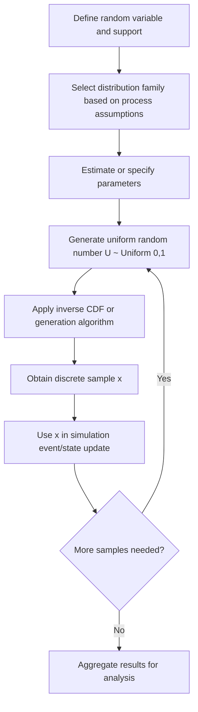

## Discrete Probability Distributions

### Overview

A discrete probability distribution describes the likelihood of outcomes for a discrete random variable — one that takes a countable set of values (finite or countably infinite), as opposed to a continuous range. In modelling and simulation, discrete distributions are the backbone of representing countable events: number of arrivals in a queue, number of failed components, number of successful trials, or number of customers served in a time window.

A discrete random variable $X$ has a **probability mass function (PMF)**, $p(x) = P(X = x)$, satisfying:

$$\sum_{x \in \mathcal{X}} p(x) = 1, \quad p(x) \geq 0 \; \forall x$$

where $\mathcal{X}$ is the support (set of possible values) of $X$.

### Core Descriptive Quantities

**Key Points**

- **Expected value (mean):** $E[X] = \sum_x x \cdot p(x)$
- **Variance:** $\text{Var}(X) = E[X^2] - (E[X])^2$
- **Standard deviation:** $\sigma = \sqrt{\text{Var}(X)}$
- **Cumulative distribution function (CDF):** $F(x) = P(X \leq x) = \sum_{k \leq x} p(k)$

These quantities let a simulation designer summarize a distribution's central tendency and spread before generating any random samples, and they underpin variance-reduction and validation techniques used later in a simulation study.

### Bernoulli Distribution

Models a single trial with two outcomes: success (1) with probability $p$, failure (0) with probability $1-p$.

$$p(x) = p^x (1-p)^{1-x}, \quad x \in \{0, 1\}$$

- $E[X] = p$
- $\text{Var}(X) = p(1-p)$

**Example**

Simulating whether a single server node crashes during a time step ($p = 0.02$) is a Bernoulli trial. Each simulation tick draws one Bernoulli sample to decide crash/no-crash.

### Binomial Distribution

Models the number of successes in $n$ independent Bernoulli trials, each with success probability $p$.

$$p(x) = \binom{n}{x} p^x (1-p)^{n-x}, \quad x = 0, 1, \ldots, n$$

- $E[X] = np$
- $\text{Var}(X) = np(1-p)$

The Binomial distribution is the sum of $n$ i.i.d. Bernoulli random variables. This additive relationship is [Confirmed] by the definition of the distribution itself — a direct consequence of independence and the linearity of expectation.

**Example**

In a discrete-event simulation of a manufacturing line with 50 independent components, each with a 3% chance of defect per batch, the number of defective components per batch follows $\text{Binomial}(n=50, p=0.03)$.

### Geometric Distribution

Models the number of trials needed to achieve the first success in a sequence of independent Bernoulli trials.

Two common parameterizations exist — number of trials until first success (support $x = 1, 2, 3, \ldots$):

$$p(x) = (1-p)^{x-1} p$$

- $E[X] = 1/p$
- $\text{Var}(X) = (1-p)/p^2$

The Geometric distribution possesses the **memoryless property**: $P(X > s + t \mid X > s) = P(X > t)$. This is a defining mathematical property of the distribution, not a simulation artifact.

**Example**

Simulating the number of connection attempts before a network handshake succeeds, given a fixed per-attempt success probability, follows a Geometric distribution.

### Negative Binomial Distribution

Generalizes the Geometric distribution to model the number of trials needed to achieve $r$ successes.

$$p(x) = \binom{x-1}{r-1} p^r (1-p)^{x-r}, \quad x = r, r+1, \ldots$$

- $E[X] = r/p$
- $\text{Var}(X) = r(1-p)/p^2$

**Example**

Modelling how many quality-control inspections are needed before the 5th defective unit is found uses $\text{NegBinomial}(r=5, p)$.

### Poisson Distribution

Models the number of events occurring in a fixed interval of time or space, given a known average rate $\lambda$, when events occur independently.

$$p(x) = \frac{e^{-\lambda} \lambda^x}{x!}, \quad x = 0, 1, 2, \ldots$$

- $E[X] = \lambda$
- $\text{Var}(X) = \lambda$

The Poisson distribution is the limiting case of the Binomial distribution as $n \to \infty$, $p \to 0$, with $np = \lambda$ held constant. This limiting relationship is a [Confirmed] mathematical result derivable directly from the Binomial PMF.

**Example**

Poisson distributions are the standard choice for modelling arrival processes in queueing simulations — e.g., number of customer arrivals at a bank teller per hour, given a historical average of $\lambda = 12$ arrivals/hour.

### Hypergeometric Distribution

Models the number of successes in $n$ draws without replacement from a finite population of size $N$ containing $K$ successes.

$$p(x) = \frac{\binom{K}{x}\binom{N-K}{n-x}}{\binom{N}{n}}$$

- $E[X] = n \cdot \frac{K}{N}$
- $\text{Var}(X) = n \cdot \frac{K}{N} \cdot \frac{N-K}{N} \cdot \frac{N-n}{N-1}$

Unlike the Binomial distribution, the Hypergeometric distribution does not assume independence between draws, since removing an item without replacement changes the probability for subsequent draws.

**Example**

Simulating quality-control sampling — drawing 10 units without replacement from a batch of 200 containing 15 defective units — requires the Hypergeometric distribution rather than the Binomial.

### Discrete Uniform Distribution

Assigns equal probability to each of a finite set of $n$ outcomes.

$$p(x) = \frac{1}{n}, \quad x \in \{a, a+1, \ldots, b\}, \; n = b - a + 1$$

- $E[X] = \frac{a+b}{2}$
- $\text{Var}(X) = \frac{n^2 - 1}{12}$

**Example**

A fair six-sided die roll in a Monte Carlo board-game simulation is Discrete Uniform on $\{1, 2, 3, 4, 5, 6\}$.

### Comparison of Common Discrete Distributions

| Distribution | Support | Parameters | Typical Simulation Use |
| --- | --- | --- | --- |
| Bernoulli | $\{0,1\}$ | $p$ | Single binary event |
| Binomial | $\{0,\ldots,n\}$ | $n, p$ | Count of successes, fixed trials |
| Geometric | $\{1,2,\ldots\}$ | $p$ | Trials until first success |
| Negative Binomial | $\{r,r+1,\ldots\}$ | $r, p$ | Trials until $r$-th success |
| Poisson | $\{0,1,2,\ldots\}$ | $\lambda$ | Arrivals/events per interval |
| Hypergeometric | $\{0,\ldots,n\}$ | $N, K, n$ | Sampling without replacement |
| Discrete Uniform | $\{a,\ldots,b\}$ | $a, b$ | Equally likely outcomes |

### Relationships Between Distributions (svg_diagram)

<svg xmlns="http://www.w3.org/2000/svg" viewBox="0 0 800 420">
\<style\>
.box { fill: #1e2a38; stroke: #5a8fd6; stroke-width: 2; }
.lbl { font-family: sans-serif; font-size: 15px; fill: #ffffff; font-weight: bold; }
.sub { font-family: sans-serif; font-size: 11px; fill: #cfd8e3; }
.arrow { stroke: #8fb4e3; stroke-width: 2; fill: none; marker-end: url(#arrowhead); }
.title { font-family: sans-serif; font-size: 16px; fill: #ffffff; font-weight: bold; }
\</style\>
<text x="400" y="30" text-anchor="middle" class="title">Distribution Relationships (svg_diagram)</text>
<rect x="40" y="70" width="160" height="60" rx="8" class="box" />
<text x="120" y="95" text-anchor="middle" class="lbl">Bernoulli(p)</text>
<text x="120" y="115" text-anchor="middle" class="sub">single trial</text>
<rect x="320" y="70" width="180" height="60" rx="8" class="box" />
<text x="410" y="95" text-anchor="middle" class="lbl">Binomial(n, p)</text>
<text x="410" y="115" text-anchor="middle" class="sub">sum of n Bernoullis</text>
<rect x="600" y="70" width="160" height="60" rx="8" class="box" />
<text x="680" y="95" text-anchor="middle" class="lbl">Poisson(λ)</text>
<text x="680" y="115" text-anchor="middle" class="sub">limit as n→∞, np=λ</text>
<rect x="40" y="220" width="180" height="60" rx="8" class="box" />
<text x="130" y="245" text-anchor="middle" class="lbl">Geometric(p)</text>
<text x="130" y="265" text-anchor="middle" class="sub">trials to 1st success</text>
<rect x="320" y="220" width="220" height="60" rx="8" class="box" />
<text x="430" y="245" text-anchor="middle" class="lbl">Negative Binomial(r, p)</text>
<text x="430" y="265" text-anchor="middle" class="sub">sum of r Geometrics</text>
<rect x="600" y="220" width="180" height="60" rx="8" class="box" />
<text x="690" y="245" text-anchor="middle" class="lbl">Hypergeometric</text>
<text x="690" y="265" text-anchor="middle" class="sub">no replacement</text>
<rect x="320" y="340" width="180" height="60" rx="8" class="box" />
<text x="410" y="365" text-anchor="middle" class="lbl">Discrete Uniform</text>
<text x="410" y="385" text-anchor="middle" class="sub">equal-probability base case</text>
<path d="M200 100 L320 100" class="arrow" />
<path d="M500 100 L600 100" class="arrow" />
<path d="M220 250 L320 250" class="arrow" />
<path d="M410 130 L410 220" class="arrow" />
<path d="M410 280 L410 340" class="arrow" />
</svg>

### Sampling Workflow in a Simulation Context

### Inverse Transform Method for Discrete Sampling

The **inverse transform method** is the standard technique for generating samples from a discrete distribution given a source of uniform random numbers.

**Steps**

1. Compute the CDF $F(x)$ over the support of $X$.
2. Draw $U \sim \text{Uniform}(0,1)$.
3. Find the smallest $x$ such that $F(x) \geq U$.
4. Return $x$ as the sample.

This method is [Confirmed] to produce correctly distributed samples for any discrete distribution with a computable CDF, since it directly inverts the probability integral transform. Its computational efficiency depends on how the search over $F(x)$ is implemented — a linear scan is $O(n)$ per sample; a binary search over a precomputed cumulative table is $O(\log n)$, which [Inference] is typically preferable for distributions with large support sampled repeatedly in a simulation loop.

**Example**

Sampling from a custom discrete distribution with outcomes $\{1, 2, 3\}$ and probabilities $\{0.2, 0.5, 0.3\}$: the CDF is $F(1)=0.2$, $F(2)=0.7$, $F(3)=1.0$. If $U = 0.65$, since $F(1) < U \leq F(2)$, the sample is $x = 2$.

### Goodness-of-Fit Considerations

When a discrete distribution is fitted to empirical simulation input data (e.g., historical arrival counts), goodness-of-fit is typically assessed using:

- **Chi-square test:** compares observed vs. expected frequencies across bins.
- **Visual comparison:** overlaying empirical relative frequencies against the fitted PMF.

Whether a chi-square test yields a statistically significant result depends on sample size, bin selection, and significance threshold — behavior may vary across datasets, and results should be interpreted alongside domain knowledge of the underlying process rather than treated as a definitive pass/fail criterion. [Inference]

### Common Pitfalls in Modelling and Simulation Practice

**Key Points**

- Applying Binomial assumptions to sampling-without-replacement scenarios, where Hypergeometric is correct — the error shrinks as population size $N$ grows large relative to sample size $n$.
- Assuming Poisson-distributed arrivals without checking whether the independent-increments assumption holds (e.g., arrivals may be correlated or seasonal in practice).
- Ignoring the memoryless property implications of the Geometric distribution when modelling processes with wear-out or aging effects, where a different distribution (e.g., discrete Weibull) may be more appropriate.
- Using a linear scan for inverse transform sampling in performance-critical simulation loops with large support sets, which [Inference] can become a bottleneck at scale.

### Related Topics

- Continuous Probability Distributions (Uniform, Normal, Exponential, Gamma)
- Random Number Generation and Pseudo-Random Number Generators (PRNGs)
- The Poisson Process and Its Role in Queueing Theory
- Markov Chains and Discrete-State Stochastic Processes
- Monte Carlo Simulation Methods
- Parameter Estimation for Discrete Distributions (Method of Moments, Maximum Likelihood)
- Variance Reduction Techniques in Stochastic Simulation