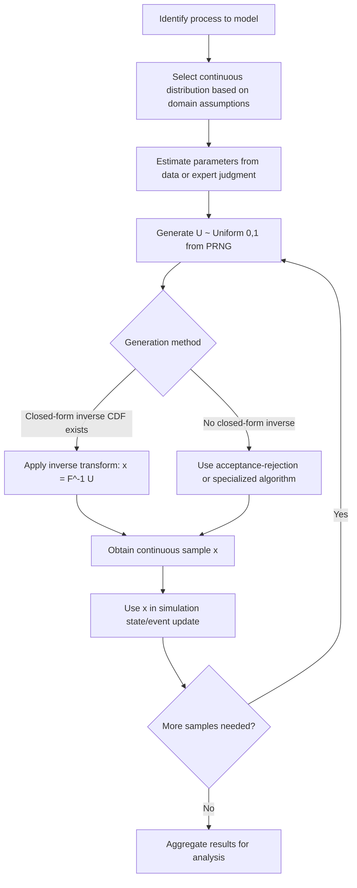

## Continuous Probability Distributions

### Overview

A continuous random variable $X$ takes values over an uncountable range (typically an interval of real numbers), in contrast to the countable support of a discrete random variable. Instead of a probability mass function, a continuous random variable is characterized by a **probability density function (PDF)**, $f(x)$, where probabilities correspond to areas under the curve rather than point masses.

$$\int_{-\infty}^{\infty} f(x)\, dx = 1, \quad f(x) \geq 0 \; \forall x$$

$$P(a \leq X \leq b) = \int_a^b f(x)\, dx$$

A key distinction from the discrete case: $P(X = x) = 0$ for any single point $x$, since a point has zero width under the density curve. Probabilities are only meaningful over intervals.

### Core Descriptive Quantities

**Key Points**

- **Expected value (mean):** $E[X] = \int_{-\infty}^{\infty} x \, f(x)\, dx$
- **Variance:** $\text{Var}(X) = E[X^2] - (E[X])^2$
- **Cumulative distribution function (CDF):** $F(x) = P(X \leq x) = \int_{-\infty}^x f(t)\, dt$
- **Relationship between PDF and CDF:** $f(x) = \frac{d}{dx} F(x)$, wherever $F$ is differentiable

The CDF of a continuous distribution is continuous (no jumps), which is the defining structural difference from a discrete CDF's step-function shape.

### Continuous Uniform Distribution

Assigns equal density to every point in an interval $[a, b]$.

$$f(x) = \frac{1}{b-a}, \quad a \leq x \leq b$$

- $E[X] = \frac{a+b}{2}$
- $\text{Var}(X) = \frac{(b-a)^2}{12}$

**Example**

The Continuous Uniform distribution on $[0,1]$ is the foundation of nearly all random-variate generation: pseudo-random number generators produce approximately $\text{Uniform}(0,1)$ samples, which are then transformed into samples from other distributions.

### Exponential Distribution

Models the time between events in a Poisson process — the continuous analogue of the Geometric distribution.

$$f(x) = \lambda e^{-\lambda x}, \quad x \geq 0$$

$$F(x) = 1 - e^{-\lambda x}$$

- $E[X] = 1/\lambda$
- $\text{Var}(X) = 1/\lambda^2$

The Exponential distribution shares the **memoryless property** with the Geometric distribution: $P(X > s+t \mid X > s) = P(X > t)$. This is a [Confirmed] defining mathematical property, derivable directly from the exponential form of the survival function.

**Example**

In queueing simulations, if customer arrivals follow a Poisson process with rate $\lambda = 12$/hour, the time between consecutive arrivals (the **interarrival time**) follows $\text{Exponential}(\lambda = 12)$.

### Normal (Gaussian) Distribution

The most widely used continuous distribution, characterized by its bell-shaped, symmetric density.

$$f(x) = \frac{1}{\sigma\sqrt{2\pi}} \exp\left(-\frac{(x-\mu)^2}{2\sigma^2}\right)$$

- $E[X] = \mu$
- $\text{Var}(X) = \sigma^2$

The **Central Limit Theorem** states that the sum (or mean) of a large number of independent, identically distributed random variables with finite variance approaches a Normal distribution, regardless of the underlying distribution shape. This is a [Confirmed] classical theorem in probability theory. In simulation practice, how quickly convergence occurs for a specific finite $n$ [Inference] depends on the skewness and tail behavior of the underlying distribution, and should not be assumed to be fast in all cases.

**Example**

Measurement error in a physical simulation, or the aggregate effect of many small independent noise sources, is commonly modeled as Normal — e.g., sensor noise in a Monte Carlo estimate of structural load.

### Standard Normal and Z-Scores

The **standard normal distribution** is $\text{Normal}(\mu=0, \sigma^2=1)$, denoted $Z$. Any Normal variable can be standardized:

$$Z = \frac{X - \mu}{\sigma}$$

This transformation is used to compute probabilities via standard normal tables or software functions without needing a distinct table for every $(\mu, \sigma)$ pair.

### Gamma Distribution

Generalizes the Exponential distribution to model the sum of $k$ independent Exponential random variables (the waiting time for the $k$-th event in a Poisson process).

$$f(x) = \frac{1}{\Gamma(k)\theta^k} x^{k-1} e^{-x/\theta}, \quad x \geq 0$$

where $\Gamma(k)$ is the Gamma function and $\theta$ is the scale parameter (with shape parameter $k$).

- $E[X] = k\theta$
- $\text{Var}(X) = k\theta^2$

**Example**

Modelling the total time until the 5th machine failure in a reliability simulation, given failures occur as a Poisson process, uses $\text{Gamma}(k=5, \theta)$.

### Weibull Distribution

Widely used in reliability and survival modelling; generalizes the Exponential distribution to allow increasing or decreasing failure (hazard) rates over time.

$$f(x) = \frac{k}{\lambda}\left(\frac{x}{\lambda}\right)^{k-1} e^{-(x/\lambda)^k}, \quad x \geq 0$$

- Shape parameter $k$: $k=1$ reduces to Exponential; $k>1$ models increasing hazard rate (wear-out); $k<1$ models decreasing hazard rate (early-life failures).
- $E[X] = \lambda \Gamma(1 + 1/k)$

**Example**

Simulating time-to-failure for mechanical components subject to wear (increasing failure rate with age) commonly uses $\text{Weibull}(k > 1)$, unlike the memoryless Exponential.

### Beta Distribution

Defined on the bounded interval $[0,1]$, making it useful for modelling proportions, probabilities, or bounded quantities.

$$f(x) = \frac{1}{B(\alpha,\beta)} x^{\alpha-1}(1-x)^{\beta-1}, \quad 0 \leq x \leq 1$$

where $B(\alpha,\beta)$ is the Beta function.

- $E[X] = \frac{\alpha}{\alpha+\beta}$
- $\text{Var}(X) = \frac{\alpha\beta}{(\alpha+\beta)^2(\alpha+\beta+1)}$

**Example**

In Bayesian simulation frameworks, the Beta distribution is the standard conjugate prior for a Bernoulli/Binomial success probability, frequently used in simulations of A/B testing or reliability estimation with uncertain success rates.

### Triangular Distribution

Defined by a minimum $a$, mode $c$, and maximum $b$; commonly used in simulation when only rough estimates (rather than full statistical data) are available for an input variable.

$$f(x) = \begin{cases} \frac{2(x-a)}{(b-a)(c-a)} & a \leq x < c \\ \frac{2(b-x)}{(b-a)(b-c)} & c \leq x \leq b \end{cases}$$

- $E[X] = \frac{a+b+c}{3}$

**Example**

In project simulation (e.g., PERT-style duration modelling), a task duration might be estimated with a Triangular distribution using best-case, most-likely, and worst-case time estimates when historical data is unavailable.

### Lognormal Distribution

Models a variable $X$ such that $\ln(X)$ is Normally distributed. Useful for strictly positive, right-skewed quantities.

$$f(x) = \frac{1}{x\sigma\sqrt{2\pi}} \exp\left(-\frac{(\ln x - \mu)^2}{2\sigma^2}\right), \quad x > 0$$

- $E[X] = e^{\mu + \sigma^2/2}$
- $\text{Var}(X) = (e^{\sigma^2}-1)e^{2\mu+\sigma^2}$

**Example**

Simulating multiplicative processes such as stock prices, income distributions, or particle sizes in a materials simulation commonly uses the Lognormal distribution, since products of many independent positive factors tend toward log-normality by a multiplicative version of the Central Limit Theorem.

### Comparison of Common Continuous Distributions

| Distribution | Support | Parameters | Typical Simulation Use |
| --- | --- | --- | --- |
| Continuous Uniform | $[a,b]$ | $a, b$ | Base for random-variate generation |
| Exponential | $[0,\infty)$ | $\lambda$ | Interarrival/interevent times |
| Normal | $(-\infty,\infty)$ | $\mu, \sigma$ | Measurement error, aggregated noise |
| Gamma | $[0,\infty)$ | $k, \theta$ | Sum of exponential waiting times |
| Weibull | $[0,\infty)$ | $k, \lambda$ | Time-to-failure, reliability |
| Beta | $[0,1]$ | $\alpha, \beta$ | Proportions, Bayesian priors |
| Triangular | $[a,b]$ | $a, b, c$ | Expert-estimate-based modelling |
| Lognormal | $(0,\infty)$ | $\mu, \sigma$ | Multiplicative/skewed positive quantities |

### Distribution Shape Comparison (svg_diagram)

<svg xmlns="http://www.w3.org/2000/svg" viewBox="0 0 800 320">
\<style\>
.axis { stroke: #8fa3b8; stroke-width: 1.5; }
.curve { fill: none; stroke-width: 2.5; }
.lbl { font-family: sans-serif; font-size: 13px; fill: #ffffff; }
.title { font-family: sans-serif; font-size: 16px; fill: #ffffff; font-weight: bold; }
\</style\>
<text x="400" y="25" text-anchor="middle" class="title">Continuous Distribution Shapes (svg_diagram)</text>

<g transform="translate(20,50)">
<line x1="0" y1="110" x2="230" y2="110" class="axis" />
<path d="M10,108 C60,10 110,10 115,108 C120,10 170,10 220,108" class="curve" stroke="#5a8fd6" />
<text x="115" y="130" text-anchor="middle" class="lbl">Normal (symmetric)</text>
</g>

<g transform="translate(280,50)">
<line x1="0" y1="110" x2="230" y2="110" class="axis" />
<path d="M5,10 C40,60 90,100 220,108" class="curve" stroke="#e3a25a" />
<text x="115" y="130" text-anchor="middle" class="lbl">Exponential (decay)</text>
</g>

<g transform="translate(540,50)">
<line x1="0" y1="110" x2="230" y2="110" class="axis" />
<path d="M5,108 C50,108 70,10 110,10 C150,10 170,90 220,108" class="curve" stroke="#5ae3a2" />
<text x="115" y="130" text-anchor="middle" class="lbl">Weibull, k&gt;1 (wear-out)</text>
</g>

<g transform="translate(20,190)">
<line x1="0" y1="110" x2="230" y2="110" class="axis" />
<path d="M5,108 C60,10 170,10 220,108" class="curve" stroke="#d65a8f" />
<text x="115" y="130" text-anchor="middle" class="lbl">Beta (bounded [0,1])</text>
</g>

<g transform="translate(280,190)">
<line x1="0" y1="110" x2="230" y2="110" class="axis" />
<path d="M5,108 L100,20 L220,108" class="curve" stroke="#c3d65a" fill="none" />
<text x="115" y="130" text-anchor="middle" class="lbl">Triangular (piecewise linear)</text>
</g>

<g transform="translate(540,190)">
<line x1="0" y1="110" x2="230" y2="110" class="axis" />
<path d="M5,108 C30,108 45,15 80,15 C120,15 160,60 220,108" class="curve" stroke="#a25ae3" />
<text x="115" y="130" text-anchor="middle" class="lbl">Lognormal (right-skewed)</text>
</g>
</svg>

### Random-Variate Generation Workflow

### Inverse Transform Method for Continuous Sampling

**Steps**

1. Derive the CDF $F(x)$ in closed form, if possible.
2. Draw $U \sim \text{Uniform}(0,1)$.
3. Solve $x = F^{-1}(U)$.
4. Return $x$ as the sample.

**Example**

For the Exponential distribution, $F(x) = 1 - e^{-\lambda x}$. Solving for $x$:

$$x = -\frac{1}{\lambda}\ln(1-U)$$

Since $1-U$ is also $\text{Uniform}(0,1)$-distributed, this simplifies in practice to $x = -\frac{1}{\lambda}\ln(U)$.

For distributions without a closed-form inverse CDF (e.g., Normal, Gamma with non-integer shape), numerical inversion or alternative algorithms (e.g., Box-Muller transform for Normal, acceptance-rejection for Gamma) are used instead. [Confirmed] as standard practice, since these distributions' CDFs are not analytically invertible.

### Common Pitfalls in Modelling and Simulation Practice

**Key Points**

- Defaulting to the Normal distribution for all continuous quantities without checking for skewness, boundedness, or heavy tails — a Lognormal, Beta, or Gamma may fit the process more appropriately.
- Applying the memoryless Exponential distribution to reliability modelling of components subject to wear, where the Weibull distribution with $k > 1$ more accurately captures increasing hazard.
- Using the Triangular distribution as a permanent substitute for empirical data collection; it is intended as a placeholder under high uncertainty, and [Inference] its accuracy relative to the true process distribution can vary substantially depending on how well the three estimates are elicited.
- Ignoring boundedness — applying an unbounded distribution (e.g., Normal) to a strictly positive or proportion-valued quantity can generate invalid samples (negative durations, probabilities outside $[0,1]$) unless truncation or an appropriately bounded distribution is used.

### Related Topics

- Discrete Probability Distributions (prerequisite topic)
- Random Number Generation and Pseudo-Random Number Generators (PRNGs)
- The Poisson Process and Its Role in Queueing Theory
- Acceptance-Rejection and Box-Muller Sampling Methods
- Parameter Estimation for Continuous Distributions (Method of Moments, Maximum Likelihood)
- Goodness-of-Fit Testing for Continuous Distributions (Kolmogorov-Smirnov, Anderson-Darling)
- Monte Carlo Simulation Methods
- Central Limit Theorem and Its Role in Simulation Output Analysis