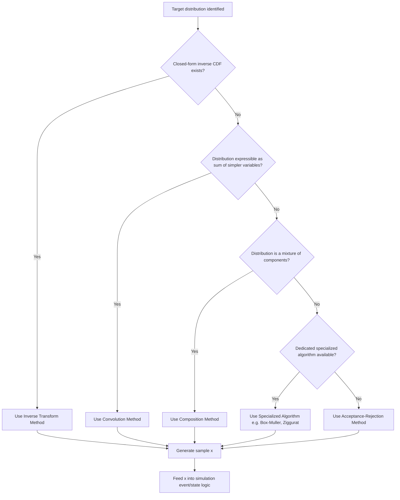

## Random Variate Generation

### Overview

Random variate generation is the process of producing samples from a specified probability distribution, given access to a source of uniform random numbers. It is the computational bridge between the theoretical distributions used to model a system (arrival times, service durations, failure events) and the actual numeric values consumed by a simulation's event logic. Every stochastic simulation depends on this process: the fidelity of the simulation's random inputs directly affects the validity of its output analysis.

The starting point for essentially all variate generation methods is a stream of samples from $\text{Uniform}(0,1)$, produced by a pseudo-random number generator (PRNG). All the techniques below describe how to transform uniform samples into samples from a target distribution.

### Pseudo-Random Number Generators as the Foundation

**Key Points**

- A PRNG produces a deterministic sequence of numbers that approximates the statistical properties of true randomness, seeded by an initial value.
- Common algorithm families include linear congruential generators (LCGs), Mersenne Twister, and modern counter-based generators (e.g., PCG, Xorshift).
- The quality of a PRNG (period length, dimensional equidistribution, absence of detectable patterns) directly bounds the quality of any variate generated from it — no downstream transformation can fix a poor-quality underlying uniform stream.
- Reproducibility in simulation studies depends on fixing and recording the PRNG seed.

Because PRNG design is itself a substantial topic, it is treated in detail separately (see Related Topics); this document assumes a satisfactory $\text{Uniform}(0,1)$ stream is available and focuses on transforming it.

### Inverse Transform Method

The most direct and generally applicable technique when the target distribution's CDF is invertible in closed form.

**Steps**

1. Derive $F(x)$, the CDF of the target distribution.
2. Draw $U \sim \text{Uniform}(0,1)$.
3. Compute $x = F^{-1}(U)$.
4. Return $x$.

This method is [Confirmed] to produce correctly distributed samples for any distribution with a computable inverse CDF; the correctness follows directly from the probability integral transform theorem.

**Example**

For the Exponential distribution with rate $\lambda$: $F(x) = 1 - e^{-\lambda x}$, so $F^{-1}(U) = -\frac{1}{\lambda}\ln(1-U)$.

For a discrete distribution with outcomes $\{1,2,3\}$ and probabilities $\{0.2,0.5,0.3\}$: the CDF steps are $F(1)=0.2$, $F(2)=0.7$, $F(3)=1.0$; a draw of $U=0.65$ yields $x=2$, since $F(1) < 0.65 \leq F(2)$.

**Limitation**

Many distributions (Normal, Gamma with non-integer shape, Beta) lack a closed-form inverse CDF, requiring either numerical root-finding on $F(x) - U = 0$ or an alternative method entirely.

### Acceptance-Rejection Method

Used when the target density $f(x)$ can be evaluated pointwise but has no tractable inverse CDF. Relies on sampling from an easier-to-generate "envelope" distribution and probabilistically accepting or rejecting each candidate.

**Steps**

1. Choose a proposal density $g(x)$ that is easy to sample from, and a constant $M$ such that $f(x) \leq M \cdot g(x)$ for all $x$.
2. Generate a candidate $Y \sim g(x)$.
3. Generate $U \sim \text{Uniform}(0,1)$ independently.
4. Accept $Y$ as a sample from $f$ if $U \leq \frac{f(Y)}{M \cdot g(Y)}$; otherwise, discard and return to step 2.

**Key Points**

- The efficiency of the method (expected number of trials per accepted sample) is $M$, so a tighter envelope (smaller $M$) reduces wasted computation.
- Choosing $M$ too large, while still valid, [Inference] tends to substantially degrade sampling throughput in performance-sensitive simulation loops, since a large fraction of candidates will be rejected.
- The method generalizes to multivariate distributions, though the "curse of dimensionality" typically makes $M$ grow unfavorably as dimension increases.

**Example**

Sampling from a Beta$(\alpha, \beta)$ distribution restricted to a bounded interval can use a Uniform proposal $g(x)$ over that interval, with $M$ set to the maximum value of the Beta density on that interval.

### Box-Muller Transform (Normal Distribution)

A specialized closed-form method for generating standard Normal variates from pairs of uniform random numbers, avoiding the need for numerical inversion of the Normal CDF.

$$Z_1 = \sqrt{-2\ln U_1} \cos(2\pi U_2)$$

$$Z_2 = \sqrt{-2\ln U_1} \sin(2\pi U_2)$$

where $U_1, U_2 \sim \text{Uniform}(0,1)$ independently, producing two independent standard Normal variates $Z_1, Z_2$.

To obtain $X \sim \text{Normal}(\mu, \sigma^2)$: $X = \mu + \sigma Z$.

This transform is [Confirmed] to produce exact standard Normal variates (not an approximation), derivable from a change of variables between Cartesian and polar coordinates applied to the bivariate standard Normal density.

**Example**

Simulating sensor measurement noise in a Monte Carlo structural-load model: each noise sample is generated via Box-Muller from a fresh pair of uniform draws, then scaled by the sensor's known standard deviation.

### Convolution Method

Used when a target distribution can be expressed as the sum of simpler, more easily generated random variables.

**Example**

An $\text{Erlang}(k, \lambda)$ random variable (a special case of Gamma with integer shape $k$) is the sum of $k$ independent $\text{Exponential}(\lambda)$ variables:

$$X = \sum_{i=1}^{k} X_i, \quad X_i \sim \text{Exponential}(\lambda) \text{ i.i.d.}$$

Each $X_i$ can itself be generated via inverse transform, making convolution a practical composition of the inverse transform method rather than a competing technique.

A $\text{Binomial}(n,p)$ variate can similarly be generated as the sum of $n$ independent $\text{Bernoulli}(p)$ variates, though for large $n$ this is [Inference] typically less efficient than direct methods (e.g., inverse transform on the Binomial CDF).

### Composition Method

Used when the target distribution can be expressed as a weighted mixture of simpler component distributions:

$$f(x) = \sum_{i=1}^{k} p_i f_i(x), \quad \sum_i p_i = 1$$

**Steps**

1. Generate $U \sim \text{Uniform}(0,1)$ to select which component distribution $f_i$ to sample from, based on the weights $p_i$.
2. Generate a sample from the selected component distribution $f_i$ using any applicable method.

**Example**

Modelling call-duration in a telecom simulation where 70% of calls follow one Exponential distribution (short calls) and 30% follow another with a different rate (long calls) is a two-component mixture, sampled via composition.

### Special-Case Algorithms

Certain distributions have dedicated, highly optimized generation algorithms beyond the general-purpose methods above:

| Distribution | Common Algorithm |
| --- | --- |
| Normal | Box-Muller, Ziggurat algorithm, Marsaglia polar method |
| Gamma (non-integer shape) | Marsaglia-Tsang method, Ahrens-Dieter algorithm |
| Poisson | Knuth's algorithm (product of uniforms), PTRS algorithm for large $\lambda$ |
| Binomial | BTPE algorithm (for large $n$) |

The choice among these is [Inference] generally driven by a tradeoff between implementation simplicity and computational efficiency at scale; most general-purpose simulation software libraries select an appropriate algorithm internally based on parameter values, and the underlying library implementation should be consulted rather than assumed.

### Method Selection Workflow

### Generation Method Comparison (svg_diagram)

<svg xmlns="http://www.w3.org/2000/svg" viewBox="0 0 800 300">
\<style\>
.box { fill: #1e2a38; stroke: #5a8fd6; stroke-width: 2; }
.lbl { font-family: sans-serif; font-size: 14px; fill: #ffffff; font-weight: bold; }
.sub { font-family: sans-serif; font-size: 11px; fill: #cfd8e3; }
.title { font-family: sans-serif; font-size: 16px; fill: #ffffff; font-weight: bold; }
.arrow { stroke: #8fb4e3; stroke-width: 2; fill: none; marker-end: url(#arrowhead2); }
\</style\>
<text x="400" y="28" text-anchor="middle" class="title">Random Variate Generation Methods (svg_diagram)</text>
<rect x="30" y="60" width="170" height="150" rx="8" class="box" />
<text x="115" y="90" text-anchor="middle" class="lbl">Inverse</text>
<text x="115" y="108" text-anchor="middle" class="lbl">Transform</text>
<text x="115" y="135" text-anchor="middle" class="sub">Requires: closed-form</text>
<text x="115" y="150" text-anchor="middle" class="sub">invertible CDF</text>
<text x="115" y="175" text-anchor="middle" class="sub">Cost: 1 uniform draw</text>
<text x="115" y="190" text-anchor="middle" class="sub">per sample</text>
<rect x="230" y="60" width="170" height="150" rx="8" class="box" />
<text x="315" y="90" text-anchor="middle" class="lbl">Acceptance-</text>
<text x="315" y="108" text-anchor="middle" class="lbl">Rejection</text>
<text x="315" y="135" text-anchor="middle" class="sub">Requires: evaluable</text>
<text x="315" y="150" text-anchor="middle" class="sub">density + envelope</text>
<text x="315" y="175" text-anchor="middle" class="sub">Cost: variable</text>
<text x="315" y="190" text-anchor="middle" class="sub">(depends on M)</text>
<rect x="430" y="60" width="170" height="150" rx="8" class="box" />
<text x="515" y="90" text-anchor="middle" class="lbl">Convolution</text>
<text x="515" y="135" text-anchor="middle" class="sub">Requires: sum</text>
<text x="515" y="150" text-anchor="middle" class="sub">decomposition</text>
<text x="515" y="175" text-anchor="middle" class="sub">Cost: k draws</text>
<text x="515" y="190" text-anchor="middle" class="sub">per sample</text>
<rect x="630" y="60" width="150" height="150" rx="8" class="box" />
<text x="705" y="90" text-anchor="middle" class="lbl">Specialized</text>
<text x="705" y="108" text-anchor="middle" class="lbl">Algorithms</text>
<text x="705" y="135" text-anchor="middle" class="sub">Requires: dedicated</text>
<text x="705" y="150" text-anchor="middle" class="sub">derivation exists</text>
<text x="705" y="175" text-anchor="middle" class="sub">Cost: often</text>
<text x="705" y="190" text-anchor="middle" class="sub">near-optimal</text>
</svg>

### Variance Reduction Relevance

Random variate generation choices interact directly with variance reduction techniques used in simulation output analysis. For example, **common random numbers** (a variance reduction technique comparing two system configurations) requires using the same underlying uniform draws across both configurations' variate generation, which is straightforward with the inverse transform method (a single $U$ maps deterministically to one $x$) but more complex with acceptance-rejection (an unknown, variable number of uniform draws are consumed per accepted sample). This is a [Confirmed] practical consideration documented in simulation methodology literature, since the number of uniforms consumed per sample is exactly what differs structurally between the two methods.

### Common Pitfalls in Modelling and Simulation Practice

**Key Points**

- Reusing the same PRNG stream across logically distinct random processes in a simulation (e.g., arrivals and service times) without stream separation, which can introduce spurious correlations between supposedly independent processes.
- Assuming acceptance-rejection efficiency is acceptable without estimating $M$ empirically first — a poorly chosen envelope can make the method impractically slow.
- Failing to validate generated variates against the target distribution's theoretical moments or via goodness-of-fit tests before relying on them in a full-scale simulation study.
- Using low-quality or short-period PRNGs for large-scale simulations, which [Inference] can introduce detectable cyclic patterns that bias output statistics, particularly in high-dimensional or long-run simulations.

### Related Topics

- Discrete Probability Distributions (prerequisite topic)
- Continuous Probability Distributions (prerequisite topic)
- Pseudo-Random Number Generators: Design and Quality Criteria
- Variance Reduction Techniques (Common Random Numbers, Antithetic Variates, Control Variates)
- Multivariate Random Variate Generation and Copulas
- Monte Carlo Simulation Methods
- Goodness-of-Fit Testing for Validating Generated Variates