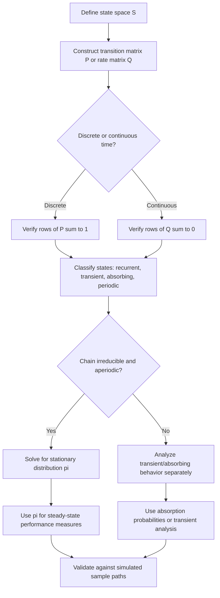

## Markov Chains and Processes

### Overview

A Markov chain is a stochastic process describing a system that transitions between a set of states over time, where the probability of moving to any future state depends only on the current state — not on the sequence of states that preceded it. This defining property is called the **Markov property** (or memorylessness at the process level, distinct from but related to the memoryless property of the Exponential/Geometric distributions).

Formally, for a discrete-time stochastic process $\{X_t\}$:

$$P(X_{t+1} = j \mid X_t = i, X_{t-1}, \ldots, X_0) = P(X_{t+1} = j \mid X_t = i)$$

Markov chains are foundational to modelling and simulation wherever a system's future behavior can be reasonably approximated as depending only on its present state — queueing systems, inventory levels, reliability states, and many discrete-event simulation frameworks.

### Discrete-Time Markov Chains (DTMC)

A DTMC evolves at fixed, discrete time steps. Its behavior is fully specified by:

- A finite or countable **state space** $S = \{1, 2, \ldots, n\}$.
- A **transition probability matrix** $P$, where $P_{ij} = P(X_{t+1} = j \mid X_t = i)$.
- An **initial distribution** $\pi_0$ over the state space.

The transition matrix satisfies:

$$\sum_{j \in S} P_{ij} = 1 \quad \forall i \in S$$

since from any state, the process must transition to exactly one state (possibly itself) at the next step.

**Example**

A simple weather model with states $\{\text{Sunny}, \text{Rainy}\}$ might have:

$$P = \begin{pmatrix} 0.8 & 0.2 \\ 0.4 & 0.6 \end{pmatrix}$$

meaning if today is Sunny, there is an 80% chance tomorrow is also Sunny; if today is Rainy, a 60% chance tomorrow is also Rainy.

### Multi-Step Transitions

The probability of moving from state $i$ to state $j$ in exactly $n$ steps is given by the $(i,j)$ entry of $P^n$ (the matrix raised to the $n$-th power), a direct consequence of the **Chapman-Kolmogorov equations**:

$$P_{ij}^{(n)} = \sum_{k \in S} P_{ik}^{(m)} P_{kj}^{(n-m)}, \quad 0 < m < n$$

This is [Confirmed] a standard structural result following directly from the law of total probability applied recursively to the Markov property.

### State Classification

**Key Points**

- **Accessible/Communicating states:** state $j$ is accessible from $i$ if $P_{ij}^{(n)} > 0$ for some $n \geq 0$; if $i$ and $j$ are mutually accessible, they **communicate**.
- **Irreducible chain:** all states communicate with each other (the chain forms a single communicating class).
- **Recurrent state:** a state the process is guaranteed to return to with probability 1.
- **Transient state:** a state with positive probability of never being revisited.
- **Absorbing state:** a state $i$ where $P_{ii} = 1$ — once entered, the process never leaves.
- **Periodic state:** a state with period $d > 1$, meaning returns to it are only possible at multiples of $d$ steps; a state with $d=1$ is **aperiodic**.

### Stationary Distribution

A **stationary distribution** $\pi$ is a probability distribution over states satisfying:

$$\pi P = \pi, \quad \sum_{i} \pi_i = 1$$

meaning that if the chain's state distribution equals $\pi$ at one time step, it remains $\pi$ at every subsequent step.

For an irreducible, aperiodic (i.e., **ergodic**) Markov chain on a finite state space, a unique stationary distribution exists, and:

$$\lim_{n \to \infty} P^n_{ij} = \pi_j \quad \text{for all } i$$

meaning the chain converges to $\pi$ regardless of its starting state. This convergence result is a [Confirmed] classical theorem in Markov chain theory (the ergodic theorem for finite chains).

**Example**

For the weather chain above, solving $\pi P = \pi$ yields the long-run proportion of Sunny vs. Rainy days, independent of what the weather was on day 0 — a quantity directly usable as a steady-state performance measure in a simulation study.

The rate at which a specific finite chain converges to its stationary distribution depends on the chain's second-largest eigenvalue magnitude, and [Inference] can vary substantially between chains with similar state-space sizes but different transition structures — this should be checked empirically (e.g., via total variation distance over iterations) rather than assumed to be fast.

### Continuous-Time Markov Chains (CTMC)

A CTMC generalizes the DTMC to continuous time, where the process remains in a state for a random (Exponentially distributed) holding time before transitioning.

**Key Points**

- Governed by a **transition rate matrix** (generator matrix) $Q$, where $Q_{ij}$ ($i \neq j$) is the rate of transitioning from $i$ to $j$, and $Q_{ii} = -\sum_{j \neq i} Q_{ij}$.
- The holding time in state $i$ before any transition is $\text{Exponential}(-Q_{ii})$, reflecting the memoryless property of the Exponential distribution — a structural requirement for the process to remain Markovian in continuous time.
- The stationary distribution $\pi$ (if it exists) satisfies $\pi Q = 0$.

**Example**

A CTMC is the natural framework for modelling a single-server queue (M/M/1): the "state" is the number of customers in the system, transitions correspond to arrival (Poisson process, rate $\lambda$) or service completion (Exponential, rate $\mu$) events, and the memoryless property of the Exponential distribution is precisely what makes the number-in-system process Markovian.

### Markov Chain State Diagram (svg_diagram)

<svg xmlns="http://www.w3.org/2000/svg" viewBox="0 0 700 320">
\<style\>
.state { fill: #1e2a38; stroke: #5a8fd6; stroke-width: 2.5; }
.lbl { font-family: sans-serif; font-size: 15px; fill: #ffffff; font-weight: bold; }
.plabel { font-family: sans-serif; font-size: 12px; fill: #e3c95a; }
.title { font-family: sans-serif; font-size: 16px; fill: #ffffff; font-weight: bold; }
.arrow { stroke: #8fb4e3; stroke-width: 2; fill: none; marker-end: url(#ah4); }
.selfarrow { stroke: #8fb4e3; stroke-width: 2; fill: none; marker-end: url(#ah4); }
\</style\>
<text x="350" y="28" text-anchor="middle" class="title">Two-State Markov Chain: Weather Model (svg_diagram)</text>
<circle cx="220" cy="170" r="60" class="state" />
<text x="220" y="177" text-anchor="middle" class="lbl">Sunny</text>
<circle cx="480" cy="170" r="60" class="state" />
<text x="480" y="177" text-anchor="middle" class="lbl">Rainy</text>
<path d="M275 150 C 350 100, 400 100, 425 150" class="arrow" />
<text x="350" y="100" text-anchor="middle" class="plabel">0.2</text>
<path d="M425 195 C 400 250, 350 250, 275 195" class="arrow" />
<text x="350" y="270" text-anchor="middle" class="plabel">0.4</text>
<path d="M190 120 C 160 60, 220 40, 250 90" class="selfarrow" />
<text x="175" y="55" text-anchor="middle" class="plabel">0.8</text>
<path d="M450 90 C 480 40, 540 60, 510 120" class="selfarrow" />
<text x="525" y="55" text-anchor="middle" class="plabel">0.6</text>
</svg>

### Markov Chain Analysis Workflow

### Absorbing Markov Chains

A chain with at least one absorbing state, where every state can reach an absorbing state, is used to model processes with a defined terminal outcome (completion, failure, absorption into a terminal category).

For a chain with transient states organized into matrix block form:

$$P = \begin{pmatrix} Q & R \\ 0 & I \end{pmatrix}$$

where $Q$ describes transitions among transient states and $R$ describes transitions from transient to absorbing states, the **fundamental matrix** $N = (I - Q)^{-1}$ gives the expected number of visits to each transient state before absorption, and $N \cdot R$ gives the probability of eventual absorption into each absorbing state.

**Example**

Modelling a manufacturing process where a unit passes through several inspection stages (transient states) before ending in either "Passed" or "Scrapped" (absorbing states) uses this framework to compute the probability of eventual scrap and the expected number of rework cycles.

### Relationship to Discrete-Event Simulation

**Key Points**

- Many discrete-event simulations are, structurally, sample-path realizations of an underlying (possibly high-dimensional) Markov chain or CTMC — the "state" of the simulation model evolves according to Markovian transition logic even when not explicitly framed in matrix form.
- When system state fully captures all information relevant to future evolution (the Markov property holds by construction), analytical Markov chain results can validate or cross-check simulation output — e.g., comparing simulated steady-state queue-length proportions against an analytically solved stationary distribution.
- When the Markov property does not hold (e.g., non-Exponential service times, state-dependent history effects), simulation becomes necessary specifically because the analytical Markov chain machinery no longer applies, motivating techniques like the semi-Markov process or direct discrete-event simulation.

### Common Pitfalls in Modelling and Simulation Practice

**Key Points**

- Assuming the Markov property holds for a system without verifying it — e.g., using an Exponential service-time assumption in a CTMC framework when real service times are empirically non-Exponential (e.g., deterministic or heavy-tailed), which breaks the Markovian structure.
- Confusing the stationary distribution with the initial or transient-period distribution when reporting simulation results — using output from early simulation time steps (before convergence) to estimate steady-state measures introduces initialization bias.
- Treating a periodic chain as if a stationary distribution describes its behavior at every time step, when in fact the limit $\lim_{n\to\infty} P^n_{ij}$ may not exist for periodic chains, even though a stationary distribution satisfying $\pi P = \pi$ still exists.
- Applying finite-chain ergodic convergence results to infinite or continuous state spaces without checking the additional conditions required in that setting, since [Inference] the finite-chain convergence guarantees do not automatically extend without further assumptions (e.g., positive recurrence, Harris recurrence).

### Related Topics

- Random Variate Generation (prerequisite topic)
- Monte Carlo Methods (prerequisite topic)
- Markov Chain Monte Carlo (MCMC) Methods
- Queueing Theory and the M/M/1 Queue
- Semi-Markov Processes and Renewal Theory
- Discrete-Event Simulation Fundamentals
- Simulation Output Analysis: Warm-Up Period and Steady-State Estimation