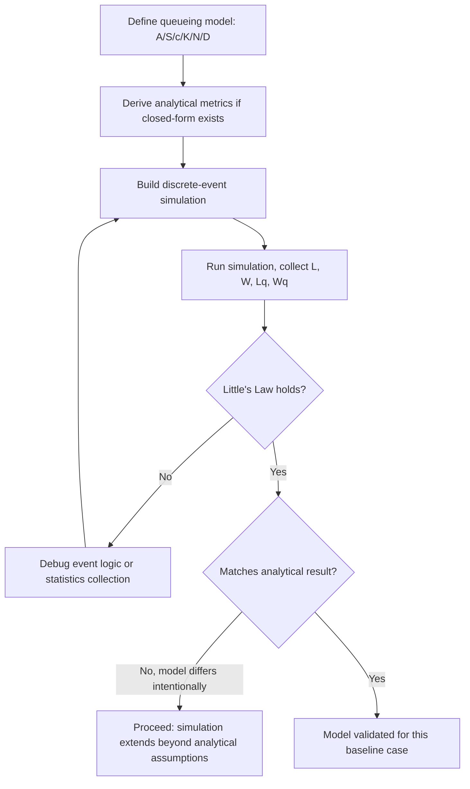

## Queueing Theory Fundamentals

### Overview

Queueing theory is the mathematical study of waiting lines. It models systems where entities ("customers") arrive, wait if necessary, receive service from a limited number of "servers," and depart. It is foundational to discrete-event simulation because most simulated systems — call centers, manufacturing lines, networks, hospitals, computer CPUs — are fundamentally queueing systems.

The theory provides closed-form analytical results for simple cases, which serve two purposes in a modelling and simulation context: they give quick approximate answers, and they act as verification benchmarks against which a discrete-event simulation model can be validated.

### Core Terminology

**Key Points**

- **Arrival process**: how customers enter the system, typically described by an interarrival time distribution.
- **Service process**: how long a server takes to process a customer, described by a service time distribution.
- **Number of servers ($c$)**: how many customers can be served simultaneously.
- **Queue capacity ($K$)**: maximum number of customers the system can hold (waiting + in service). Often assumed infinite for simplicity.
- **Calling population**: the pool from which customers are drawn. Often assumed infinite.
- **Queue discipline**: the rule for selecting the next customer to serve — FIFO (First-In-First-Out) is most common; others include LIFO, priority-based, and random selection (SIRO).

### Kendall's Notation

Queueing systems are classified using Kendall's notation, written as:

$$A/S/c/K/N/D$$

- $A$: interarrival time distribution
- $S$: service time distribution
- $c$: number of servers
- $K$: system capacity (omitted if infinite)
- $N$: calling population size (omitted if infinite)
- $D$: queue discipline (omitted if FIFO)

Common distribution codes:

- $M$: Markovian (exponential, memoryless)
- $D$: Deterministic (constant)
- $G$ or $GI$: General (arbitrary distribution, independent)
- $E_k$: Erlang with shape $k$

An $M/M/1$ queue therefore means exponential interarrivals, exponential service times, a single server, infinite capacity, infinite population, and FIFO discipline. This is the most-studied queueing model due to its analytical tractability.

### The M/M/1 Queue

**Key Points**

This is the canonical single-server queue: Poisson arrivals with rate $\lambda$, exponential service times with rate $\mu$, one server, infinite capacity and population.

Let the traffic intensity (utilization) be:

$$\rho = \frac{\lambda}{\mu}, \quad \rho < 1 \text{ for stability}$$

Stability here means the queue does not grow without bound over time; if $\rho \geq 1$, the server cannot keep up with arrivals and the queue length diverges.

Given stability, the steady-state performance measures are:

$$P_0 = 1 - \rho \quad \text{(probability system is empty)}$$

$$P_n = (1-\rho)\rho^n \quad \text{(probability of } n \text{ customers in system)}$$

$$L = \frac{\rho}{1-\rho} \quad \text{(expected number in system)}$$

$$L_q = \frac{\rho^2}{1-\rho} \quad \text{(expected number in queue)}$$

$$W = \frac{L}{\lambda} = \frac{1}{\mu - \lambda} \quad \text{(expected time in system)}$$

$$W_q = \frac{L_q}{\lambda} = \frac{\rho}{\mu - \lambda} \quad \text{(expected time in queue)}$$

**Example**

A help desk receives requests according to a Poisson process at $\lambda = 8$ per hour. One technician handles requests with exponential service time averaging 6 minutes ($\mu = 10$ per hour).

$$\rho = \frac{8}{10} = 0.8$$

$$L = \frac{0.8}{1 - 0.8} = 4 \text{ requests in the system on average}$$

$$W = \frac{1}{10 - 8} = 0.5 \text{ hours} = 30 \text{ minutes average time in system}$$

$$W_q = \frac{0.8}{10-8} = 0.4 \text{ hours} = 24 \text{ minutes average wait before service}$$

Note $\rho = 0.8$ is close to 1, which is why $L$ and $W$ are disproportionately large relative to the raw service rate — this nonlinear blow-up near $\rho = 1$ is one of the most important qualitative lessons of queueing theory.

### Little's Law

**Key Points**

Little's Law is a distribution-free relationship that holds for virtually any stable queueing system in steady state, not just $M/M/1$:

$$L = \lambda W$$

In words: the average number of customers in a system equals the arrival rate multiplied by the average time each customer spends in the system. The same relation holds for the queue alone: $L_q = \lambda W_q$.

Little's Law is one of the most widely used sanity checks in discrete-event simulation — if a simulation's measured $L$, $\lambda$, and $W$ do not satisfy this identity (within statistical noise), there is likely a bug in the model or the statistics-collection logic.

### M/M/c: Multi-Server Queue

Extends $M/M/1$ to $c$ identical parallel servers, still with Poisson arrivals ($\lambda$) and exponential service ($\mu$ per server). Traffic intensity is defined per-server:

$$\rho = \frac{\lambda}{c\mu}, \quad \rho < 1 \text{ for stability}$$

The probability of zero customers in the system is:

$$P_0 = \left[ \sum_{n=0}^{c-1} \frac{(c\rho)^n}{n!} + \frac{(c\rho)^c}{c!(1-\rho)} \right]^{-1}$$

The probability an arriving customer must wait (Erlang C formula):

$$C(c, \lambda/\mu) = \frac{(c\rho)^c}{c!(1-\rho)} P_0$$

Expected queue length and wait:

$$L_q = \frac{C(c, \lambda/\mu)\,\rho}{1-\rho}, \qquad W_q = \frac{L_q}{\lambda}$$

This model underlies call-center staffing calculations, where $c$ is chosen to keep $W_q$ or the wait probability below a service-level target.

### M/M/1/K: Finite Capacity Queue

When the system can hold at most $K$ customers (including the one in service), arrivals that find the system full are lost — a critical distinction from infinite-capacity models because throughput is capped regardless of $\lambda$.

$$P_n = \begin{cases} \dfrac{(1-\rho)\rho^n}{1-\rho^{K+1}} & \rho \neq 1 \\ \dfrac{1}{K+1} & \rho = 1 \end{cases}, \quad n = 0, 1, \dots, K$$

The blocking probability (probability an arrival is turned away) is $P_K$. The effective arrival rate entering the system is:

$$\lambda_{\text{eff}} = \lambda(1 - P_K)$$

Little's Law must then use $\lambda_{\text{eff}}$, not the nominal $\lambda$, since blocked customers never actually enter the system.

### M/G/1 Queue: General Service Times

When service times follow an arbitrary distribution $G$ with mean $1/\mu$ and variance $\sigma^2$, exact per-state probabilities are harder to derive, but the mean queue length is given by the Pollaczek–Khinchine formula:

$$L_q = \frac{\rho^2 (1 + \sigma^2 \mu^2)}{2(1-\rho)}$$

equivalently expressed via the squared coefficient of variation of service time, $C_s^2 = \sigma^2\mu^2$:

$$L_q = \frac{\rho^2(1 + C_s^2)}{2(1-\rho)}$$

[Inference] Because $C_s^2 = 1$ for the exponential distribution, this formula reduces exactly to the $M/M/1$ result when service times are exponential, which is a useful consistency check when implementing it.

This formula demonstrates a key qualitative insight: queue length depends not only on utilization $\rho$ but on service time *variability*. Deterministic service ($C_s^2 = 0$) halves $L_q$ relative to exponential service at the same $\rho$ — this is the basis of the general principle that reducing variability, not just mean service time, improves system performance.

### Network of Queues

**Key Points**

Real systems often consist of multiple queueing stations connected together (e.g., a manufacturing line, a computer network). Two common frameworks:

- **Tandem (series) queues**: output of one queue feeds directly into the next.
- **Jackson networks**: a network of $M/M/c$-type stations where customers move probabilistically between stations after service, arrivals to each node are Poisson (from outside or from other nodes), and each node behaves, in steady state, *as if* it were an independent $M/M/c$ queue with its own effective arrival rate solved from traffic equations:

$$\lambda_j = \gamma_j + \sum_{i} \lambda_i p_{ij}$$

where $\gamma_j$ is external arrival rate to node $j$, and $p_{ij}$ is the routing probability from node $i$ to node $j$. This product-form result — each node analyzable independently despite the network coupling — is one of the most elegant and simulation-relevant results in queueing theory, since it lets analysts decompose otherwise-intractable network models.

### System Flow Diagram

<svg xmlns="http://www.w3.org/2000/svg" viewBox="0 0 720 260">
<text x="360" y="24" text-anchor="middle" font-size="15" font-weight="bold" fill="#222">Single-Server Queueing System (svg_diagram)</text>

<text x="60" y="120" font-size="13" fill="#333">Arrivals (λ)</text>

<line x1="30" y1="140" x2="140" y2="140" stroke="#333" stroke-width="2" marker-end="url(#arrow)" />

<rect x="150" y="110" width="180" height="60" fill="none" stroke="#333" stroke-width="2" />
<text x="240" y="135" text-anchor="middle" font-size="12" fill="#333">Queue</text>
<text x="240" y="152" text-anchor="middle" font-size="11" fill="#666">(waiting line)</text>
<line x1="330" y1="140" x2="400" y2="140" stroke="#333" stroke-width="2" marker-end="url(#arrow)" />
<circle cx="450" cy="140" r="50" fill="none" stroke="#333" stroke-width="2" />
<text x="450" y="135" text-anchor="middle" font-size="12" fill="#333">Server</text>
<text x="450" y="152" text-anchor="middle" font-size="11" fill="#666">(rate μ)</text>
<line x1="500" y1="140" x2="600" y2="140" stroke="#333" stroke-width="2" marker-end="url(#arrow)" />
<text x="650" y="135" text-anchor="middle" font-size="13" fill="#333">Departures</text>

<text x="240" y="200" text-anchor="middle" font-size="11" fill="#666">Wq = avg wait</text>

<text x="450" y="215" text-anchor="middle" font-size="11" fill="#666">W = avg time in system</text>

</svg>

### Simulation Verification Workflow

### Practical Role in Simulation

**Key Points**

- Analytical queueing formulas rarely apply directly to real systems, since real interarrival and service processes are rarely exactly exponential or Poisson — this is precisely why discrete-event simulation is needed.
- The formulas above serve as **validation baselines**: build the simulation first under the same simplifying assumptions (e.g., force $M/M/1$ conditions), confirm the simulation's output matches the analytical prediction, and only then relax the assumptions to model the real, more complex system.
- [Inference] Mismatches between simulated and analytical results under identical assumptions most often indicate implementation errors (e.g., incorrect random variate generation, biased warm-up period handling, or flawed statistics collection) rather than a flaw in the theory itself, since the M/M/1 and M/M/c results are mathematically proven.

### Related Topics

- Discrete-Event Simulation Mechanics (event scheduling, the event list, simulation clock advancement)
- Random Variate Generation (inverse transform, acceptance-rejection methods)
- Warm-up Period and Steady-State Statistics Collection
- Simulation Output Analysis (confidence intervals, replication methods)
- Markov Chains and the Birth-Death Process (theoretical basis for M/M/1 derivations)
- Priority Queueing Disciplines and Preemption
- Simulation of Jackson and Non-Jackson Queueing Networks