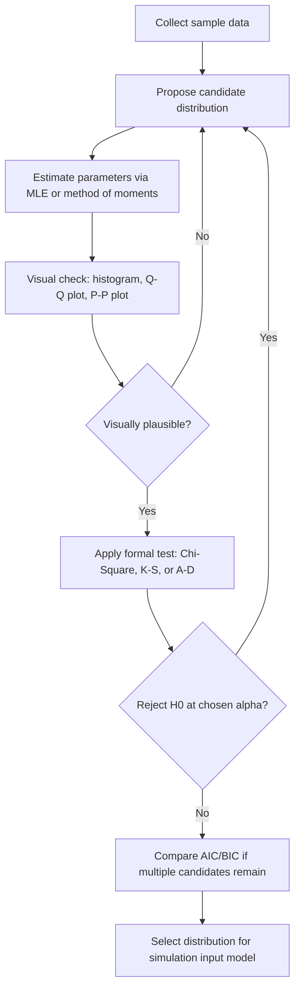

## Goodness-of-Fit Testing for Distributions

### Overview

Goodness-of-fit (GOF) testing is the process of statistically evaluating whether a hypothesized probability distribution adequately describes a set of observed data. In modelling and simulation, this step is essential when selecting input distributions — for example, deciding whether interarrival times truly follow an exponential distribution before feeding that assumption into an $M/M/1$ queueing model or a discrete-event simulation's random variate generator.

Without GOF testing, a simulation may be built on an incorrect distributional assumption, producing outputs that look plausible but do not reflect the real system's behavior.

### The General Hypothesis-Testing Framework

**Key Points**

GOF tests are framed as classical hypothesis tests:

$$H_0: \text{the data follow the hypothesized distribution } F(x)$$

$$H_1: \text{the data do not follow } F(x)$$

A test statistic is computed from the sample and compared against a critical value (or converted to a p-value) at a chosen significance level $\alpha$ (commonly 0.05). If the test statistic exceeds the critical value, $H_0$ is rejected.

A critical interpretive point: failing to reject $H_0$ does **not** prove the data follow that distribution — it only means the data are not inconsistent with it, given the sample size and test power. Small samples in particular often fail to reject almost any reasonable candidate distribution.

### Preliminary Step: Parameter Estimation

Before testing, unknown distribution parameters (e.g., $\lambda$ for exponential, $\mu$ and $\sigma$ for normal) must typically be estimated from the same data, usually via maximum likelihood estimation (MLE) or method of moments. Using estimated rather than known parameters affects the sampling distribution of the test statistic and generally requires adjusted critical values, particularly for the Kolmogorov-Smirnov test discussed below.

### Chi-Square Goodness-of-Fit Test

**Key Points**

The chi-square test is the most widely taught GOF test and works for both discrete and continuous distributions (continuous data must first be grouped into class intervals).

**Procedure:**

1. Divide the data range into $k$ mutually exclusive intervals.
2. Compute the observed frequency $O_i$ in each interval.
3. Compute the expected frequency $E_i = n \cdot p_i$, where $p_i$ is the hypothesized probability of falling in interval $i$ and $n$ is the sample size.
4. Compute the test statistic:

$$\chi^2 = \sum_{i=1}^{k} \frac{(O_i - E_i)^2}{E_i}$$

5. Compare against $\chi^2_{\alpha, k-s-1}$, where $s$ is the number of parameters estimated from the data.

**Rule of thumb**: intervals should be chosen so that $E_i \geq 5$ for each interval (some references allow as low as 3–4), merging adjacent intervals if needed to satisfy this.

**Example**

Suppose 100 observed interarrival times are grouped into 5 intervals, hypothesized to follow an exponential distribution with $\hat\lambda$ estimated from the sample mean.

| Interval | $O_i$ | $E_i$ | $(O_i-E_i)^2/E_i$ |
| --- | --- | --- | --- |
| 1 | 24 | 22 | 0.18 |
| 2 | 19 | 20 | 0.05 |
| 3 | 22 | 20 | 0.20 |
| 4 | 17 | 19 | 0.21 |
| 5 | 18 | 19 | 0.05 |

$$\chi^2 = 0.18+0.05+0.20+0.21+0.05 = 0.69$$

Degrees of freedom: $k - s - 1 = 5 - 1 - 1 = 3$ (one parameter, $\lambda$, estimated). At $\alpha = 0.05$, $\chi^2_{0.05,3} \approx 7.81$. Since $0.69 < 7.81, do not reject $H_0
; the exponential distribution is a plausible fit.

**Limitations**: the chi-square test is sensitive to the choice and number of intervals — different binning can lead to different conclusions — and it discards information by grouping continuous data. It is generally less powerful than the Kolmogorov-Smirnov test for continuous distributions with small to moderate sample sizes.

### Kolmogorov-Smirnov (K-S) Test

**Key Points**

The K-S test compares the empirical distribution function (EDF) of the sample directly against the hypothesized CDF, without requiring grouping into intervals — making it more powerful than chi-square for continuous distributions, especially with small samples.

Given ordered sample values $X_{(1)} \leq X_{(2)} \leq \dots \leq X_{(n)}$, the empirical CDF is:

$$F_n(x) = \frac{\text{number of observations} \leq x}{n}$$

The test statistic is the maximum absolute deviation between $F_n(x)$ and the hypothesized $F(x)$:

$$D = \sup_x |F_n(x) - F(x)|$$

Computed practically as:

$$D^+ = \max_{1 \leq i \leq n} \left( \frac{i}{n} - F(X_{(i)}) \right), \qquad D^- = \max_{1 \leq i \leq n} \left( F(X_{(i)}) - \frac{i-1}{n} \right)$$

$$D = \max(D^+, D^-)$$

$D$ is compared to a tabulated critical value $D_\alpha$ dependent on $n$. If $D > D_\alpha$, reject $H_0$.

**Caveat**: standard K-S critical value tables assume the distribution's parameters are known in advance, *not* estimated from the same sample. When parameters are estimated (the common case in simulation input modelling), adjusted tables or corrections are required — for example, the Lilliefors correction for the normal distribution. [Unverified] Applying unadjusted K-S critical values when parameters were estimated from the data tends to make the test overly conservative (less likely to reject $H_0$ than it should be), and the exact magnitude of this effect is distribution-specific.

### Anderson-Darling (A-D) Test

**Key Points**

The Anderson-Darling test is a refinement of the K-S approach that gives more weight to the tails of the distribution:

$$A^2 = -n - \sum_{i=1}^{n} \frac{2i-1}{n} \left[ \ln F(X_{(i)}) + \ln(1 - F(X_{(n+1-i)})) \right]$$

This tail-sensitivity matters heavily in simulation, because many downstream performance measures (e.g., queue overflow probability, extreme wait times) are driven by tail behavior rather than the bulk of the distribution. A distribution can pass a K-S test while still poorly fitting the tail, which the A-D test is more likely to catch. Like the K-S test, A-D critical values must be adjusted when parameters are estimated from the sample rather than known.

### Probability Plots (Q-Q and P-P Plots)

**Key Points**

Graphical GOF assessment complements formal tests and is standard practice before/alongside them:

- **Q-Q plot (quantile-quantile)**: plots sample quantiles against theoretical quantiles of the hypothesized distribution. A good fit shows points falling approximately along the 45° line.
- **P-P plot (probability-probability)**: plots the empirical CDF against the hypothesized CDF at each data point; more sensitive to deviations in the middle of the distribution than the tails.

Systematic curvature in a Q-Q plot indicates a specific type of misfit (e.g., consistent upward curvature can indicate the true distribution is more right-skewed than hypothesized), which is diagnostic information that a single test statistic does not provide.

### Comparing Candidate Distributions

**Key Points**

When multiple candidate distributions pass GOF tests (common with limited data), additional criteria help choose among them:

- **p-value comparison**: prefer the distribution with the largest p-value (weakest evidence against $H_0$), though this should not be the sole criterion.
- **Akaike Information Criterion (AIC)** and **Bayesian Information Criterion (BIC)**: penalize distributions with more parameters, discouraging overfitting.

$$AIC = 2s - 2\ln(\hat{L})$$

where $s$ is the number of parameters and $\hat L$ is the maximized likelihood.

- **Physical/domain plausibility**: a distribution should also make sense given the underlying process — e.g., preferring exponential for a memoryless arrival process over a better-fitting but mechanistically unjustified distribution, unless there is a specific reason to expect otherwise.

### GOF Testing Workflow

### Test Comparison Diagram

<svg xmlns="http://www.w3.org/2000/svg" viewBox="0 0 720 280">
<text x="360" y="24" text-anchor="middle" font-size="15" font-weight="bold" fill="#222">GOF Test Selection Guide (svg_diagram)</text>
<rect x="30" y="60" width="200" height="180" fill="none" stroke="#333" stroke-width="2" />
<text x="130" y="85" text-anchor="middle" font-size="13" font-weight="bold" fill="#333">Chi-Square</text>
<text x="130" y="110" text-anchor="middle" font-size="11" fill="#555">Discrete or</text>
<text x="130" y="125" text-anchor="middle" font-size="11" fill="#555">continuous (binned)</text>
<text x="130" y="150" text-anchor="middle" font-size="11" fill="#555">Requires E_i ≥ 5</text>
<text x="130" y="175" text-anchor="middle" font-size="11" fill="#555">Sensitive to</text>
<text x="130" y="190" text-anchor="middle" font-size="11" fill="#555">bin choice</text>
<rect x="260" y="60" width="200" height="180" fill="none" stroke="#333" stroke-width="2" />
<text x="360" y="85" text-anchor="middle" font-size="13" font-weight="bold" fill="#333">Kolmogorov-Smirnov</text>
<text x="360" y="110" text-anchor="middle" font-size="11" fill="#555">Continuous only</text>
<text x="360" y="135" text-anchor="middle" font-size="11" fill="#555">No binning needed</text>
<text x="360" y="160" text-anchor="middle" font-size="11" fill="#555">Good for small n</text>
<text x="360" y="185" text-anchor="middle" font-size="11" fill="#555">Whole-distribution</text>
<text x="360" y="200" text-anchor="middle" font-size="11" fill="#555">sensitivity</text>
<rect x="490" y="60" width="200" height="180" fill="none" stroke="#333" stroke-width="2" />
<text x="590" y="85" text-anchor="middle" font-size="13" font-weight="bold" fill="#333">Anderson-Darling</text>
<text x="590" y="110" text-anchor="middle" font-size="11" fill="#555">Continuous only</text>
<text x="590" y="135" text-anchor="middle" font-size="11" fill="#555">No binning needed</text>
<text x="590" y="160" text-anchor="middle" font-size="11" fill="#555">Tail-weighted</text>
<text x="590" y="185" text-anchor="middle" font-size="11" fill="#555">Best for extreme-</text>
<text x="590" y="200" text-anchor="middle" font-size="11" fill="#555">value sensitivity</text>
</svg>

### Common Pitfalls in Simulation Practice

**Key Points**

- Fitting a distribution to pooled data that actually comes from a mixture of distinct processes (e.g., combining weekday and weekend arrival patterns), which no single GOF test will flag as a structural problem.
- Ignoring autocorrelation: GOF tests generally assume independent observations; serially correlated data (common in time-series-like simulation inputs) can invalidate the test's assumptions even when the marginal distribution fits well.
- Over-reliance on large-sample p-values: with very large $n$, GOF tests become highly powered and will reject nearly any hypothesized distribution due to trivial deviations, even when the fit is practically adequate for simulation purposes.
- Skipping visual diagnostics entirely and relying only on a single p-value, which can mask systematic tail misfit or bimodality that a histogram or Q-Q plot would reveal immediately.

### Related Topics

- Random Variate Generation from Fitted Distributions
- Maximum Likelihood Estimation for Common Simulation Input Distributions
- Input Modelling for Non-Stationary (Time-Varying) Arrival Processes
- Bootstrap Methods for Distribution Fitting Uncertainty
- Empirical Distributions as a Fallback When No Theoretical Distribution Fits
- Autocorrelation Detection and Time-Series Input Modelling