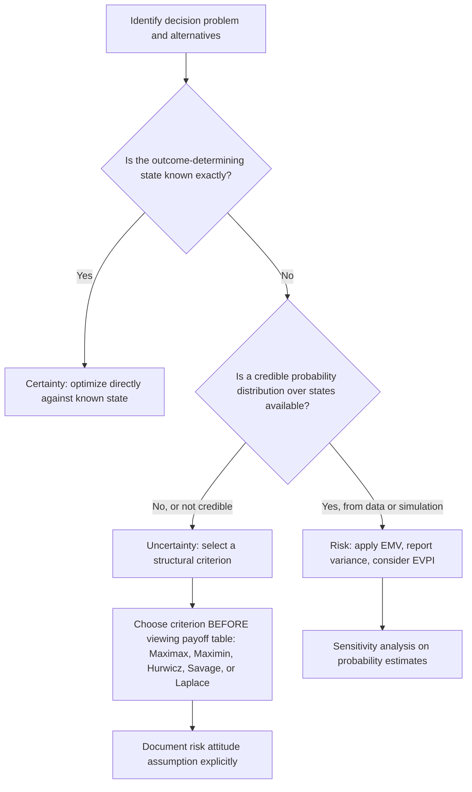

## Decision Making Under Certainty, Risk, and Uncertainty

### Overview

Decision problems are classified into three canonical information environments based on what is known about the states of nature: certainty, risk, and uncertainty. This classification determines which analytical machinery is appropriate — optimization, probability-weighted expected value, or structural (non-probabilistic) criteria, respectively. Correctly identifying which environment a real decision belongs to is a prerequisite step before applying any decision criterion, since applying an expected-value method to a genuine uncertainty problem manufactures false precision.

### Decision Making Under Certainty

**Key Points**

Under certainty, the decision maker knows exactly which state of nature will occur. The payoff table effectively collapses to a single column, and the problem reduces to:

$$a^* = \arg\max_i u(a_i, \theta_{\text{known}})$$

This is formally a special case of standard optimization rather than decision theory proper. It appears in simulation contexts when a scenario is fixed by assumption (e.g., "assume demand will be exactly 500 units/day") to isolate and study one part of a larger, otherwise-uncertain problem — a controlled simplification technique rather than a realistic representation of most systems.

**Key Points**

- True certainty is rare in practice; it is often used as a limiting case or benchmark against which decisions under risk/uncertainty are compared.
- A simulation study may run a "deterministic baseline" scenario (all inputs at their expected/nominal values, no randomness) specifically to establish this certainty-case reference point before introducing stochastic variation.

### Decision Making Under Risk

**Key Points**

Under risk, the states of nature are unknown, but a probability distribution $P(\theta_j)$ over them is known or can be credibly estimated — commonly from historical frequency data, expert judgment (subjective probability), or, centrally in this context, from simulation output.

The dominant criterion is **Expected Monetary Value (EMV)**:

$$EMV(a_i) = \sum_{j=1}^{m} P(\theta_j)\, u(a_i, \theta_j)$$

with the optimal alternative $a^* = \arg\max_i EMV(a_i)$.

Two important supplementary measures:

**Expected Value of Perfect Information (EVPI)** — the maximum rational amount to pay for perfect advance knowledge of the true state of nature:

$$EVPI = \sum_j P(\theta_j) \max_i u(a_i,\theta_j) - \max_i EMV(a_i)$$

**Variance/standard deviation of payoff** — EMV alone ignores dispersion; two alternatives can have identical EMV but very different risk profiles. Reporting

$$\sigma^2(a_i) = \sum_j P(\theta_j)\big[u(a_i,\theta_j) - EMV(a_i)\big]^2$$

alongside EMV lets the decision maker see risk, not just central tendency — critical when a low-probability, high-severity outcome (e.g., system failure, stockout) matters disproportionately to the decision maker.

**Example**

Two production alternatives have identical EMV of 50 but different payoff spreads:

| Alternative | Bad state (P=0.5) | Good state (P=0.5) | EMV | Std. Dev. |
| --- | --- | --- | --- | --- |
| A (stable process) | 45 | 55 | 50 | 5 |
| B (volatile process) | 10 | 90 | 50 | 40 |

A pure EMV criterion is indifferent between A and B, but a risk-averse decision maker would strongly prefer A. This is precisely why EMV is described as *risk-neutral* by construction — it does not, by itself, capture risk aversion.

### Decision Making Under Uncertainty

**Key Points**

Under uncertainty, neither the states of nature nor any probability distribution over them is known or considered credible enough to use. This is the most conservative and least information-dependent environment, relying instead on structural criteria that make an explicit assumption about the decision maker's attitude toward risk.

| Criterion | Assumption / Attitude | Formula |
| --- | --- | --- |
| Maximax | Optimistic | $\arg\max_i \max_j u(a_i,\theta_j)$ |
| Maximin (Wald) | Pessimistic | $\arg\max_i \min_j u(a_i,\theta_j)$ |
| Hurwicz | Weighted optimism ($\alpha$) | $\arg\max_i \big[\alpha \max_j u + (1-\alpha)\min_j u\big]$ |
| Minimax Regret (Savage) | Minimize worst-case regret | $\arg\min_i \max_j \text{Regret}(a_i,\theta_j)$ |
| Laplace | Equal likelihood assumed | $\arg\max_i \frac{1}{m}\sum_j u(a_i,\theta_j)$ |

**Key Points**

- No single criterion is objectively "correct" under uncertainty — each formalizes a different, defensible attitude toward the absence of probability information, and different decision makers facing an identical payoff table can rationally select different alternatives depending on which criterion (and, for Hurwicz, which $\alpha$) they adopt.
- The choice of criterion is itself a decision that should be made *before* seeing the payoff table, to avoid the appearance of reverse-engineering a criterion to justify a preferred alternative.

### Comparative Example Across All Three Environments

**Example**

A single payoff table, analyzed three different ways depending on what is assumed to be known:

| Alternative | State A | State B | State C |
| --- | --- | --- | --- |
| $a_1$ | 50 | 30 | 70 |
| $a_2$ | 40 | 60 | 40 |
| $a_3$ | 20 | 80 | 20 |

**Under certainty** (suppose State B is known to occur): compare column B directly → $a_3$ wins (80).

**Under risk** (suppose $P(A)=0.5, P(B)=0.3, P(C)=0.2$):

$$EMV(a_1) = 0.5(50)+0.3(30)+0.2(70) = 25+9+14 = 48$$

$$EMV(a_2) = 0.5(40)+0.3(60)+0.2(40) = 20+18+8 = 46$$

$$EMV(a_3) = 0.5(20)+0.3(80)+0.2(20) = 10+24+4 = 38$$

→ $a_1$ wins.

**Under uncertainty** (no probabilities assumed):

- Maximax: best of each row's max → $a_3$ (80) wins.
- Maximin: worst of each row → $a_1$: 30, $a_2$: 40, $a_3$: 20 → $a_2$ wins.
- Laplace: row averages → $a_1$: 50, $a_2$: 46.7, $a_3$: 40 → $a_1$ wins.

The same payoff table produces three *different* winning alternatives ($a_3$, $a_1$, $a_2$ or $a_1$) depending purely on which information environment is assumed and which criterion is applied within it — this is the central practical lesson of the topic: the "right answer" is contingent on correctly identifying what is actually known, not just on doing the arithmetic correctly.

### Environment Comparison Diagram

<svg xmlns="http://www.w3.org/2000/svg" viewBox="0 0 760 300">
<text x="380" y="24" text-anchor="middle" font-size="15" font-weight="bold" fill="#222">Decision Environments Spectrum (svg_diagram)</text>
<line x1="60" y1="150" x2="700" y2="150" stroke="#333" stroke-width="2" marker-end="url(#arrow2)" />
<text x="60" y="175" font-size="11" fill="#555">Full information</text>
<text x="640" y="175" font-size="11" fill="#555">No information</text>
<circle cx="130" cy="150" r="8" fill="#333" />
<text x="130" y="120" text-anchor="middle" font-size="13" font-weight="bold" fill="#333">Certainty</text>
<text x="130" y="200" text-anchor="middle" font-size="11" fill="#555">State known</text>
<text x="130" y="215" text-anchor="middle" font-size="11" fill="#555">exactly</text>
<circle cx="380" cy="150" r="8" fill="#333" />
<text x="380" y="120" text-anchor="middle" font-size="13" font-weight="bold" fill="#333">Risk</text>
<text x="380" y="200" text-anchor="middle" font-size="11" fill="#555">Probabilities</text>
<text x="380" y="215" text-anchor="middle" font-size="11" fill="#555">known/estimated</text>
<text x="380" y="235" text-anchor="middle" font-size="11" fill="#555">→ use EMV</text>
<circle cx="620" cy="150" r="8" fill="#333" />
<text x="620" y="120" text-anchor="middle" font-size="13" font-weight="bold" fill="#333">Uncertainty</text>
<text x="620" y="200" text-anchor="middle" font-size="11" fill="#555">No probabilities</text>
<text x="620" y="215" text-anchor="middle" font-size="11" fill="#555">→ structural criteria</text>
<text x="620" y="230" text-anchor="middle" font-size="11" fill="#555">(maximin, etc.)</text>
</svg>

### Selecting the Correct Environment: A Practical Workflow

### Role of Simulation in Shifting Environments

**Key Points**

- A core practical value of simulation is converting a decision problem from **uncertainty** into **risk**: rather than facing unknown states of nature with no probability structure, a well-validated simulation model can generate an empirical distribution over outcomes, supplying the $P(\theta_j)$ that risk-based methods require.
- [Inference] This conversion is only justified to the extent the simulation model itself has been validated (see prior goodness-of-fit and verification topics); an unvalidated simulation applied here risks producing a false sense of having moved from uncertainty to risk, when the underlying probability estimates may not actually be trustworthy.
- When simulation cannot credibly produce such probabilities (e.g., truly novel scenarios with no comparable historical or modelled precedent), the uncertainty-based criteria remain the more honest and defensible choice, even though they are less mathematically elegant than EMV.

### Related Topics

- Expected Value of Perfect and Sample Information (EVPI, EVSI)
- Utility Theory and Risk-Adjusted Decision Criteria
- Bayesian Updating of State Probabilities with New Simulation Data
- Ranking and Selection Procedures for Simulation-Generated Alternatives
- Scenario Analysis and Robust Decision Making Under Deep Uncertainty
- Multi-Criteria Decision Analysis (MCDA)