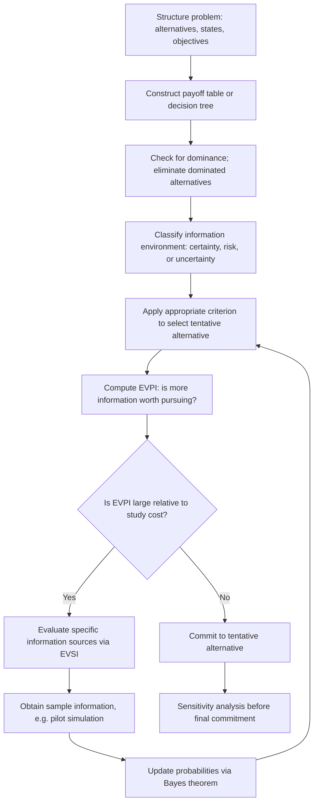

## Classical Decision Analysis

### Overview

Classical decision analysis is the formalized discipline — originating in the work of von Neumann, Morgenstern, Savage, and Raiffa — that structures decision problems into a rigorous sequence of steps: problem formulation, model construction, criterion selection, sensitivity analysis, and choice. Where the previous topics addressed individual *criteria* (maximax, EMV, etc.), classical decision analysis addresses the *process* that wraps around them — the discipline of decision analysis as a repeatable methodology rather than a single formula.

It is "classical" in the sense of being the foundational, pre-Bayesian-updating framework: states of nature and their probabilities (if known) are treated as fixed inputs to a single-stage or tree-structured problem, rather than continuously revised as in Bayesian decision theory.

### The Formal Decision Analysis Process

**Key Points**

Classical treatments (e.g., Raiffa's decision analysis framework) decompose the discipline into a standard sequence:

1. **Structure the problem**: identify the decision maker's objective(s), the set of feasible alternatives, and the relevant states of nature.
2. **Assign payoffs (or losses)**: construct a payoff table or decision tree quantifying the outcome of each alternative under each state.
3. **Determine the information environment**: certainty, risk, or uncertainty (as classified previously), which dictates which criteria are admissible.
4. **Apply the appropriate criterion**: EMV under risk; maximax/maximin/Hurwicz/Laplace/Savage under uncertainty.
5. **Perform sensitivity analysis**: test how robust the chosen alternative is to changes in probability estimates or payoff values.
6. **Consider the value of additional information**: compute EVPI or, for less-than-perfect information sources, the Expected Value of Sample Information (EVSI), to determine whether further data collection or study is economically justified before committing to a decision.

This sequence is what elevates decision analysis from "pick a formula" to a structured methodology suitable for high-stakes organizational decisions.

### Normal Form vs. Extensive Form

**Key Points**

Classical decision analysis distinguishes two equivalent representations of a decision problem:

- **Normal form**: the payoff table representation — alternatives × states of nature, with no explicit representation of the sequence or timing of decisions and chance events. Appropriate for single-stage decisions.
- **Extensive form**: the decision tree representation — explicit nodes for decisions (squares) and chance events (circles), connected in temporal sequence. Necessary once a problem involves multiple sequential decisions, each potentially informed by the outcome of an earlier chance event.

Any single-stage normal-form problem can be redrawn as a (trivial, one-level) extensive-form tree, but not every extensive-form problem can be collapsed into a normal-form table without losing the sequential/conditional structure that makes the problem genuinely multi-stage.

### Dominance

**Key Points**

Before applying any formal criterion, classical decision analysis prescribes checking for **dominance**, which can eliminate alternatives without needing any probability information at all:

**Alternative $a_i$ dominates $a_k$** if $u(a_i, \theta_j) \geq u(a_k, \theta_j)$ for all states $\theta_j$, with strict inequality for at least one state. A dominated alternative can never be optimal under *any* criterion (EMV, maximax, maximin, or any other monotonic rule) and should be eliminated from the payoff table immediately, simplifying subsequent analysis.

**Example**

| Alternative | State A | State B | State C |
| --- | --- | --- | --- |
| $a_1$ | 20 | 30 | 25 |
| $a_2$ | 25 | 35 | 30 |
| $a_3$ | 15 | 20 | 10 |

$a_2$ dominates both $a_1$ (25≥20, 35≥30, 30≥25) and $a_3$ (25≥15, 35≥20, 30≥10). Regardless of which criterion or probability distribution is eventually used, $a_2$ will always be at least as good — $a_1$ and $a_3$ can be dropped from the table before any further analysis, reducing computational effort and eliminating irrelevant alternatives from decision-maker consideration.

Dominance checks rarely eliminate every alternative but are a standard, low-cost first pass in any classical decision analysis.

### Expected Value of Sample Information (EVSI)

**Key Points**

While EVPI (covered in the prior topic) measures the value of *perfect* information, real information sources — additional simulation runs, pilot studies, market surveys — are imperfect. **EVSI** measures the value of a specific, less-than-perfect information source:

$$EVSI = E_{\text{sample}}\big[\max_i EMV(a_i \mid \text{sample outcome})\big] - \max_i EMV(a_i)$$

That is, EVSI compares the expected value of the *optimal* decision made after observing the sample information (updating beliefs about $P(\theta_j)$ accordingly) against the expected value of the best decision made *without* that information. It is always true that:

$$0 \leq EVSI \leq EVPI$$

since sample information can never be worth more than perfect information, and cannot have negative value under classical (non-adversarial) decision analysis, since the decision maker always retains the option to ignore the sample and act on prior information alone.

**Efficiency of information** is sometimes reported as the ratio $EVSI / EVPI$, indicating how close a proposed study or additional simulation effort comes to the theoretical maximum value of information.

### Posterior Analysis and Bayes' Theorem

**Key Points**

When sample information (e.g., a pilot simulation run, a market indicator) is obtained, classical decision analysis incorporates it via Bayes' theorem to update the prior probabilities $P(\theta_j)$ into posterior probabilities $P(\theta_j \mid \text{sample result})$:

$$P(\theta_j \mid I) = \frac{P(I \mid \theta_j)\, P(\theta_j)}{\sum_k P(I \mid \theta_k)\, P(\theta_k)}$$

where $I$ denotes the observed sample information/indicator. EMV is then recomputed using the posterior probabilities rather than the priors, and the decision reevaluated. This step is the direct precursor to full Bayesian decision theory, which generalizes this single update into a continuous belief-revision framework.

### Classical Decision Analysis Flow

### Decision Analysis Structure Diagram

<svg xmlns="http://www.w3.org/2000/svg" viewBox="0 0 760 260">
<text x="380" y="24" text-anchor="middle" font-size="15" font-weight="bold" fill="#222">Classical Decision Analysis Components (svg_diagram)</text>
<rect x="40" y="60" width="160" height="70" fill="none" stroke="#333" stroke-width="2" />
<text x="120" y="90" text-anchor="middle" font-size="12" font-weight="bold" fill="#333">Problem</text>
<text x="120" y="108" text-anchor="middle" font-size="11" fill="#555">Structure</text>
<line x1="200" y1="95" x2="260" y2="95" stroke="#333" stroke-width="2" marker-end="url(#arrow3)" />
<rect x="270" y="60" width="160" height="70" fill="none" stroke="#333" stroke-width="2" />
<text x="350" y="90" text-anchor="middle" font-size="12" font-weight="bold" fill="#333">Payoff Model</text>
<text x="350" y="108" text-anchor="middle" font-size="11" fill="#555">+ Dominance Check</text>
<line x1="430" y1="95" x2="490" y2="95" stroke="#333" stroke-width="2" marker-end="url(#arrow3)" />
<rect x="500" y="60" width="200" height="70" fill="none" stroke="#333" stroke-width="2" />
<text x="600" y="90" text-anchor="middle" font-size="12" font-weight="bold" fill="#333">Criterion Selection</text>
<text x="600" y="108" text-anchor="middle" font-size="11" fill="#555">EMV / Maximin / etc.</text>
<line x1="600" y1="130" x2="600" y2="170" stroke="#333" stroke-width="2" marker-end="url(#arrow3)" />
<rect x="500" y="180" width="200" height="60" fill="none" stroke="#333" stroke-width="2" />
<text x="600" y="205" text-anchor="middle" font-size="12" font-weight="bold" fill="#333">Value of Information</text>
<text x="600" y="222" text-anchor="middle" font-size="11" fill="#555">EVPI / EVSI</text>
<line x1="500" y1="210" x2="350" y2="210" stroke="#333" stroke-width="2" />
<line x1="350" y1="210" x2="350" y2="130" stroke="#333" stroke-width="2" marker-end="url(#arrow3)" />
<text x="380" y="240" font-size="10" fill="#555">feedback: revise via Bayes update</text>
</svg>

### Limitations of the Classical Framework

**Key Points**

- Classical decision analysis assumes payoffs and probabilities can be quantified numerically and on a common scale, which is often difficult for non-monetary or multi-dimensional objectives (safety, reputation, environmental impact) — motivating multi-criteria decision analysis (MCDA) as an extension.
- The framework assumes the decision maker's preferences are consistent and can be represented by a single utility function; behavioral economics research has documented systematic ways real decision makers violate this assumption (e.g., loss aversion, framing effects), which classical decision analysis does not natively account for.
- [Inference] For simulation-supported decisions specifically, the practical bottleneck is usually not the decision-analysis mathematics itself but the credibility of the input probabilities/payoffs the simulation supplies — the classical framework is only as trustworthy as the model feeding it.

### Related Topics

- Bayesian Decision Theory and Continuous Belief Updating
- Multi-Criteria Decision Analysis (MCDA) and Non-Monetary Objectives
- Behavioral Decision Theory and Deviations from Expected Utility
- Multi-Stage Decision Trees and Optimal Stopping Problems
- Value of Information Analysis in Simulation Study Design
- Ranking and Selection Procedures for Simulation Output Comparison