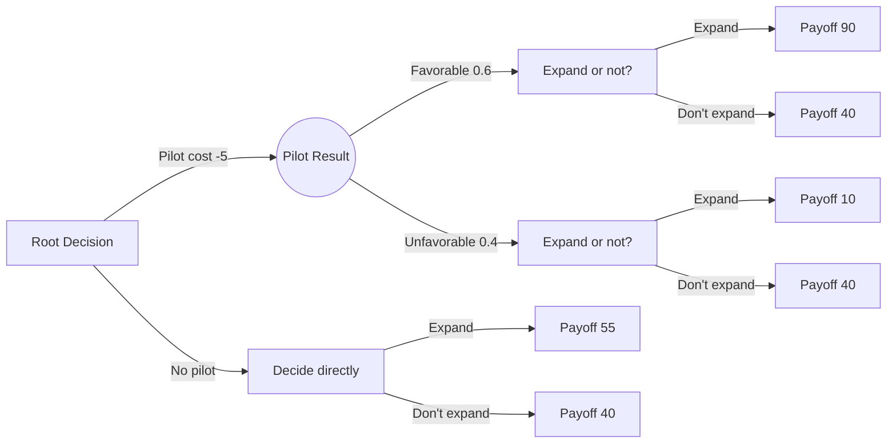

## Decision Trees and Payoff Matrices

### Overview

Decision trees and payoff matrices are the two standard representational tools of decision analysis, corresponding respectively to the extensive form and normal form introduced previously. This topic focuses on the mechanics of constructing and solving each — the algorithmic rules for folding back a tree, and the structural techniques for reducing and interpreting a payoff matrix — rather than the choice criteria applied on top of them.

### Payoff Matrix Construction Rules

**Key Points**

A payoff matrix is built according to a small set of structural conventions:

- Rows represent the decision maker's **controllable alternatives**.
- Columns represent **states of nature**, which are mutually exclusive and collectively exhaustive — exactly one will occur, and the decision maker cannot influence which.
- Cell entries $u(a_i, \theta_j)$ must be measured on a **single consistent scale** (typically monetary value, but can be any cardinal utility measure) — mixing units (e.g., some cells in cost, others in time) invalidates any aggregate criterion applied to the matrix.
- **Opportunity loss (regret) matrices** are derived from a payoff matrix by column: for each state $\theta_j$, subtract every entry in that column from the column's maximum. This transformation is purely mechanical and always produces a matrix with a zero in every column (the best alternative for that state has zero regret).

**Example: Deriving a Regret Matrix**

| Alternative | State A | State B | State C |
| --- | --- | --- | --- |
| $a_1$ | 50 | 30 | 70 |
| $a_2$ | 40 | 60 | 40 |
| $a_3$ | 20 | 80 | 20 |

Column maxima: A→50, B→80, C→70. Subtracting each column's max from every entry in that column:

| Alternative | Regret A | Regret B | Regret C |
| --- | --- | --- | --- |
| $a_1$ | 0 | 50 | 0 |
| $a_2$ | 10 | 20 | 30 |
| $a_3$ | 30 | 0 | 50 |

The minimax regret criterion then takes the row maxima (50, 30, 50) and selects the smallest: $a_2$, with maximum regret of 30. Deriving the regret matrix mechanically this way avoids errors that arise from trying to compute regret values ad hoc per cell.

### Matrix Reduction via Dominance

**Key Points**

As established previously, dominance allows rows to be struck from the matrix before any criterion is applied. The mechanical check, run pairwise across all alternatives:

For each pair $(a_i, a_k)$, compare every column entry. If $a_i$'s entry is $\geq$ $a_k$'s entry in every column, and strictly greater in at least one, then $a_k$ is dominated and removed. This check has $O(n^2)$ pairwise comparisons for $n$ alternatives and should be performed exhaustively — a common error is stopping after finding the first dominance relationship rather than checking all pairs, which can miss additional eliminable alternatives.

**Weak dominance** (all entries $\geq$, no strict inequality required) is sometimes used as an additional simplification step but does not guarantee the dominated alternative is strictly worse — only that it is never strictly better, and can be safely dropped without loss of any strictly optimal choice, though ties may exist between the dominant and dominated alternative in that case.

### Decision Tree Construction Rules

**Key Points**

A decision tree is built left-to-right in chronological order:

- **Decision nodes** (squares): the decision maker chooses one branch. Every feasible alternative at that decision point must be represented as a separate branch.
- **Chance nodes** (circles): nature selects a branch according to a probability distribution. The probabilities on branches emanating from a single chance node must sum to 1.
- **Terminal nodes**: endpoints where a final payoff is recorded, reflecting the cumulative outcome of every decision and chance event along the path from the root.
- Branches must be **mutually exclusive and collectively exhaustive** at every node — this is a structural requirement, not a modelling choice, since an incomplete or overlapping branch set makes the tree unsolvable by backward induction.

Trees can represent **multi-stage** problems naturally, with a chance node's outcome feeding into a subsequent decision node — something a single normal-form payoff matrix cannot represent without collapsing the sequential structure.

### Backward Induction (Folding Back) Algorithm

**Key Points**

Solving a decision tree proceeds in four mechanical steps, applied right-to-left (from terminal nodes toward the root):

1. **Start at terminal nodes**: record the payoff at each leaf.
2. **At each chance node**, compute the expected value by summing (probability × payoff) across all branches from that node, and assign this expected value to the node.
3. **At each decision node**, compare the (now-computed) values of all outgoing branches and select the branch with the highest value (for a maximization problem); assign that maximum value to the decision node, and mark the selected branch as the optimal choice at that point.
4. **Repeat steps 2–3** moving leftward until the root is reached; the value at the root is the expected value of the optimal overall strategy, and the marked branches trace out the complete optimal policy — including the optimal action to take at *every* decision node, not just the first one.

This last point is important: backward induction produces a full **contingent strategy** ("choose X initially; if the chance event resolves as Y, then choose Z"), not merely a single first-stage recommendation — this is the key advantage of the extensive form over the normal form for multi-stage problems.

**Example**

A two-stage tree: first decide whether to run a pilot simulation study (cost 5) or proceed directly. If piloted, the pilot result (favorable, $P=0.6$; unfavorable, $P=0.4$) informs a second decision between expanding capacity or not.

Folding back: at $D3$ (favorable branch), expand (90) beats don't expand (40) → value 90. At $D4$ (unfavorable branch), don't expand (40) beats expand (10) → value 40. At $C1$: $EV = 0.6(90) + 0.4(40) = 54+16 = 70$; net of pilot cost, $70 - 5 = 65. At $D2
 (no pilot branch): expand (55) beats don't expand (40) → value 55. At the root: piloting (65) beats not piloting (55) → **optimal strategy: run the pilot; expand if favorable, don't expand if unfavorable**, with expected net value 65.

Note the answer is a full conditional policy, not just "run the pilot" — this is what distinguishes tree-based analysis from a single-stage payoff matrix comparison.

### Equivalence and Non-Equivalence Between Representations

**Key Points**

- A single-stage decision problem can always be represented equivalently as either a payoff matrix or a (trivial, two-level) decision tree, and folding back the tree will produce the same optimal alternative as applying EMV directly to the matrix.
- A genuinely multi-stage problem — where a later decision can be conditioned on the outcome of an earlier chance event — **cannot** be losslessly collapsed into a single normal-form payoff matrix, because the matrix format has no mechanism for representing "choose differently depending on what happened earlier." Attempting to force such a problem into matrix form requires enumerating every possible *strategy* (a full contingent plan) as a single row, which is possible in principle but rapidly becomes unwieldy as the number of stages grows.
- This asymmetry is the primary reason multi-stage problems are conventionally solved via tree/backward-induction rather than matrix methods.

### Common Construction Errors

**Key Points**

- Assigning probabilities to chance-node branches that do not sum to 1, often from omitting a state of nature or double-counting one.
- Failing to net out intermediate costs (such as the pilot study cost above) at the correct node — costs incurred at a decision node should be reflected either at that node directly or consistently deducted from all downstream terminal payoffs on that branch, but not both, to avoid double-counting.
- Building an incomplete tree that omits a feasible decision alternative at a later stage because it was not anticipated when the tree was first sketched — trees for genuinely novel problems typically require at least one revision pass after an initial draft.
- Applying backward induction out of order (e.g., solving the root before its downstream branches are resolved), which produces values that do not actually reflect optimal downstream behavior.

### Related Topics

- Multi-Stage Sequential Decision Problems and Optimal Stopping
- Expected Value of Sample Information Applied Within Tree Structures
- Software Tools for Large-Scale Decision Tree Construction and Solving
- Converting Extensive-Form Strategies to Normal-Form Strategy Tables
- Sensitivity Analysis on Tree Branch Probabilities and Payoffs
- Influence Diagrams as a Compact Alternative to Large Decision Trees