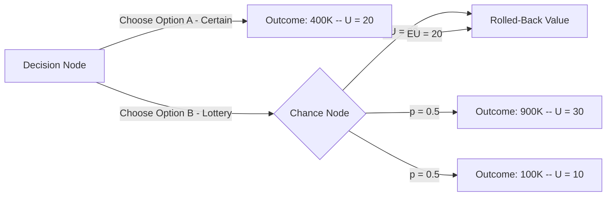

## Utility Theory

### Definition

Utility theory is a mathematical framework used in decision analysis to quantify a decision maker's preferences over outcomes, particularly under conditions of risk and uncertainty. It assigns a numerical value — utility — to each possible outcome, allowing decisions to be evaluated not just by their expected monetary value but by how much value or satisfaction the decision maker actually derives from each outcome.

In modelling and simulation, utility theory underpins decision models where multiple outcomes with different probabilities must be compared systematically, especially when the decision maker's attitude toward risk affects the "best" choice.

### Motivation: Why Not Just Use Expected Monetary Value

Expected Monetary Value (EMV) treats a dollar as having the same value regardless of who holds it or how much they already have. This assumption breaks down in practice:

- A person facing bankruptcy values an additional $10,000 far more than a billionaire does.
- Most people prefer a guaranteed $500,000 over a 50% chance of $1,000,000 and a 50% chance of $0, even though both have the same EMV.

This preference for certainty over an equally-valued gamble is called **risk aversion**, and EMV alone cannot capture it. Utility theory resolves this by replacing monetary payoffs with utility values that reflect the decision maker's actual preferences.

### Core Assumptions (Axioms of Rational Choice)

Utility theory rests on axioms first formalized by von Neumann and Morgenstern. A decision maker whose preferences satisfy these axioms can be represented by a utility function:

- **Completeness** — For any two outcomes A and B, the decision maker can state a preference: A is preferred to B, B is preferred to A, or the decision maker is indifferent.
- **Transitivity** — If A is preferred to B, and B is preferred to C, then A must be preferred to C.
- **Continuity** — If A is preferred to B, and B is preferred to C, there exists some probability $p$ such that the decision maker is indifferent between B for certain and a lottery giving A with probability $p$ and C with probability $(1-p)$.
- **Independence** — If A is preferred to B, then a lottery involving A and a third outcome C must be preferred to the equivalent lottery substituting B for A, for any C.

[Inference] These axioms are widely used as the theoretical foundation of expected utility theory in academic treatments of decision analysis; real decision makers do not always satisfy them consistently, which is a documented source of divergence between prescriptive and descriptive decision models.

### Utility Function

A utility function $U(x)$ maps a monetary outcome $x$ to a utility value, typically normalized to a convenient scale (e.g., 0 to 1, or 0 to 100).

$$U: X \rightarrow \mathbb{R}$$

Where $X$ is the set of possible outcomes. The shape of $U(x)$ encodes the decision maker's risk attitude:

- **Concave** $U(x)$ → risk-averse
- **Linear** $U(x)$ → risk-neutral
- **Convex** $U(x)$ → risk-seeking

### Expected Utility

Once a utility function is established, decisions under uncertainty are evaluated using **Expected Utility (EU)** instead of expected value:

$$EU(\text{decision}) = \sum_{i=1}^{n} p_i \cdot U(x_i)$$

Where $p_i$ is the probability of outcome $x_i$, and $U(x_i)$ is its utility. The decision maker selects the alternative with the highest expected utility, not necessarily the highest expected monetary value.

**Example**

Suppose a decision maker has the utility function $U(x) = \sqrt{x}$ for monetary outcomes $x$ (in thousands of dollars), and faces two options:

- **Option A**: Receive $400,000 for certain.
- **Option B**: A lottery with a 50% chance of $900,000 and a 50% chance of $100,000.

Expected monetary value:

- $EMV_A = 400$
- $EMV_B = 0.5(900) + 0.5(100) = 500$

By EMV alone, Option B looks better. Now compute expected utility:

- $U_A = \sqrt{400} = 20$
- $EU_B = 0.5\sqrt{900} + 0.5\sqrt{100} = 0.5(30) + 0.5(10) = 15 + 5 = 20$

Here $EU_A = EU_B = 20$, so the decision maker is indifferent — despite Option B having a higher EMV. This illustrates how a concave (risk-averse) utility function discounts the value of the riskier, higher-EMV option.

### Certainty Equivalent and Risk Premium

Two related concepts quantify the practical impact of risk aversion:

- **Certainty Equivalent (CE)** — The guaranteed amount of money that provides the same utility as a given risky lottery. In the example above, $400,000 is the certainty equivalent of the lottery in Option B.
- **Risk Premium (RP)** — The difference between the expected monetary value of a lottery and its certainty equivalent:

$$RP = EMV - CE$$

For Option B: $RP = 500 - 400 = 100$ (in thousands of dollars). This is the amount the decision maker is willing to "give up" in expected value to avoid risk.

### Constructing a Utility Function

In practice, a decision maker's utility function is elicited through structured questioning, commonly using the **certainty equivalent method** or the **lottery method**:

1. Define the best possible outcome ($x_{best}$) and worst possible outcome ($x_{worst}$) in the decision context.
2. Assign utility values: $U(x_{best}) = 1$, $U(x_{worst}) = 0$.
3. For each intermediate outcome $x$, ask the decision maker: "What probability $p$ would make you indifferent between receiving $x$ for certain, versus a lottery with probability $p$ of $x_{best}$ and $(1-p)$ of $x_{worst}$?"
4. That probability $p$ becomes $U(x)$, since:

$$U(x) = p \cdot U(x_{best}) + (1-p) \cdot U(x_{worst}) = p$$

5. Repeat for enough points to plot a smooth utility curve.

**Example**

If a decision maker states they are indifferent between $50,000 for certain and a lottery with a 70% chance of $100,000 (best) and a 30% chance of $0 (worst), then $U(50{,}000) = 0.7$.

### Common Utility Function Forms

- **Exponential utility function** — widely used for its constant risk aversion property:

$$U(x) = 1 - e^{-x/R}$$

Where $R$ is the **risk tolerance** parameter; a larger $R$ indicates lower risk aversion (the decision maker behaves more like a risk-neutral one as $R \rightarrow \infty$).

- **Logarithmic utility function**:

$$U(x) = \ln(x)$$

- **Power utility function**:

$$U(x) = x^{\alpha}, \quad 0 < \alpha < 1$$

[Inference] These forms are commonly presented as standard closed-form options in decision analysis references because they are tractable and match commonly observed risk-averse behavior; the appropriateness of any specific form for a particular decision maker is an empirical matter and not guaranteed by the model alone.

### Risk Attitude Classification

| Utility Function Shape | Risk Attitude | Behavior |
| --- | --- | --- |
| Concave ($U'' < 0$) | Risk-averse | Prefers certain outcome over equal-EMV gamble |
| Linear ($U'' = 0$) | Risk-neutral | Indifferent between certain outcome and equal-EMV gamble; EU ranking matches EMV ranking |
| Convex ($U'' > 0$) | Risk-seeking | Prefers gamble over equal-EMV certain outcome |

### Diagram: Utility Curve Shapes by Risk Attitude

<svg xmlns="http://www.w3.org/2000/svg" viewBox="0 0 640 420" font-family="Arial, sans-serif">
<text x="320" y="30" text-anchor="middle" font-size="18" font-weight="bold">Utility Curve Shapes by Risk Attitude (svg_diagram)</text>

<line x1="80" y1="360" x2="580" y2="360" stroke="black" stroke-width="2" />
<line x1="80" y1="360" x2="80" y2="60" stroke="black" stroke-width="2" />
<text x="330" y="395" text-anchor="middle" font-size="14">Monetary Outcome (x)</text>
<text x="35" y="210" text-anchor="middle" font-size="14" transform="rotate(-90 35 210)">Utility U(x)</text>

<path d="M 80 360 Q 200 100 580 80" fill="none" stroke="#1f77b4" stroke-width="3" />
<text x="420" y="95" fill="#1f77b4" font-size="13" font-weight="bold">Risk-Averse (Concave)</text>

<line x1="80" y1="360" x2="580" y2="140" stroke="#2ca02c" stroke-width="3" />
<text x="420" y="165" fill="#2ca02c" font-size="13" font-weight="bold">Risk-Neutral (Linear)</text>

<path d="M 80 360 Q 400 340 580 160" fill="none" stroke="#d62728" stroke-width="3" />
<text x="380" y="335" fill="#d62728" font-size="13" font-weight="bold">Risk-Seeking (Convex)</text>

<circle cx="80" cy="360" r="3" fill="black" />
<text x="60" y="378" font-size="12">0</text>
</svg>

### Utility Theory in Decision Trees

Utility theory integrates directly into decision tree analysis by replacing monetary payoffs at terminal nodes with their corresponding utility values, then rolling back the tree using expected utility instead of expected monetary value. The decision at each node selects the branch with the highest expected utility.

### Multi-Attribute Utility Theory (MAUT)

Real decisions often involve multiple, sometimes conflicting, objectives (e.g., cost, time, safety, quality). **Multi-Attribute Utility Theory** extends single-attribute utility theory to handle this by combining individual attribute utilities into a single overall utility score.

The most common form is the **additive utility function**:

$$U(x_1, x_2, \ldots, x_n) = \sum_{i=1}^{n} w_i \cdot U_i(x_i)$$

Where:

- $x_i$ is the outcome level for attribute $i$
- $U_i(x_i)$ is the single-attribute utility function for attribute $i$, normalized to [0, 1]
- $w_i$ is the weight (importance) assigned to attribute $i$, with $\sum w_i = 1$

[Unverified] The additive form is only strictly valid when attributes satisfy **mutual preferential independence** (preferences for one attribute do not depend on the levels of others); when this condition does not hold, more complex multiplicative or multilinear utility forms are typically required, and applying the additive form regardless can produce misleading rankings.

**Example**

A decision maker choosing between job offers weighs salary (40%), work-life balance (35%), and career growth (25%). If Job A scores $U_{salary}=0.8$, $U_{balance}=0.6$, $U_{growth}=0.9$:

$$U(\text{Job A}) = 0.40(0.8) + 0.35(0.6) + 0.25(0.9) = 0.32 + 0.21 + 0.225 = 0.755$$

This composite score can then be directly compared against similarly computed scores for competing job offers.

### Applications in Modelling and Simulation

- **Simulation-based decision support** — Monte Carlo simulations generate probability distributions over outcomes; utility theory converts these distributions into a single comparable utility score per alternative.
- **Agent-based modelling** — Agents in a simulation can be assigned utility functions to drive individually rational behavior, producing emergent system-level dynamics.
- **Resource allocation models** — Utility-weighted objectives allow simulations to optimize across competing stakeholder priorities rather than a single financial metric.
- **Risk analysis in engineering and finance** — Simulated outcome distributions (e.g., project completion time, portfolio returns) are evaluated via expected utility to select designs or portfolios matching an organization's actual risk tolerance rather than a purely EMV-optimal one.

### Limitations

- Utility elicitation is subjective and can be inconsistent across different elicitation methods for the same individual.
- The independence axiom is frequently violated in observed human behavior (see the Allais paradox), suggesting expected utility theory is a normative (prescriptive) rather than fully descriptive model of actual choice behavior. [Inference] This is a widely cited critique in behavioral decision theory literature, though the extent of its practical impact varies by decision context.
- Utility functions assumed to be stable can shift with context, wealth level, or framing of the decision.
- Multi-attribute models require careful validation of independence assumptions before applying additive forms.

### Conclusion

Utility theory provides the formal mechanism for incorporating risk attitude into decision analysis, transforming raw monetary or outcome values into a consistent scale that reflects what a decision maker actually values. It forms the analytical backbone connecting probability-based decision models — such as decision trees and simulation outputs — to rational choice, and extends naturally into multi-attribute contexts where several competing objectives must be reconciled into a single decision metric.

**Related Topics**

- Multi-Attribute Utility Theory (MAUT) — Deep Dive and Independence Conditions
- The Allais Paradox and Violations of Expected Utility Theory
- Prospect Theory as an Alternative to Expected Utility Theory
- Risk Tolerance Elicitation Techniques
- Decision Trees and Rollback Analysis
- Sensitivity Analysis in Utility-Based Decision Models
- Analytic Hierarchy Process (AHP) as an Alternative Multi-Criteria Method