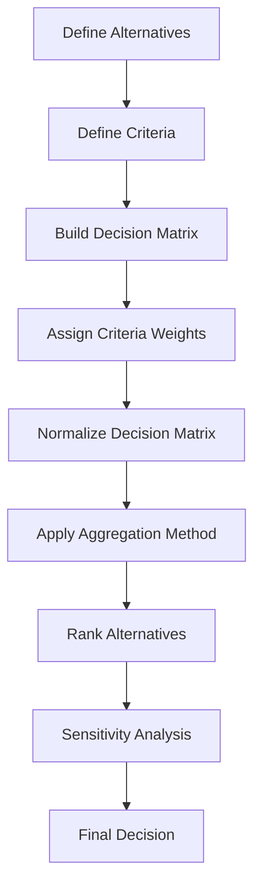

## Multi-Criteria Decision Making

### Definition

Multi-Criteria Decision Making (MCDM) is a branch of decision analysis concerned with evaluating and selecting among alternatives when the decision must satisfy multiple, often conflicting, criteria simultaneously. Rather than optimizing a single objective, MCDM provides structured methods to aggregate performance across criteria such as cost, quality, risk, time, and sustainability into a coherent ranking or selection of alternatives.

In modelling and simulation, MCDM techniques are used whenever a simulated or modeled system must be evaluated against several competing performance measures rather than one, and where trade-offs between those measures must be made explicit and defensible.

### Why Single-Criterion Optimization Falls Short

Most real-world decisions cannot be reduced to a single number. A facility location decision, for example, might need to balance:

- Construction cost
- Distance to suppliers
- Environmental impact
- Local labor availability
- Regulatory risk

Optimizing on cost alone might select a site with poor labor access; optimizing on labor access alone might select an environmentally risky site. MCDM formalizes the process of weighing these criteria together rather than arbitrarily picking one to dominate the decision, or relying on unstructured judgment.

### Core Components of an MCDM Problem

- **Alternatives** ($A_1, A_2, \ldots, A_m$) — the set of options being compared.
- **Criteria** ($C_1, C_2, \ldots, C_n$) — the dimensions along which alternatives are evaluated.
- **Decision matrix** — an $m \times n$ matrix where each entry $x_{ij}$ represents the performance of alternative $i$ on criterion $j$.
- **Weights** ($w_1, w_2, \ldots, w_n$) — the relative importance assigned to each criterion, typically normalized so $\sum w_j = 1$.
- **Aggregation rule** — the mathematical method used to combine weighted criteria performance into an overall score or ranking.

The general decision matrix is represented as:

$$D =
\begin{bmatrix}
x_{11} & x_{12} & \cdots & x_{1n} \\
x_{21} & x_{22} & \cdots & x_{2n} \\
\vdots & \vdots & \ddots & \vdots \\
x_{m1} & x_{m2} & \cdots & x_{mn}
\end{bmatrix}$$

### Classification of MCDM Criteria

- **Benefit criteria** — higher values are preferred (e.g., quality, reliability, revenue).
- **Cost criteria** — lower values are preferred (e.g., price, risk, delay).

Criteria must be identified as benefit or cost type before normalization, since the direction of "better" affects how raw values are transformed into comparable scores.

### General MCDM Workflow

### Normalization Techniques

Because criteria are often measured in different units (dollars, kilometers, percentages), the decision matrix must be normalized before aggregation. Common approaches:

- **Linear (max) normalization** for benefit criteria:

$$r_{ij} = \frac{x_{ij}}{\max_i(x_{ij})}$$

- **Linear (min) normalization** for cost criteria:

$$r_{ij} = \frac{\min_i(x_{ij})}{x_{ij}}$$

- **Vector normalization**:

$$r_{ij} = \frac{x_{ij}}{\sqrt{\sum_{i=1}^{m} x_{ij}^2}}$$

[Inference] Different normalization methods can produce different final rankings for the same raw data; this is a documented sensitivity issue in MCDM methodology rather than a flaw unique to any single technique.

### Weighted Sum Model (WSM)

The simplest and most widely used MCDM aggregation method. The overall score for alternative $i$ is:

$$S_i = \sum_{j=1}^{n} w_j \cdot r_{ij}$$

The alternative with the highest $S_i$ is selected.

**Example**

Three suppliers are evaluated on cost (weight 0.5), quality (weight 0.3), and delivery time (weight 0.2), with normalized scores:

| Supplier | Cost (r) | Quality (r) | Delivery (r) |
| --- | --- | --- | --- |
| A | 0.90 | 0.70 | 0.60 |
| B | 0.70 | 0.95 | 0.80 |
| C | 0.85 | 0.80 | 0.75 |

$$S_A = 0.5(0.90) + 0.3(0.70) + 0.2(0.60) = 0.45 + 0.21 + 0.12 = 0.78$$

$$S_B = 0.5(0.70) + 0.3(0.95) + 0.2(0.80) = 0.35 + 0.285 + 0.16 = 0.795$$

$$S_C = 0.5(0.85) + 0.3(0.80) + 0.2(0.75) = 0.425 + 0.24 + 0.15 = 0.815$$

Supplier C has the highest weighted score and would be selected under WSM.

### Weighted Product Model (WPM)

An alternative to WSM that uses multiplication instead of addition, which avoids some scaling issues inherent to WSM when criteria have very different units:

$$S_i = \prod_{j=1}^{n} (r_{ij})^{w_j}$$

Alternatives are compared using ratios:

$$\frac{S_i}{S_k} = \prod_{j=1}^{n} \left(\frac{r_{ij}}{r_{kj}}\right)^{w_j}$$

If this ratio exceeds 1, alternative $i$ is preferred over alternative $k$.

### Analytic Hierarchy Process (AHP)

AHP, developed by Thomas Saaty, structures a decision into a hierarchy (goal, criteria, sub-criteria, alternatives) and derives weights through **pairwise comparisons** rather than direct weight assignment.

**Key Points**

- Decision makers compare criteria two at a time using a standardized 1–9 preference scale (1 = equal importance, 9 = extreme importance of one over the other).
- Comparisons are organized into a pairwise comparison matrix, from which relative weights are derived (commonly via the eigenvector method).
- A **Consistency Ratio (CR)** is computed to check whether the pairwise judgments are logically coherent; a CR below 0.10 is conventionally considered acceptable.

The pairwise comparison matrix has the property:

$$a_{ij} = \frac{1}{a_{ji}}, \quad a_{ii} = 1$$

**Example**

Comparing three criteria — cost, quality, delivery — a decision maker might state that quality is moderately more important than cost (value 3), and cost is slightly more important than delivery (value 2), producing:

$$A =
\begin{bmatrix}
1 & 1/3 & 2 \\
3 & 1 & 4 \\
1/2 & 1/4 & 1
\end{bmatrix}$$

Normalizing the principal eigenvector of this matrix yields the derived weights for cost, quality, and delivery respectively.

### TOPSIS (Technique for Order Preference by Similarity to Ideal Solution)

TOPSIS ranks alternatives based on their geometric distance from an ideal best solution and an ideal worst solution. The alternative closest to the ideal best and farthest from the ideal worst is ranked highest.

**Steps**

1. Normalize the decision matrix (typically via vector normalization).
2. Multiply by criteria weights to get the weighted normalized matrix $v_{ij} = w_j \cdot r_{ij}$.
3. Determine the **ideal best** ($A^+$) and **ideal worst** ($A^-$) solutions:

$$A^+ = \{(\max_i v_{ij} \mid j \in \text{benefit}), (\min_i v_{ij} \mid j \in \text{cost})\}$$

$$A^- = \{(\min_i v_{ij} \mid j \in \text{benefit}), (\max_i v_{ij} \mid j \in \text{cost})\}$$

4. Compute Euclidean distance of each alternative from both ideals:

$$D_i^+ = \sqrt{\sum_{j=1}^{n} (v_{ij} - v_j^+)^2}, \qquad D_i^- = \sqrt{\sum_{j=1}^{n} (v_{ij} - v_j^-)^2}$$

5. Compute the **relative closeness coefficient**:

$$C_i = \frac{D_i^-}{D_i^+ + D_i^-}$$

6. Rank alternatives by descending $C_i$ (closer to 1 is better).

### Diagram: TOPSIS Geometric Concept

<svg xmlns="http://www.w3.org/2000/svg" viewBox="0 0 640 440" font-family="Arial, sans-serif">
<text x="320" y="30" text-anchor="middle" font-size="18" font-weight="bold">TOPSIS Distance from Ideal Solutions (svg_diagram)</text>

<line x1="80" y1="380" x2="580" y2="380" stroke="black" stroke-width="2" />
<line x1="80" y1="380" x2="80" y2="70" stroke="black" stroke-width="2" />
<text x="330" y="415" text-anchor="middle" font-size="14">Criterion 1 (weighted)</text>
<text x="35" y="230" text-anchor="middle" font-size="14" transform="rotate(-90 35 230)">Criterion 2 (weighted)</text>

<circle cx="540" cy="110" r="8" fill="#2ca02c" />
<text x="480" y="100" font-size="13" fill="#2ca02c" font-weight="bold">Ideal Best (A+)</text>

<circle cx="120" cy="350" r="8" fill="#d62728" />
<text x="130" y="370" font-size="13" fill="#d62728" font-weight="bold">Ideal Worst (A−)</text>

<circle cx="300" cy="220" r="7" fill="#1f77b4" />
<text x="310" y="215" font-size="12" fill="#1f77b4">Alt A</text>
<line x1="300" y1="220" x2="540" y2="110" stroke="#2ca02c" stroke-width="1.5" stroke-dasharray="4,3" />
<line x1="300" y1="220" x2="120" y2="350" stroke="#d62728" stroke-width="1.5" stroke-dasharray="4,3" />
<circle cx="420" cy="180" r="7" fill="#9467bd" />
<text x="430" y="175" font-size="12" fill="#9467bd">Alt B</text>
<line x1="420" y1="180" x2="540" y2="110" stroke="#2ca02c" stroke-width="1.5" stroke-dasharray="4,3" />
<line x1="420" y1="180" x2="120" y2="350" stroke="#d62728" stroke-width="1.5" stroke-dasharray="4,3" />
<circle cx="200" cy="290" r="7" fill="#ff7f0e" />
<text x="205" y="310" font-size="12" fill="#ff7f0e">Alt C</text>
<line x1="200" y1="290" x2="540" y2="110" stroke="#2ca02c" stroke-width="1.5" stroke-dasharray="4,3" />
<line x1="200" y1="290" x2="120" y2="350" stroke="#d62728" stroke-width="1.5" stroke-dasharray="4,3" />
</svg>

### ELECTRE (Elimination Et Choix Traduisant la Réalité)

ELECTRE is an outranking method that determines whether one alternative sufficiently outranks another based on **concordance** (the degree to which criteria support a preference) and **discordance** (the degree to which criteria oppose it), rather than aggregating into a single score.

**Key Points**

- Useful when compensatory aggregation (allowing a poor score on one criterion to be offset by a good score on another) is not appropriate for the decision context.
- Produces partial rankings; some alternatives may remain incomparable rather than strictly ordered.
- Multiple versions exist (ELECTRE I, II, III, IV), each suited to different decision goals (choice, ranking, sorting).

### PROMETHEE (Preference Ranking Organization Method for Enrichment of Evaluations)

PROMETHEE builds pairwise preference functions between alternatives for each criterion, then aggregates these into outranking flows:

- **Positive (leaving) flow** $\phi^+$ — how much an alternative outranks all others.
- **Negative (entering) flow** $\phi^-$ — how much an alternative is outranked by all others.
- **Net flow** $\phi = \phi^+ - \phi^-$, used for a complete ranking (PROMETHEE II).

### Compensatory vs. Non-Compensatory Methods

| Method Type | Examples | Characteristic |
| --- | --- | --- |
| Compensatory | WSM, WPM, TOPSIS, AHP | A weak score on one criterion can be offset by a strong score on another |
| Non-compensatory / Outranking | ELECTRE, PROMETHEE | Poor performance on a critical criterion may not be offset regardless of strength elsewhere |

Choosing between compensatory and non-compensatory methods depends on whether trade-offs between criteria are ethically or practically acceptable in the decision context (e.g., safety criteria in engineering decisions are often treated as non-compensatory thresholds rather than tradeable scores).

### Sensitivity Analysis in MCDM

Because criteria weights are often subjectively assigned, MCDM results should be tested for robustness:

- Vary individual weights within a plausible range and observe whether the ranking of top alternatives changes.
- Identify **critical weight thresholds** — the point at which a small weight change flips the ranking.
- Report ranking stability alongside the final recommendation rather than presenting a single deterministic ranking as absolute.

[Unverified] The degree of ranking instability under weight perturbation is problem-specific; some decision matrices produce robust rankings across a wide weight range, while others are highly sensitive, and this cannot be assumed without direct sensitivity testing on the specific dataset.

### Applications in Modelling and Simulation

- **Simulation-based facility and network design** — evaluating simulated layouts or network configurations against cost, throughput, and resilience criteria simultaneously.
- **Supplier and vendor selection models** — combining simulated cost distributions with quality and reliability scores.
- **Environmental and sustainability impact modelling** — balancing simulated emissions, cost, and social impact metrics.
- **Simulation optimization under multiple objectives** — MCDM ranking methods are often applied downstream of Pareto-front generation in multi-objective simulation optimization to select a single implementable solution from a non-dominated set.

### Relationship to Multi-Attribute Utility Theory

MCDM and Multi-Attribute Utility Theory (MAUT) overlap substantially; MAUT can be viewed as a compensatory MCDM method grounded explicitly in expected utility axioms, whereas general MCDM methods (AHP, TOPSIS, ELECTRE) do not necessarily require the same axiomatic utility foundation and instead rely on their own respective mathematical constructions for ranking or scoring.

### Limitations

- Weight assignment remains partly subjective even in structured methods like AHP, since pairwise comparison values still originate from expert or stakeholder judgment.
- Different MCDM methods can produce different rankings for identical input data, a phenomenon documented in comparative MCDM literature.
- Non-compensatory methods (ELECTRE, PROMETHEE) can produce incomplete rankings, which complicates decisions requiring a single clear choice.
- Normalization method choice can itself influence outcomes, adding another layer of methodological sensitivity.

### Conclusion

Multi-Criteria Decision Making provides a structured toolkit for resolving decisions that cannot be reduced to a single objective, ranging from simple weighted-sum scoring to sophisticated outranking methods like ELECTRE and PROMETHEE. In modelling and simulation contexts, MCDM serves as the critical bridge between generating multiple simulated or modeled alternatives and selecting a single, defensible course of action, particularly when trade-offs across cost, risk, quality, and other competing priorities must be made transparent and reproducible.

**Related Topics**

- Analytic Hierarchy Process (AHP) — Detailed Pairwise Comparison and Eigenvector Method
- TOPSIS — Full Worked Numerical Example
- Pareto Optimality and Multi-Objective Simulation Optimization
- ELECTRE and PROMETHEE — Outranking Method Comparison
- Sensitivity Analysis Techniques for Criteria Weights
- Group Decision Making and Weight Aggregation in MCDM
- Fuzzy MCDM Methods for Handling Imprecise Criteria Data