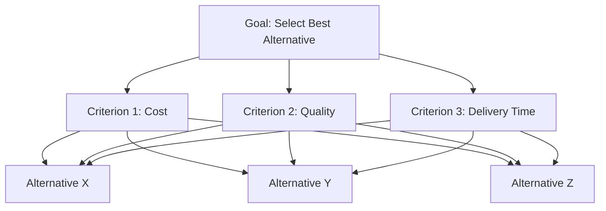

## Analytic Hierarchy Process

### Definition

The Analytic Hierarchy Process (AHP) is a structured multi-criteria decision-making method developed by Thomas Saaty in the 1970s. It decomposes a complex decision into a hierarchy of a goal, criteria (and optionally sub-criteria), and alternatives, then uses systematic pairwise comparisons to derive relative priority weights at each level of the hierarchy. These weights are synthesized to produce an overall ranking of alternatives.

AHP is distinguished from other MCDM methods by its reliance on pairwise comparison rather than direct numerical weight assignment, and by its built-in mechanism for checking the logical consistency of a decision maker's judgments.

### Purpose and Rationale

Direct weight assignment (e.g., "cost is 40% important, quality is 35%, delivery is 25%") is cognitively difficult for decision makers, especially across many criteria, and is prone to arbitrary or unstable results. AHP addresses this by asking simpler, more intuitive questions: "Comparing just cost and quality, which is more important, and by how much?" These pairwise judgments are then mathematically converted into a consistent set of weights.

### The Hierarchical Structure

AHP organizes a decision problem into three (or more) levels:

- **Level 1: Goal** — the overall objective of the decision (e.g., "select the best supplier").
- **Level 2: Criteria** (and sub-criteria, if needed) — the factors relevant to achieving the goal.
- **Level 3: Alternatives** — the options being evaluated against each criterion.

### The Saaty 1–9 Fundamental Scale

Pairwise comparisons are made using a standardized verbal-to-numerical scale:

| Intensity | Definition | Explanation |
| --- | --- | --- |
| 1 | Equal importance | Two elements contribute equally |
| 3 | Moderate importance | Experience/judgment slightly favors one element |
| 5 | Strong importance | Experience/judgment strongly favors one element |
| 7 | Very strong importance | One element is favored very strongly; dominance demonstrated in practice |
| 9 | Extreme importance | Evidence favoring one element is as strong as possible |
| 2, 4, 6, 8 | Intermediate values | Used for compromise between two adjacent judgments |

Reciprocal values (1/3, 1/5, 1/7, 1/9, etc.) are used when the comparison favors the second element over the first.

### Step 1: Constructing the Pairwise Comparison Matrix

For $n$ criteria, decision makers construct an $n \times n$ matrix $A$ where element $a_{ij}$ represents how much more important criterion $i$ is than criterion $j$:

$$A =
\begin{bmatrix}
1 & a_{12} & \cdots & a_{1n} \\
1/a_{12} & 1 & \cdots & a_{2n} \\
\vdots & \vdots & \ddots & \vdots \\
1/a_{1n} & 1/a_{2n} & \cdots & 1
\end{bmatrix}$$

The matrix satisfies the reciprocal property $a_{ji} = 1/a_{ij}$ and $a_{ii} = 1$ for all diagonal elements.

**Example**

For three criteria — Cost, Quality, Delivery — a decision maker judges Quality moderately more important than Cost (3), and Cost slightly more important than Delivery (2), giving:

$$A =
\begin{bmatrix}
1 & 1/3 & 2 \\
3 & 1 & 4 \\
1/2 & 1/4 & 1
\end{bmatrix}$$

### Step 2: Deriving Priority Weights

The relative weights (priorities) of the criteria are derived from the **principal eigenvector** of matrix $A$. An approximate and commonly taught method is the **normalization method**:

1. Sum each column of the matrix.
2. Divide each element by its column sum to normalize the matrix.
3. Average each row of the normalized matrix to obtain the priority weight for that criterion.

**Example (continued)**

Column sums: Cost column = $1 + 3 + 0.5 = 4.5; Quality column = $1/3 + 1 + 1/4 = 1.583
; Delivery column = $2 + 4 + 1 = 7$.

Normalized matrix:

$$A_{norm} =
\begin{bmatrix}
0.222 & 0.211 & 0.286 \\
0.667 & 0.632 & 0.571 \\
0.111 & 0.158 & 0.143
\end{bmatrix}$$

Row averages (priority weights):

$$w_{Cost} = \frac{0.222+0.211+0.286}{3} = 0.240$$

$$w_{Quality} = \frac{0.667+0.632+0.571}{3} = 0.623$$

$$w_{Delivery} = \frac{0.111+0.158+0.143}{3} = 0.137$$

These weights sum to 1.0 and represent the relative importance of Cost, Quality, and Delivery respectively.

[Inference] The row-average normalization method is commonly taught as a close approximation to the exact principal eigenvector solution; for matrices with meaningful inconsistency, the exact eigenvector calculation and the normalization approximation can diverge slightly, though both are standard in AHP practice.

### Step 3: Checking Consistency

Because pairwise judgments are subjective, they may not be perfectly logically consistent (e.g., if Quality is judged 3x more important than Cost, and Cost is judged 2x more important than Delivery, perfect consistency would require Quality to be judged exactly 6x more important than Delivery — but a human decision maker might state a different value). AHP provides a formal consistency check.

**Consistency Index (CI)**

$$CI = \frac{\lambda_{max} - n}{n - 1}$$

Where $\lambda_{max}$ is the principal eigenvalue of the comparison matrix and $n$ is the matrix size.

**Consistency Ratio (CR)**

$$CR = \frac{CI}{RI}$$

Where $RI$ is the **Random Index**, a benchmark average CI value derived from randomly generated reciprocal matrices of the same size:

| n | 1 | 2 | 3 | 4 | 5 | 6 | 7 | 8 | 9 | 10 |
| --- | --- | --- | --- | --- | --- | --- | --- | --- | --- | --- |
| RI | 0.00 | 0.00 | 0.58 | 0.90 | 1.12 | 1.24 | 1.32 | 1.41 | 1.45 | 1.49 |

**Key Points**

- A **CR ≤ 0.10** is conventionally considered acceptable, indicating judgments are reasonably consistent.
- A **CR > 0.10** indicates the decision maker's pairwise judgments should be revisited and revised.
- [Unverified] The 0.10 threshold is a widely adopted convention in AHP practice originating from Saaty's own work; whether it is strictly appropriate can vary depending on the criticality of the decision and the number of criteria involved.

**Example (continued)**

Computing $\lambda_{max}$ for the 3×3 matrix above (via matrix multiplication $Aw$ and comparing to $w$) yields an estimated $\lambda_{max} \approx 3.05$.

$$CI = \frac{3.05 - 3}{3 - 1} = \frac{0.05}{2} = 0.025$$

$$CR = \frac{0.025}{0.58} = 0.043$$

Since $CR = 0.043 < 0.10$, the judgments are considered acceptably consistent.

### Step 4: Evaluating Alternatives Against Each Criterion

The same pairwise comparison process (Steps 1–3) is repeated for the alternatives, but separately under each criterion. For example, the three alternatives (Supplier X, Y, Z) would be pairwise-compared once for Cost, once for Quality, and once for Delivery — producing three separate local priority vectors.

### Step 5: Synthesizing Global Priorities

The overall (global) priority score for each alternative is computed by weighting its local priority under each criterion by that criterion's overall weight, then summing:

$$P_k = \sum_{j=1}^{n} w_j \cdot L_{kj}$$

Where $P_k$ is the global priority of alternative $k$, $w_j$ is the weight of criterion $j$, and $L_{kj}$ is the local priority of alternative $k$ under criterion $j$.

**Example**

Suppose local priorities for Supplier X are: Cost = 0.50, Quality = 0.30, Delivery = 0.20. Using the criteria weights derived earlier ($w_{Cost}=0.240$, $w_{Quality}=0.623$, $w_{Delivery}=0.137$):

$$P_X = 0.240(0.50) + 0.623(0.30) + 0.137(0.20) = 0.120 + 0.187 + 0.027 = 0.334$$

This process is repeated for each alternative, and the alternative with the highest global priority score is the recommended choice.

### Diagram: AHP Synthesis Flow

<svg xmlns="http://www.w3.org/2000/svg" viewBox="0 0 640 460" font-family="Arial, sans-serif">
<text x="320" y="30" text-anchor="middle" font-size="18" font-weight="bold">AHP Weight Synthesis (svg_diagram)</text>

<rect x="40" y="70" width="160" height="40" rx="6" fill="#e8f0fe" stroke="#1f77b4" stroke-width="1.5" />
<text x="120" y="95" text-anchor="middle" font-size="13">Cost, w=0.240</text>
<rect x="240" y="70" width="160" height="40" rx="6" fill="#e8f0fe" stroke="#1f77b4" stroke-width="1.5" />
<text x="320" y="95" text-anchor="middle" font-size="13">Quality, w=0.623</text>
<rect x="440" y="70" width="160" height="40" rx="6" fill="#e8f0fe" stroke="#1f77b4" stroke-width="1.5" />
<text x="520" y="95" text-anchor="middle" font-size="13">Delivery, w=0.137</text>

<rect x="40" y="170" width="160" height="40" rx="6" fill="#fef3e8" stroke="#ff7f0e" stroke-width="1.5" />
<text x="120" y="195" text-anchor="middle" font-size="13">L(X,Cost)=0.50</text>
<rect x="240" y="170" width="160" height="40" rx="6" fill="#fef3e8" stroke="#ff7f0e" stroke-width="1.5" />
<text x="320" y="195" text-anchor="middle" font-size="13">L(X,Quality)=0.30</text>
<rect x="440" y="170" width="160" height="40" rx="6" fill="#fef3e8" stroke="#ff7f0e" stroke-width="1.5" />
<text x="520" y="195" text-anchor="middle" font-size="13">L(X,Delivery)=0.20</text>

<line x1="120" y1="110" x2="120" y2="170" stroke="black" stroke-width="1.5" />
<line x1="320" y1="110" x2="320" y2="170" stroke="black" stroke-width="1.5" />
<line x1="520" y1="110" x2="520" y2="170" stroke="black" stroke-width="1.5" />
<line x1="120" y1="210" x2="320" y2="300" stroke="black" stroke-width="1.5" />
<line x1="320" y1="210" x2="320" y2="300" stroke="black" stroke-width="1.5" />
<line x1="520" y1="210" x2="320" y2="300" stroke="black" stroke-width="1.5" />

<rect x="200" y="300" width="240" height="60" rx="8" fill="#e6f4ea" stroke="#2ca02c" stroke-width="2" />
<text x="320" y="325" text-anchor="middle" font-size="13" font-weight="bold">Global Priority P(X)</text>
<text x="320" y="345" text-anchor="middle" font-size="13">= 0.240(0.50)+0.623(0.30)+0.137(0.20)</text>

<text x="320" y="400" text-anchor="middle" font-size="14" font-weight="bold">P(X) = 0.334</text>

</svg>

### Handling Multiple Decision Makers (Group AHP)

When several stakeholders contribute judgments, individual pairwise comparison matrices can be aggregated using the **geometric mean** method before proceeding with the standard AHP calculation:

$$a_{ij}^{group} = \left( \prod_{k=1}^{m} a_{ij}^{(k)} \right)^{1/m}$$

Where $m$ is the number of decision makers. The geometric mean is used (rather than the arithmetic mean) because it preserves the reciprocal property of the aggregated matrix.

### AHP with Sub-Criteria

For more complex decisions, criteria can be broken into sub-criteria, each pairwise-compared within its parent criterion. The overall weight of a sub-criterion is the product of its local weight (within its parent) and its parent criterion's global weight:

$$w_{sub}^{global} = w_{sub}^{local} \times w_{parent}^{global}$$

This allows AHP hierarchies to extend to several levels of depth while maintaining a consistent weighting logic throughout.

### Strengths of AHP

- Breaks down complex decisions into manageable pairwise comparisons rather than requiring simultaneous evaluation of many criteria at once.
- Provides an explicit, quantitative consistency check (CR) that other MCDM methods generally lack.
- Applicable to both tangible (quantifiable) and intangible (qualitative, judgment-based) criteria.
- Produces a fully ranked, compensatory scoring of alternatives suitable for direct decision-making.

### Limitations

- The number of required pairwise comparisons grows quadratically with the number of criteria/alternatives ($n(n-1)/2$ comparisons for $n$ elements), which can become burdensome for large problems.
- Judgments remain fundamentally subjective; AHP structures and checks consistency but does not eliminate the influence of the decision maker's biases or framing.
- **Rank reversal** — [Unverified] the phenomenon where adding or removing a seemingly irrelevant alternative can change the relative ranking of existing alternatives — has been documented as a criticism of the standard AHP method in decision science literature, and remains a debated topic; some AHP variants (e.g., the "ideal mode" formulation) have been proposed specifically to address it.
- The 1–9 verbal-to-numerical scale, while intuitive, imposes a particular mathematical structure on human judgment that may not perfectly reflect true underlying preference intensities.

### Applications in Modelling and Simulation

- **Simulation model validation and selection** — ranking competing simulation models or configurations against criteria such as accuracy, computational cost, and interpretability.
- **Scenario ranking in system dynamics models** — prioritizing simulated policy scenarios across multiple stakeholder-relevant criteria.
- **Facility and process design** — selecting among simulated layout or process alternatives using weighted engineering, cost, and safety criteria.
- **Risk assessment modelling** — structuring qualitative and quantitative risk factors into a hierarchy for comparative risk ranking.

### Relationship to Other MCDM Methods

AHP is often used specifically to **derive criteria weights**, which can then feed into other MCDM aggregation methods such as TOPSIS or the Weighted Sum Model, combining AHP's structured weight-elicitation strength with another method's alternative-ranking mechanics. This hybrid approach (e.g., "AHP-TOPSIS") is common in applied decision modelling.

### Conclusion

The Analytic Hierarchy Process offers a rigorous, psychologically intuitive method for deriving decision weights through pairwise comparison, paired with a built-in consistency check that distinguishes it from most other multi-criteria techniques. Its hierarchical structure, capacity to handle both quantitative and qualitative criteria, and compatibility with other MCDM methods make it a foundational tool wherever modelling and simulation outputs must be evaluated against multiple, weighted decision criteria.

**Related Topics**

- Eigenvector Method vs. Normalization Approximation for AHP Weight Derivation
- Rank Reversal in AHP and the Ideal Mode Alternative
- Group AHP and Geometric Mean Aggregation Techniques
- AHP-TOPSIS Hybrid Decision Models
- Fuzzy AHP for Handling Imprecise Pairwise Judgments
- Analytic Network Process (ANP) as an Extension of AHP
- Consistency Index Derivation and the Random Index Table