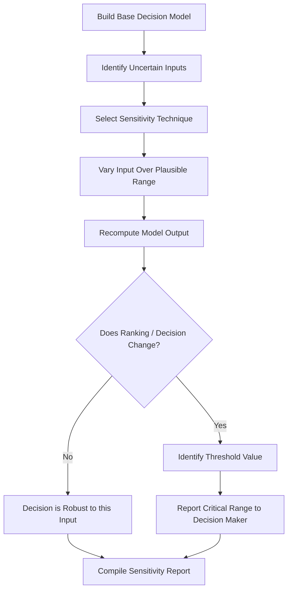

## Sensitivity Analysis in Decision Models

### Definition

Sensitivity analysis is the systematic study of how changes in a decision model's inputs — probabilities, payoffs, weights, or parameter values — affect its outputs, particularly the ranking of decision alternatives or the recommended course of action. It answers the question: "How much can an input change before the optimal decision changes?"

In modelling and simulation, sensitivity analysis serves as a validation and robustness-checking step, applied after a decision model (whether a decision tree, utility model, or MCDM ranking) produces an initial recommendation, to determine how confidently that recommendation can be trusted given uncertainty in the underlying estimates.

### Why Sensitivity Analysis Matters

Decision models rely on inputs that are frequently estimates, forecasts, or subjective judgments rather than precisely known quantities — probabilities of future events, cost projections, or stakeholder-assigned weights. A decision recommendation based on a single point estimate of each input can be misleading if:

- Small, plausible changes in an input would reverse the recommended decision.
- The decision maker has genuine uncertainty about the "true" value of an input.
- Stakeholders disagree about input values and need to understand the practical impact of that disagreement.

Sensitivity analysis converts a single deterministic recommendation into a more defensible statement about how robust that recommendation is.

### General Workflow

### Types of Sensitivity Analysis

- **One-way (single-parameter) sensitivity analysis** — Varies one input at a time while holding all others constant, observing the effect on the output.
- **Two-way sensitivity analysis** — Varies two inputs simultaneously, useful for exploring interaction effects between them.
- **Multi-way (n-way) sensitivity analysis** — Varies several inputs simultaneously, often used with simulation techniques (e.g., Monte Carlo methods) rather than manual enumeration due to the combinatorial number of scenarios.
- **Probabilistic sensitivity analysis** — Assigns probability distributions to uncertain inputs and propagates that uncertainty through the model (typically via simulation) to produce a distribution of possible outputs rather than a single point estimate.

### One-Way Sensitivity Analysis

The simplest and most commonly applied form. A single parameter — for example, the probability of a favorable market condition in a decision tree — is varied across its plausible range, and the resulting expected value (or expected utility) of each alternative is recalculated at each point.

**Example**

Consider a decision tree comparing two investment options:

- **Option A**: Guaranteed return of $50,000.
- **Option B**: A risky venture with probability $p$ of a $150,000 payoff and probability $(1-p)$ of a $0 payoff.

The expected value of Option B is:

$$EV_B(p) = 150{,}000p$$

Setting $EV_B(p) = EV_A = 50{,}000$ and solving for $p$:

$$150{,}000p = 50{,}000 \implies p = \frac{1}{3} \approx 0.333$$

This means that if the decision maker's estimated probability of success $p$ exceeds 0.333, Option B becomes preferable; below that threshold, Option A remains the better choice. This threshold value is the **crossover point** or **breakeven point**.

### Tornado Diagrams

A **tornado diagram** is a standard visual tool for one-way sensitivity analysis across multiple input variables. Each variable is varied individually across its plausible range (commonly its low and high estimates), and the resulting swing in the output (e.g., expected value or net present value) is plotted as a horizontal bar. Variables are ordered from the largest output swing (top) to the smallest (bottom), producing a characteristic tapering shape.

**Key Points**

- Variables with the widest bars have the greatest influence on the decision output and warrant the most attention or further data-gathering effort.
- Variables with narrow bars can often be fixed at their best-estimate value without materially affecting the decision.
- Tornado diagrams are typically constructed after computing the base-case output, then independently re-running the model with each variable set to its low and high bound while others remain at base-case values.

### Diagram: Tornado Diagram Example

<svg xmlns="http://www.w3.org/2000/svg" viewBox="0 0 640 400" font-family="Arial, sans-serif">
<text x="320" y="30" text-anchor="middle" font-size="18" font-weight="bold">Tornado Diagram — Sensitivity by Variable (svg_diagram)</text>

<line x1="320" y1="60" x2="320" y2="360" stroke="black" stroke-width="1.5" stroke-dasharray="3,3" />
<text x="320" y="380" text-anchor="middle" font-size="12">Base Case Output</text>

<text x="60" y="90" font-size="13">Market Growth Rate</text>

<rect x="150" y="75" width="170" height="24" fill="`#1f77b4`" />

<rect x="320" y="75" width="200" height="24" fill="`#1f77b4`" />

<text x="60" y="150" font-size="13">Production Cost</text>

<rect x="200" y="135" width="120" height="24" fill="`#2ca02c`" />

<rect x="320" y="135" width="140" height="24" fill="`#2ca02c`" />

<text x="60" y="210" font-size="13">Competitor Response</text>

<rect x="240" y="195" width="80" height="24" fill="`#ff7f0e`" />

<rect x="320" y="195" width="90" height="24" fill="`#ff7f0e`" />

<text x="60" y="270" font-size="13">Regulatory Delay</text>

<rect x="280" y="255" width="40" height="24" fill="`#d62728`" />

<rect x="320" y="255" width="45" height="24" fill="`#d62728`" />

<text x="320" y="320" text-anchor="middle" font-size="12" font-style="italic">Bars widen toward the top: variables ordered by decreasing impact</text>

</svg>

### Two-Way Sensitivity Analysis

When two uncertain inputs interact, a two-way sensitivity analysis varies both simultaneously and identifies the combined region over which each alternative is preferred, often visualized as a two-dimensional plot with a **decision boundary line** separating regions favoring different alternatives.

**Example**

Extending the previous example, suppose both the probability of success $p$ and the high-payoff value $V$ (instead of a fixed $150,000) are uncertain. The breakeven condition becomes:

$$Vp = 50{,}000 \implies p = \frac{50{,}000}{V}$$

Plotting this as a curve on a $(V, p)$ plane divides the plane into a region where Option A is preferred (below the curve) and a region where Option B is preferred (above the curve).

### Spider Diagrams

A **spider diagram** (or spider plot) shows the effect of varying each input across a common percentage range (e.g., ±20% from base case) on the output, with all variables plotted on the same chart as separate lines radiating from the base-case point. Unlike a tornado diagram, which shows absolute swings ordered by magnitude, a spider diagram shows the functional shape (linear, convex, concave) of each variable's effect on the output.

### Probabilistic (Monte Carlo) Sensitivity Analysis

Rather than varying inputs one at a time, probabilistic sensitivity analysis assigns a probability distribution to each uncertain input (e.g., triangular, normal, uniform) and repeatedly samples from these distributions — typically thousands of times — recomputing the model output at each iteration. This produces:

- A **distribution of possible outcomes** for the decision output (e.g., expected value or utility), rather than a single number.
- Summary statistics such as mean, variance, and percentiles of the output distribution.
- The probability that a given alternative is optimal, computed as the fraction of simulation iterations in which it outperforms competing alternatives.

[Inference] Monte Carlo–based sensitivity analysis is widely used in simulation modelling specifically because it captures the combined effect of simultaneous uncertainty across many inputs, which one-way and two-way methods cannot fully represent; the computational cost of this approach is generally higher and scales with the number of iterations and model complexity.

### Sensitivity Analysis in Decision Trees

For decision trees specifically, sensitivity analysis is commonly applied to:

- **Branch probabilities** — testing how changes in the likelihood of chance events affect the expected value rollback.
- **Payoff values** — testing how changes in terminal node payoffs affect the optimal decision path.
- **Risk tolerance / utility function parameters** — when utility theory is incorporated, testing how changes in the assumed risk tolerance parameter (e.g., $R$ in an exponential utility function) affect which branch has the highest expected utility.

The decision tree is re-rolled-back at each varied input value, and the resulting optimal path is tracked to identify at what parameter value(s) the optimal path changes.

### Sensitivity Analysis in MCDM Methods

For methods such as AHP, WSM, or TOPSIS, sensitivity analysis typically focuses on:

- **Criteria weight sensitivity** — varying one or more criteria weights (while proportionally rescaling the others to maintain $\sum w_j = 1$) and observing whether the top-ranked alternative changes.
- **Critical weight identification** — determining the specific weight value at which a rank reversal occurs between the top two alternatives.
- **Pairwise judgment sensitivity (AHP-specific)** — testing how changes to individual pairwise comparison values affect derived weights and, subsequently, final alternative rankings.

**Example**

If a WSM-based supplier ranking shows Supplier C narrowly ahead of Supplier B (0.815 vs. 0.795, using the earlier weights of Cost=0.5, Quality=0.3, Delivery=0.2), a sensitivity analysis might reveal that increasing the Quality weight to just 0.35 (with Cost and Delivery rescaled proportionally) is sufficient to reverse the ranking in favor of Supplier B — indicating the recommendation is not highly robust to how "Quality" is weighted.

### Value of Information and Sensitivity Analysis

Sensitivity analysis often motivates a related question: is it worth acquiring more information to reduce uncertainty about a highly influential input? If a tornado diagram identifies a variable with a very wide swing, and the current decision could plausibly reverse depending on its true value, this signals high **value of information** for that variable — meaning additional research, expert consultation, or data collection to narrow its uncertainty may be economically justified before committing to a decision. This concept is formalized further in Expected Value of Perfect Information (EVPI) analysis.

### Reporting Sensitivity Results

**Key Points**

- Present the base-case recommendation alongside the range of conditions under which it remains optimal.
- Clearly state any threshold or breakeven values where the recommended alternative would change.
- Highlight the small number of inputs (often identified via tornado diagrams) that most strongly drive the outcome, directing decision-maker attention and further data-gathering effort toward those inputs specifically.
- Avoid presenting a single sensitivity result as a guarantee of real-world outcomes; sensitivity analysis characterizes model behavior under assumed input ranges, and actual future conditions may fall outside those assumed ranges.

### Limitations

- Sensitivity analysis is only as good as the assumed plausible ranges for each input; overly narrow or overly wide ranges can distort the perceived robustness of a decision.
- One-way and two-way methods do not capture interaction effects among more than two variables simultaneously; only multi-way or probabilistic methods do this.
- [Unverified] The choice of probability distribution shape in probabilistic sensitivity analysis (e.g., triangular vs. normal vs. uniform) can influence the resulting output distribution, and the appropriateness of a given distributional assumption is context-specific rather than universally correct.
- Sensitivity analysis identifies robustness within the model's structural assumptions; it does not validate whether the model's structure itself correctly represents the real-world decision problem.

### Applications in Modelling and Simulation

- **Simulation model calibration** — identifying which input parameters most strongly influence simulation outputs, prioritizing calibration and validation effort accordingly.
- **Risk and investment analysis** — testing how uncertain market, cost, or demand parameters affect the ranking of simulated investment or project alternatives.
- **Policy and scenario modelling** — testing how sensitive a recommended policy scenario is to uncertain assumptions such as adoption rates or external economic conditions.
- **Engineering design under uncertainty** — testing how design parameter uncertainty affects simulated performance metrics and design ranking decisions.

### Conclusion

Sensitivity analysis transforms a decision model's output from a single, potentially fragile recommendation into a well-characterized statement of robustness, explicitly identifying which uncertain inputs matter most and at what values a decision recommendation would change. Across decision trees, utility-based models, and MCDM ranking methods, it functions as an essential validation layer connecting modelled recommendations to the genuine uncertainty present in real-world decision-making.

**Related Topics**

- Expected Value of Perfect Information (EVPI) and Value of Information Analysis
- Monte Carlo Simulation Methods for Probabilistic Sensitivity Analysis
- Tornado Diagram Construction from Simulation Output Data
- Two-Way Sensitivity Analysis and Decision Boundary Mapping
- Rank Reversal and Critical Weight Analysis in MCDM
- Scenario Analysis vs. Sensitivity Analysis — Key Distinctions
- Probability Distribution Selection for Uncertain Model Inputs