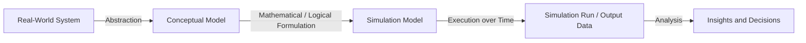
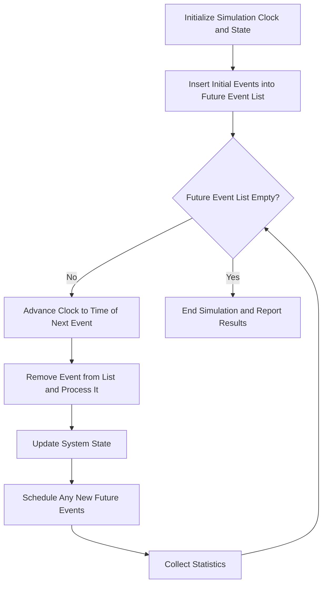

## Introduction to Computer Simulation Concepts

### Definition

Computer simulation is the use of a computer program to imitate the behavior of a real-world or hypothetical system over time, based on a mathematical or logical model of that system. It allows analysts to observe how a system behaves under different conditions, test scenarios that would be costly, dangerous, or impossible to test in reality, and generate quantitative data for decision-making without directly manipulating the real system.

Computer simulation forms the practical, executable counterpart to a conceptual model: while a model describes the structure and logic of a system mathematically, simulation actually runs that model, typically incorporating randomness, time progression, and complex interactions that are difficult to solve analytically.

### Why Simulation Is Used

Many real-world systems are too complex to analyze with closed-form mathematical solutions, due to:

- **Stochastic (random) behavior** — arrival times, service durations, failure events, and demand levels are often probabilistic rather than fixed.
- **Complex interactions** — multiple components interact in ways that produce emergent behavior not easily captured by a single equation.
- **Dynamic behavior over time** — system state changes continuously or at discrete points, and understanding transient (short-term) as well as steady-state (long-term) behavior often matters.
- **Cost, risk, or feasibility constraints** — testing a new factory layout, an epidemic intervention, or an aircraft evacuation procedure in reality is often impractical or dangerous.

Simulation provides a controlled, repeatable, and low-cost environment in which such systems can be studied.

### Systems, Models, and Simulations

**Key Points**

- A **system** is a collection of entities (people, machines, resources) that interact together toward some purpose, existing in the real world.
- A **model** is an abstraction or representation of a system, capturing the relevant relationships and behaviors while omitting unnecessary detail.
- A **simulation** is the execution of a model over time, typically using a computer, to observe and measure its behavior.

### Types of Systems

- **Discrete systems** — state changes occur only at specific points in time (e.g., a customer arriving at a bank, a machine breaking down).
- **Continuous systems** — state changes occur continuously over time, typically described by differential equations (e.g., fluid flow, temperature change, population growth).
- **Hybrid systems** — combine both discrete and continuous elements (e.g., a chemical process with continuous flow but discrete batch events).

### Classification of Simulation Models

| Dimension | Categories |
| --- | --- |
| Time handling | Static vs. Dynamic |
| State change nature | Discrete vs. Continuous |
| Randomness | Deterministic vs. Stochastic |

- **Static simulation models** — represent a system at a single point in time, without regard to time progression (e.g., a Monte Carlo simulation estimating a fixed quantity like an integral or a portfolio risk value).
- **Dynamic simulation models** — represent how a system evolves over time (e.g., a queueing system simulation tracking customer waiting times across a simulated day).
- **Deterministic models** — contain no random components; given the same inputs, the model always produces the same output.
- **Stochastic models** — incorporate randomness (via probability distributions), so different runs with the same inputs can produce different outputs; typically require multiple replications to characterize expected behavior.

### Discrete-Event Simulation (DES)

Discrete-Event Simulation is one of the most widely used simulation paradigms. The system state changes only at discrete points in time called **events** (e.g., customer arrival, service completion, machine failure), and nothing of interest happens between events — the simulation clock can therefore "jump" directly from one event to the next rather than advancing in small fixed increments.

**Key Points**

- **Entities** — objects that flow through the system (e.g., customers, parts, messages).
- **Attributes** — characteristics associated with a specific entity (e.g., a customer's arrival time or service requirement).
- **Events** — instantaneous occurrences that change system state (e.g., arrival, departure, start of service).
- **Event list (future event list)** — a time-ordered list of scheduled future events, which drives the simulation clock forward.
- **State variables** — values describing the system at a given point in time (e.g., number of customers in queue, server status).
- **Resources** — entities that provide service and may be limited in number (e.g., tellers, machines, servers).

### The Event-Scheduling Mechanism

This is known as the **next-event time advance** mechanism, distinguishing DES from fixed-increment time advance approaches used in some continuous simulations.

### Continuous Simulation

In continuous simulation, state variables change continuously with time and are typically represented by differential or difference equations. The simulation clock advances in small, often fixed, time steps ($\Delta t$), and state variables are updated at each step using numerical integration techniques.

$$\frac{dx}{dt} = f(x, t)$$

Common numerical methods for solving such equations within a simulation include Euler's method and Runge-Kutta methods. [Inference] Smaller time steps generally produce more accurate approximations of the true continuous behavior at the cost of increased computation time; the appropriate step size is a standard trade-off decision in numerical simulation practice.

### Monte Carlo Simulation

Monte Carlo simulation is a technique that uses repeated random sampling to estimate numerical results, most commonly for static (time-independent) problems, though the term is sometimes used loosely to describe the random-sampling component within dynamic simulations as well.

**Key Points**

- Random values are drawn from specified probability distributions for each uncertain input.
- The model is evaluated using these sampled values, and the output is recorded.
- This process is repeated many times (often thousands or more), and the resulting collection of outputs approximates the full output distribution.
- Commonly used for risk analysis, financial modelling, integral estimation, and reliability analysis.

**Example**

Estimating the value of $\pi$ via Monte Carlo simulation: randomly generate points within a unit square, count the fraction that fall within an inscribed quarter circle, and use the ratio of areas:

$$\pi \approx 4 \times \frac{\text{points inside circle}}{\text{total points}}$$

As the number of random points increases, this estimate converges toward the true value of $\pi$, illustrating the general principle that Monte Carlo estimates improve in precision (though not certainty) with a larger number of samples.

### Random Number Generation

Simulations rely on **pseudo-random number generators (PRNGs)** — deterministic algorithms that produce sequences of numbers that approximate the statistical properties of true randomness. These uniform random numbers (typically between 0 and 1) are then transformed into samples from other distributions (exponential, normal, triangular, etc.) using techniques such as the **inverse transform method**.

$$U \sim \text{Uniform}(0,1) \implies X = F^{-1}(U)$$

Where $F^{-1}$ is the inverse of the desired distribution's cumulative distribution function.

[Inference] Because PRNGs are deterministic algorithms, they require a **seed value** to initialize; using the same seed reproduces the identical sequence of "random" numbers, which is standard practice for enabling repeatable simulation experiments and controlled comparison between scenarios.

### Model Verification and Validation

Two distinct quality-assurance concepts are essential in simulation modelling:

- **Verification** — "Is the model built correctly?" Confirms that the simulation program accurately implements the intended conceptual model, free of programming errors or logical bugs.
- **Validation** — "Is the correct model built?" Confirms that the simulation model adequately represents the real-world system it is intended to represent, typically checked against historical data, expert judgment, or known system behavior.

| Aspect | Verification | Validation |
| --- | --- | --- |
| Question answered | Does the model work as designed? | Does the model represent reality? |
| Compared against | Conceptual model / specification | Real-world system / historical data |
| Common techniques | Code review, debugging, trace analysis | Statistical comparison, expert review, sensitivity checks |

### Simulation Run Considerations

- **Warm-up period** — the initial period of a simulation run during which the system has not yet reached representative (steady-state) behavior; data collected during this period is often excluded from final statistics to avoid bias, particularly in steady-state simulation studies.
- **Replications** — because stochastic simulations produce different results each run (due to randomness), multiple independent replications (using different random number streams) are typically performed to estimate the variability and confidence interval of output measures.
- **Run length** — the total simulated time or number of events for a single run, which must be long enough to capture the behavior of interest (e.g., an entire business day, a full production cycle, or a specified number of customer arrivals).
- **Terminating vs. non-terminating (steady-state) simulations** — a terminating simulation has a natural, well-defined end event (e.g., a bank closing at 5 PM); a non-terminating simulation is intended to run indefinitely and is analyzed based on long-run steady-state behavior after the warm-up period.

### Common Simulation Application Domains

- **Queueing systems** — banks, call centers, hospital emergency rooms, checkout lines.
- **Manufacturing and production systems** — assembly lines, inventory control, job-shop scheduling.
- **Transportation and logistics** — traffic flow, airport operations, supply chain networks.
- **Healthcare systems** — patient flow modelling, resource allocation, epidemic spread.
- **Financial and risk modelling** — portfolio risk, option pricing, insurance claims.
- **Military and defense** — combat simulation, logistics planning, training simulators.

### Advantages of Simulation

- Allows study of systems that do not yet exist (e.g., a proposed factory layout) before committing real resources.
- Enables controlled experimentation — testing "what-if" scenarios without disrupting an operating real-world system.
- Compresses or expands time — a year of operation can be simulated in seconds, or a microsecond-level process can be studied in slow motion.
- Captures complex interdependencies among system components that may defy closed-form analytical solutions.

### Limitations of Simulation

- Simulation models can be time-consuming and costly to build, particularly for large, detailed systems.
- Results are only as reliable as the model's assumptions and input data; an unvalidated model can produce plausible-looking but inaccurate output.
- Stochastic simulations require careful statistical analysis (replications, confidence intervals) to draw valid conclusions — a single run does not represent expected system behavior.
- [Unverified] Simulation provides descriptive and predictive insight into a modeled system's behavior, but it does not, by itself, produce an optimal solution; simulation is typically paired with optimization or MCDM methods (as covered in decision analysis) when a single best decision must be recommended.

### Diagram: DES vs. Continuous Simulation Clock Advance

<svg xmlns="http://www.w3.org/2000/svg" viewBox="0 0 640 380" font-family="Arial, sans-serif">
<text x="320" y="30" text-anchor="middle" font-size="18" font-weight="bold">Discrete-Event vs. Continuous Clock Advance (svg_diagram)</text>

<text x="60" y="80" font-size="14" font-weight="bold">Discrete-Event (Next-Event Advance)</text>

<line x1="60" y1="110" x2="580" y2="110" stroke="black" stroke-width="2" />

<circle cx="100" cy="110" r="6" fill="`#1f77b4`" />

<circle cx="220" cy="110" r="6" fill="`#1f77b4`" />

<circle cx="260" cy="110" r="6" fill="`#1f77b4`" />

<circle cx="420" cy="110" r="6" fill="`#1f77b4`" />

<circle cx="540" cy="110" r="6" fill="`#1f77b4`" />

<text x="100" y="135" text-anchor="middle" font-size="11">Arrival</text>

<text x="220" y="135" text-anchor="middle" font-size="11">Service Start</text>

<text x="260" y="155" text-anchor="middle" font-size="11">Arrival</text>

<text x="420" y="135" text-anchor="middle" font-size="11">Departure</text>

<text x="540" y="135" text-anchor="middle" font-size="11">Departure</text>

<text x="320" y="185" text-anchor="middle" font-size="12" font-style="italic">Clock jumps directly between event times; gaps are skipped</text>

<text x="60" y="240" font-size="14" font-weight="bold">Continuous (Fixed-Step Advance)</text>

<line x1="60" y1="270" x2="580" y2="270" stroke="black" stroke-width="2" />

<circle cx="100" cy="270" r="4" fill="`#d62728`" />

<circle cx="150" cy="270" r="4" fill="`#d62728`" />

<circle cx="200" cy="270" r="4" fill="`#d62728`" />

<circle cx="250" cy="270" r="4" fill="`#d62728`" />

<circle cx="300" cy="270" r="4" fill="`#d62728`" />

<circle cx="350" cy="270" r="4" fill="`#d62728`" />

<circle cx="400" cy="270" r="4" fill="`#d62728`" />

<circle cx="450" cy="270" r="4" fill="`#d62728`" />

<circle cx="500" cy="270" r="4" fill="`#d62728`" />

<circle cx="550" cy="270" r="4" fill="`#d62728`" />

<text x="320" y="300" text-anchor="middle" font-size="12" font-style="italic">Clock advances by fixed Δt regardless of activity</text>

</svg>

### Conclusion

Computer simulation provides the executable engine that brings mathematical and logical models to life, enabling analysts to observe, test, and measure system behavior under uncertainty, complexity, and dynamic conditions that resist closed-form analysis. Understanding the foundational distinctions — discrete vs. continuous systems, deterministic vs. stochastic models, and the rigorous requirements of verification, validation, and statistical replication — establishes the conceptual groundwork for the specific simulation methodologies, such as discrete-event simulation and Monte Carlo methods, that are built upon these principles.

**Related Topics**

- Discrete-Event Simulation — Detailed Mechanics and World Views (Event-Scheduling, Process-Interaction, Activity-Scanning)
- Random Variate Generation Techniques (Inverse Transform, Acceptance-Rejection, Composition)
- Input Data Analysis and Probability Distribution Fitting for Simulation Models
- Output Analysis for Terminating and Steady-State Simulations
- Verification and Validation Techniques for Simulation Models
- Queueing Theory Foundations for Discrete-Event Simulation
- Simulation Software and Languages (e.g., Arena, AnyLogic, SimPy) Overview