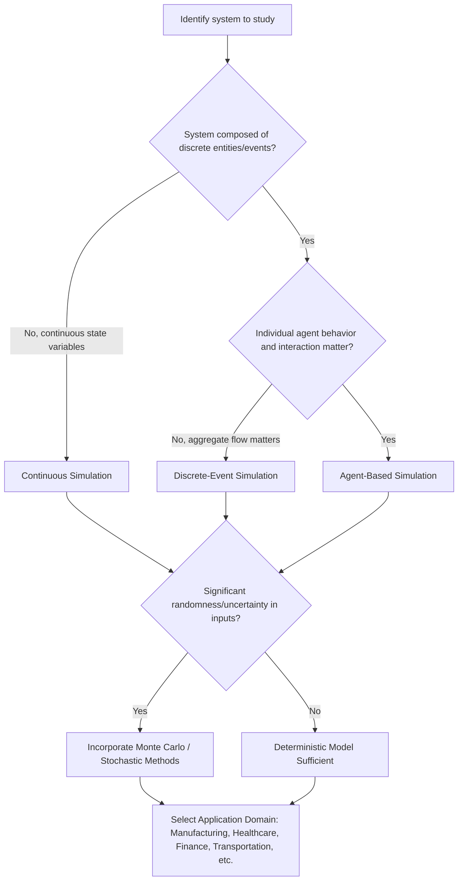

## Applications of Simulation

### Overview

Simulation, as a modelling technique, finds practical use across nearly every domain where systems are too complex, costly, dangerous, or slow to experiment with directly. Rather than testing changes on a real system, analysts build a model that mimics the system's behavior and run experiments on the model instead. The value of simulation lies in its ability to answer "what if" questions cheaply and repeatedly, revealing system behavior under conditions that would be impractical or risky to create in reality.

This section surveys the major application domains of simulation, the specific problems simulation addresses within each, and representative examples of how simulation techniques (discrete-event, continuous, agent-based, Monte Carlo, and hybrid) are applied.

### Why Simulation Is Used

Before surveying domains, it helps to isolate the general motivations that recur across all applications:

- **Cost avoidance**: Testing a new factory layout or aircraft design in reality is expensive; a model is cheap by comparison.
- **Safety**: Simulating a nuclear reactor failure or a surgical procedure avoids real-world danger.
- **Time compression or expansion**: A simulation can compress years of system operation into minutes, or expand a microsecond-scale chemical reaction into an observable timeframe.
- **Irreversibility avoidance**: Some real-world experiments cannot be undone (e.g., demolishing a bridge to test a design flaw); simulation allows repeated, reversible trials.
- **Access to otherwise impossible scenarios**: Simulating a system that does not yet exist (a proposed transit line, an unbuilt product) is only possible through modelling.

### Manufacturing and Production Systems

Simulation is heavily used in manufacturing to design, evaluate, and optimize production processes before committing capital.

**Key Points**

- Discrete-event simulation (DES) is the dominant paradigm here, since manufacturing systems are naturally composed of discrete entities (parts, batches, pallets) moving through discrete stages (machines, buffers, inspection stations).
- Typical applications include: production line layout and balancing, bottleneck identification, buffer sizing, scheduling rule evaluation, and throughput/capacity planning.
- Simulation allows engineers to test "what if we add a second machine here" or "what if lot sizes are reduced" without halting real production.

**Example**

A factory considers adding a robotic arm to reduce cycle time at a bottleneck station. Instead of purchasing the robot outright, engineers build a DES model of the line, incorporating existing machine cycle times, failure rates, and buffer capacities. The robot's projected cycle time is added as a hypothetical resource, and the simulation is run for a simulated month of production. If simulated throughput increases substantially with acceptable queue lengths elsewhere, the capital investment is justified with quantitative evidence rather than intuition.

### Healthcare and Medical Systems

Healthcare simulation spans both operational (hospital logistics) and clinical (physiological, procedural) uses.

**Key Points**

- **Operational simulation**: Emergency department patient flow, staff scheduling, bed allocation, and ambulance dispatch are commonly modelled with DES or agent-based models (ABM), since patients behave as discrete, autonomous entities with variable service times.
- **Epidemiological simulation**: Disease spread through a population is frequently modelled using compartmental (continuous, differential-equation-based) models such as SIR/SEIR, or agent-based models when individual-level heterogeneity and contact networks matter.
- **Clinical/physiological simulation**: Human physiology (e.g., blood glucose regulation, drug pharmacokinetics) is modelled with continuous simulation grounded in differential equations. Surgical simulators use real-time continuous and haptic simulation for training.

**Example**

A hospital wants to reduce emergency department wait times. An agent-based model represents each patient as an agent with attributes (triage severity, arrival time, required resources). Agents move through a network of stages — registration, triage, treatment, discharge — competing for limited resources (doctors, beds). By varying staffing levels across simulated shifts, planners can identify the staffing pattern that minimizes average wait time without over-provisioning.

For epidemic modelling, a basic SEIR model is expressed as a continuous system:

$$\frac{dS}{dt} = -\beta \frac{SI}{N}, \quad \frac{dE}{dt} = \beta \frac{SI}{N} - \sigma E, \quad \frac{dI}{dt} = \sigma E - \gamma I, \quad \frac{dR}{dt} = \gamma I$$

where $S$, $E$, $I$, $R$ represent Susceptible, Exposed, Infected, and Recovered populations, $\beta$ is the transmission rate, $\sigma$ is the incubation rate, and $\gamma$ is the recovery rate.

### Transportation and Logistics

Transportation systems are natural candidates for simulation because they combine discrete entities (vehicles, passengers, shipments) with continuous elements (traffic flow density, fuel consumption).

**Key Points**

- **Traffic simulation**: Modelled at three levels of granularity — macroscopic (traffic as continuous flow, using partial differential equations analogous to fluid dynamics), mesoscopic (grouped vehicle packets), and microscopic (individual vehicle behavior, car-following and lane-changing models, typically agent-based or DES).
- **Supply chain and logistics**: Inventory systems, warehouse operations, and distribution networks are modelled with DES to evaluate reorder policies, warehouse layouts, and transportation routing.
- **Airport and airline operations**: Runway scheduling, gate assignment, and baggage handling are modelled with DES to reduce delays.

**Example**

A city evaluates a proposed traffic signal timing change at a congested intersection. A microscopic traffic simulation models each vehicle as an agent with acceleration, deceleration, and gap-acceptance behavior rules. Running the simulation under the current and proposed signal timings, across many random seeds to account for stochastic variation in arrival patterns, produces distributions of average delay and queue length. If the proposed timing consistently reduces delay across simulated runs, it supports real-world implementation.

Below is a diagram illustrating the granularity spectrum in transportation simulation:

<svg xmlns="http://www.w3.org/2000/svg" viewBox="0 0 760 260">
<text x="380" y="30" font-size="18" font-weight="bold" text-anchor="middle" fill="#1a1a1a">Traffic Simulation Granularity Spectrum (svg_diagram)</text>
<rect x="40" y="80" width="200" height="110" rx="8" fill="#dbeafe" stroke="#1d4ed8" stroke-width="2" />
<text x="140" y="110" font-size="15" font-weight="bold" text-anchor="middle" fill="#1e3a8a">Macroscopic</text>
<text x="140" y="135" font-size="12" text-anchor="middle" fill="#1e3a8a">Continuous flow model</text>
<text x="140" y="153" font-size="12" text-anchor="middle" fill="#1e3a8a">Density, flow, speed</text>
<text x="140" y="171" font-size="12" text-anchor="middle" fill="#1e3a8a">PDE-based</text>
<rect x="280" y="80" width="200" height="110" rx="8" fill="#fef3c7" stroke="#b45309" stroke-width="2" />
<text x="380" y="110" font-size="15" font-weight="bold" text-anchor="middle" fill="#78350f">Mesoscopic</text>
<text x="380" y="135" font-size="12" text-anchor="middle" fill="#78350f">Grouped vehicle packets</text>
<text x="380" y="153" font-size="12" text-anchor="middle" fill="#78350f">Simplified interactions</text>
<text x="380" y="171" font-size="12" text-anchor="middle" fill="#78350f">Statistical movement</text>
<rect x="520" y="80" width="200" height="110" rx="8" fill="#dcfce7" stroke="#15803d" stroke-width="2" />
<text x="620" y="110" font-size="15" font-weight="bold" text-anchor="middle" fill="#14532d">Microscopic</text>
<text x="620" y="135" font-size="12" text-anchor="middle" fill="#14532d">Individual vehicle agents</text>
<text x="620" y="153" font-size="12" text-anchor="middle" fill="#14532d">Car-following rules</text>
<text x="620" y="171" font-size="12" text-anchor="middle" fill="#14532d">Lane-changing behavior</text>
<line x1="240" y1="135" x2="280" y2="135" stroke="#374151" stroke-width="2" marker-end="url(#arrow)" />
<line x1="480" y1="135" x2="520" y2="135" stroke="#374151" stroke-width="2" marker-end="url(#arrow)" />
<text x="380" y="230" font-size="13" text-anchor="middle" fill="`#4b5563`">Increasing computational detail and decreasing scale →</text>

</svg>

### Finance and Economics

Financial simulation relies heavily on stochastic and Monte Carlo methods due to the inherently uncertain nature of markets.

**Key Points**

- **Monte Carlo simulation** is used extensively for option pricing, portfolio risk assessment (Value-at-Risk), and retirement planning, since it can approximate outcomes under a wide range of random future price paths.
- **Agent-based computational economics (ACE)** models markets as populations of interacting agents (traders, firms, consumers) with individual decision rules, used to study emergent phenomena like market crashes or bubbles that classical equilibrium models struggle to capture.
- **System dynamics** (a continuous simulation approach) is applied to macroeconomic modelling, examining feedback loops between variables like inflation, employment, and investment over time.

**Example**

To price a European call option, a Monte Carlo simulation generates thousands of possible future price paths for the underlying asset using a stochastic process such as geometric Brownian motion:

$$dS_t = \mu S_t \, dt + \sigma S_t \, dW_t$$

where $S_t$ is the asset price, $\mu$ is the drift, $\sigma$ is volatility, and $W_t$ is a Wiener process. For each simulated path, the option's payoff at expiration is computed, and the average discounted payoff across all simulated paths approximates the option's fair value.

### Engineering and Physical Sciences

Simulation is foundational in engineering design and physical science research, primarily through continuous simulation grounded in differential equations.

**Key Points**

- **Structural and mechanical engineering**: Finite Element Analysis (FEA) simulates stress, strain, and deformation in structures under load, used for bridges, buildings, and vehicle crash testing.
- **Fluid dynamics**: Computational Fluid Dynamics (CFD) simulates airflow, water flow, and heat transfer, used in aircraft design, HVAC systems, and weather prediction.
- **Electrical and control systems**: Circuit simulators (e.g., SPICE-style tools) model current and voltage behavior; control system simulation evaluates stability and response of feedback systems before physical prototyping.
- **Aerospace**: Flight simulators combine continuous simulation of aircraft dynamics with real-time human-in-the-loop interaction for pilot training.

**Example**

Automotive crash testing uses FEA to simulate a vehicle frame's deformation during an impact. The vehicle body is discretized into thousands of small elements; the simulation solves for stress and displacement at each element across small time steps, following the general system of PDEs governing structural mechanics. This allows engineers to test dozens of frame designs digitally before ever building a physical prototype for a real crash test, drastically reducing both cost and time. [Inference: quantitative reductions in testing cost/time vary by organization and are not universal figures.]

### Military and Defense

Simulation has long-standing use in military training, strategy evaluation, and systems acquisition, predating much of its civilian application.

**Key Points**

- **Wargaming**: Discrete-event and agent-based simulations model combat scenarios, logistics, and troop movement to evaluate strategies without real-world engagement.
- **Training simulators**: Flight, naval, and vehicle simulators provide realistic, repeatable, and risk-free training environments.
- **Systems acquisition**: Before procuring new equipment (aircraft, missile systems), simulation evaluates performance and cost-effectiveness under varied operational scenarios.

### Environmental and Climate Systems

Environmental simulation typically applies continuous or hybrid modelling to large-scale physical and ecological systems.

**Key Points**

- **Climate modelling**: General Circulation Models (GCMs) simulate atmospheric and oceanic processes using coupled systems of differential equations across a spatial grid, used to project long-term climate trends.
- **Ecological modelling**: Population dynamics (predator-prey systems, species migration) are modelled with continuous simulation (e.g., Lotka-Volterra equations) or agent-based simulation when individual organism behavior and spatial heterogeneity matter.
- **Environmental impact assessment**: Simulation evaluates the effect of proposed developments (dams, pipelines, urban expansion) on water systems, air quality, or wildlife before construction.

**Example**

The classic Lotka-Volterra predator-prey model is a continuous simulation described by:

$$\frac{dx}{dt} = \alpha x - \beta x y, \quad \frac{dy}{dt} = \delta x y - \gamma y$$

where $x$ is prey population, $y$ is predator population, and $\alpha$, $\beta$, $\delta$, $\gamma$ are interaction rate constants. Simulating this system over time reveals oscillatory population cycles, helping ecologists understand sustainable harvesting limits or the effects of introducing/removing a species.

### Computer Networks and Telecommunications

Network design and performance evaluation rely heavily on discrete-event simulation.

**Key Points**

- Packet-level network simulators (e.g., conceptually similar to tools like NS-3 or OMNeT++) model routers, links, and packets as discrete entities to evaluate protocol performance, congestion behavior, and quality of service under varying load.
- Applications include: capacity planning for data centers, evaluating new routing protocols before deployment, and simulating wireless network coverage and interference.

### Business, Operations Research, and Service Systems

Beyond manufacturing, general business operations are a major simulation application area, often grouped under operations research.

**Key Points**

- **Queueing systems**: Call centers, bank branches, and retail checkout lines are modelled with DES to determine optimal staffing levels against service-level targets.
- **Inventory management**: Simulation evaluates reorder point and reorder quantity policies under uncertain demand, balancing holding costs against stockout risk.
- **Project and risk management**: Monte Carlo simulation is applied to project schedules (e.g., PERT-style analysis) to estimate the probability of completing a project by a given date, given uncertain task durations.

**Example**

A retail chain wants to determine optimal staffing for checkout counters. A DES model represents customer arrivals as a stochastic process (commonly modelled with a Poisson arrival process), service times as a probability distribution, and checkout counters as limited servers in a queueing system. By simulating different staffing levels across many replications, the store identifies the minimum staffing that keeps average wait time below a target threshold, balancing labor cost against customer satisfaction.

### Education and Training (Simulation-Based Learning)

Simulation applications extend into pedagogy itself, where the simulated environment is the primary learning tool.

**Key Points**

- **Serious games and simulators**: Flight simulators, medical simulators, and business simulation games allow trainees to practice decision-making in realistic, consequence-free environments.
- **Virtual laboratories**: Physics, chemistry, and engineering education increasingly use simulated lab environments where students manipulate virtual apparatus, useful when physical equipment is costly, dangerous, or unavailable.

### Cross-Domain Workflow: How Simulation Applications Are Typically Selected

The choice of simulation paradigm for a given application is guided by the nature of the system being studied. The following diagram summarizes a general decision flow:

### Common Threads Across Applications

Despite spanning vastly different domains, simulation applications share recurring characteristics:

- **Verification and validation** are essential in every domain: a simulation model is only useful if it accurately reflects the real system's behavior (validation) and is implemented correctly (verification).
- **Replication and statistical analysis**: Because many simulations involve randomness, results are typically obtained by running multiple replications and analyzing output distributions rather than trusting a single run.
- **Trade-off between fidelity and computational cost**: More detailed models (e.g., microscopic traffic simulation vs. macroscopic) provide richer insight but demand significantly more computation.
- **Decision support role**: In nearly all applications, simulation is used to inform decisions (capital investment, policy change, design choice) rather than to provide a single "correct" answer; results are typically presented as comparative scenarios or probability distributions. [Inference: the degree to which simulation directly drives versus merely informs decisions varies by organizational context.]

### Conclusion

The applications of simulation span manufacturing, healthcare, transportation, finance, engineering, defense, environmental science, telecommunications, business operations, and education. What unites these disparate uses is a common underlying purpose: enabling experimentation on a model when experimentation on the real system is impossible, unsafe, costly, or slow. The specific simulation paradigm chosen — discrete-event, continuous, agent-based, Monte Carlo, or hybrid combinations — depends on the structural characteristics of the system being studied, particularly whether it is naturally discrete or continuous, whether individual-level behavior matters, and whether uncertainty must be explicitly modelled.

**Related Topics**

- Verification and Validation of Simulation Models
- Discrete-Event Simulation: Core Concepts and Mechanics
- Continuous Simulation and Differential Equation Solvers
- Agent-Based Modelling Fundamentals
- Monte Carlo Methods and Random Number Generation
- Input Data Analysis and Distribution Fitting for Simulation
- Output Analysis: Replications, Confidence Intervals, and Steady-State Behavior
- Hybrid Simulation Approaches
- Simulation Software Tools and Platforms