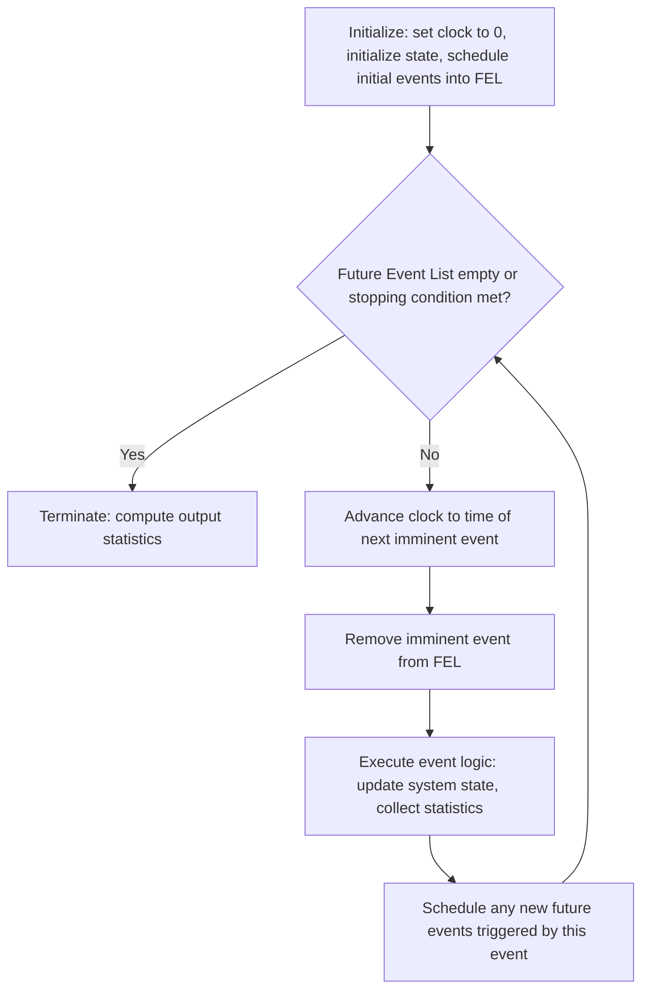

## Discrete Event System Simulation

### Overview

Discrete Event System Simulation (DES) is a modelling paradigm in which the state of a system changes only at discrete points in time, triggered by the occurrence of events. Between consecutive events, the system state remains constant. This contrasts with continuous simulation, where state variables change continuously over time according to differential equations. DES is the dominant paradigm for systems composed of countable entities (customers, parts, packets, patients) that move through a sequence of processes, queues, and resources.

DES underlies most operations research and industrial engineering simulation work, including queueing systems, manufacturing lines, logistics networks, and computer systems.

### Core Characteristics of Discrete Event Systems

**Key Points**

- **State**: A collection of variables describing the system at a point in time (e.g., number of customers in a queue, status of a server).
- **Event**: An instantaneous occurrence that may change the system state (e.g., a customer arrival, a service completion).
- **Entity**: An object that flows through the system and can trigger or be affected by events (e.g., a customer, a job, a message).
- **Attribute**: A property associated with an entity (e.g., a customer's arrival time, priority level).
- **Resource**: An entity or facility that provides service and has limited capacity (e.g., a server, a machine, a clerk).
- **Queue (or waiting line)**: A location where entities wait when a resource is unavailable.
- **Simulation clock**: A variable representing simulated time, advanced according to the occurrence of events rather than in fixed real-time increments.

Because the system only changes at discrete instants, the simulation clock does not need to advance in small uniform steps; it can jump directly from one event time to the next, skipping over periods of inactivity. This is the central efficiency advantage of DES over naive time-stepped approaches.

### The Event-Scheduling / Time-Advance Mechanism

The defining mechanical feature of DES is the **next-event time advance** approach, as opposed to a fixed-increment time advance.

**Key Points**

- In **fixed-increment time advance**, the clock advances by a constant $\Delta t$ regardless of whether an event occurs, checking at each step whether an event should happen. This is computationally wasteful when events are sparse and risks missing events that fall between steps.
- In **next-event time advance**, the simulation maintains a **Future Event List (FEL)**, an ordered list of scheduled events with their associated times. The clock jumps directly to the time of the next (soonest) event, processes that event (updating state, scheduling any new future events), removes it from the list, and repeats.
- This mechanism guarantees that no event is missed and that computational effort is spent only at moments when the system state actually changes.

The general next-event time-advance algorithm proceeds as follows:

### Components of a Discrete-Event Simulation Model

A complete DES model conventionally consists of the following components, following the widely used framework popularized in simulation textbooks:

- **System state**: The collection of state variables needed to describe the system at any time.
- **Simulation clock**: Tracks current simulated time.
- **Event list**: The FEL, storing the next occurrence time of each event type.
- **Statistical counters**: Variables used to accumulate information for performance measures (e.g., total wait time, number served).
- **Initialization routine**: Sets the simulation clock to zero and defines the initial state.
- **Timing routine**: Determines the next event from the FEL and advances the simulation clock.
- **Event routine(s)**: Update the system state when a particular event type occurs, and schedule any consequent future events.
- **Library/utility routines**: Generate random variates from probability distributions used to model stochastic behavior (e.g., interarrival times, service times).
- **Report generator**: Computes and outputs summary statistics at the end of the run.
- **Main program**: Coordinates the timing routine and event routines, invoking them in the correct sequence until a stopping condition is reached.

### Worked Example: Single-Server Queueing System

Consider a simple single-server queueing system (e.g., a single checkout counter), often referred to as an M/M/1 or M/G/1 queue depending on the interarrival and service time distributions.

**Key Points**

- **Entities**: Customers.
- **Events**: Arrival and Departure (service completion).
- **State variables**: Number of customers in the system, $L(t)$; status of the server (busy/idle).
- **Resource**: The single server.

**Example**

The event logic for this system operates as follows:

*Arrival event*:

1. Schedule the next arrival event at time $t + A$, where $A$ is a randomly generated interarrival time.
2. If the server is idle, set it to busy and schedule a departure event at time $t + S$, where $S$ is a randomly generated service time.
3. If the server is busy, add the customer to the queue.

*Departure event*:

1. If the queue is empty, set the server to idle.
2. If the queue is non-empty, remove the next customer from the queue, set the server to busy, and schedule a departure event at time $t + S$ for that customer.

Interarrival times are frequently modelled as exponentially distributed (implying a Poisson arrival process), with probability density function:

$$f(t) = \lambda e^{-\lambda t}, \quad t \geq 0$$

where $\lambda$ is the arrival rate. Service times may follow an exponential, deterministic, or other empirically fitted distribution depending on the system being modelled.

The evolution of such a system can be visualized as a sequence of events along the simulation clock:

<svg xmlns="http://www.w3.org/2000/svg" viewBox="0 0 780 240">
<text x="390" y="28" font-size="18" font-weight="bold" text-anchor="middle" fill="#1a1a1a">Single-Server Queue: Event Timeline (svg_diagram)</text>
<line x1="50" y1="120" x2="730" y2="120" stroke="#374151" stroke-width="2" />
<polygon points="730,120 718,114 718,126" fill="#374151" />
<circle cx="100" cy="120" r="6" fill="#1d4ed8" />
<text x="100" y="105" font-size="12" text-anchor="middle" fill="#1d4ed8">A1</text>
<text x="100" y="145" font-size="11" text-anchor="middle" fill="#4b5563">t=2</text>
<circle cx="220" cy="120" r="6" fill="#1d4ed8" />
<text x="220" y="105" font-size="12" text-anchor="middle" fill="#1d4ed8">A2</text>
<text x="220" y="145" font-size="11" text-anchor="middle" fill="#4b5563">t=5</text>
<circle cx="300" cy="120" r="6" fill="#b45309" />
<text x="300" y="105" font-size="12" text-anchor="middle" fill="#b45309">D1</text>
<text x="300" y="145" font-size="11" text-anchor="middle" fill="#4b5563">t=7</text>
<circle cx="420" cy="120" r="6" fill="#1d4ed8" />
<text x="420" y="105" font-size="12" text-anchor="middle" fill="#1d4ed8">A3</text>
<text x="420" y="145" font-size="11" text-anchor="middle" fill="#4b5563">t=10</text>
<circle cx="520" cy="120" r="6" fill="#b45309" />
<text x="520" y="105" font-size="12" text-anchor="middle" fill="#b45309">D2</text>
<text x="520" y="145" font-size="11" text-anchor="middle" fill="#4b5563">t=13</text>
<circle cx="640" cy="120" r="6" fill="#b45309" />
<text x="640" y="105" font-size="12" text-anchor="middle" fill="#b45309">D3</text>
<text x="640" y="145" font-size="11" text-anchor="middle" fill="#4b5563">t=16</text>

<text x="100" y="175" font-size="11" text-anchor="middle" fill="`#374151`">Server: Busy</text>

<text x="220" y="175" font-size="11" text-anchor="middle" fill="`#374151`">Queue: 1</text>

<text x="420" y="175" font-size="11" text-anchor="middle" fill="`#374151`">Server: Busy</text>

<text x="390" y="210" font-size="12" text-anchor="middle" fill="`#4b5563`">A = Arrival event D = Departure event Clock jumps directly between event times</text>

</svg>

### Random Number Generation and Variate Generation

Because most discrete-event systems involve uncertainty (variable arrival times, service durations, machine failures), DES relies fundamentally on the generation of random numbers and random variates.

**Key Points**

- **Pseudo-random number generators (PRNGs)** produce sequences of numbers in $[0,1)$ that approximate the statistical properties of true randomness, using deterministic algorithms seeded with an initial value. Common algorithm families include linear congruential generators and Mersenne Twister-based generators.
- **Random variate generation** transforms uniform random numbers into samples from a desired probability distribution (exponential, normal, Poisson, empirical, etc.), commonly via techniques such as inverse transform sampling, acceptance-rejection, or convolution methods.
- **Inverse transform method**: If $U$ is uniformly distributed on $[0,1)$ and $F$ is the cumulative distribution function of the target distribution, then $X = F^{-1}(U)$ has the desired distribution. For the exponential distribution, this yields:

$$X = -\frac{1}{\lambda} \ln(1-U)$$

- Using the same random number stream (same seed) across different simulated scenarios allows for **common random numbers**, a variance-reduction technique that improves the precision of comparisons between alternative system configurations.

### Model Verification and Validation

DES models must be checked for correctness on two distinct dimensions.

**Key Points**

- **Verification** asks: "Is the model implemented correctly?" — i.e., does the code correctly reflect the conceptual model's logic, free of programming errors. Techniques include structured walkthroughs, tracing individual event executions, and checking intermediate outputs against hand calculations.
- **Validation** asks: "Is the model an accurate representation of the real system?" — i.e., does the model's output behavior sufficiently match real-world data or expert judgment. Techniques include comparing simulation output to historical data, sensitivity analysis, and face validation with subject-matter experts.
- A model can be verified (correctly coded) yet invalid (not representative of reality), and these two properties must be assessed independently.

### Output Analysis: Terminating vs. Steady-State Simulations

The way simulation output is analyzed depends on the nature of the study.

**Key Points**

- **Terminating simulations** have a natural, well-defined ending event or condition (e.g., a bank simulated from opening to closing). Multiple independent replications, each starting from the same initial conditions but with different random number streams, are run, and statistics are averaged across replications.
- **Non-terminating (steady-state) simulations** aim to study long-run system behavior with no natural ending point (e.g., a continuously operating factory). These require careful handling of the **initialization bias** (the warm-up period), since early simulation output reflects the artificial starting conditions (e.g., an empty system) rather than typical steady-state behavior. A common approach is to discard a warm-up period before collecting statistics, determined via techniques such as Welch's graphical method.
- **Replication** (running the simulation multiple times with different random seeds) is essential in both cases to construct confidence intervals around performance estimates, since a single run only reflects one possible random realization of the system.

### Common Performance Measures

**Key Points**

- **Utilization**: The proportion of time a resource is busy, $\rho = \lambda / (\text{service rate})$ in simple single-server systems.
- **Average waiting time**: Mean time entities spend in queue before being served.
- **Average time in system**: Mean total time from entity arrival to departure (waiting plus service time).
- **Average number in queue/system**: Time-averaged count of entities waiting or present, often computed via **Little's Law**:

$$L = \lambda W$$

where $L$ is the average number of entities in the system, $\lambda$ is the average arrival rate, and $W$ is the average time an entity spends in the system. Little's Law holds for a broad class of stable queueing systems regardless of the specific arrival or service distributions, provided the system reaches steady state. [Inference: strict applicability requires the system to be stable (arrival rate less than service capacity) and reach long-run equilibrium; results for systems that never stabilize should be interpreted cautiously.]

### DES vs. Other Simulation Paradigms

**Key Points**

- **DES vs. Continuous Simulation**: DES updates state only at discrete event times; continuous simulation updates state variables continuously via numerical integration of differential equations across small time steps. DES suits systems with countable entities and instantaneous transitions; continuous simulation suits systems where quantities like temperature, pressure, or concentration change smoothly.
- **DES vs. Agent-Based Simulation**: DES traditionally emphasizes process flow through a system-wide, often centralized, event list, focusing on aggregate performance measures (throughput, wait times). Agent-based simulation emphasizes autonomous decision-making entities with individual behavior rules, focusing on emergent system-level patterns arising from micro-level interactions. In practice, many modern DES tools incorporate agent-like entity behavior, blurring this distinction.
- **DES vs. Monte Carlo Simulation**: Monte Carlo simulation typically refers to static, time-independent stochastic sampling (e.g., estimating an integral or a one-shot risk outcome), whereas DES explicitly models the dynamic evolution of a system over simulated time through sequences of events.

### Common Software Tools and Implementation Approaches

**Key Points**

- **General-purpose programming languages** (Python, Java, C++) can implement DES from scratch using an explicit FEL data structure (commonly a priority queue/heap ordered by event time), offering maximum flexibility at the cost of development effort.
- **Simulation libraries**: Frameworks such as SimPy (Python) provide process-based DES abstractions, allowing entities to be modelled as processes that "wait" for resources or time delays, with the library managing the underlying event list internally.
- **Commercial/specialized DES software**: Tools such as Arena, Simio, AnyLogic, and FlexSim provide graphical modelling environments with built-in statistical distribution fitting, animation, and output analysis, commonly used in industrial and academic settings. [Unverified: specific feature sets and current version capabilities of named commercial tools should be checked against current vendor documentation, as they are updated over time.]

### Advantages and Limitations of DES

**Key Points**

- **Advantages**: Computationally efficient relative to fixed time-step approaches for systems with sparse events; naturally represents systems composed of discrete, countable entities; well-suited to queueing and process-flow analysis; strong theoretical foundation for output analysis (confidence intervals, variance reduction).
- **Limitations**: Can become complex to model when entity interactions are highly interdependent or when continuous-valued state changes (e.g., fluid levels, temperature) are also present, often requiring hybrid discrete-continuous approaches; model logic can grow intricate for large systems with many event types and conditional branching; results are only as reliable as the input distributions used to characterize randomness, making input data analysis a critical (and often underestimated) part of the modelling process.

### Conclusion

Discrete Event System Simulation provides a rigorous, efficient framework for modelling systems whose state changes at discrete points in time driven by identifiable events. Its core mechanism — the next-event time-advance approach coupled with a future event list — allows simulation of complex queueing, manufacturing, logistics, and service systems without the computational waste of fixed time-stepping. Proper application of DES requires attention to random variate generation, verification and validation, and rigorous output analysis (particularly the distinction between terminating and steady-state studies) to produce statistically defensible conclusions.

**Related Topics**

- Future Event List Data Structures and Priority Queue Implementation
- Random Number Generators and Variate Generation Techniques
- Input Data Analysis and Distribution Fitting
- Output Analysis: Confidence Intervals and Variance Reduction Techniques
- Queueing Theory Fundamentals (M/M/1, M/M/c, M/G/1 Systems)
- Process-Based Simulation Frameworks (e.g., SimPy)
- Hybrid Discrete-Continuous Simulation
- Steady-State Simulation and the Warm-Up Period Problem