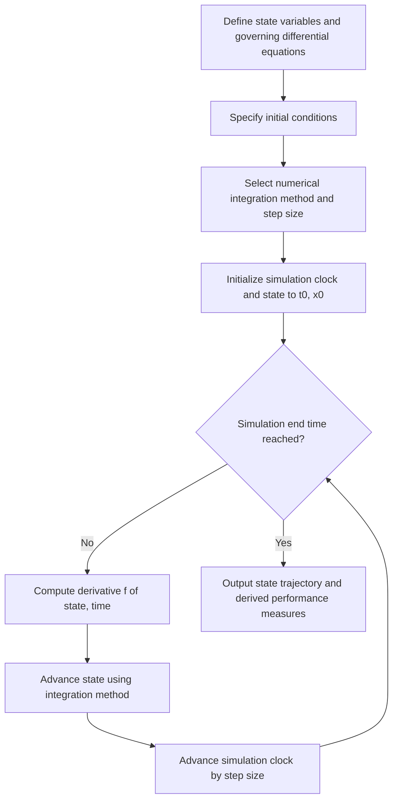

## Continuous Simulation

### Overview

Continuous simulation is a modelling paradigm in which system state variables change continuously over time, rather than at discrete instants triggered by events. It is used to represent systems whose behavior is naturally described by physical quantities that vary smoothly — temperature, pressure, velocity, concentration, population size — governed by differential equations. Where discrete-event simulation (DES) tracks entities moving through discrete stages, continuous simulation tracks the trajectory of state variables through continuous time, typically by numerically solving systems of ordinary differential equations (ODEs) or, in more advanced cases, partial differential equations (PDEs).

Continuous simulation underlies most engineering, physical science, and systems-dynamics modelling, including control systems, fluid dynamics, population ecology, chemical processes, and macroeconomic models.

### Core Characteristics of Continuous Systems

**Key Points**

- **State variables**: Quantities that describe the system at any instant and change continuously over time (e.g., tank fluid level, aircraft altitude, predator population).
- **Rate of change**: The behavior of a continuous system is defined by how its state variables change with respect to time, typically expressed as derivatives, $\frac{dx}{dt}$.
- **Differential equations**: The mathematical backbone of continuous simulation; a model consists of one or more equations describing the instantaneous rate of change of each state variable, often as a function of the current state and time.
- **Initial conditions**: Since differential equations describe rates of change rather than absolute values, a complete model requires the state values at the starting time, $x(t_0) = x_0$, to produce a unique trajectory.
- **Smooth time evolution**: Unlike DES, there are no discrete "events" that instantaneously alter the state (in pure continuous systems); the state evolves gradually according to the governing equations.

### Mathematical Foundation

A general continuous simulation model can be expressed as a system of first-order ODEs:

$$\frac{d\mathbf{x}}{dt} = f(\mathbf{x}, t)$$

where $\mathbf{x}$ is a vector of state variables and $f$ defines their instantaneous rates of change, possibly depending on the current state and time. Higher-order differential equations (e.g., those involving acceleration, $\frac{d^2x}{dt^2}$) are conventionally converted into an equivalent system of first-order equations by introducing auxiliary variables, since most numerical solution methods are designed for first-order systems.

**Example**

A simple population growth model (exponential growth) is described by:

$$\frac{dN}{dt} = rN$$

where $N$ is population size and $r$ is the growth rate. This has the closed-form analytical solution $N(t) = N_0 e^{rt}$, but most realistic continuous models (especially nonlinear or coupled systems) have no closed-form solution and must be solved numerically.

### Numerical Integration Methods

Since most continuous models cannot be solved analytically, continuous simulation relies on numerical integration techniques that approximate the solution trajectory by advancing the state in small time steps, $\Delta t$ (often called $h$).

**Key Points**

- **Euler's Method**: The simplest numerical integration technique, approximating the next state as:

$$x_{n+1} = x_n + h \cdot f(x_n, t_n)$$

Euler's method is easy to implement but accumulates error quickly, especially with larger step sizes, and can become numerically unstable for certain systems ("stiff" equations).

- **Improved Euler / Heun's Method**: A second-order method that averages the slope at the beginning and (estimated) end of the interval, improving accuracy over basic Euler with modest additional computation.
- **Runge-Kutta Methods**: A family of higher-order methods, with the fourth-order Runge-Kutta method (RK4) being the most widely used in practice due to its favorable balance of accuracy and computational cost. RK4 evaluates the derivative function at four points within each step and combines them in a weighted average.
- **Adaptive step-size methods**: Techniques (e.g., Runge-Kutta-Fehlberg, Dormand-Prince) that automatically adjust $\Delta t$ based on estimated local error, taking smaller steps where the system changes rapidly and larger steps where it changes slowly, improving both accuracy and computational efficiency.
- **Implicit methods**: Methods (e.g., backward Euler, implicit Runge-Kutta) that solve for the next state using an equation involving the unknown future state itself, generally more computationally expensive per step but far more stable for "stiff" systems where explicit methods would require impractically small step sizes to remain stable.

The trade-off between step size, accuracy, and stability is a central practical concern in continuous simulation:

<svg xmlns="http://www.w3.org/2000/svg" viewBox="0 0 760 260">
<text x="380" y="28" font-size="18" font-weight="bold" text-anchor="middle" fill="#1a1a1a">Numerical Integration: Step Size Trade-off (svg_diagram)</text>
<line x1="60" y1="210" x2="700" y2="210" stroke="#374151" stroke-width="1.5" />
<line x1="60" y1="210" x2="60" y2="50" stroke="#374151" stroke-width="1.5" />
<text x="380" y="240" font-size="12" text-anchor="middle" fill="#4b5563">Step Size (h)</text>
<text x="30" y="130" font-size="12" text-anchor="middle" fill="#4b5563" transform="rotate(-90 30 130)">Error / Cost</text>
<path d="M 80 60 Q 250 65 400 130 Q 550 190 680 205" fill="none" stroke="#1d4ed8" stroke-width="2.5" />
<text x="600" y="185" font-size="12" fill="#1d4ed8">Truncation Error (decreases)</text>
<path d="M 80 205 Q 250 190 400 140 Q 550 90 680 60" fill="none" stroke="#b45309" stroke-width="2.5" />
<text x="480" y="75" font-size="12" fill="#b45309">Computational Cost (increases)</text>
<line x1="330" y1="50" x2="330" y2="210" stroke="#6b7280" stroke-width="1" stroke-dasharray="4,4" />
<text x="330" y="45" font-size="12" text-anchor="middle" fill="#14532d" font-weight="bold">Practical Balance Region</text>
</svg>

### Example: Simulating a Simple RC Circuit

**Example**

Consider a simple resistor-capacitor (RC) circuit charging from a voltage source. The voltage across the capacitor, $V_C(t)$, is governed by:

$$\frac{dV_C}{dt} = \frac{V_s - V_C}{RC}$$

where $V_s$ is the source voltage, $R$ is resistance, and $C$ is capacitance. Applying Euler's method with step size $h$:

$$V_{C,n+1} = V_{C,n} + h \cdot \frac{V_s - V_{C,n}}{RC}$$

Starting from $V_C(0) = 0$, repeated application of this update rule for successive time steps produces an approximate charging curve that converges toward $V_s$, mimicking the exponential charging behavior of the physical circuit. Smaller step sizes $h$ produce a closer approximation to the true exponential curve at the cost of more computation.

### Continuous Simulation Process Flow

The general workflow for building and running a continuous simulation follows a consistent pattern regardless of the specific domain:

### Stiff Systems

**Key Points**

- A system of differential equations is termed **stiff** when it involves widely differing time scales — some components change very rapidly while others change slowly — causing explicit numerical methods to require extremely small step sizes to remain numerically stable, even when accuracy at that resolution is not otherwise needed.
- Stiffness commonly arises in chemical kinetics (fast and slow reactions occurring together), electrical circuits with widely varying time constants, and certain control systems.
- Implicit integration methods are generally preferred for stiff systems, since they remain stable at larger step sizes, though each step requires solving an (often nonlinear) equation, increasing per-step computational cost. [Inference: the specific step-size and stability advantage of a given implicit method depends on the particular system's stiffness characteristics and is typically assessed empirically or via stability analysis rather than assumed universally.]

### Applications of Continuous Simulation

**Key Points**

- **Control systems engineering**: Simulating the response of feedback control systems (e.g., a thermostat, cruise control, an autopilot) to verify stability and performance before physical implementation.
- **Population and ecological dynamics**: Predator-prey models (Lotka-Volterra equations), epidemiological compartmental models (SIR/SEIR), and resource-consumption models.
- **Chemical and process engineering**: Simulating reactor concentrations, temperature profiles, and reaction kinetics over time.
- **Aerospace and vehicle dynamics**: Simulating aircraft or spacecraft trajectories, attitude dynamics, and orbital mechanics.
- **System dynamics modelling**: Used in business and economics to model feedback loops between aggregate variables (e.g., inventory, workforce, capital investment) over time, a technique closely associated with Jay Forrester's work on industrial and urban dynamics.

### Continuous vs. Discrete-Event Simulation

**Key Points**

- **State change**: Continuous simulation state variables change smoothly and are recalculated at every time step; DES state variables change only at discrete event instants, remaining constant between events.
- **Time advance**: Continuous simulation conventionally uses a fixed (or adaptively adjusted) small time-step advance, since the governing equations must be integrated across the entire time span; DES uses next-event time advance, jumping directly between event times.
- **Suitability**: Continuous simulation suits systems where the underlying physical or mathematical description is inherently a differential equation (fluid flow, heat transfer, mechanical motion); DES suits systems composed of discrete, countable entities passing through discrete stages (customers, jobs, packets).
- **Hybrid systems**: Many real-world systems exhibit both continuous and discrete behavior simultaneously (e.g., a chemical tank with continuously varying fluid level, but discrete valve-open/valve-close events) and require hybrid discrete-continuous simulation approaches that combine numerical integration with event scheduling.

### Verification and Validation Considerations

**Key Points**

- **Verification** of a continuous simulation involves confirming that the numerical implementation correctly solves the specified differential equations — checking for coding errors, appropriate step-size selection, and numerical stability, often by comparing against known analytical solutions for simplified cases.
- **Validation** involves confirming that the differential equations themselves accurately represent the real system's dynamics, typically through comparison against empirical measurement data and sensitivity analysis of model parameters.
- **Numerical error sources** unique to continuous simulation include truncation error (from the approximation inherent in the numerical method) and round-off error (from finite-precision arithmetic), both of which must be considered when selecting step size and integration method.

### Common Software Tools and Implementation Approaches

**Key Points**

- **General-purpose scientific computing environments**: Python (with libraries such as SciPy's ODE solvers), MATLAB/Simulink, and Julia's differential equations ecosystem provide built-in numerical integrators (Euler, Runge-Kutta variants, adaptive-step and implicit solvers) for solving ODE/PDE systems.
- **Specialized system dynamics software**: Tools such as Vensim and Stella provide graphical stock-and-flow modelling interfaces specifically designed for continuous system dynamics modelling, commonly used in business, environmental, and policy contexts. [Unverified: specific feature sets and current capabilities of named tools should be checked against current vendor documentation.]
- **Domain-specific simulators**: Computational Fluid Dynamics (CFD) packages and circuit simulators (SPICE-family tools) implement specialized continuous solvers tailored to their respective physical domains, often solving PDEs across spatial grids in addition to time integration.

### Advantages and Limitations

**Key Points**

- **Advantages**: Naturally represents systems governed by well-established physical laws expressed as differential equations; mature numerical methods with well-understood error and stability properties; capable of modelling smooth, continuous physical phenomena that discrete approaches would only approximate.
- **Limitations**: Computationally demanding for systems requiring fine time resolution or spatial discretization (as in CFD); numerical stability and step-size selection require care, particularly for stiff systems; does not naturally represent discrete, countable entities or abrupt state changes without hybrid extensions; model accuracy is fundamentally limited by how well the chosen differential equations capture the real system's underlying physics or dynamics.

### Conclusion

Continuous simulation provides the mathematical and computational framework for modelling systems whose state evolves smoothly over time according to differential equations. Its central methodology — numerical integration of ODE/PDE systems from specified initial conditions — enables the study of physical, biological, and economic systems where discrete-event approaches are unsuitable. Effective use of continuous simulation requires careful selection of integration methods and step sizes, particular attention to system stiffness, and the same rigorous verification and validation discipline applied across all simulation paradigms.

**Related Topics**

- Numerical Methods for Ordinary Differential Equations (Euler, Runge-Kutta, Adaptive Methods)
- Stiff Systems and Implicit Integration Methods
- System Dynamics Modelling and Stock-and-Flow Diagrams
- Hybrid Discrete-Continuous Simulation
- Partial Differential Equations and Spatial Discretization (Finite Difference/Element Methods)
- Stability Analysis of Numerical Integration Schemes
- Sensitivity Analysis in Continuous Models
- Control Systems Simulation and Feedback Loop Modelling