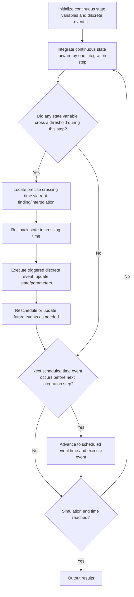

## Hybrid Simulation Approaches

### Overview

Hybrid simulation refers to modelling approaches that combine two or more simulation paradigms — most commonly discrete-event simulation (DES), continuous simulation, and agent-based modelling (ABM) — within a single model to represent systems that exhibit both discrete and continuous behavior, or that require multiple levels of abstraction simultaneously. Many real-world systems do not fit cleanly into a single paradigm: a chemical plant has continuously varying fluid levels alongside discrete valve operations; a supply chain has discrete shipment events alongside continuously fluctuating inventory levels; an epidemic model may need aggregate continuous dynamics at the population level combined with discrete, agent-level behavior for high-risk subgroups. Hybrid simulation addresses these systems by allowing different components of the model to be represented with whichever paradigm best fits their nature, coupled through a coordinated simulation mechanism.

### Why Hybrid Simulation Is Needed

**Key Points**

- **Mixed system dynamics**: Many systems have state variables that change continuously (temperature, fluid volume, stock price) alongside events that occur at discrete instants (a valve opening, an order being placed, a machine failure).
- **Multi-level abstraction needs**: A single system may need to be studied at multiple levels simultaneously — for example, individual customer behavior (agent-based, micro-level) alongside aggregate market dynamics (continuous, macro-level).
- **Fidelity vs. computational cost trade-offs**: Modelling an entire large-scale system at the finest level of detail (e.g., agent-based) may be computationally prohibitive; hybrid approaches allow high-fidelity modelling only where it matters, with coarser aggregate modelling elsewhere.
- **Pure-paradigm limitations**: Discrete-event simulation cannot naturally represent smoothly varying quantities without artificial discretization; continuous simulation cannot naturally represent discrete, countable entities or abrupt state changes without special handling. Hybrid simulation removes the need to force a system into an ill-fitting paradigm.

### Common Hybrid Combinations

**Key Points**

- **Discrete-Continuous Hybrid (DES + Continuous)**: The most classical form of hybrid simulation, combining a discrete event list with continuously integrated state variables. Continuous state variables evolve according to differential equations between events, while discrete events can be triggered either by scheduled times (as in standard DES) or by **state events** — conditions on the continuous variables themselves (e.g., "trigger an event when tank level reaches a threshold").
- **Agent-Based + System Dynamics Hybrid**: Combines individual agent decision-making and behavior with aggregate continuous feedback loops governing the broader environment (e.g., individual consumer agents operating within a continuously modelled macroeconomic environment).
- **Agent-Based + Discrete-Event Hybrid**: Agents make autonomous decisions but interact within a process-flow structure managed by an event list (e.g., patients as agents with individual health trajectories, moving through a hospital's discrete-event process flow of triage, treatment, and discharge).
- **Multi-paradigm, multi-scale models**: Some models combine all three paradigms across different spatial or organizational scales, such as a supply chain model using system dynamics for aggregate inventory trends, discrete-event simulation for order processing and shipment logistics, and agent-based modelling for individual supplier negotiation behavior.

### State Events vs. Time Events

A key technical distinction in discrete-continuous hybrid simulation is the type of condition that triggers a discrete event.

**Key Points**

- **Time events**: Events scheduled to occur at a specific, known simulation time, exactly as in standard DES (e.g., "an order arrives at $t = 14.2$").
- **State events**: Events triggered when a continuously evolving state variable crosses a specified threshold, where the exact triggering time is not known in advance and must be detected during the simulation run (e.g., "shut the valve when tank level reaches 100 liters").
- Detecting state events requires the simulation engine to monitor the continuous state trajectory and interpolate or iteratively search for the precise crossing time once a threshold has been passed between integration steps, a process often called **event location** or **root-finding**, since it typically involves finding the root of $g(x(t)) = 0$ for some threshold condition $g$.
- Failing to detect a state event precisely can introduce significant simulation error, since the discrete event's effect (e.g., a valve closing) should ideally be applied at the exact moment the threshold is crossed, not at the next scheduled integration step.

### General Hybrid Simulation Execution Cycle

The coordination between continuous integration and discrete event handling in a discrete-continuous hybrid model generally follows this cycle:

### Worked Example: Tank-Filling System with Discrete Valve Control

**Example**

Consider a tank being filled with liquid at a continuous inflow rate, with a discrete controller that closes the inlet valve once the tank reaches a target level and opens a drain valve once it falls below a minimum threshold — a classic hybrid system combining continuous dynamics with discrete mode switching.

The continuous dynamics while filling are governed by:

$$\frac{dV}{dt} = Q_{in} - Q_{out}$$

where $V$ is tank volume, $Q_{in}$ is inflow rate, and $Q_{out}$ is outflow rate (zero while the drain valve is closed). The system has two discrete modes — "filling" and "draining" — with the continuous equation's parameters changing depending on the current mode. The transition between modes is governed by state events:

- **Event: Tank Full** — triggered when $V(t) = V_{max}$, causing the mode to switch from "filling" to "idle" or "draining" depending on control logic, and closing the inlet valve ($Q_{in} \to 0$).
- **Event: Tank Empty** — triggered when $V(t) = V_{min}$, causing the mode to switch to "filling" and opening the inlet valve.

This produces a state trajectory that alternates between smooth continuous segments (filling or draining) and instantaneous discrete mode switches at the threshold crossings, illustrated below:

<svg xmlns="http://www.w3.org/2000/svg" viewBox="0 0 760 260">
<text x="380" y="28" font-size="18" font-weight="bold" text-anchor="middle" fill="#1a1a1a">Hybrid System: Tank Volume Over Time (svg_diagram)</text>
<line x1="60" y1="210" x2="700" y2="210" stroke="#374151" stroke-width="1.5" />
<line x1="60" y1="210" x2="60" y2="40" stroke="#374151" stroke-width="1.5" />
<text x="380" y="240" font-size="12" text-anchor="middle" fill="#4b5563">Time</text>
<text x="25" y="125" font-size="12" text-anchor="middle" fill="#4b5563" transform="rotate(-90 25 125)">Volume V(t)</text>
<line x1="60" y1="70" x2="700" y2="70" stroke="#b45309" stroke-width="1" stroke-dasharray="5,5" />
<text x="705" y="74" font-size="11" fill="#b45309">V_max</text>
<line x1="60" y1="180" x2="700" y2="180" stroke="#1d4ed8" stroke-width="1" stroke-dasharray="5,5" />
<text x="705" y="184" font-size="11" fill="#1d4ed8">V_min</text>
<path d="M 60 180 L 220 70" fill="none" stroke="#15803d" stroke-width="2.5" />
<path d="M 220 70 L 380 180" fill="none" stroke="#b91c1c" stroke-width="2.5" />
<path d="M 380 180 L 540 70" fill="none" stroke="#15803d" stroke-width="2.5" />
<path d="M 540 70 L 700 180" fill="none" stroke="#b91c1c" stroke-width="2.5" />
<circle cx="220" cy="70" r="5" fill="#1a1a1a" />
<text x="220" y="55" font-size="11" text-anchor="middle" fill="#1a1a1a">Tank Full (state event)</text>
<circle cx="380" cy="180" r="5" fill="#1a1a1a" />
<text x="380" y="200" font-size="11" text-anchor="middle" fill="#1a1a1a">Tank Empty</text>

<text x="140" y="120" font-size="11" fill="`#15803d`">Filling</text>

<text x="300" y="120" font-size="11" fill="`#b91c1c`">Draining</text>

<text x="460" y="120" font-size="11" fill="`#15803d`">Filling</text>

</svg>

### Modelling Approaches and Formalisms

**Key Points**

- **Combined Discrete-Continuous Simulation (CDCS) languages**: Historically, specialized simulation languages (e.g., GASP, SIMSCRIPT extensions) were developed specifically to support combined discrete-continuous modelling, providing built-in constructs for state-event detection.
- **DEVS (Discrete Event System Specification)**: A formalism providing a rigorous mathematical basis for expressing hybrid systems by extending the discrete-event formalism to include continuous segments (sometimes referred to as DEV&DESS, or Quantized State Systems approaches), allowing hybrid systems to be composed from atomic and coupled models in a well-defined manner.
- **Hybrid automata**: A formalism from computer science and control theory that represents a system as a set of discrete modes (locations), each associated with continuous dynamics (differential equations), with discrete transitions between modes governed by guard conditions — closely aligned conceptually with the tank example above.
- **Modern multi-paradigm simulation platforms**: Tools such as AnyLogic explicitly support combining system dynamics, discrete-event, and agent-based modelling within a single simulation environment, reflecting the practical demand for hybrid approaches in industry applications. [Unverified: specific current feature sets of named commercial platforms should be checked against current vendor documentation.]

### Applications of Hybrid Simulation

**Key Points**

- **Process and chemical engineering**: Batch reactor systems combining continuous reaction kinetics with discrete batch-start/batch-end events and valve operations.
- **Healthcare systems**: Combining continuous physiological models of individual patients (e.g., glucose-insulin dynamics) with discrete-event hospital process flows (admission, treatment scheduling, discharge).
- **Supply chain and manufacturing**: Aggregate continuous inventory and demand trends (system dynamics) combined with discrete order-processing and shipment events, and/or agent-based supplier behavior.
- **Energy systems**: Power grid simulation combining continuous electrical dynamics (voltage, frequency) with discrete switching events (circuit breakers, generator dispatch decisions).
- **Epidemiology**: Aggregate continuous compartmental disease-spread models combined with discrete, agent-based representation of specific high-risk or highly-connected subpopulations.
- **Traffic systems**: Macroscopic continuous traffic-flow models for highway segments combined with discrete-event or agent-based modelling of intersections, traffic signals, and individual vehicle decisions.

### Advantages and Limitations

**Key Points**

- **Advantages**: Allows each system component to be modelled using the paradigm best suited to its natural behavior; avoids the distortion introduced by forcing a system into an ill-fitting single paradigm; supports multi-scale analysis, combining fine-grained individual behavior with aggregate system trends within one coherent model.
- **Limitations**: Significantly increased modelling and implementation complexity compared to single-paradigm models; requires careful synchronization between the discrete event-handling mechanism and the continuous integration process, particularly accurate state-event detection; verification and validation become more challenging, since errors can arise from the interaction between paradigms and not just within a single paradigm's logic; computational cost can be higher due to the need for event location (root-finding) alongside numerical integration. [Inference: the magnitude of added computational cost depends heavily on the frequency of state events relative to the continuous integration step size, and varies significantly by application.]

### Conclusion

Hybrid simulation approaches address the practical reality that many real-world systems cannot be adequately captured by a single simulation paradigm. By combining discrete-event, continuous, and agent-based techniques — coordinated through mechanisms such as state-event detection and multi-paradigm formalisms like hybrid automata or DEVS — hybrid simulation enables accurate modelling of systems with mixed discrete and continuous behavior, or with behavior that must be studied simultaneously at multiple levels of abstraction. The added modelling and computational complexity is generally justified when the system under study genuinely exhibits both discrete and continuous dynamics that materially affect the results of interest.

**Related Topics**

- DEVS Formalism and Hybrid Automata
- State-Event Detection and Root-Finding Algorithms
- Multi-Paradigm Simulation Platforms (e.g., AnyLogic)
- Combined Discrete-Continuous Simulation Languages (Historical: GASP, SIMSCRIPT)
- System Dynamics and Stock-and-Flow Modelling
- Agent-Based Modelling Fundamentals
- Verification and Validation Challenges in Multi-Paradigm Models
- Quantized State System (QSS) Methods