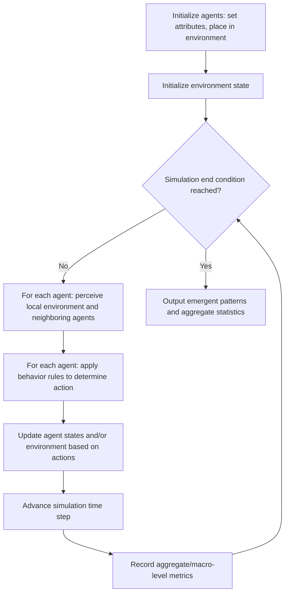

## Agent-Based Modeling

### Overview

Agent-Based Modeling (ABM) is a simulation paradigm that represents a system as a collection of autonomous, interacting entities called **agents**, each following individual behavior rules, rather than modelling the system through aggregate equations or a centralized process flow. System-level behavior in ABM is not explicitly programmed; instead, it **emerges** from the local interactions of many individual agents with each other and with their environment. This bottom-up approach makes ABM particularly well-suited to studying complex systems where aggregate patterns arise from decentralized, heterogeneous individual decision-making — phenomena that are difficult or impossible to capture with purely equation-based (continuous) or purely process-flow-based (discrete-event) models.

### Core Characteristics of Agent-Based Models

**Key Points**

- **Agents**: Autonomous entities with their own internal state, behavior rules, and decision-making logic (e.g., individual consumers, vehicles, animals, cells, or organizations).
- **Autonomy**: Agents act independently based on their own rules and perceived local environment, without central coordination dictating their behavior.
- **Heterogeneity**: Unlike aggregate models that treat a population as uniform, agents can differ from one another in attributes, state, and even behavior rules, allowing realistic representation of diverse populations.
- **Environment**: The space (physical, network-based, or abstract) within which agents exist and interact, which may itself have dynamic properties (e.g., resource availability, terrain).
- **Interaction**: Agents influence one another directly (e.g., communication, competition, collision) or indirectly through shared environmental resources.
- **Emergence**: System-level patterns and behaviors (e.g., traffic jams, market crashes, flocking behavior, disease outbreaks) arise from the cumulative effect of individual agent interactions, rather than being explicitly specified at the system level.
- **Adaptation/learning** (optional): In more sophisticated models, agents may modify their behavior rules over time based on experience or changing conditions.

### The Micro-to-Macro Relationship

**Key Points**

- The defining conceptual feature of ABM is the translation of **micro-level rules** (individual agent behavior) into **macro-level patterns** (observed system behavior), a relationship that is often nonlinear and not easily predictable from the individual rules alone.
- This makes ABM especially valuable for studying **emergent phenomena**, where the whole exhibits properties or behaviors not present in, or trivially deducible from, any individual part.
- Because emergence arises from simulation rather than being analytically derived, ABM is often used as an exploratory and theory-generating tool, complementing rather than replacing purely mathematical (equation-based) approaches.

The general relationship can be visualized as follows:

<svg xmlns="http://www.w3.org/2000/svg" viewBox="0 0 760 260">
<text x="380" y="28" font-size="18" font-weight="bold" text-anchor="middle" fill="#1a1a1a">Micro-Level Rules to Macro-Level Emergence (svg_diagram)</text>
<circle cx="120" cy="120" r="18" fill="#dbeafe" stroke="#1d4ed8" stroke-width="2" />
<circle cx="180" cy="80" r="18" fill="#dbeafe" stroke="#1d4ed8" stroke-width="2" />
<circle cx="180" cy="160" r="18" fill="#dbeafe" stroke="#1d4ed8" stroke-width="2" />
<circle cx="240" cy="120" r="18" fill="#dbeafe" stroke="#1d4ed8" stroke-width="2" />
<circle cx="240" cy="200" r="18" fill="#dbeafe" stroke="#1d4ed8" stroke-width="2" />
<circle cx="300" cy="60" r="18" fill="#dbeafe" stroke="#1d4ed8" stroke-width="2" />

<text x="120" y="125" font-size="10" text-anchor="middle" fill="`#1e3a8a`">A</text>

<text x="180" y="85" font-size="10" text-anchor="middle" fill="`#1e3a8a`">A</text>

<text x="180" y="165" font-size="10" text-anchor="middle" fill="`#1e3a8a`">A</text>

<text x="240" y="125" font-size="10" text-anchor="middle" fill="`#1e3a8a`">A</text>

<text x="240" y="205" font-size="10" text-anchor="middle" fill="`#1e3a8a`">A</text>

<text x="300" y="65" font-size="10" text-anchor="middle" fill="`#1e3a8a`">A</text>

<text x="190" y="235" font-size="13" text-anchor="middle" fill="`#1e3a8a`" font-weight="bold">Micro-level: individual agent rules</text>

<line x1="340" y1="140" x2="440" y2="140" stroke="#374151" stroke-width="2" marker-end="url(#arrow2)" />
<text x="390" y="125" font-size="11" text-anchor="middle" fill="#374151">simulate</text>
<rect x="470" y="70" width="230" height="140" rx="10" fill="#dcfce7" stroke="#15803d" stroke-width="2" />
<text x="585" y="100" font-size="14" font-weight="bold" text-anchor="middle" fill="#14532d">Emergent Pattern</text>
<text x="585" y="130" font-size="12" text-anchor="middle" fill="#14532d">(e.g., traffic jam,</text>
<text x="585" y="150" font-size="12" text-anchor="middle" fill="#14532d">market bubble,</text>
<text x="585" y="170" font-size="12" text-anchor="middle" fill="#14532d">flocking, segregation)</text>
<text x="585" y="230" font-size="13" text-anchor="middle" fill="#14532d" font-weight="bold">Macro-level: system behavior</text>
</svg>

### Structure of an Agent-Based Model

**Key Points**

- **Agent attributes**: State variables describing each agent (e.g., location, wealth, health status, opinion).
- **Agent behavior rules**: Conditional logic or decision procedures determining how an agent acts or updates its state based on its own attributes and its perception of the environment/neighbors (e.g., "if a neighboring cell is empty, move there").
- **Environment/space**: Commonly represented as a grid (cellular-automaton-like), a continuous 2D/3D space, or a network (graph), defining which agents can interact with which.
- **Scheduler**: Determines the order and timing in which agents update their state (e.g., synchronous updating, where all agents update simultaneously based on the prior state, versus asynchronous/random-order updating).
- **Global/aggregate outputs**: Metrics computed from the collection of individual agent states over time, used to observe emergent patterns (e.g., total infected count, average price, spatial clustering measures).

### Worked Example: Schelling's Segregation Model

**Example**

One of the most well-known illustrative ABMs is Schelling's segregation model, which demonstrates how mild individual preferences can produce strong emergent segregation patterns at the aggregate level.

- **Agents**: Individuals of two (or more) types, placed on a grid.
- **Behavior rule**: Each agent evaluates the proportion of its neighbors (within a defined neighborhood) that are of the same type. If this proportion falls below a satisfaction threshold (e.g., an agent wants at least 30% of neighbors to be the same type), the agent is "unsatisfied" and moves to a random empty cell.
- **Simulation loop**: At each time step, unsatisfied agents are identified and relocated; the process repeats until no agents are unsatisfied (equilibrium) or a maximum number of iterations is reached.
- **Emergent result**: Even with a relatively low individual satisfaction threshold (agents do not require a majority of similar neighbors, just a modest proportion), the aggregate spatial pattern that emerges after many iterations typically shows pronounced clustering and segregation by type — a macro-level outcome not explicitly programmed into any individual agent's rule, and one that would not be predicted from the mildness of the individual preference alone.

This example is frequently used to illustrate how ABM can generate counterintuitive insights about collective behavior from simple individual rules.

### Agent Interaction and Environment Representation

**Key Points**

- **Grid-based (cellular) environments**: Agents occupy cells in a lattice and interact with neighboring cells (commonly using a Moore neighborhood, the 8 surrounding cells, or a Von Neumann neighborhood, the 4 adjacent cells); common in models of land use, epidemics, and simple spatial dynamics.
- **Continuous-space environments**: Agents have continuous position coordinates and interact based on proximity within a defined radius; common in models of flocking, crowd movement, and physical particle-like systems.
- **Network-based environments**: Agents are represented as nodes in a graph, interacting only with directly connected agents; common in models of social influence, disease spread through contact networks, and information diffusion.
- **Mobile vs. static agents**: Some models feature agents that move through their environment (vehicles, animals, pedestrians), while others feature static agents that only interact with fixed neighbors (e.g., cellular automata-style models).

### Simulation Execution Cycle in ABM

The general execution cycle for an agent-based simulation follows a repeated update loop across discrete time steps (or, in some implementations, an event-driven update triggered by individual agent actions):

### Applications of Agent-Based Modeling

**Key Points**

- **Social science and economics**: Modelling segregation, opinion dynamics, market behavior, and the spread of social norms, where individual heterogeneity and local interaction are central to the phenomena studied.
- **Epidemiology**: Modelling disease spread through explicitly represented individual contact patterns, useful when population heterogeneity, contact network structure, or targeted interventions (e.g., isolating specific individuals) are important, complementing aggregate compartmental (continuous) models.
- **Traffic and pedestrian dynamics**: Modelling individual vehicle or pedestrian decision-making (lane changes, route choice, crowd movement) to study emergent phenomena such as traffic jams or crowd bottlenecks.
- **Ecology**: Modelling individual organism behavior (foraging, reproduction, predation) to study population-level dynamics, spatial distribution, and species interactions.
- **Supply chains and organizations**: Modelling individual firms or supply-chain actors as agents with independent decision rules (ordering policy, negotiation strategy) to study emergent supply-chain behaviors such as the bullwhip effect.
- **Biology**: Modelling individual cells or molecules as agents to study tissue-level or population-level biological phenomena (e.g., tumor growth, immune response).

### ABM vs. Other Simulation Paradigms

**Key Points**

- **ABM vs. Discrete-Event Simulation**: DES emphasizes entities flowing through a process structure managed by a centralized future event list, typically focused on system-wide throughput and queueing metrics; ABM emphasizes autonomous, heterogeneous agents with individual decision rules, typically focused on emergent spatial or social patterns. Many practical models blur this line, using DES-style process flows for agents with individual attributes.
- **ABM vs. Continuous (Equation-Based) Simulation**: Continuous simulation represents a system through aggregate state variables and differential equations, implicitly assuming homogeneity within each modelled population/compartment; ABM explicitly represents heterogeneity and individual-level variation, capturing distributional effects and localized interactions that aggregate equations average away.
- **When ABM is preferred**: ABM is generally favored when individual heterogeneity, local/spatial interaction structure, adaptive or learning behavior, and emergent phenomena are central to the research question; aggregate equation-based models are often preferred when the population is reasonably homogeneous and computational efficiency for large-scale, long-duration simulation is a priority. [Inference: this preference is a general modelling heuristic rather than a strict rule, and hybrid combinations are frequently used precisely because either paradigm alone may be insufficient.]

### Verification and Validation Challenges Specific to ABM

**Key Points**

- **Emergent outcome validation**: Because system-level behavior emerges from individual rules rather than being directly specified, validating an ABM often requires comparing emergent macro-level patterns (not just individual agent behavior) against real-world aggregate data.
- **Sensitivity to individual rule specification**: Small changes to individual behavior rules or interaction structure can produce disproportionately different emergent outcomes, making thorough sensitivity analysis particularly important in ABM.
- **Calibration difficulty**: Determining realistic parameter values for individual agent behavior rules (which are often not directly observable, unlike aggregate statistics) can be more difficult than calibrating aggregate continuous models, sometimes requiring techniques such as approximate Bayesian computation or empirically-grounded behavioral data.
- **Stochastic replication**: As with other stochastic simulation paradigms, ABM results are typically obtained from many replications (given random initial agent placement, random behavior tie-breaking, etc.) to characterize the distribution of possible emergent outcomes rather than relying on a single run.

### Common Software Tools and Implementation Approaches

**Key Points**

- **General-purpose programming languages**: Python (with libraries such as Mesa) and Java-based frameworks allow custom implementation of agent behavior rules and environment structures with maximum flexibility.
- **Specialized ABM platforms**: Tools such as NetLogo are widely used in education and research for their accessible visual environment and built-in agent/patch/link abstractions; MASON and Repast are used for more computationally intensive research applications; AnyLogic supports ABM alongside DES and system dynamics within a single multi-paradigm environment. [Unverified: specific current feature sets and performance characteristics of named platforms should be checked against current documentation, as these evolve over time.]

### Advantages and Limitations

**Key Points**

- **Advantages**: Naturally captures heterogeneity and individual-level variation; well-suited to studying emergent phenomena that aggregate models cannot represent; intuitive correspondence between model structure and real-world individual entities, aiding communication with domain experts and stakeholders; flexible enough to incorporate adaptive/learning agent behavior.
- **Limitations**: Computationally intensive for large agent populations, since each agent's state and interactions must be individually tracked and updated; results can be highly sensitive to individual rule specification and parameter choices, complicating calibration and validation; the stochastic and emergent nature of outputs can make it harder to isolate causal mechanisms compared to more analytically tractable equation-based models; lack of standardized theoretical foundations (compared to, e.g., queueing theory for DES) can make formal output analysis less standardized across different ABM applications. [Inference: the extent of this last limitation varies by field, as some ABM research communities have developed established statistical and analytical conventions specific to their domain.]

### Conclusion

Agent-Based Modeling provides a bottom-up simulation paradigm for studying complex systems composed of autonomous, heterogeneous, interacting entities, where system-level behavior emerges from individual-level rules rather than being directly specified. Its strength lies in capturing heterogeneity, local interaction structure, and emergent phenomena that aggregate continuous models and process-centric discrete-event models cannot naturally represent. Effective use of ABM requires careful design of agent behavior rules and environment structure, rigorous sensitivity analysis given the sensitivity of emergent outcomes to individual rule specification, and validation against real-world aggregate patterns rather than individual agent behavior alone.

**Related Topics**

- Cellular Automata and Grid-Based Environments
- Network-Based Agent Interaction and Social Network Analysis
- Schelling's Segregation Model and Other Classic ABM Case Studies
- Emergence and Complex Adaptive Systems Theory
- Calibration and Validation Techniques for Agent-Based Models
- NetLogo, Mesa, and Other ABM Software Platforms
- Hybrid Agent-Based and System Dynamics Modelling
- Sensitivity Analysis in Agent-Based Models