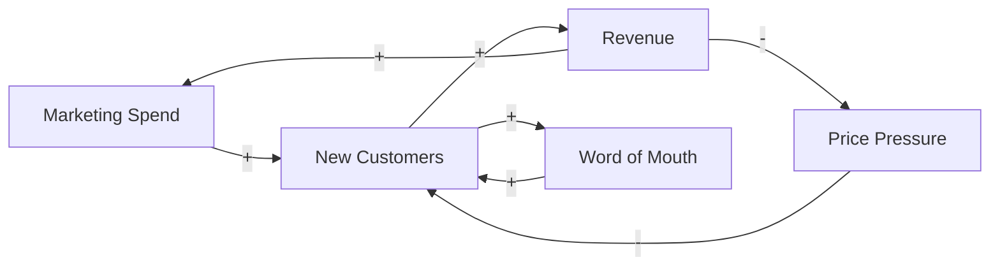
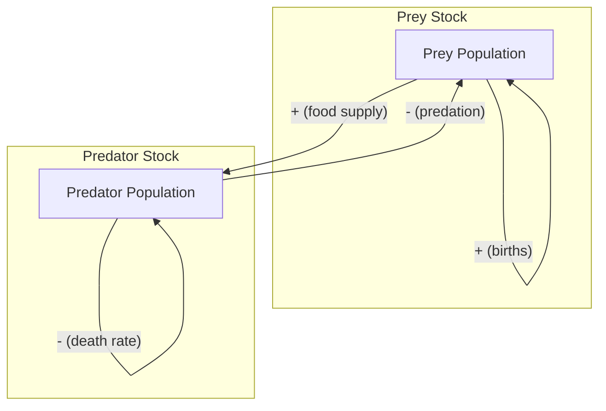

## System Dynamics Modeling

### Overview

System dynamics is a simulation paradigm for modeling the behavior of complex systems over time, developed by Jay Forrester at MIT in the 1950s. It represents systems using **stocks** (accumulations), **flows** (rates of change), **feedback loops**, and **time delays**, capturing how the internal structure of a system produces its behavior over time. It operates at a continuous, aggregate level of abstraction — modeling populations, quantities, and rates rather than individual discrete entities.

System dynamics is best suited to problems where feedback, delays, and accumulation dominate system behavior — such as policy analysis, supply chains, epidemiology, corporate strategy, and environmental systems.

### Core Building Blocks

**Stocks (Levels)**

A stock represents an accumulation — a quantity that has built up over time and persists even if all activity stops. Examples: inventory in a warehouse, population of a species, water in a bathtub, cumulative knowledge in an organization.

Mathematically, a stock is the integral of its net flow:

$$Stock(t) = Stock(t_0) + \int_{t_0}^{t} \left[ \text{Inflow}(s) - \text{Outflow}(s) \right] ds$$

**Flows (Rates)**

A flow represents the rate of change of a stock — movement into or out of an accumulation per unit time. Examples: birth rate, hiring rate, production rate, decay rate. Flows are the derivatives of stocks:

$$\frac{d(Stock)}{dt} = \text{Inflow}(t) - \text{Outflow}(t)$$

**Converters (Auxiliary Variables)**

Converters transform inputs into outputs using algebraic relationships, constants, or lookup tables. They often represent decision rules, ratios, or intermediate calculations that link stocks to flows (e.g., converting "population" and "birth rate per capita" into an actual "births" flow).

**Connectors (Information Links)**

Connectors carry information (not material) from one element to another, indicating that a converter, flow, or stock's value depends on another element's value. They establish the causal structure of the model without themselves representing quantity or accumulation.

Below is the canonical stock-and-flow notation:

<svg xmlns="http://www.w3.org/2000/svg" viewBox="0 0 760 260" font-family="Helvetica, Arial, sans-serif">
<text x="380" y="24" text-anchor="middle" font-size="15" font-weight="bold" fill="#1a1a1a">Stock and Flow Diagram Notation (svg_diagram)</text>

<rect x="300" y="90" width="160" height="70" fill="#dbeafe" stroke="#1e40af" stroke-width="2" />
<text x="380" y="130" text-anchor="middle" font-size="14" fill="#1e293b">Stock</text>
<text x="380" y="148" text-anchor="middle" font-size="11" fill="#475569">(e.g., Population)</text>

<line x1="60" y1="125" x2="290" y2="125" stroke="#1a1a1a" stroke-width="3" />
<polygon points="290,118 305,125 290,132" fill="#1a1a1a" />
<circle cx="120" cy="125" r="16" fill="#bbf7d0" stroke="#166534" stroke-width="2" />
<text x="120" y="106" text-anchor="middle" font-size="11" fill="#1e293b">Inflow</text>
<text x="120" y="150" text-anchor="middle" font-size="10" fill="#475569">(Births)</text>

<line x1="470" y1="125" x2="700" y2="125" stroke="#1a1a1a" stroke-width="3" />
<polygon points="700,118 715,125 700,132" fill="#1a1a1a" />
<circle cx="640" cy="125" r="16" fill="#fecaca" stroke="#991b1b" stroke-width="2" />
<text x="640" y="106" text-anchor="middle" font-size="11" fill="#1e293b">Outflow</text>
<text x="640" y="150" text-anchor="middle" font-size="10" fill="#475569">(Deaths)</text>

<ellipse cx="45" cy="125" rx="22" ry="14" fill="#f1f5f9" stroke="#64748b" stroke-width="1.5" />
<ellipse cx="735" cy="125" rx="22" ry="14" fill="#f1f5f9" stroke="#64748b" stroke-width="1.5" />

<circle cx="120" cy="210" r="20" fill="#fef9c3" stroke="#854d0e" stroke-width="2" />
<text x="120" y="214" text-anchor="middle" font-size="10" fill="#1e293b">Birth</text>
<text x="120" y="245" text-anchor="middle" font-size="10" fill="#475569">Rate (Converter)</text>

<path d="M 130,192 Q 140,160 118,140" fill="none" stroke="#0369a1" stroke-width="1.5" stroke-dasharray="4,2" />
<polygon points="112,144 118,140 122,148" fill="#0369a1" />

<path d="M 340,160 Q 260,200 145,208" fill="none" stroke="#0369a1" stroke-width="1.5" stroke-dasharray="4,2" />
<polygon points="150,203 145,208 149,213" fill="#0369a1" />

<text x="380" y="232" text-anchor="middle" font-size="10" fill="`#64748b`">Solid arrows = material flow. Dashed arrows = information (connector).</text>

</svg>

### Feedback Loops

Feedback loops are the mechanism by which system dynamics models generate endogenous behavior — behavior arising from internal structure rather than external forcing.

**Reinforcing Loops (R)**

A reinforcing loop amplifies change in the same direction — growth generates more growth, decline generates more decline. Every causal link in the loop, when traced around, has a net positive polarity. Examples: compound interest, viral adoption, population growth (births increase population, which increases future births).

**Balancing Loops (B)**

A balancing loop counteracts change, driving a system toward a goal or equilibrium. It has a net negative polarity around the loop. Examples: thermostat control, market supply-demand equilibrium, predator-prey population regulation.

Most real systems contain multiple interacting reinforcing and balancing loops, and which loop dominates at a given time determines the system's observed behavior (e.g., exponential growth followed by saturation as a balancing loop takes over).

<svg xmlns="http://www.w3.org/2000/svg" viewBox="0 0 760 320" font-family="Helvetica, Arial, sans-serif">
<text x="380" y="24" text-anchor="middle" font-size="15" font-weight="bold" fill="#1a1a1a">Reinforcing vs Balancing Feedback Loops (svg_diagram)</text>

<text x="180" y="55" text-anchor="middle" font-size="13" font-weight="bold" fill="`#166534`">Reinforcing Loop (R)</text>

<circle cx="180" cy="150" r="80" fill="none" stroke="`#166534`" stroke-width="2" />

<rect x="140" y="80" width="80" height="36" fill="`#bbf7d0`" stroke="`#166534`" stroke-width="1.5" rx="4" />

<text x="180" y="103" text-anchor="middle" font-size="11" fill="`#1e293b`">Population</text>

<rect x="140" y="196" width="80" height="36" fill="`#bbf7d0`" stroke="`#166534`" stroke-width="1.5" rx="4" />

<text x="180" y="219" text-anchor="middle" font-size="11" fill="`#1e293b`">Births</text>

<path d="M 214,112 Q 260,150 214,196" fill="none" stroke="`#166534`" stroke-width="2" />

<polygon points="210,192 214,196 219,188" fill="`#166534`" />

<text x="255" y="155" font-size="10" fill="`#166534`">+</text>

<path d="M 146,196 Q 100,150 146,112" fill="none" stroke="`#166534`" stroke-width="2" />

<polygon points="150,116 146,112 141,120" fill="`#166534`" />

<text x="100" y="155" font-size="10" fill="`#166534`">+</text>

<text x="180" y="155" text-anchor="middle" font-size="12" fill="`#166534`">R</text>

<text x="580" y="55" text-anchor="middle" font-size="13" font-weight="bold" fill="`#991b1b`">Balancing Loop (B)</text>

<circle cx="580" cy="150" r="80" fill="none" stroke="`#991b1b`" stroke-width="2" />

<rect x="540" y="80" width="80" height="36" fill="`#fecaca`" stroke="`#991b1b`" stroke-width="1.5" rx="4" />

<text x="580" y="103" text-anchor="middle" font-size="11" fill="`#1e293b`">Inventory</text>

<rect x="540" y="196" width="80" height="36" fill="`#fecaca`" stroke="`#991b1b`" stroke-width="1.5" rx="4" />

<text x="580" y="219" text-anchor="middle" font-size="11" fill="`#1e293b`">Order Rate</text>

<path d="M 614,112 Q 660,150 614,196" fill="none" stroke="`#991b1b`" stroke-width="2" />

<polygon points="610,192 614,196 619,188" fill="`#991b1b`" />

<text x="655" y="155" font-size="10" fill="`#991b1b`">+</text>

<path d="M 546,196 Q 500,150 546,112" fill="none" stroke="`#991b1b`" stroke-width="2" />

<polygon points="550,116 546,112 541,120" fill="`#991b1b`" />

<text x="500" y="155" font-size="10" fill="`#991b1b`">−</text>

<text x="580" y="155" text-anchor="middle" font-size="12" fill="`#991b1b`">B</text>

<text x="380" y="300" text-anchor="middle" font-size="10" fill="`#64748b`">Loop polarity = product of all link signs traversed around the loop.</text>

</svg>

### Causal Loop Diagrams (CLDs)

Causal loop diagrams are a qualitative precursor to full stock-and-flow models. They show causal relationships between variables using arrows labeled with polarity (+ or −), without distinguishing stocks from flows. CLDs are used in the conceptualization phase to map mental models and identify feedback structure before committing to quantitative formulation.

A **+** link means the two variables move in the same direction (all else equal); a **−** link means they move in opposite directions. Loop polarity is determined by multiplying the signs around the closed loop: an even number of minus signs (or none) yields a reinforcing loop; an odd number yields a balancing loop.

### Time Delays

Delays represent the lag between a cause and its observed effect, and are a primary source of oscillation, overshoot, and instability in system dynamics models. Common delay structures include:

- **Material delays** — physical goods in transit (e.g., shipping pipeline)
- **Information delays** — lag in perceiving or reporting a signal (e.g., smoothed sales forecasts)
- **Perception/adjustment delays** — gradual behavioral response to a perceived gap

A first-order exponential delay is commonly modeled as:

$$\frac{d(Output)}{dt} = \frac{Input(t) - Output(t)}{\tau}$$

where $\tau$ is the average delay time (time constant). Higher-order delays (chains of first-order delays in series) produce a more pronounced, S-shaped lag response and are used when a sharper, less "leaky" delay behavior is needed to match real system data.

### Canonical Model Structures

**Exponential Growth**

A single reinforcing loop where the outflow (or inflow) is proportional to the stock itself:

$$\frac{dP}{dt} = rP$$

Produces unbounded exponential growth (or decay if $r < 0$), the signature behavior of a pure reinforcing loop.

**Goal-Seeking (Balancing) Structure**

A single balancing loop where the flow is proportional to the gap between the stock and a goal:

$$\frac{dS}{dt} = \frac{(Goal - S)}{\text{Adjustment Time}}$$

Produces asymptotic approach to the goal — the signature behavior of a pure balancing loop.

**S-Shaped Growth (Logistic)**

Combines a reinforcing loop (growth) with a balancing loop (carrying-capacity constraint) that dominates as the stock approaches a limit:

$$\frac{dP}{dt} = rP\left(1 - \frac{P}{K}\right)$$

where $K$ is the carrying capacity. Early behavior resembles exponential growth; as $P \to K$, the balancing loop dominates and growth flattens.

**Overshoot and Oscillation**

Arises when a balancing loop contains a significant delay, causing the corrective action to overcorrect. The classic example is inventory-and-order management, where delayed perception of inventory gaps causes ordering to overshoot, then undershoot, producing oscillation (this structure underlies the well-known "bullwhip effect" in supply chains).

**Overshoot and Collapse**

Occurs when a reinforcing growth loop interacts with a balancing loop tied to a depletable resource (e.g., population growth constrained by a non-renewing resource base). Growth continues past the sustainable carrying capacity due to delay, then collapses as the resource is depleted — a structure central to models like *World3* (used in *Limits to Growth*).

### The Modeling Process

**Key Points**

1. **Problem articulation** — define the purpose, boundary, time horizon, and the reference behavior pattern (the historical/expected trend the model must reproduce)
2. **Dynamic hypothesis** — formulate a causal loop diagram capturing the feedback structure believed to generate the problematic behavior
3. **Formulation** — convert the causal structure into a formal stock-and-flow model with quantified equations, parameters, and initial conditions
4. **Testing** — validate against reference behavior, run extreme-condition tests, dimensional consistency checks, and sensitivity analysis
5. **Policy design and evaluation** — use the validated model to test interventions and structural changes before real-world implementation

### Numerical Simulation

System dynamics models are systems of coupled first-order ordinary differential equations (ODEs), solved numerically over discrete time steps. Common integration methods:

- **Euler's method** — simplest, first-order accuracy: $x_{t+\Delta t} = x_t + \Delta t \cdot f(x_t, t)$. Computationally cheap but can introduce numerical error or artificial oscillation if $\Delta t$ is too large relative to system time constants.
- **Runge-Kutta 4th order (RK4)** — higher accuracy, widely used as the default in professional system dynamics software (e.g., Vensim, Stella) for smoother, more stable results with larger time steps.

**Time step selection** should satisfy $\Delta t \leq \frac{1}{4}$ to $\frac{1}{10}$ of the shortest time constant in the model, to avoid numerical instability — a heuristic guideline rather than a strict guarantee across all model structures. [Inference — the precise safety margin depends on model stiffness and the chosen integration scheme.]

### Worked Example: Predator-Prey Dynamics

A classic system dynamics formulation of the Lotka-Volterra model, expressed as stocks (Prey, Predators) governed by feedback:

$$\frac{dPrey}{dt} = \alpha \cdot Prey - \beta \cdot Prey \cdot Predators$$

$$\frac{dPredators}{dt} = \delta \cdot Prey \cdot Predators - \gamma \cdot Predators$$

- $\alpha$ = prey birth rate (reinforcing loop: more prey → more prey births)
- $\beta$ = predation rate coefficient (balancing loop: more predators → fewer prey)
- $\delta$ = predator growth efficiency from consumed prey (reinforcing loop: more prey → more predator growth)
- $\gamma$ = predator death rate (balancing loop: predators self-deplete)

This structure — two interlinked stocks, each driven by a reinforcing and a balancing loop — produces sustained oscillation, since neither population reaches a stable equilibrium but instead cycles around it.

### Comparison with Other Simulation Paradigms

| Aspect | System Dynamics | Discrete Event Simulation | Agent-Based Modeling |
| --- | --- | --- | --- |
| Abstraction level | Aggregate, continuous | Entity/event-level, discrete | Individual agent-level |
| Time treatment | Continuous (or fine discrete steps) | Event-driven, jumps between events | Discrete ticks or event-driven |
| State representation | Stocks and flows | Entities with attributes, queues | Autonomous agents with rules |
| Best suited for | Feedback-dominated aggregate trends | Process/resource-constrained systems | Emergent behavior from local interaction |
| Typical output | Smooth trend curves | Throughput, wait times, utilization | Spatial/network patterns, emergence |

### Common Software Tools

- **Vensim** — widely used in academia and policy modeling; strong support for optimization and sensitivity analysis
- **Stella/iThink** — known for accessible visual interface, common in education
- **AnyLogic** — supports hybrid modeling combining system dynamics with agent-based and discrete-event paradigms
- **Python (via `PySD` or custom ODE solvers using `scipy.integrate.odeint`/`solve_ivp`)** — used for programmatic, code-based system dynamics modeling and integration into larger analytical pipelines

### Common Pitfalls

- **Boundary misspecification** — excluding a variable or feedback loop that materially affects the behavior being studied ("everything is connected to everything" — modeling requires disciplined judgment about relevance, not just completeness)
- **Ignoring delays** — omitting realistic information or material delays, which understates the potential for oscillation or overshoot
- **Overfitting to historical data** — tuning parameters purely to match a single historical trace rather than to represent plausible real-world mechanisms, which produces a model with poor structural validity even if numerically it fits data
- **Confusing correlation-based CLDs with validated causal structure** — a causal loop diagram encodes hypothesized causality, not proven causality, and must be tested/validated before being used for policy conclusions [Unverified — validity depends entirely on domain grounding and testing rigor applied by the modeler]

**Related Topics**

- Simulation Paradigms — Discrete Event Simulation
- Simulation Paradigms — Agent-Based Modeling
- Numerical methods for ODEs (Euler, RK4, adaptive step-size solvers)
- Sensitivity analysis and Monte Carlo methods in simulation
- The *World3* model and *Limits to Growth* case study
- Bullwhip effect in supply chain dynamics
- PySD: Python-based system dynamics modeling
- Model validation and verification (V&V) techniques in simulation