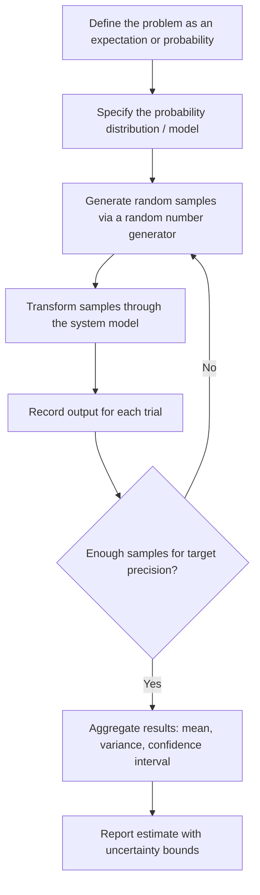

## Monte Carlo Simulation as a Paradigm

Monte Carlo simulation is a computational paradigm that uses repeated random sampling to obtain numerical estimates of quantities that are difficult or impossible to compute analytically. Rather than solving a system through closed-form equations, the method approximates a solution by generating a large number of random trials, observing the outcomes, and aggregating them into statistical estimates. The paradigm underlies applications ranging from nuclear physics and financial risk modeling to computer graphics rendering and machine learning inference.

### Historical Origins

The method was formalized in the 1940s by Stanislaw Ulam, John von Neumann, and Nicholas Metropolis while working on nuclear weapon design at Los Alamos National Laboratory. Ulam conceived the idea while considering the probability of winning a game of solitaire, realizing that random sampling could estimate probabilities that were combinatorially intractable to compute directly. The name "Monte Carlo" was coined by Metropolis, referencing the Monte Carlo Casino in Monaco, since Ulam's uncle would borrow money from relatives to gamble there. The method was first applied to neutron diffusion and criticality problems in fission weapon design, where analytical solutions to the transport equations were computationally infeasible with the technology of the era.

### Core Principle

The foundational idea is that many problems — particularly those involving integration, optimization, or probabilistic inference — can be reframed as expectations over a probability distribution. If a quantity of interest can be expressed as:

$$I = \int_{\Omega} f(x) \, p(x) \, dx = \mathbb{E}_{p}[f(x)]$$

then this expectation can be approximated by drawing $N$ independent samples $x_1, x_2, \dots, x_N$ from $p(x)$ and computing the sample average:

$$\hat{I}_N = \frac{1}{N} \sum_{i=1}^{N} f(x_i)$$

By the Law of Large Numbers, $\hat{I}_N$ converges to the true value $I$ as $N \to \infty$. The Central Limit Theorem further guarantees that the estimator's error is asymptotically normally distributed, which allows quantification of confidence intervals around the estimate.

### Why the Paradigm Works

Monte Carlo methods are particularly valuable in three circumstances:

- **High-dimensional integration** — Deterministic quadrature methods (e.g., Simpson's rule, Gaussian quadrature) suffer from the "curse of dimensionality," where computational cost grows exponentially with the number of dimensions. Monte Carlo error, in contrast, scales as $O(1/\sqrt{N})$ regardless of dimensionality, making it comparatively efficient in high-dimensional spaces.
- **Complex or unknown analytical structure** — Many systems (e.g., particle transport, financial derivatives with path-dependent payoffs) lack closed-form solutions. Simulating the underlying stochastic process directly avoids the need to derive one.
- **Systems with inherent randomness** — Physical or economic systems that are stochastic by nature (radioactive decay, stock price movements, queueing arrivals) are naturally suited to a sampling-based representation rather than a deterministic one.

### Convergence Rate

A defining — and often counterintuitive — property of the paradigm is its convergence behavior. The standard error of the Monte Carlo estimator is:

$$\text{SE}(\hat{I}_N) = \frac{\sigma}{\sqrt{N}}$$

where $\sigma$ is the standard deviation of $f(x)$ under $p(x)$. This means that to reduce the error by a factor of 10, the number of samples $N$ must increase by a factor of 100. This slow, dimension-independent convergence is both the paradigm's greatest weakness (compared to fast-converging deterministic methods in low dimensions) and its greatest strength (since the rate does not degrade as dimensionality increases, unlike deterministic quadrature).

### General Algorithmic Structure

Most Monte Carlo simulations, regardless of domain, follow a common structural pattern:

### Key Points

- Monte Carlo simulation reframes deterministic or intractable problems as statistical estimation problems solved through repeated random sampling.
- Convergence follows $O(1/\sqrt{N})$, independent of the problem's dimensionality — a property that distinguishes it from deterministic numerical methods.
- The paradigm depends critically on the quality of the underlying random number generator (RNG); poor-quality pseudo-random sequences can introduce bias or correlation artifacts into results. [Inference — the degree of impact depends on the specific RNG and application; well-established generators like Mersenne Twister or PCG are standard in modern implementations]
- Results are inherently probabilistic estimates, not exact values, and should always be reported with a measure of uncertainty (variance, standard error, or confidence interval).

### Random Number Generation

The integrity of a Monte Carlo simulation rests on the quality of its source of randomness. Two broad categories exist:

- **Pseudo-random number generators (PRNGs)** — Deterministic algorithms (e.g., Mersenne Twister, PCG, Xorshift) that produce sequences which statistically resemble true randomness. They are seeded, meaning the same seed reproduces the same sequence — a property valuable for debugging and reproducibility.
- **Quasi-random (low-discrepancy) sequences** — Sequences such as Sobol or Halton sequences that are not random in the statistical sense but are designed to fill a space more uniformly than pseudo-random sampling. Simulations using these sequences are typically termed **Quasi-Monte Carlo (QMC)** methods, and can achieve faster convergence (closer to $O(1/N)$) for certain classes of smooth, low-dimensional integrands. [Inference — the improved convergence rate for QMC is well-documented for smooth integrands in moderate dimensions, but the advantage diminishes or disappears for discontinuous functions or very high dimensions]

For applications requiring cryptographic-grade unpredictability (distinct from simulation applications), true random number generators (TRNGs) sourced from physical entropy are used instead, though this is generally unnecessary for standard simulation work.

### Variance Reduction Techniques

Because convergence is slow, practitioners commonly apply variance reduction techniques to achieve acceptable precision with fewer samples:

- **Antithetic variates** — Pairing each random sample with its negatively correlated counterpart (e.g., using both $u$ and $1-u$ from a uniform draw) to cancel out variance.
- **Control variates** — Using a correlated variable with a known expected value to adjust the estimate and reduce variance.
- **Importance sampling** — Sampling more frequently from regions of the domain that contribute most to the result, then reweighting samples to correct for the biased sampling distribution.
- **Stratified sampling** — Dividing the sample space into non-overlapping subregions ("strata") and ensuring samples are drawn from each, preventing clustering or gaps.
- **Latin Hypercube Sampling (LHS)** — A generalization of stratified sampling to multiple dimensions, ensuring each dimension is evenly sampled across its range.

### Example

Estimating the value of $\pi$ using Monte Carlo sampling is a classic illustrative case. Consider a unit circle inscribed in a $2 \times 2$ square. The ratio of the circle's area to the square's area is $\pi/4$. By randomly sampling points uniformly within the square and computing the fraction that fall inside the circle, $\pi$ can be estimated:

$$\hat{\pi} \approx 4 \times \frac{\text{points inside circle}}{\text{total points}}$$

A simplified procedural outline:

1. Generate $N$ random points $(x_i, y_i)$ where $x_i, y_i \sim \text{Uniform}(-1, 1)$.
2. For each point, test whether $x_i^2 + y_i^2 \leq 1$ (inside the circle).
3. Let $M$ be the count of points satisfying the condition.
4. Compute $\hat{\pi} = 4M/N$.

With $N = 10,000$ samples, the estimate typically converges to within approximately $\pm 0.02$ of the true value of $\pi$, though the exact deviation on any given run is random by construction. [Inference — precise numerical error on a specific run cannot be guaranteed and depends on the realized random draw]

### Diagram: Monte Carlo Sampling Geometry (svg_diagram)

<svg xmlns="http://www.w3.org/2000/svg" viewBox="0 0 420 300">
  <rect x="0" y="0" width="420" height="300" fill="#ffffff" />
  <text x="210" y="24" text-anchor="middle" font-size="16" font-weight="bold" fill="#1a1a1a">Monte Carlo Estimation of π (svg_diagram)</text>

  <rect x="60" y="45" width="220" height="220" fill="none" stroke="#333333" stroke-width="2" />
  <circle cx="170" cy="155" r="110" fill="none" stroke="#2563eb" stroke-width="2" />

  <circle cx="95" cy="70" r="2.5" fill="#2563eb" />
  <circle cx="130" cy="95" r="2.5" fill="#2563eb" />
  <circle cx="150" cy="60" r="2.5" fill="#2563eb" />
  <circle cx="170" cy="155" r="2.5" fill="#2563eb" />
  <circle cx="200" cy="180" r="2.5" fill="#2563eb" />
  <circle cx="220" cy="120" r="2.5" fill="#2563eb" />
  <circle cx="140" cy="200" r="2.5" fill="#2563eb" />
  <circle cx="190" cy="90" r="2.5" fill="#2563eb" />
  <circle cx="160" cy="130" r="2.5" fill="#2563eb" />
  <circle cx="230" cy="200" r="2.5" fill="#2563eb" />

  <circle cx="70" cy="55" r="2.5" fill="#dc2626" />
  <circle cx="270" cy="60" r="2.5" fill="#dc2626" />
  <circle cx="65" cy="255" r="2.5" fill="#dc2626" />
  <circle cx="265" cy="250" r="2.5" fill="#dc2626" />
  <circle cx="75" cy="230" r="2.5" fill="#dc2626" />
  <circle cx="255" cy="75" r="2.5" fill="#dc2626" />
  <circle cx="80" cy="150" r="2.5" fill="#dc2626" />

  <rect x="60" y="278" width="10" height="10" fill="#2563eb" />
  <text x="76" y="287" font-size="11" fill="#1a1a1a">Inside circle (counted)</text>
  <rect x="220" y="278" width="10" height="10" fill="#dc2626" />
  <text x="236" y="287" font-size="11" fill="#1a1a1a">Outside circle</text>

  <text x="320" y="80" font-size="12" fill="#1a1a1a">Square area = 4</text>
  <text x="320" y="100" font-size="12" fill="#1a1a1a">Circle area = π</text>
  <text x="320" y="120" font-size="12" fill="#1a1a1a">Ratio = π/4</text>
  <text x="320" y="150" font-size="12" fill="#1a1a1a">π̂ = 4M/N</text>
</svg>

### Applications by Domain

- **Physics and engineering** — Neutron transport, radiation shielding design, statistical mechanics (e.g., Ising model simulations), reliability engineering.
- **Finance** — Option pricing (particularly path-dependent derivatives), portfolio risk assessment (Value at Risk), credit risk modeling.
- **Operations research** — Queueing systems, inventory management under demand uncertainty, project scheduling risk (e.g., PERT simulations).
- **Machine learning and statistics** — Bayesian inference via Markov Chain Monte Carlo (MCMC), Monte Carlo dropout for uncertainty estimation, reinforcement learning (Monte Carlo methods for policy evaluation).
- **Computer graphics** — Path tracing and global illumination rendering, where light transport integrals are estimated via random ray sampling.

### Strengths and Limitations

**Key Points**

- **Strengths**: Conceptually simple to implement; naturally handles high-dimensional and complex stochastic systems; convergence rate is independent of dimensionality; easily parallelizable since individual trials are typically independent.
- **Limitations**: Slow $O(1/\sqrt{N})$ convergence makes high-precision estimates computationally expensive; results carry inherent sampling variance and must be reported with uncertainty bounds; quality is dependent on the underlying random number generator; naive implementations can be inefficient for rare-event estimation, requiring specialized techniques like importance sampling.

### Relationship to Other Simulation Paradigms

Monte Carlo simulation is often contrasted with discrete-event simulation (DES) and system dynamics (SD). Where DES models a system as a sequence of state-changing events over simulated time, and SD models continuous feedback loops through differential equations, Monte Carlo simulation is primarily a *sampling and estimation* paradigm that can be layered onto either — for instance, using random sampling to represent stochastic event timing within a DES model, or to characterize parameter uncertainty within an SD model. In this sense, Monte Carlo is less a competing paradigm for representing system structure and more a general-purpose technique for handling uncertainty and estimation within any simulation framework.

### Next Steps

- Markov Chain Monte Carlo (MCMC) — Metropolis-Hastings and Gibbs Sampling
- Discrete-Event Simulation as a Paradigm
- System Dynamics as a Paradigm
- Variance Reduction Techniques in Depth (Importance Sampling, Control Variates)
- Quasi-Monte Carlo Methods and Low-Discrepancy Sequences
- Random Number Generation: Algorithms and Statistical Testing
- Monte Carlo Methods in Bayesian Inference
- Sensitivity Analysis and Uncertainty Quantification in Simulation Models