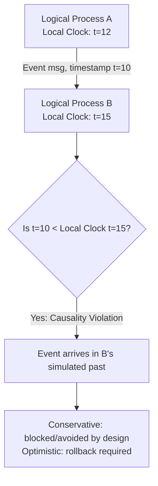
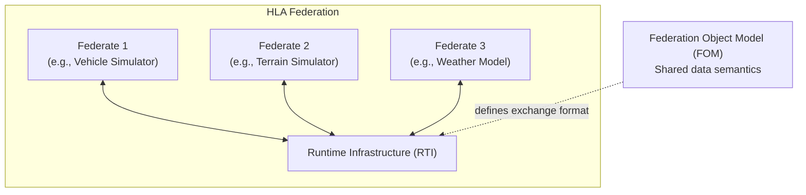

## Distributed and Parallel Simulation

### Overview

Distributed and parallel simulation is a computational paradigm concerned with executing a single simulation across multiple processors, cores, or physically separate machines, rather than as a single sequential process on one processor. It addresses a fundamental limitation of large-scale simulation: as model fidelity, entity counts, or geographic scope grow, sequential execution becomes too slow or memory-constrained to be practical. This paradigm spans two related but distinct goals — **speeding up** a simulation through parallel computation, and **enabling geographically distributed participants** (people, systems, or simulators) to interact within a single coherent simulated world.

Distributed and parallel simulation is not itself a modeling paradigm like system dynamics or agent-based modeling — it is an **execution architecture** that can host any of those paradigms, chosen when scale, real-time interactivity, or organizational distribution makes single-process execution insufficient.

### Motivations

- **Performance** — reducing wall-clock execution time for computationally intensive simulations (e.g., large-scale agent-based models with millions of agents, high-resolution physical simulations)
- **Memory scaling** — distributing state across multiple machines when a model's memory footprint exceeds what a single machine can hold
- **Geographic distribution** — enabling simulators located in different physical locations (different labs, military training sites, or organizations) to participate in one shared simulation
- **Legacy system integration** — combining multiple independently developed simulators (each modeling a different subsystem) into a single federated exercise without rewriting them
- **Real-time interactivity** — supporting human-in-the-loop training simulators (e.g., military or aviation simulators) where multiple participants must experience a consistent, low-latency shared simulated environment

### Core Challenge: Time Management

The central technical difficulty in distributed simulation is **synchronization** — ensuring that events are processed in correct time order across processes that do not share a global clock and communicate only via messages with unpredictable delivery delay. If Process A sends an event timestamped $t=10$ to Process B, but Process B has already advanced past simulated time $t=10$ processing its own local events, a **causality violation** occurs: the simulation has computed an outcome based on stale information.

This problem does not exist in single-process sequential discrete event simulation, where a single global event queue guarantees strict timestamp order. Distributed simulation must reconstruct that guarantee — or explicitly tolerate its violation — across independently executing processes.

### Time Management Approaches

**Conservative Synchronization**

Conservative approaches strictly prevent causality violations from ever occurring, by having each logical process only advance its local clock when it can guarantee — based on lookahead information about the minimum timestamp of any future incoming message — that no earlier event can still arrive.

- **Chandy-Misra-Bryant (CMB) algorithm** — a foundational conservative protocol where each logical process only processes an event once it has received messages (or null messages, sent purely to communicate a lower bound on future timestamps) from all input channels confirming no earlier event is pending
- **Advantages** — simplicity, no wasted computation from incorrect speculative execution, guaranteed-correct event ordering
- **Disadvantages** — can suffer from **deadlock** if processes wait on each other in a cycle without lookahead information, and performance depends heavily on the quality of lookahead (how far ahead a process can guarantee no new incoming events) — poor lookahead severely limits achievable parallelism

**Optimistic Synchronization**

Optimistic approaches allow logical processes to advance their local clock speculatively, without waiting for guarantees from all input channels, and correct any resulting causality violations after the fact by detecting and rolling back.

- **Time Warp mechanism** — the foundational optimistic protocol (developed by David Jefferson in the 1980s), in which each logical process executes events as they arrive, but if a "straggler" message arrives with a timestamp earlier than events already processed, the process **rolls back** its state to before that timestamp, undoing any effects (including messages already sent to other processes, which must be retracted via **anti-messages**)
- **State saving** — rollback requires the ability to restore prior state, implemented via periodic checkpointing (saving full state snapshots) or incremental state saving (recording only what changed)
- **Global Virtual Time (GVT)** — a computed lower bound across all processes below which no rollback can ever occur, used to safely reclaim memory (discard old checkpoints and processed anti-messages) via a technique called **fossil collection**
- **Advantages** — can achieve higher parallelism than conservative approaches when lookahead is poor, since processes are not blocked waiting for guarantees
- **Disadvantages** — rollback overhead can be substantial if causality violations are frequent ("rollback thrashing"), and requires more complex infrastructure (state saving, anti-messages, GVT computation)

<svg xmlns="http://www.w3.org/2000/svg" viewBox="0 0 760 320" font-family="Helvetica, Arial, sans-serif">
<text x="380" y="24" text-anchor="middle" font-size="15" font-weight="bold" fill="#1a1a1a">Conservative vs Optimistic Synchronization (svg_diagram)</text>

<text x="180" y="55" text-anchor="middle" font-size="13" font-weight="bold" fill="`#1e40af`">Conservative</text>

<rect x="60" y="70" width="240" height="200" fill="`#eff6ff`" stroke="`#1e40af`" stroke-width="1.5" rx="6" />

<text x="180" y="95" text-anchor="middle" font-size="10" fill="`#1e293b`">LP waits for lookahead</text>

<text x="180" y="110" text-anchor="middle" font-size="10" fill="`#1e293b`">guarantee before advancing</text>

<rect x="90" y="130" width="60" height="24" fill="`#bfdbfe`" stroke="`#1e40af`" />

<text x="120" y="146" text-anchor="middle" font-size="9">Wait</text>

<rect x="170" y="130" width="60" height="24" fill="`#bfdbfe`" stroke="`#1e40af`" />

<text x="200" y="146" text-anchor="middle" font-size="9">Wait</text>

<path d="M 150,142 L 168,142" stroke="`#1e40af`" stroke-width="1.5" marker-end="url(#arrow1)" />

<rect x="90" y="180" width="140" height="24" fill="`#93c5fd`" stroke="`#1e40af`" />

<text x="160" y="196" text-anchor="middle" font-size="9">Safe to Process</text>

<text x="180" y="240" text-anchor="middle" font-size="9" fill="`#475569`">No rollback ever needed</text>

<text x="180" y="255" text-anchor="middle" font-size="9" fill="`#475569`">Risk: deadlock, idle time</text>

<text x="580" y="55" text-anchor="middle" font-size="13" font-weight="bold" fill="`#991b1b`">Optimistic (Time Warp)</text>

<rect x="460" y="70" width="240" height="200" fill="`#fef2f2`" stroke="`#991b1b`" stroke-width="1.5" rx="6" />

<text x="580" y="95" text-anchor="middle" font-size="10" fill="`#1e293b`">LP advances speculatively</text>

<rect x="490" y="115" width="180" height="20" fill="`#fecaca`" stroke="`#991b1b`" />

<text x="580" y="129" text-anchor="middle" font-size="9">Process events t=1..20</text>

<path d="M 620,135 L 620,150" stroke="`#991b1b`" stroke-width="1.5" marker-end="url(#arrow2)" />

<text x="670" y="145" font-size="8" fill="`#991b1b`">straggler t=8</text>

<rect x="490" y="155" width="180" height="20" fill="`#fca5a5`" stroke="`#991b1b`" />

<text x="580" y="169" text-anchor="middle" font-size="9">ROLLBACK to t=8</text>

<rect x="490" y="195" width="180" height="20" fill="`#fecaca`" stroke="`#991b1b`" />

<text x="580" y="209" text-anchor="middle" font-size="9">Re-process from t=8</text>

<text x="580" y="240" text-anchor="middle" font-size="9" fill="`#475569`">Higher parallelism potential</text>

<text x="580" y="255" text-anchor="middle" font-size="9" fill="`#475569`">Risk: rollback overhead</text>

</svg>

### Logical Processes and Model Partitioning

A distributed simulation is decomposed into **Logical Processes (LPs)**, each responsible for simulating a subset of the overall model's state and events, communicating exclusively via timestamped messages. Effective partitioning is critical to performance:

- **Load balancing** — dividing the model such that each LP has roughly equal computational work, avoiding processes that sit idle waiting on a heavily loaded peer
- **Communication locality** — partitioning to minimize cross-LP messaging, since inter-process communication (especially across physical machines) carries far higher latency than intra-process event processing
- **Lookahead quality** — partitioning boundaries chosen so that LPs can offer strong lookahead guarantees to their neighbors, which directly benefits conservative synchronization performance

Poor partitioning is a common cause of disappointing speedup in distributed simulation — a model split such that LPs are tightly coupled and constantly waiting on each other yields little benefit over sequential execution regardless of how many processors are available. [Inference — the specific speedup penalty depends heavily on the coupling structure of the particular model; no universal bound applies.]

### The HLA Standard (High Level Architecture)

The **High Level Architecture (HLA)**, standardized as IEEE 1516, is the dominant standard for distributed simulation interoperability, originally developed for U.S. Department of Defense modeling and simulation but now used more broadly across training, testing, and analysis domains.

**Key Components**

- **Federate** — an individual simulator or system participating in a distributed simulation
- **Federation** — the collection of federates executing together as a single distributed simulation
- **Runtime Infrastructure (RTI)** — the middleware layer that manages message routing, time synchronization, and data distribution management among federates, implementing the HLA interface specification
- **Federation Object Model (FOM)** — the shared data model defining what object classes, attributes, and interactions federates can exchange; ensures federates agree on data semantics
- **Ownership management** — HLA mechanisms allowing federates to transfer or share responsibility for controlling ("owning") a given simulated object's attributes

HLA supports both conservative and optimistic (via a "time-regulating"/"time-constrained" federate model) time management, and its explicit separation of the RTI middleware from the individual simulator implementations is what enables independently developed simulators to interoperate.

### Other Interoperability Standards

- **DIS (Distributed Interactive Simulation)**, IEEE 1278 — an earlier standard predating HLA, using broadcast-based Protocol Data Units (PDUs) over a network; simpler than HLA but less flexible for complex data management, still used in some legacy military training systems
- **TENA (Test and Training Enabling Architecture)** — designed for live, virtual, and constructive test and training range integration, addressing needs somewhat distinct from HLA's constructive-simulation focus [Unverified — precise current adoption scope relative to HLA may vary by organization and application domain]
- **DDS (Data Distribution Service)** — an OMG standard for real-time, publish-subscribe data exchange, used as an underlying transport in some distributed simulation and real-time systems contexts, though it is a general-purpose middleware standard rather than simulation-specific

### Parallel Discrete Event Simulation (PDES) vs. Distributed Simulation

These terms are often used interchangeably but carry a useful distinction:

| Aspect | Parallel Discrete Event Simulation (PDES) | Distributed Simulation |
| --- | --- | --- |
| Primary goal | Speed (reduce wall-clock runtime) | Interoperability and geographic distribution |
| Typical hardware | Tightly coupled multi-core / cluster | Geographically separated, loosely coupled machines |
| Communication latency | Low (shared memory or fast interconnect) | Higher and more variable (network) |
| Focus | Time management algorithms, load balancing | Standards (HLA, DIS), federate integration, data model agreement |
| Example use case | Large-scale agent-based epidemic model on a compute cluster | Multi-site military training exercise across bases |

In practice, the same time management algorithms (conservative, optimistic) underlie both — the distinction is more about the goal and deployment context than the underlying synchronization theory.

### Live, Virtual, and Constructive (LVC) Simulation

A closely related taxonomy, particularly prevalent in defense and training simulation, describing the entities participating in a distributed simulation:

- **Live** — real people operating real systems (e.g., a soldier in an actual vehicle with instrumented data feeding the simulation)
- **Virtual** — real people operating simulated systems (e.g., a human pilot in a flight simulator)
- **Constructive** — simulated people operating simulated systems (e.g., an AI-controlled agent-based force in a wargaming model)

LVC simulation environments integrate all three within a single distributed simulation, typically using HLA or DIS as the interoperability backbone, to support training exercises that blend real personnel, human-operated simulators, and fully computer-generated forces in one consistent scenario.

### Performance Considerations

**Key Points**

- **Speedup** is rarely linear with processor count; communication overhead, synchronization waiting, and load imbalance all erode theoretical parallel gains
- **Granularity** — the ratio of computation time to communication time per event — is a critical determinant of achievable speedup; fine-grained models (little computation per event relative to messaging overhead) often parallelize poorly
- **Amdahl's Law** provides a theoretical ceiling on speedup based on the fraction of the simulation that is inherently sequential:

$$Speedup(N) = \frac{1}{(1-p) + \frac{p}{N}}$$

where $p$ is the parallelizable fraction of the workload and $N$ is the number of processors. Even a small sequential fraction $(1-p)$ imposes a hard ceiling on achievable speedup regardless of how many processors are added.

- **Rollback overhead** in optimistic simulation can, in pathological cases, cause a distributed simulation to run slower than its sequential equivalent if causality violations are frequent and state saving/restoration is expensive relative to event processing time [Inference — the severity of this effect is model- and workload-dependent, and well-tuned optimistic implementations mitigate it through techniques like lazy cancellation and adaptive checkpointing intervals]

### Applications

| Domain | Application |
| --- | --- |
| Defense/Military | Large-scale training exercises, wargaming, mission rehearsal (HLA/DIS-based) |
| Aerospace | Multi-vehicle, multi-site flight and mission simulation |
| Telecommunications | Large-scale network protocol and traffic simulation |
| Epidemiology | Continent-scale agent-based disease spread models requiring cluster-level compute |
| Manufacturing | Digital twin simulations spanning multiple factory sites |
| Gaming/Virtual Worlds | Massively multiplayer online environments requiring consistent shared state across servers |

### Common Pitfalls

- **Underestimating synchronization overhead** — assuming that adding processors yields proportional speedup without accounting for the cost of maintaining causal correctness across processes
- **Poor lookahead in conservative protocols** — leads to excessive blocking and can approach sequential performance despite parallel hardware, if LPs cannot bound how far ahead they can safely process
- **Neglecting state-saving cost in optimistic protocols** — naive full-state checkpointing on every event can make rollback recovery more expensive than the computation it protects, especially for models with large per-entity state
- **FOM/data-model mismatches in HLA federations** — federates developed independently and later integrated may hold subtly different assumptions about shared object semantics, producing silent correctness issues rather than outright failures [Unverified — the frequency and severity of this failure mode depends on federation development process rigor and the quality of the FOM specification]
- **Treating distributed simulation as a drop-in performance upgrade** — models with high inter-entity coupling or poor partitioning potential may see little to no benefit from distribution, regardless of engineering effort invested

**Related Topics**

- Parallel Discrete Event Simulation (PDES) algorithms in depth: Chandy-Misra-Bryant, Time Warp, and hybrid protocols
- IEEE 1516 (HLA) technical specification and RTI implementations
- Load balancing and dynamic partitioning strategies for large-scale agent-based models
- Digital twin architectures and real-time distributed simulation
- Cloud-based and GPU-accelerated simulation scaling
- Verification and Validation (V&V) challenges specific to federated/distributed simulations
- Discrete Event Simulation (sequential foundations underlying PDES)
- Real-time and hardware-in-the-loop (HIL) simulation