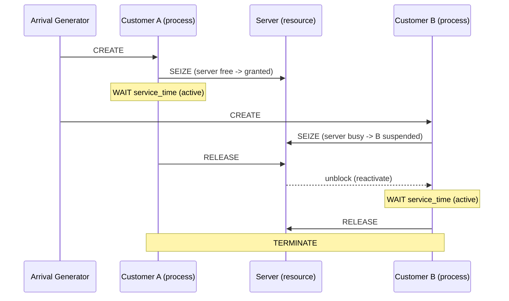

## Process Interaction Approach

### Overview

The Process Interaction (PI) approach is a worldview for discrete event simulation in which a system is modeled as a set of entities that flow through a sequence of steps, or a **process**, over simulated time. Each entity's lifecycle — its acquisitions of resources, delays, waits, and releases — is described as a single, self-contained narrative rather than being scattered across many disconnected event routines. This distinguishes it from the event-scheduling approach, where the same lifecycle is fragmented into separate event handlers (arrival, start-service, end-service, departure) that must explicitly schedule one another.

Under the hood, most Process Interaction implementations are still built on top of an event-scheduling engine and a future event list (FEL). The distinguishing feature is not the underlying mechanism but the **modeling abstraction**: the modeler writes code (or draws a flow) that reads like a flowchart of one entity's journey, and the simulation executor handles the underlying event scheduling, suspension, and resumption automatically.

### Core Concepts

**Process**

A process is a time-ordered sequence of actions performed by or upon an entity as it moves through the system. It is typically written as a single procedure or coroutine, e.g., `Customer_Process()`, that describes everything that happens to one customer from arrival to departure.

**Entity**

An entity is a discrete object flowing through the model, e.g., a customer, a job, a message packet, a vehicle. Each active entity is generally associated with its own process instance.

**Process Life Cycle**

A process instance moves through a defined set of states during simulation execution:

- **Active** — currently executing logic at the current simulation time.
- **Ready/Runnable** — scheduled to resume at a specific future time (holds a FEL entry).
- **Suspended/Blocked** — waiting on a condition, resource, or signal with no scheduled resumption time (e.g., waiting in a queue for a busy resource).
- **Terminated** — has completed its process logic and is removed from the simulation.

**Interaction**

"Interaction" refers to how one process's actions affect another's — for example, a process releasing a resource may unblock another process that was suspended waiting for it. This is the defining feature that gives the approach its name: processes interact with each other through shared resources, queues, and signals, rather than executing in isolation.

### Relationship to Other DES Worldviews

Discrete event simulation is traditionally described using three worldviews, and Process Interaction is best understood in contrast to the other two.

- **Event Scheduling** — the system is modeled purely as a set of instantaneous events (e.g., `Arrival`, `Start_Service`, `End_Service`) and each event's routine explicitly schedules future events. This gives fine-grained control but fragments an entity's logical lifecycle across multiple routines.
- **Activity Scanning** — the simulation repeatedly scans all potential activities at each time step and starts any whose preconditions are satisfied. This avoids explicit event scheduling but can be computationally inefficient due to repeated condition-checking.
- **Process Interaction** — combines the entity-centric narrative style with the efficiency of event-driven execution. It is generally regarded as the most intuitive worldview for modelers, since a process description maps closely to how a human would narrate the entity's journey (e.g., "the customer arrives, joins the queue, is served, then leaves").

$$
\text{Process Interaction} = \text{Event Scheduling (execution engine)} + \text{Entity-centric process narrative (modeling abstraction)}
$$

### Execution Mechanics

Each process is typically implemented as a **coroutine** — a routine that can suspend its execution at a point (e.g., a `WAIT`, `HOLD`, or `SEIZE` statement) and later resume exactly where it left off, preserving local state (local variables, call stack position).

The simulation executor maintains:

1. A **future event list (FEL)**, ordered by scheduled resumption time, holding processes that are due to reactivate at a specific future time.
2. A **current events list**, holding processes scheduled to execute at the current simulation time.
3ि. One or more **condition/wait queues**, holding processes suspended pending a resource or condition rather than a fixed time.

The main simulation loop repeatedly:

1. Advances simulated time to the timestamp of the next scheduled event (next-event time advance).
2. Activates (resumes) all processes scheduled for that time.
3. Lets each active process run until it either terminates, reschedules itself for a future time, or blocks awaiting a resource/condition.
4. Checks whether any blocked processes can now be unblocked, as a side effect of state changes made by the just-executed process (e.g., a resource became free).
5. Repeats until the FEL is empty or a stopping condition is met.

### Typical Process Statements

Most Process Interaction simulation languages and libraries (e.g., SIMULA, GPSS, SIMSCRIPT II.5, SimPy, Arena's process modules) provide a common vocabulary of process primitives:

| Statement | Purpose |
|---|---|
| `CREATE` / `GENERATE` | Instantiate a new process/entity |
| `WAIT(time)` / `HOLD(duration)` | Suspend the process for a fixed simulated duration |
| `SEIZE(resource)` / `REQUEST` | Acquire a resource; block if unavailable |
| `RELEASE(resource)` | Free a resource, potentially unblocking a waiting process |
| `QUEUE` / `ENTER(queue)` | Join a waiting line |
| `WAIT UNTIL(condition)` | Suspend until a logical condition becomes true |
| `TERMINATE` / `DISPOSE` | End the process and remove the entity |
| `PASSIVATE` | Suspend indefinitely until explicitly reactivated by another process |
| `ACTIVATE` / `REACTIVATE` | Resume a passivated or newly created process |

### Worked Example: Single-Server Queueing System

Consider a simple single-server system (e.g., one checkout counter). The process narrative for a `Customer` entity is:

**Example**

```
Process Customer:
    ARRIVE                         // entity created at simulated arrival time
    ENTER queue                    // join the waiting line
    SEIZE server                   // wait here if server is busy (blocks)
    LEAVE queue                    // now being served, leave the queue
    WAIT service_time              // hold for the duration of service
    RELEASE server                 // free the server; may unblock next customer
    TERMINATE                      // exit the system
```

A separate, much shorter process generates arrivals:

```
Process Arrival_Generator:
    LOOP FOREVER:
        WAIT interarrival_time
        CREATE Customer
```

Notice how the entire customer lifecycle — queueing, service, departure — is expressed as one linear narrative, in contrast to event scheduling, where this same logic would require at least two separate event routines (`Arrival_Event` and `Departure_Event`) that each explicitly schedule the other.

### Process Interaction Flow Diagram

<svg xmlns="http://www.w3.org/2000/svg" viewBox="0 0 760 420" font-family="Helvetica, Arial, sans-serif">
  <text x="380" y="28" text-anchor="middle" font-size="18" font-weight="bold" fill="#1a1a1a">Customer Process Lifecycle (svg_diagram)</text>

  
  <rect x="40" y="70" width="140" height="55" rx="8" fill="#dbeafe" stroke="#1d4ed8" stroke-width="2" />
  <text x="110" y="103" text-anchor="middle" font-size="14" fill="#1a1a1a">Arrive</text>

  
  <rect x="230" y="70" width="150" height="55" rx="8" fill="#fef3c7" stroke="#b45309" stroke-width="2" />
  <text x="305" y="97" text-anchor="middle" font-size="14" fill="#1a1a1a">Enter Queue</text>
  <text x="305" y="114" text-anchor="middle" font-size="11" fill="#4b4b4b">(may suspend)</text>

  
  <rect x="430" y="70" width="150" height="55" rx="8" fill="#fde68a" stroke="#b45309" stroke-width="2" />
  <text x="505" y="97" text-anchor="middle" font-size="14" fill="#1a1a1a">Seize Server</text>
  <text x="505" y="114" text-anchor="middle" font-size="11" fill="#4b4b4b">blocks if busy</text>

  
  <rect x="630" y="70" width="110" height="55" rx="8" fill="#bbf7d0" stroke="#15803d" stroke-width="2" />
  <text x="685" y="103" text-anchor="middle" font-size="14" fill="#1a1a1a">Hold: Service</text>

  
  <rect x="630" y="190" width="110" height="55" rx="8" fill="#bbf7d0" stroke="#15803d" stroke-width="2" />
  <text x="685" y="223" text-anchor="middle" font-size="14" fill="#1a1a1a">Release Server</text>

  
  <rect x="430" y="190" width="150" height="55" rx="8" fill="#fecaca" stroke="#b91c1c" stroke-width="2" />
  <text x="505" y="223" text-anchor="middle" font-size="14" fill="#1a1a1a">Terminate</text>

  
  <rect x="60" y="270" width="640" height="110" rx="8" fill="#f3f4f6" stroke="#9ca3af" stroke-width="1.5" />
  <text x="380" y="295" text-anchor="middle" font-size="13" font-weight="bold" fill="#1a1a1a">Interaction Point</text>
  <text x="380" y="318" text-anchor="middle" font-size="12" fill="#333">When Customer A executes RELEASE, the server resource becomes free.</text>
  <text x="380" y="338" text-anchor="middle" font-size="12" fill="#333">If Customer B is suspended in the queue waiting on SEIZE, this event</text>
  <text x="380" y="358" text-anchor="middle" font-size="12" fill="#333">reactivates Customer B's process — the defining "interaction" between processes.</text>

  
  <line x1="180" y1="97" x2="228" y2="97" stroke="#374151" stroke-width="2" marker-end="url(#arrow)" />
  <line x1="380" y1="97" x2="428" y2="97" stroke="#374151" stroke-width="2" marker-end="url(#arrow)" />
  <line x1="580" y1="97" x2="628" y2="97" stroke="#374151" stroke-width="2" marker-end="url(#arrow)" />
  <line x1="685" y1="125" x2="685" y2="188" stroke="#374151" stroke-width="2" marker-end="url(#arrow)" />
  <line x1="628" y1="217" x2="582" y2="217" stroke="#374151" stroke-width="2" marker-end="url(#arrow)" />

  </svg>

### System-Level Interaction Between Two Processes



### Advantages

- **Modeling clarity** — process descriptions closely mirror natural-language narratives of entity behavior, reducing the conceptual gap between the mental model and the code.
- **Reduced fragmentation** — a single process encapsulates an entity's entire lifecycle, avoiding the scattering of logic across many event routines.
- **Reusability** — process definitions (e.g., a generic "queue-seize-serve-release" pattern) can often be reused across different resource types or scenarios with minimal change.
- **Natural resource semantics** — constructs like `SEIZE`/`RELEASE` map intuitively onto how resources are acquired and contended for in real systems.

### Limitations

- **Debugging complexity** — because execution jumps between many suspended coroutines, tracing the exact interleaving of events at a given simulated time can be harder than with straightforward event-scheduling code. [Inference: this is a widely reported practical experience among simulation practitioners, though the degree of difficulty depends on the specific tool's debugging support.]
- **Overhead** — coroutine/context-switching mechanics can introduce more runtime overhead than a flat event-scheduling loop, particularly in languages without native lightweight coroutine support. [Unverified: the magnitude of this overhead is implementation- and platform-dependent, and modern coroutine libraries substantially narrow this gap.]
- **Hidden control flow** — because the underlying event list and scheduling are managed implicitly by the executor, modelers with less experience may have difficulty understanding what is happening "under the hood" during unexpected behavior.
- **Tool dependency** — this worldview generally requires either a specialized simulation language (SIMULA, GPSS, SIMSCRIPT) or a library offering coroutine-like constructs (e.g., Python's SimPy, using generators), rather than being trivially implementable in an arbitrary general-purpose language without such support.

### Representative Tools and Languages

- **SIMULA 67** — historically significant as the origin of both the process-interaction worldview and object-oriented programming's class/coroutine concepts.
- **GPSS (General Purpose Simulation System)** — a classic block-oriented language built natively around the process interaction paradigm.
- **SIMSCRIPT II.5** — supports process-based modeling with explicit `CREATE`, `WORK`, `ACTIVATE`/`WAIT` constructs.
- **SimPy** (Python) — a modern, widely used open-source library implementing process interaction via Python generator functions acting as coroutines.
- **Arena, AnyLogic, Simio** — commercial simulation platforms that offer process-flow modeling interfaces built on process-interaction-style execution engines beneath a graphical flowchart layer.

### Pseudocode: Minimal Executor Sketch

```
FEL = empty priority queue (by resumption time)
clock = 0

function WAIT(process, duration):
    schedule process to resume at clock + duration  // insert into FEL
    suspend process (yield control)

function SEIZE(process, resource):
    if resource.is_free():
        resource.assign(process)
    else:
        resource.queue.append(process)
        suspend process indefinitely           // no FEL entry; blocked

function RELEASE(process, resource):
    resource.release()
    if resource.queue is not empty:
        next_process = resource.queue.pop_front()
        resource.assign(next_process)
        reactivate(next_process)                 // interaction: unblocks another process

function main_loop():
    while FEL is not empty:
        clock = FEL.pop_min_time()
        resume the process(es) scheduled at clock
```

**Conclusion**

The Process Interaction approach reframes discrete event simulation modeling around entity-centric narratives rather than isolated event handlers, making it one of the more intuitive worldviews for describing complex queueing, resource-contention, and flow-based systems. Its practical power comes from coroutine-based suspension and resumption, layered atop the same fundamental future-event-list mechanics used in event scheduling — offering an accessible modeling abstraction without sacrificing the efficiency of event-driven time advance.

**Related Topics**

- Activity Scanning and the Three-Phase Approach
- Coroutines and Their Role in Simulation Engines
- Resource Contention Modeling and Queueing Discipline (FIFO, LIFO, Priority)
- Future Event List (FEL) Data Structures and Time Advance Mechanisms
- Statistical Output Analysis for Queueing Simulations (Little's Law, Utilization)
- SimPy: Practical Implementation of Process Interaction in Python
- Verification and Validation Techniques for DES Models
- Parallel and Distributed Discrete Event Simulation (PDES)