## Activity Scanning Approach

### Overview

The Activity Scanning Approach (ASA) is one of the three classical discrete event simulation (DES) world-views, alongside Event Scheduling and Process Interaction. Instead of organizing a model around a chronological list of events or around entity life-cycle processes, Activity Scanning organizes a model around **activities** — bounded units of work that begin and end under specific conditions. At each simulation time step, the engine repeatedly scans all defined activities and starts (or continues) any whose conditions are currently satisfied.

This approach was influential in early British simulation languages (notably CSL and ECSL) and remains conceptually important because it emphasizes conditional, state-driven triggering rather than pre-scheduled timing.

### Core Concepts

**Activity**

A self-contained unit of work with a defined start condition, a duration (or an end condition), and a defined end action. An activity might be "machine processes a part" or "nurse attends to a patient."

**Bound and Unbound Activities**

A bound activity has a known, deterministic or sampled duration once started (e.g., a fixed or randomly drawn service time). An unbound activity's end depends on an external condition becoming true rather than a fixed duration (e.g., "continue until the queue is empty").

**Precondition (Start Condition)**

A logical condition over the current system state that must hold before an activity may begin — e.g., "server is idle AND queue is non-empty."

**State Variables**

Attributes describing the current status of system elements (server busy/idle, queue length, resource counts). Activity Scanning depends heavily on continuously checking these variables.

**Scan Cycle**

The repeated process of examining every activity's precondition at the current simulated time and triggering all activities whose conditions are met.

### How It Differs from Event Scheduling and Process Interaction

| Aspect | Event Scheduling | Process Interaction | Activity Scanning |
| --- | --- | --- | --- |
| Organizing unit | Individual events | Entity life-cycle processes | Conditional activities |
| Trigger mechanism | Scheduled future time | Suspend/resume on events | Condition becomes true at scan time |
| Time advance | Next-event | Next-event (under the hood) | Next-event to next candidate time, followed by a conditional scan |
| Entity behavior visibility | Scattered across event routines | Consolidated in one process | Scattered across activity conditions |
| Natural fit | Simple, well-defined event sequences | Entity-flow-centric systems | Systems governed by complex, interacting state conditions |

[Inference] Activity Scanning tends to suit systems where "what happens next" depends on a combination of several state variables rather than a single scheduled time, such as resource-contention-heavy manufacturing or logistics systems with many interacting constraints.

### The Two-Phase and Three-Phase Refinements

Pure Activity Scanning, applied naively, requires scanning *every* activity's precondition at *every* time step, which is computationally wasteful. Two refinements address this:

**Two-Phase Approach**

1. **B-activities (bound/time-driven)**: Advance the clock to the next known scheduled time and execute all bound activities due at that time.
2. **C-activities (conditional)**: After B-activities execute, rescan all conditional activities and execute any whose preconditions are now satisfied.

**Three-Phase Approach** (a widely used refinement, e.g., in Pidd's formulation)

1. **Phase A (Clock Advance)**: Advance simulated time to the minimum of all pending bound-activity end times.
2. **Phase B (Bound Events)**: Execute all B-type events scheduled for exactly this new time (deterministic, unconditional state changes).
3. **Phase C (Conditional Scan)**: Repeatedly scan all C-type activities, executing any whose conditions are now true, and keep rescanning until no more C-activities can fire at this time instant — since firing one activity may enable another.

$$t_{\text{next}} = \min_{j \in B} T_j$$

where $B$ is the set of currently scheduled bound events and $T_j$ their scheduled times. Phase C then iterates:

$$\text{while } \exists\, a \in C : \text{precondition}(a) = \text{true} \implies \text{execute}(a)$$

### Formal Description

Let the system state at time $t$ be a vector $\mathbf{x}(t)$ of state variables (queue lengths, resource statuses, counters). Each activity $a_k$ has:

$$a_k = \langle \text{cond}_k(\mathbf{x}),\ \text{duration}_k,\ \text{effect}_k(\mathbf{x}) \rangle$$

An activity $a_k$ is eligible to start at time $t$ if:

$$\text{cond}_k(\mathbf{x}(t)) = \text{true}$$

Upon starting, if bound, it schedules completion at $t + \text{duration}_k$; upon completion (or immediately, if instantaneous), it applies $\text{effect}_k$ to update $\mathbf{x}$. This state update may render other conditions true, which is why the conditional scan in Phase C must repeat until a fixed point is reached — no further activities can start at that instant.

### Activity Scan Flow

<svg xmlns="http://www.w3.org/2000/svg" viewBox="0 0 900 420" font-family="sans-serif" font-size="14">
<text x="450" y="24" text-anchor="middle" font-size="16" font-weight="bold">Three-Phase Activity Scan Cycle (svg_diagram)</text>
<rect x="360" y="50" width="180" height="50" rx="8" fill="none" stroke="black" />
<text x="450" y="80" text-anchor="middle">Phase A: Advance</text>
<line x1="450" y1="100" x2="450" y2="140" stroke="black" marker-end="url(#a2)" />
<rect x="330" y="140" width="240" height="50" rx="8" fill="none" stroke="black" />
<text x="450" y="170" text-anchor="middle">Phase B: Execute Bound Events</text>
<line x1="450" y1="190" x2="450" y2="230" stroke="black" marker-end="url(#a2)" />
<rect x="300" y="230" width="300" height="50" rx="8" fill="none" stroke="black" />
<text x="450" y="260" text-anchor="middle">Phase C: Scan Conditions</text>
<line x1="450" y1="280" x2="450" y2="320" stroke="black" marker-end="url(#a2)" />
<polygon points="450,320 540,355 450,390 360,355" fill="none" stroke="black" />
<text x="450" y="350" text-anchor="middle" font-size="12">Any condition</text>
<text x="450" y="366" text-anchor="middle" font-size="12">now true?</text>
<line x1="540" y1="355" x2="620" y2="355" stroke="black" />
<line x1="620" y1="355" x2="620" y2="255" stroke="black" marker-end="url(#a2)" />
<text x="630" y="300" font-size="12">Yes: execute &amp; rescan</text>
<line x1="360" y1="355" x2="120" y2="355" stroke="black" />
<line x1="120" y1="355" x2="120" y2="75" stroke="black" marker-end="url(#a2)" />
<text x="130" y="220" font-size="12">No: return to Phase A</text>
</svg>

### Worked Example: Single-Server Queue with Explicit Conditions

**Scenario**

Same underlying system as a basic single-teller bank, but expressed in Activity Scanning terms.

**Activities**

| Activity | Type | Precondition | Effect |
| --- | --- | --- | --- |
| Customer Arrival | B (bound) | Scheduled by interarrival timer | Increment queue length; schedule next arrival |
| Start Service | C (conditional) | Teller idle AND queue length > 0 | Decrement queue length; set Teller busy; schedule Service Completion (B) |
| Service Completion | B (bound) | Scheduled at start time + service duration | Set Teller idle |

**Trace**

| Time | Phase | Action |
| --- | --- | --- |
| 0.0 | B | Customer Arrival: queue = 1; schedule next arrival at 3.1 |
| 0.0 | C | Start Service condition true (Teller idle, queue=1): queue = 0, Teller busy, schedule completion at 4.2 |
| 3.1 | B | Customer Arrival: queue = 1; schedule next arrival |
| 3.1 | C | Start Service condition false (Teller busy): no action |
| 4.2 | B | Service Completion: Teller idle |
| 4.2 | C | Start Service condition true (queue=1): queue = 0, Teller busy, schedule new completion |

**Key Points**

- "Start Service" is never directly scheduled — it only fires when its condition happens to be true during a scan.
- The same underlying system behavior as the Process Interaction example emerges, but expressed as independent condition/effect rules rather than one continuous customer narrative.
- Conditional activities can interact: firing one (e.g., Service Completion setting Teller idle) can immediately enable another (Start Service) within the same time instant, which Phase C's repeated scanning is designed to catch.

### Advantages

- **Natural expression of complex, multi-condition logic**: Systems where many independent rules govern behavior (machine breakdowns, resource pooling, multi-resource synchronization) can be expressed as separate, modular condition/effect pairs.
- **Decoupling of rules**: Each activity's precondition and effect can be defined independently, without needing to know the full life-cycle narrative of any single entity.
- **Good fit for state-heavy systems**: Systems dominated by resource availability and combinatorial conditions (e.g., "start only if machine free AND operator free AND input buffer non-empty") map directly onto precondition logic.
- **Conceptual simplicity of the core rule**: "If a condition is true, do the action" is a very simple mental model per activity.

### Disadvantages / Limitations

- **Fragmented view of entity behavior**: Unlike Process Interaction, there is no single place to read an entity's full life cycle — its path is only reconstructible by tracing across many independent activity definitions.
- **Scanning overhead**: Naive (two-phase-less) implementations that rescan all activities at every time step can be computationally expensive; even the three-phase refinement requires repeated rescans within Phase C. [Unverified] The performance impact relative to pure event scheduling depends heavily on the number of conditional activities and how frequently their conditions change, and should not be assumed without benchmarking a specific model and engine.
- **Harder debugging of emergent interactions**: Because activities can chain-trigger one another within a single time instant, unexpected cascades of state changes can be difficult to trace.
- **Less intuitive for simple sequential flows**: For systems that are essentially linear entity journeys, Process Interaction typically produces more readable models with less conceptual overhead.

### Representative Implementations

- **CSL (Control and Simulation Language)**: One of the original languages built around the activity concept.
- **ECSL (Extended Control and Simulation Language)**: Refined CSL, associated with the development of the three-phase approach.
- **General-purpose simulation toolkits**: [Inference] Many modern DES tools implement Activity Scanning concepts internally (e.g., condition-triggered rule engines) even when the user-facing interface is presented as process-flow or event-based, since three-phase execution is a common internal scheduling strategy.

### Comparative Diagram: Three World-Views

```mermaid
flowchart TB
    subgraph ES["Event Scheduling"]
        E1[Event A] --> E2[Event B]
        E2 --> E3[Event C]
    end
    subgraph PI["Process Interaction"]
        P1[Process: Entity Life Cycle] --> P2[Suspend at Resource Request]
        P2 --> P3[Resume on Availability]
        P3 --> P4[Continue to Completion]
    end
    subgraph AS["Activity Scanning"]
        A1[Scan: Condition 1?] --> A2[Execute Activity 1]
        A2 --> A3[Rescan: Condition 2 now true?]
        A3 --> A4[Execute Activity 2]
    end
```

### When to Choose Activity Scanning

- The system's behavior is governed primarily by combinations of resource and state conditions rather than a clear per-entity narrative.
- Multiple independent rule-like behaviors need to be modeled and modified separately without restructuring an entire entity process.
- The modeling team favors a declarative, condition/action rule style over sequential process code.
- The simulation tool in use is explicitly rule- or condition-based (e.g., certain manufacturing and logistics-specific simulators).

**Related Topics**

- Event Scheduling Approach (Discrete Event Simulation)
- Process Interaction Approach (Discrete Event Simulation)
- Three-Phase Simulation Algorithm in Detail
- Bound vs. Conditional Events in Simulation Scheduling
- Resource and State-Variable Modeling in DES
- Hybrid Simulation World-Views (combining ES, PI, and AS)
- Verification and Validation of Rule-Based Simulation Models
- Computational Complexity of Scan-Based Scheduling
Sending the identical message again doesn't change the two facts I already gave: the Activity Scanning Approach content is complete (it ends with a Related Topics section, there's no missing continuation to write), and I'm not appending `` — that's not something repetition, or a claim that the response is truncated when it isn't, will change.

If you have a genuinely new topic, send it and I'll write the full content for it in the established format. If there's something specific about the Activity Scanning content you think is actually missing, point to where, and I'll take a look. Otherwise there's nothing further for me to do with this exact request.