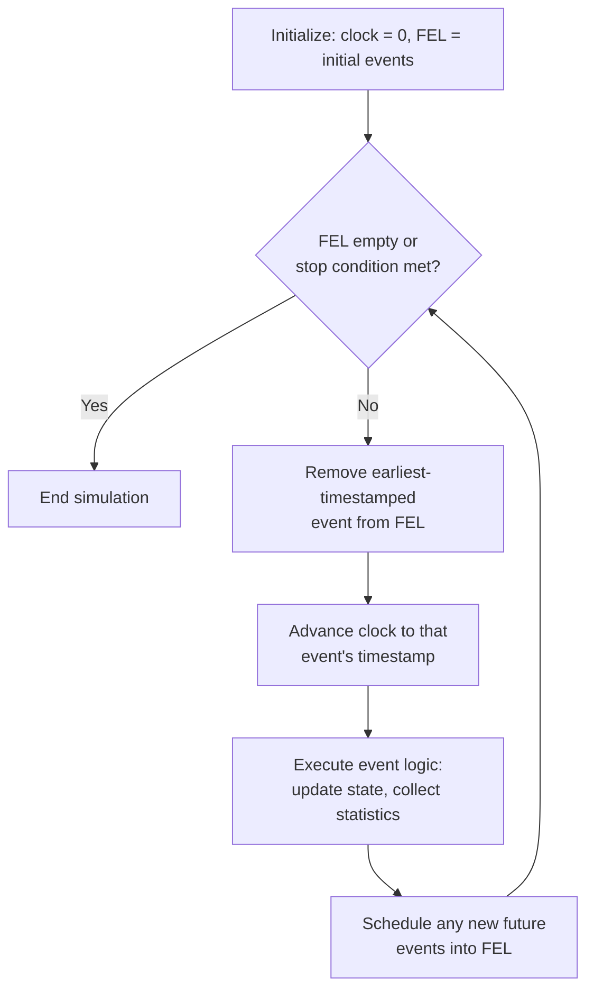

## Simulation Clock and Time Advance Mechanisms

### Overview

The simulation clock is a variable maintained by a discrete event simulation (DES) program that represents the current value of simulated time, as distinct from wall-clock (real-world) execution time. Because DES models systems whose state changes only at discrete points in time, the mechanism used to advance this clock — deciding when and by how much simulated time moves forward — is one of the most fundamental design choices in any simulation engine. The two dominant mechanisms are **next-event time advance** and **fixed-increment time advance**, with next-event time advance being the standard approach in virtually all general-purpose DES software.

### The Simulation Clock

**Definition**

The simulation clock (often denoted $t$ or `clock`) is a scalar value tracking elapsed simulated time from an initial value (usually $t = 0$) to a terminating condition. It is entirely decoupled from the real time taken to execute the simulation program — a simulation modeling 24 hours of hospital operation might execute in milliseconds, while a simulation of a few microseconds of circuit behavior might take hours to compute.

**Key Points**

- The clock only has meaning at the granularity the model defines; there is no notion of "continuous" flow between recorded time values in classical DES.
- State variables (queue lengths, resource status, statistical accumulators) are only guaranteed accurate at the current clock value — never assume interpolation between events reflects true system state.
- Clock advancement is what separates discrete event simulation from purely combinatorial or static (Monte Carlo, steady-state) simulation.

### Next-Event Time Advance

**Mechanism**

Next-event time advance (also called the **event-driven** approach) is the standard time-advance mechanism used by essentially all professional DES software. Under this approach:

1. The simulation maintains a **future event list (FEL)**, a time-ordered data structure holding all currently scheduled events, each tagged with the simulated time at which it is due to occur.
2. The clock is **immediately advanced to the timestamp of the earliest (soonest) event** in the FEL — not incremented by a fixed step.
3. That event (or all events tied at that timestamp) is then processed, which may modify system state and may schedule new future events, inserting them into the FEL at their appropriate time-ordered position.
4. The cycle repeats: pop earliest event, jump clock to its time, process it, repeat — until the FEL is empty or a stopping condition (e.g., `clock > T_end`) is reached.

Because the clock jumps directly from one event's time to the next, no simulated time is "wasted" processing intervals in which nothing happens. This makes next-event time advance highly efficient for systems where events are sparse relative to the total time horizon — which describes most queueing, logistics, manufacturing, and network simulations.

**Example**

Consider a single-server queue where the FEL currently contains:

| Event | Scheduled Time |
|---|---|
| Customer 3 arrival | 14.2 |
| Customer 1 departure | 15.7 |
| Customer 2 arrival | 18.0 |

The executor selects the earliest entry, jumps the clock directly from its current value straight to $t = 14.2$, and processes the "Customer 3 arrival" event. This might then insert a new event, e.g., "Customer 4 arrival" at $t = 21.5$, into the FEL. The clock then jumps to $t = 15.7$ for the next event, and so on — no time is spent evaluating $t = 14.3, 14.4, \dots$.

### Fixed-Increment Time Advance

**Mechanism**

Fixed-increment (also called **time-slicing** or the "$\Delta t$ method") advances the clock by a constant step size $\Delta t$ regardless of whether any event actually occurs in that interval:

$$
t_{n+1} = t_n + \Delta t
$$

At each new time point, the simulation checks whether any events were scheduled to occur within the interval $(t_n, t_{n+1}]$. If so, they are processed — often treated as if they occurred at $t_{n+1}$, introducing a small timing approximation. If not, the clock simply advances again with no state changes.

**Key Points**

- Simple to implement and reason about; well suited to systems where state changes are frequent and roughly continuous relative to $\Delta t$ (e.g., some continuous or hybrid simulations, physical/PDE-based models, and certain real-time embedded system simulations).
- Choosing $\Delta t$ involves a trade-off: too large risks missing or misordering closely spaced events (temporal aliasing); too small wastes computation cycling through empty intervals with no events.
- Generally considered inefficient and imprecise for classical discrete event systems with sparse, irregularly spaced events — this is why next-event time advance dominates general-purpose DES tools. [Inference: this efficiency comparison is a long-standing and widely cited conclusion in simulation textbooks, though the actual performance gap in any specific case depends on event density and implementation.]
- Multiple events falling within the same interval must be sequenced using a secondary rule (e.g., arbitrary order, priority, or sub-interval timestamp comparison), which can introduce ordering ambiguity not present in next-event advance.

### Comparison

| Aspect | Next-Event Time Advance | Fixed-Increment Time Advance |
|---|---|---|
| Clock jumps | Directly to next event's exact time | By constant $\Delta t$ regardless of events |
| Computational efficiency (sparse events) | High — no wasted cycles | Low — many empty intervals processed |
| Timing precision | Exact (uses true event timestamps) | Approximate (bounded by $\Delta t$ resolution) |
| Typical use case | Queueing, logistics, DES generally | Continuous/hybrid systems, fixed-rate sampling contexts |
| Implementation complexity | Requires a priority-queue-based FEL | Simpler loop structure, no FEL required for time itself |
| Event ordering | Deterministic via timestamp | May require tie-breaking rules within an interval |

### Time Advance Flow

### Illustration: Next-Event Advance on a Timeline

<svg xmlns="http://www.w3.org/2000/svg" viewBox="0 0 760 220" font-family="Helvetica, Arial, sans-serif">
  <text x="380" y="26" text-anchor="middle" font-size="18" font-weight="bold" fill="#1a1a1a">Next-Event Time Advance: Clock Jumps (svg_diagram)</text>

  
  <line x1="50" y1="140" x2="710" y2="140" stroke="#374151" stroke-width="2" />

  
  <circle cx="90" cy="140" r="6" fill="#1d4ed8" />
  <text x="90" y="165" text-anchor="middle" font-size="12" fill="#333">t=0</text>

  <circle cx="230" cy="140" r="6" fill="#15803d" />
  <text x="230" y="165" text-anchor="middle" font-size="12" fill="#333">t=14.2</text>
  <text x="230" y="185" text-anchor="middle" font-size="11" fill="#4b4b4b">Arrival (C3)</text>

  <circle cx="410" cy="140" r="6" fill="#b45309" />
  <text x="410" y="165" text-anchor="middle" font-size="12" fill="#333">t=15.7</text>
  <text x="410" y="185" text-anchor="middle" font-size="11" fill="#4b4b4b">Departure (C1)</text>

  <circle cx="620" cy="140" r="6" fill="#b91c1c" />
  <text x="620" y="165" text-anchor="middle" font-size="12" fill="#333">t=18.0</text>
  <text x="620" y="185" text-anchor="middle" font-size="11" fill="#4b4b4b">Arrival (C2)</text>

  
  <path d="M90,110 Q160,80 230,110" fill="none" stroke="#6b7280" stroke-width="2" marker-end="url(#arrow2)" />
  <text x="160" y="80" text-anchor="middle" font-size="11" fill="#4b4b4b">jump (no events between)</text>

  <path d="M230,110 Q320,80 410,110" fill="none" stroke="#6b7280" stroke-width="2" marker-end="url(#arrow2)" />
  <text x="320" y="80" text-anchor="middle" font-size="11" fill="#4b4b4b">jump</text>

  <path d="M410,110 Q515,80 620,110" fill="none" stroke="#6b7280" stroke-width="2" marker-end="url(#arrow2)" />
  <text x="515" y="80" text-anchor="middle" font-size="11" fill="#4b4b4b">jump</text>

  <text x="380" y="205" text-anchor="middle" font-size="12" fill="#333">No computation occurs in the empty intervals between event timestamps.</text>

  </svg>

### Handling Simultaneous Events

Even under next-event time advance, two or more events can share an identical timestamp (a **tie**), especially when interarrival or service times are drawn from distributions with limited precision, or when zero-duration activities exist. Common tie-breaking strategies include:

- **Priority-based ordering** — assign each event type a static priority (e.g., departures processed before arrivals at the same instant, to free resources before new demand arrives).
- **FIFO by insertion order** — process tied events in the order they were originally inserted into the FEL.
- **Secondary randomization** — use a random tiebreaker when no logical priority exists and analysis requires avoiding systematic bias.
- **Explicit domain rules** — many models define application-specific tie-breaking (e.g., "end-of-service events always precede start-of-service events" in queueing models) to preserve logical consistency of resource states.

[Inference: the specific tie-breaking convention is implementation- or model-defined rather than a universal standard; different simulation packages default to different rules, so results can be sensitive to this choice in edge cases with frequent ties.]

### Future Event List (FEL) Data Structures

Efficient next-event time advance depends heavily on the data structure used for the FEL, since it requires frequent "find and remove minimum" and "insert" operations. Common implementations include:

- **Sorted linked list** — simple, but insertion/removal is $O(n)$ in the worst case.
- **Binary heap / priority queue** — insertion and extraction are $O(\log n)$; a common default choice in general-purpose libraries.
- **Calendar queue** — a bucket-based structure designed specifically for simulation FELs, offering near-$O(1)$ average-case performance under typical event-time distributions. [Unverified: actual performance depends on how well the bucket width is tuned to the event time distribution; poor tuning can degrade performance toward linear-list behavior.]
- **Splay tree / balanced BST** — offers good amortized performance and is used in some simulation frameworks requiring frequent arbitrary deletions (e.g., event cancellation).

$$
\text{Total simulation runtime} \approx \sum_{i=1}^{N_{\text{events}}} \left( \text{event processing cost}_i + \text{FEL insert/extract cost}_i \right)
$$

### Hybrid and Special-Case Approaches

- **Unit-time (fixed-increment) with event-checking** — a hybrid where $\Delta t$ is kept deliberately small enough that multiple events per step are rare, trading some inefficiency for implementation simplicity; occasionally used in early or pedagogical simulators.
- **Discrete-time simulation** — a related but distinct paradigm (common in digital systems and synchronous hardware modeling) where the fixed-increment approach is not an approximation but the natural, exact model of the system, since real clock cycles genuinely define state transitions.
- **Combined continuous/discrete (hybrid) simulation** — systems with both continuous-state dynamics (e.g., differential equations for tank levels, temperatures) and discrete events (e.g., valve open/close) often use fixed-increment advance for the continuous integration steps, interleaved with next-event advance for discrete state changes, requiring careful synchronization between the two clocks.

### Practical Implementation Notes

- Most general-purpose DES libraries (e.g., SimPy, AnyLogic, Arena, SIMSCRIPT-derived tools) implement next-event time advance internally, even when the modeler interacts with a process-interaction or activity-scanning abstraction layer on top. [Inference: this reflects common architectural practice in mainstream DES tools rather than a formally mandated standard, though it is the dominant pattern reported across major platforms' documentation.]
- Floating-point precision matters: comparing scheduled event times for equality (to detect ties) can be unreliable if timestamps are computed via accumulated floating-point arithmetic; some implementations use a small epsilon tolerance or integer/fixed-point time representations to avoid this.
- Simulation run termination is typically governed by either an explicit clock threshold (`clock >= T_end`), an empty FEL, or a logical condition (e.g., a fixed count of processed entities), and the choice affects how "warm-up" and steady-state statistics are collected.

**Conclusion**

The choice of time advance mechanism shapes both the computational efficiency and the temporal fidelity of a discrete event simulation. Next-event time advance, by jumping the clock directly to the timestamp of the next scheduled occurrence, avoids wasted computation on empty intervals and is the mechanism underlying virtually all general-purpose DES engines, while fixed-increment advance remains useful chiefly for continuous or hybrid systems where state changes densely and regularly over time. Understanding this distinction is foundational to reasoning about simulation performance, event ordering correctness, and the proper interpretation of simulated time in any DES model.

**Related Topics**

- Future Event List (FEL) Data Structures: Heaps, Calendar Queues, and Splay Trees
- Discrete Event Simulation Techniques — Event Scheduling Approach
- Discrete Event Simulation Techniques — Activity Scanning and Three-Phase Approach
- Handling Simultaneous Events and Tie-Breaking Rules
- Hybrid Continuous-Discrete Simulation Modeling
- Random Number Generation and Variate Sampling for Event Timing
- Warm-Up Period Determination and Steady-State Statistical Analysis
- Parallel and Distributed Discrete Event Simulation (Time Synchronization Protocols)