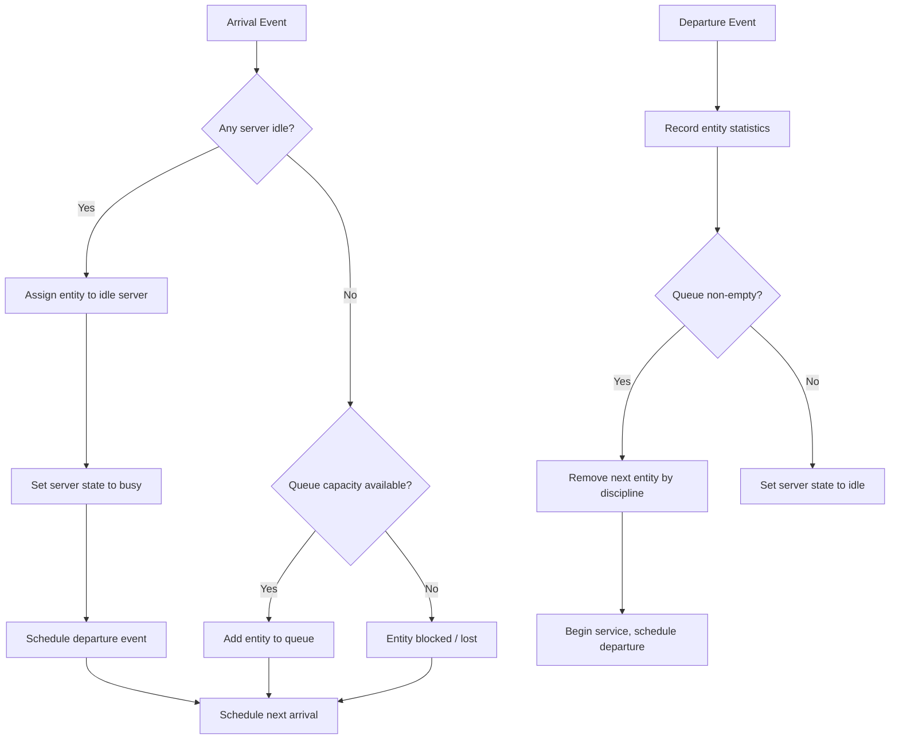

## Queueing Systems and Server Modeling

### Overview

Queueing systems form the analytical backbone of discrete event simulation (DES) for any process involving entities that wait for limited resources. A queueing system consists of an arrival process, one or more servers, a waiting area (queue), and a set of rules governing how entities move through the system. Simulating queues allows analysts to estimate performance measures — wait times, queue lengths, server utilization, throughput — that are often mathematically intractable to compute in closed form once systems deviate from idealized assumptions.

### Core Components of a Queueing System

#### Arrival Process

The arrival process describes how entities enter the system over time. It is typically characterized by an interarrival time distribution — the random time between successive arrivals. Common choices include:

- **Exponential distribution**: models arrivals with a constant average rate and no memory of past arrivals (Poisson arrival process)
- **Deterministic**: fixed, regular intervals
- **Erlang or Gamma**: sum of exponential stages, useful for arrivals that occur in a more regulated pattern than pure randomness
- **Empirical distributions**: derived directly from observed data when no standard distribution fits well

The arrival rate is commonly denoted $\lambda$, representing the average number of arrivals per unit time.

#### Service Mechanism

The service mechanism defines how entities are processed once they reach a server. Key elements:

- **Number of servers**: single-server or multi-server (parallel) configurations
- **Service time distribution**: how long each entity occupies a server, often exponential, deterministic, uniform, or empirical
- **Service rate**: denoted $\mu$, the average number of entities a single server can process per unit time

#### Queue (Waiting Line) Characteristics

- **Queue capacity**: finite or infinite. Finite capacity introduces the possibility of balking (entities that leave without joining) or blocking (arrivals rejected when the queue is full)
- **Queue discipline**: the rule governing which waiting entity is served next
- **Population source**: finite or infinite calling population, which affects arrival behavior as the system fills

### Queue Disciplines

| Discipline | Description |
|---|---|
| FIFO / FCFS | First-In-First-Out / First-Come-First-Served — the most common default |
| LIFO / LCFS | Last-In-First-Out — entities served in reverse arrival order |
| SIRO | Service In Random Order |
| Priority (non-preemptive) | Higher-priority entities served first, but an in-progress service is not interrupted |
| Priority (preemptive) | A higher-priority arrival can interrupt an in-progress lower-priority service |
| Shortest Processing Time (SPT) | Entities with the shortest known service requirement are served first |

Priority disciplines require the simulation's event list and server logic to support interruption and resumption (for preemptive cases) or reordering of the waiting queue by priority key rather than strict arrival order.

### Kendall's Notation

Queueing systems are conventionally classified using Kendall's notation:

$$A/S/c/K/N/D$$

Where:
- $A$ = interarrival time distribution (e.g., M for Markovian/exponential, D for deterministic, G for general)
- $S$ = service time distribution
- $c$ = number of parallel servers
- $K$ = system capacity (queue + service, omitted if infinite)
- $N$ = size of the calling population (omitted if infinite)
- $D$ = queue discipline (omitted if FIFO)

An **M/M/1** queue denotes Markovian (exponential) arrivals, Markovian (exponential) service, and a single server, with infinite capacity and population, FIFO discipline implied.

An **M/G/c** queue denotes exponential arrivals, a general (arbitrary) service time distribution, and $c$ parallel servers.

### Basic Queueing Relationships

#### Traffic Intensity

The traffic intensity (or utilization factor) for a single-server system is:

$$\rho = \frac{\lambda}{\mu}$$

For a multi-server system with $c$ servers:

$$\rho = \frac{\lambda}{c\mu}$$

Stability requires $\rho < 1$; otherwise the queue grows without bound over time. [Inference] In practice, simulations run with $\rho$ close to 1 exhibit high variance in queue length and may require substantially longer run lengths to reach statistically stable estimates, since the system spends extended periods in congested states.

#### Little's Law

Little's Law relates the average number of entities in a system to the average time they spend in it:

$$L = \lambda W$$

Where:
- $L$ = average number of entities in the system (or subsystem, such as just the queue)
- $\lambda$ = average arrival rate
- $W$ = average time an entity spends in the system (or subsystem)

Little's Law holds for any queueing system in steady state, regardless of the arrival distribution, service distribution, number of servers, or queue discipline, provided the system is stable. This makes it one of the few universally applicable results in queueing theory and a useful sanity check against simulation output: if a simulation reports $L$, $\lambda$, and $W$ that do not approximately satisfy $L = \lambda W$, the model likely contains a logic error or has not reached steady state.

Applied separately to the queue only:

$$L_q = \lambda W_q$$

Where $L_q$ is the average number waiting (excluding those in service) and $W_q$ is the average wait time before service begins.

### The M/M/1 Queue as a Reference Model

The M/M/1 queue is the simplest non-trivial queueing model and serves as a standard reference for validating simulation logic, since it has known closed-form analytical results.

For $\rho = \lambda/\mu < 1$:

$$L = \frac{\rho}{1-\rho}$$

$$W = \frac{L}{\lambda} = \frac{1}{\mu - \lambda}$$

$$L_q = \frac{\rho^2}{1-\rho}$$

$$W_q = \frac{\rho}{\mu - \lambda}$$

**Example**

Consider a single technical support agent (M/M/1) where calls arrive at $\lambda = 4$ per hour and are handled at a rate of $\mu = 5$ per hour.

$$\rho = \frac{4}{5} = 0.8$$

$$L = \frac{0.8}{1 - 0.8} = 4 \text{ callers in the system on average}$$

$$W = \frac{1}{5 - 4} = 1 \text{ hour average time in system}$$

$$L_q = \frac{0.8^2}{1 - 0.8} = 3.2 \text{ callers waiting on average}$$

A DES built to model this scenario should, over a sufficiently long run with enough replications, produce estimates converging toward these analytical values — a standard verification technique before extending the model to more complex, non-Markovian configurations where no closed form exists.

### Server Modeling in DES

#### Server State Representation

Within a DES, a server is typically modeled as a resource entity with a state variable, commonly:

- **Idle**: available to begin service immediately
- **Busy**: currently processing an entity
- **Down/Failed**: unavailable due to breakdown (in models incorporating reliability)
- **Blocked**: finished service but unable to release the entity downstream (common in networks with finite buffers)

#### Multi-Server Systems

When $c > 1$ identical parallel servers exist, the simulation must track the state of each server individually and apply a server-selection rule when an arrival finds multiple idle servers available, such as:

- Lowest-indexed idle server
- Round-robin assignment
- Least-utilized server (load balancing)

#### Heterogeneous Servers

Servers need not be identical. Heterogeneous server modeling assigns different service time distributions or rates to each server, which is common when simulating a mix of experienced and novice staff, or machines of different generations. The server-selection rule becomes more consequential here, since routing an entity to a slower server materially changes system performance compared to routing to a faster one.

#### Server Breakdown and Repair

Realistic server models often incorporate reliability behavior:

- **Time to failure**: typically modeled with an exponential or Weibull distribution
- **Time to repair**: often modeled with a lognormal or gamma distribution, reflecting the tendency for most repairs to be quick with an occasional long-tail repair

[Inference] Incorporating breakdowns generally increases effective service time variability and reduces effective capacity, which tends to increase queue lengths and wait times relative to an equivalent breakdown-free model at the same nominal service rate — though the magnitude of the effect depends heavily on the specific failure and repair distributions chosen and their correlation with load.

### Network of Queues

Real systems frequently consist of multiple queueing stations linked together, where the output of one server becomes the input to the next.

#### Series (Tandem) Queues

Entities pass sequentially through multiple stations. The departure process of one station becomes the arrival process of the next, and unless arrivals are Poisson and servers are exponential (a Jackson network), the interarrival distribution at downstream stations is generally not the same as at the first station.

#### Jackson Networks

A Jackson network is a network of interconnected M/M/c-type queues where, under specific conditions (Poisson external arrivals, exponential service, probabilistic routing between stations), each station behaves as an independent M/M/c queue in isolation for analytical purposes. [Unverified] Whether a given simulated network satisfies the full set of Jackson network conditions should be checked explicitly, since even small deviations, such as deterministic routing rather than probabilistic routing, invalidate the product-form solution.

#### Feedback and Routing

Entities may probabilistically return to earlier stations, be routed conditionally based on entity attributes, or split across parallel downstream paths. Simulation logic must encode routing as an explicit decision point in the entity's flow, typically evaluated immediately upon completion of service at the current station.

### Queueing System Flow (svg_diagram)

<svg xmlns="http://www.w3.org/2000/svg" viewBox="0 0 800 300">
  <text x="400" y="25" text-anchor="middle" font-size="16" font-weight="bold" fill="#1a1a2e">Single-Station Queueing System (svg_diagram)</text>

  
  <text x="60" y="150" text-anchor="middle" font-size="12" fill="#333">Arrivals</text>
  <text x="60" y="165" text-anchor="middle" font-size="11" fill="#666">λ</text>
  <line x1="20" y1="150" x2="140" y2="150" stroke="#333" stroke-width="2" marker-end="url(#arrow1)" />

  
  <rect x="140" y="115" width="160" height="70" fill="#eef3fb" stroke="#3a5a9c" stroke-width="2" />
  <text x="220" y="105" text-anchor="middle" font-size="13" font-weight="bold" fill="#1a1a2e">Queue</text>
  <circle cx="165" cy="150" r="8" fill="#3a5a9c" />
  <circle cx="190" cy="150" r="8" fill="#3a5a9c" />
  <circle cx="215" cy="150" r="8" fill="#3a5a9c" />
  <circle cx="240" cy="150" r="8" fill="#3a5a9c" opacity="0.4" />
  <text x="220" y="175" text-anchor="middle" font-size="10" fill="#555">Waiting entities</text>

  <line x1="300" y1="150" x2="360" y2="150" stroke="#333" stroke-width="2" marker-end="url(#arrow1)" />

  
  <rect x="360" y="115" width="120" height="70" fill="#fdeee0" stroke="#c96a1f" stroke-width="2" />
  <text x="420" y="105" text-anchor="middle" font-size="13" font-weight="bold" fill="#1a1a2e">Server</text>
  <text x="420" y="145" text-anchor="middle" font-size="11" fill="#555">Service</text>
  <text x="420" y="160" text-anchor="middle" font-size="11" fill="#555">rate μ</text>

  <line x1="480" y1="150" x2="560" y2="150" stroke="#333" stroke-width="2" marker-end="url(#arrow1)" />

  <text x="620" y="150" text-anchor="middle" font-size="12" fill="#333">Departures</text>

  
  <path d="M 220 115 C 220 60, 320 60, 320 60" stroke="#a33" stroke-width="1.5" fill="none" stroke-dasharray="4,3" marker-end="url(#arrow2)" />
  <text x="330" y="55" font-size="10" fill="#a33">Balking / Reneging</text>

  </svg>

### Balking, Reneging, and Jockeying

These three behaviors introduce realism into queue models where entities are decision-making agents (typically human customers) rather than purely passive units:

- **Balking**: an arriving entity chooses not to join the queue at all, typically because it perceives the queue as too long
- **Reneging**: an entity that has joined the queue leaves before being served, often after waiting longer than some patience threshold
- **Jockeying**: in multi-queue systems, an entity switches from one queue to another it perceives as moving faster

Modeling these behaviors requires the simulation to assign each entity a stochastic threshold (e.g., a maximum tolerable wait time, sampled from a distribution) and to evaluate that threshold against current system state at appropriate points in the entity's lifecycle — continuously for reneging, or at the moment of arrival for balking.

### Event-Driven Logic for a Single-Server Queue

The following outlines the core event handlers required to simulate a basic single-server queue within a DES framework:

**Arrival Event**
1. Schedule the next arrival event using the interarrival distribution
2. If the server is idle: begin service immediately, schedule a departure event using the service time distribution, set server state to busy
3. If the server is busy: append the entity to the queue, recording its arrival timestamp for later wait-time calculation

**Departure Event**
1. Record statistics for the departing entity (time in system, time in queue)
2. If the queue is non-empty: remove the next entity according to the queue discipline, begin its service, schedule its departure event, update its wait-time statistic
3. If the queue is empty: set server state to idle

**Key Points**
- The arrival and departure event handlers are the only two event types required for a basic single-server FIFO queue; all queueing behavior emerges from their interaction through the event list
- Statistics such as $L$, $L_q$, $W$, $W_q$, and server utilization are typically accumulated using time-weighted averages (area under the curve of the relevant state variable over simulated time) rather than simple arithmetic averages, since the system spends unequal amounts of time in each state

### Time-Weighted Statistics

For state variables like queue length or number-in-system, a simple average over observation points is misleading if observations are not equally spaced in time. Instead, the time-weighted average is computed as:

$$\bar{L} = \frac{1}{T} \int_0^T L(t)\, dt$$

In DES practice, this integral is accumulated incrementally: each time the state variable $L(t)$ changes, the simulation multiplies the previous value by the duration it held that value, and adds this product to a running area total. Dividing the accumulated area by total elapsed simulated time yields the time-weighted average.

### Multi-Server Queue Logic (Mermaid)

### Warm-Up Period and Steady-State Estimation

Most queueing simulations begin in an empty, idle state that does not reflect typical operating conditions. Statistics collected during this initial transient period bias steady-state estimates, typically toward underestimating congestion measures. Standard practice:

- Run the simulation for a **warm-up period**, discarding all statistics collected before it ends
- Determine the warm-up length using methods such as Welch's graphical procedure, which plots a moving average of a key output metric across multiple replications to visually identify when the transient effect has dissipated
- Continue collecting statistics only after the warm-up period, either within a single long run (non-terminating systems) or across multiple independent replications (terminating systems)

[Inference] The appropriate warm-up length is problem-specific and tends to scale with how close the system operates to $\rho = 1$; systems with high utilization generally require longer warm-up periods because their state trajectories mix more slowly.

### Performance Measures Summary

| Measure | Symbol | Description |
|---|---|---|
| Server utilization | $\rho$ or $\bar{u}$ | Fraction of time server(s) are busy |
| Average number in system | $L$ | Time-weighted average count of entities present |
| Average number in queue | $L_q$ | Time-weighted average count waiting |
| Average time in system | $W$ | Mean total time from arrival to departure |
| Average time in queue | $W_q$ | Mean wait time before service begins |
| Throughput | — | Entities processed per unit time |
| Balking rate | — | Fraction of arrivals that decline to join |
| Blocking probability | — | Fraction of arrivals rejected due to finite capacity |

### Validation Against Analytical Models

Before using a DES model to explore configurations without known closed-form solutions, it is standard practice to first replicate a case with a known analytical solution (such as M/M/1 or M/M/c) and confirm that simulation output converges to the analytical values within expected statistical error bounds. This validates the event logic, random variate generation, and statistics-collection code before the model is extended to non-Markovian or network configurations where analytical benchmarks are unavailable.

**Next Steps**
- Simulating Multi-Server and Multi-Stage Queueing Networks
- Random Variate Generation for Non-Standard Distributions
- Statistical Analysis of Simulation Output: Replications, Confidence Intervals, and Variance Reduction
- Simulating Priority-Based and Preemptive Scheduling Systems
- Modeling Resource Contention and Blocking in Finite-Capacity Networks
- Simulating System Reliability: Failure and Repair Processes
- Output Analysis for Terminating vs. Non-Terminating Simulations
- Verification and Validation Techniques for Simulation Models