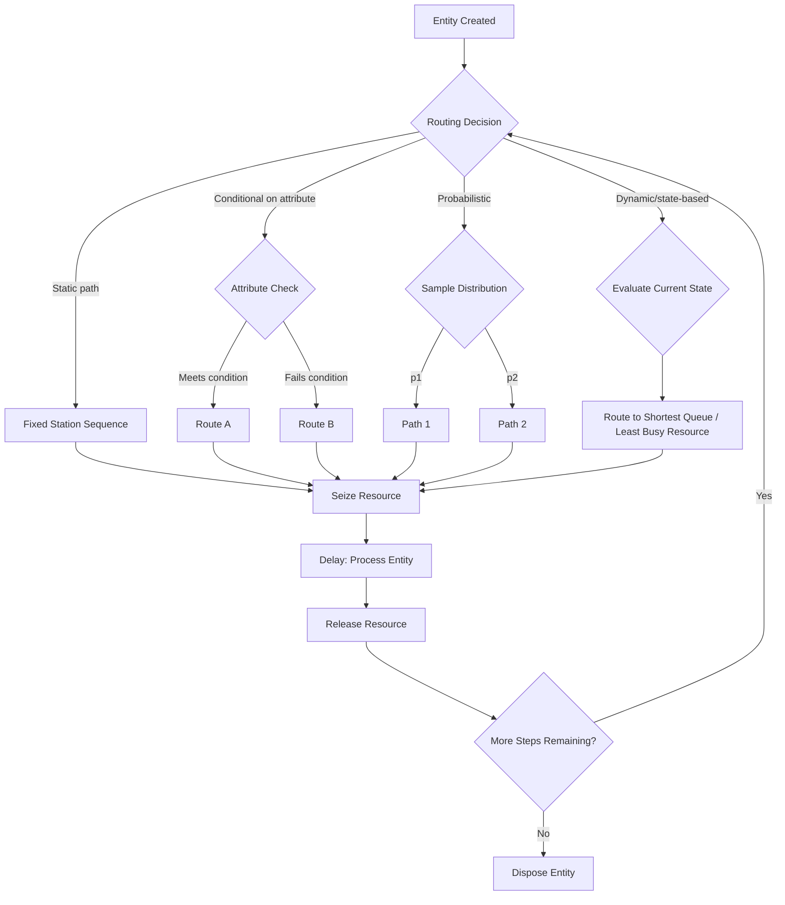

## Entity Flow and Resource Management

### Overview

Entity flow and resource management concern how discrete units move through a simulated system and how they compete for, acquire, and release the limited resources needed to complete their processing. Where queueing theory (as covered previously) focuses on the analytical behavior of waiting lines, this topic addresses the underlying simulation architecture: how entities are represented, how resources are modeled as shared, constrained assets, and how the simulation engine coordinates access between them. This is the structural layer beneath nearly every DES model, regardless of application domain.

### Entities

#### Definition and Attributes

An entity is a discrete object that moves through the simulated system, triggering and being affected by events. Entities are not merely tokens — they typically carry attributes that influence their behavior and the statistics collected about them.

Common entity attributes include:

- **Identity**: a unique identifier for tracking and debugging
- **Type or class**: distinguishes entities that follow different logical paths (e.g., priority customers vs. standard customers)
- **Timestamps**: arrival time, service start time, and other lifecycle markers used to compute derived statistics such as time in system
- **Attribute values**: domain-specific data such as required service time, priority level, size, or destination

#### Entity Lifecycle

An entity's journey through a simulation generally follows a structured lifecycle:

1. **Creation**: the entity is generated, typically by an arrival or generator event, and assigned initial attribute values
2. **Routing**: the entity moves through a sequence of processing steps, queues, and decision points
3. **Resource acquisition**: the entity requests and, when granted, seizes one or more resources
4. **Processing**: the entity occupies the resource for a duration determined by a service time distribution or logic
5. **Resource release**: the entity releases the resource, making it available to other waiting entities
6. **Disposal**: the entity exits the system, at which point final statistics are recorded and the entity object is typically destroyed or archived

#### Entity Attributes vs. System State Variables

A common conceptual distinction in DES:

| Concept | Scope | Example |
|---|---|---|
| Entity attribute | Belongs to a single entity, travels with it | Customer priority level, order size |
| System state variable | Describes the system as a whole | Number of entities currently in queue, server busy/idle status |

Confusing these two categories is a frequent source of modeling errors, since entity attributes should be read and written only in the context of the specific entity being processed, while state variables persist independently of any single entity's presence.

### Resources

#### Resource as a Modeling Abstraction

A resource represents any constrained asset that entities compete for: a machine, a staff member, a piece of equipment, a unit of physical space, or an abstract capacity limit such as bandwidth. Resources are typically modeled with:

- **Capacity**: the number of units available (e.g., a resource with capacity 3 can serve three entities simultaneously)
- **Current allocation state**: how many units are currently seized, and by which entities
- **A queue or wait mechanism**: for entities that request the resource when it is unavailable

#### Seize-Delay-Release Pattern

The most common resource interaction pattern in DES modeling is:

1. **Seize**: the entity requests one or more units of a resource; if unavailable, the entity waits
2. **Delay**: once granted, the entity holds the resource for a duration (the processing or service time)
3. **Release**: the entity relinquishes the resource, making it available for the next waiting entity

This pattern generalizes the server logic from single-queue models to arbitrary resource types and is the standard building block in commercial and academic DES frameworks alike.

#### Resource Capacity and Multi-Unit Resources

Resources are not limited to representing a single server. A resource can have capacity $c > 1$, meaning multiple entities can hold it simultaneously up to that limit. This is distinct from having $c$ separate single-capacity resources when:

- Entities may request more than one unit at a time (e.g., a task requiring 2 of 5 available technicians)
- The resource's units are interchangeable and tracked in aggregate rather than individually addressed

[Inference] Aggregate multi-unit resource modeling is generally more computationally efficient than modeling each unit as a distinct resource object when the units are truly interchangeable, since the simulation only needs to track a count rather than the state of each individual unit — though this efficiency gain is most significant in large-scale models with high resource counts and frequent seize/release events.

### Resource Allocation Rules

When multiple entities compete for a resource, or when a resource has multiple candidate assignees, allocation logic determines the outcome:

- **FIFO allocation**: entities are granted the resource in the order they requested it
- **Priority-based allocation**: entities with higher priority attributes are granted the resource first, potentially ahead of entities that requested earlier
- **Preemption**: a high-priority entity may seize a resource currently held by a lower-priority entity, interrupting the latter's processing
- **Set/selection rules**: when an entity may be served by any of several resource types (e.g., any of three machine types), a selection rule (fastest available, least-utilized, specific preference order) determines which is assigned

### Resource Flow Diagram (svg_diagram)

<svg xmlns="http://www.w3.org/2000/svg" viewBox="0 0 800 340">
  <text x="400" y="25" text-anchor="middle" font-size="16" font-weight="bold" fill="#1a1a2e">Seize-Delay-Release Resource Cycle (svg_diagram)</text>

  
  <rect x="30" y="140" width="110" height="60" fill="#eef3fb" stroke="#3a5a9c" stroke-width="2" />
  <text x="85" y="175" text-anchor="middle" font-size="12" fill="#1a1a2e">Entity Created</text>

  <line x1="140" y1="170" x2="200" y2="170" stroke="#333" stroke-width="2" marker-end="url(#arrowR)" />

  <rect x="200" y="140" width="120" height="60" fill="#fdeee0" stroke="#c96a1f" stroke-width="2" />
  <text x="260" y="170" text-anchor="middle" font-size="12" fill="#1a1a2e">Seize Resource</text>
  <text x="260" y="185" text-anchor="middle" font-size="10" fill="#555">(wait if unavailable)</text>

  <line x1="320" y1="170" x2="380" y2="170" stroke="#333" stroke-width="2" marker-end="url(#arrowR)" />

  <rect x="380" y="140" width="110" height="60" fill="#e9f7ee" stroke="#2f8a4b" stroke-width="2" />
  <text x="435" y="170" text-anchor="middle" font-size="12" fill="#1a1a2e">Delay</text>
  <text x="435" y="185" text-anchor="middle" font-size="10" fill="#555">(service time)</text>

  <line x1="490" y1="170" x2="550" y2="170" stroke="#333" stroke-width="2" marker-end="url(#arrowR)" />

  <rect x="550" y="140" width="120" height="60" fill="#f7e9f3" stroke="#9c3a7c" stroke-width="2" />
  <text x="610" y="170" text-anchor="middle" font-size="12" fill="#1a1a2e">Release Resource</text>

  <line x1="670" y1="170" x2="730" y2="170" stroke="#333" stroke-width="2" marker-end="url(#arrowR)" />
  <text x="760" y="175" text-anchor="middle" font-size="12" fill="#333">Exit</text>

  
  <rect x="200" y="250" width="470" height="60" fill="#fff8e6" stroke="#b8860b" stroke-width="1.5" stroke-dasharray="5,3" />
  <text x="435" y="270" text-anchor="middle" font-size="12" font-weight="bold" fill="#7a5c00">Resource Pool (capacity = c)</text>
  <circle cx="240" cy="292" r="9" fill="#b8860b" />
  <circle cx="270" cy="292" r="9" fill="#b8860b" opacity="0.3" />
  <circle cx="300" cy="292" r="9" fill="#b8860b" />
  <text x="400" y="296" font-size="10" fill="#7a5c00">filled = in use, faded = available</text>

  <line x1="260" y1="200" x2="260" y2="250" stroke="#c96a1f" stroke-width="1.5" stroke-dasharray="3,2" marker-end="url(#arrowD)" />
  <line x1="610" y1="250" x2="610" y2="200" stroke="#9c3a7c" stroke-width="1.5" stroke-dasharray="3,2" marker-end="url(#arrowU)" />

  </svg>

### Multi-Resource Requirements

Some processing steps require an entity to simultaneously hold more than one resource before proceeding — for example, a surgical procedure requiring both an operating room and a qualified surgeon. This introduces two important complications:

- **Simultaneous seize requirements**: the entity cannot proceed until all required resources are available at once, which is logically distinct from sequentially seizing each resource, since an entity might successfully seize one resource and then be forced to hold it idle while waiting for the second
- **Deadlock risk**: if two entities each hold one resource the other needs and are unwilling to release it, the simulation can enter a deadlock state where neither can proceed

#### Deadlock Avoidance Strategies

- **Resource ordering**: requiring all entities to request multi-resource sets in a fixed, consistent order, which prevents circular wait conditions
- **All-or-nothing acquisition**: an entity only seizes a resource once it has confirmed availability of all resources it needs, releasing any partially-held resources if the full set cannot be acquired
- **Timeout and rollback**: an entity that has waited too long while holding partial resources releases them and re-enters the queue, retrying later

[Unverified] Whether deadlock is a practical concern for a given model depends heavily on the specific resource-acquisition logic implemented; simulations using only sequential single-resource seizes per processing step, without ever requiring simultaneous multi-resource holds, are not exposed to this failure mode at all.

### Resource States

Resources typically transition through a small set of states over the course of a simulation:

| State | Description |
|---|---|
| Idle | Available, not currently held by any entity |
| Busy | Fully or partially seized by one or more entities |
| Blocked | Held by an entity that has finished processing but cannot release it downstream (e.g., no space in the next buffer) |
| Down | Unavailable due to failure, maintenance, or scheduled downtime |
| Setup/Changeover | Transitioning between tasks, such as reconfiguring a machine for a different product type |

### Entity Routing Logic

Routing determines the sequence of stations, queues, and resources an entity visits. Routing can be:

- **Static**: every entity of a given type follows a fixed, predetermined path
- **Conditional**: routing decisions depend on entity attributes (e.g., entities above a size threshold are routed to a different resource)
- **Probabilistic**: routing follows a specified probability distribution over possible next steps, useful for modeling systems where the deterministic cause of a routing choice is not tracked explicitly
- **Attribute-driven dynamic routing**: routing decisions depend on real-time system state, such as directing an entity to whichever of several parallel resources currently has the shortest queue

### Entity Flow Routing Logic (Mermaid)

### Batching and Splitting

Entity flow is not always one-to-one. Two common structural transformations:

- **Batching**: multiple individual entities are combined into a single batch entity for joint processing (e.g., items grouped for a shared shipment), then typically split apart again afterward
- **Splitting**: a single entity is divided into multiple sub-entities, each of which may follow independent downstream paths (e.g., a bulk order divided into individual line items)

Batching logic requires the simulation to hold arriving entities in a temporary collection area until a batch-formation condition is met — either a fixed batch size or a maximum waiting time, whichever occurs first — introducing an additional synchronization point distinct from standard resource seizing.

### Resource Utilization Statistics

Resource-level performance measures parallel those used for queues, since a resource is the generalized version of a server:

$$\bar{u} = \frac{\text{total busy time}}{\text{total elapsed simulation time} \times \text{capacity}}$$

For multi-unit resources, utilization is computed as a time-weighted average of the fraction of units in use, following the same accumulation approach used for time-weighted queue statistics: each time the number of busy units changes, the previous count is multiplied by its duration and added to a running total.

**Key Points**
- Entities carry attributes and move through a lifecycle of creation, routing, resource acquisition, processing, release, and disposal
- Resources are the generalized abstraction underlying "servers"; the seize-delay-release pattern is the standard interaction model
- Multi-resource requirements introduce deadlock risk, which is addressed through resource ordering, all-or-nothing acquisition, or timeout/rollback strategies
- Routing logic can be static, conditional, probabilistic, or dynamically state-dependent, and determines the sequence of resource interactions an entity experiences

### Common Modeling Pitfalls

- **Failing to release resources on all exit paths**: if an entity can exit a process block through an error path or early termination, the resource it holds must still be explicitly released, or it will remain incorrectly marked busy for the rest of the simulation
- **Conflating entity count with resource capacity**: a queue can have unlimited entities waiting even when the resource capacity is small; failing to model queue capacity separately from resource capacity can produce unrealistic blocking behavior
- **Ignoring setup/changeover time**: omitting changeover delays between different entity types processed by the same resource can meaningfully overstate effective capacity
- **Static routing where dynamic routing is warranted**: applying a fixed routing rule in a system where entities would realistically adapt to current congestion (e.g., choosing the shorter of two visible queues) can produce systematically biased utilization estimates across parallel resources

**Next Steps**
- Simulating Multi-Resource and Deadlock-Prone Systems
- Batching, Splitting, and Assembly Processes in DES
- Modeling Setup and Changeover Times in Resource-Constrained Systems
- Dynamic and State-Dependent Routing Strategies
- Simulating Material Handling and Transporter Resources
- Statistical Analysis of Resource Utilization and Bottleneck Identification
- Verification and Validation Techniques for Simulation Models
- Simulating System Reliability: Failure and Repair Processes