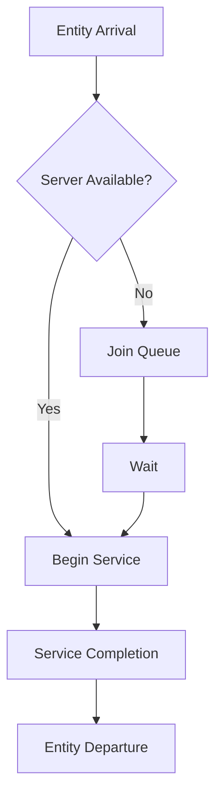

## Simulation of Manufacturing and Service Systems

### Overview

Discrete event simulation (DES) is widely applied to manufacturing and service systems because both domains are naturally composed of entities (parts, customers, jobs) that move through a sequence of processes, compete for limited resources (machines, servers, staff), and experience delays (queues, waiting lines). DES models these systems as a sequence of discrete events — arrivals, service starts, service completions, machine breakdowns, departures — rather than modeling continuous time flow, making it computationally efficient and conceptually aligned with how these systems actually operate.

### Why Simulate Manufacturing and Service Systems

**Key Points**

- Real systems are often too complex for closed-form analytical solutions (e.g., queuing theory) once variability, multiple resource types, routing logic, and breakdowns are introduced together.
- Simulation allows "what-if" experimentation without disrupting actual operations or incurring real-world costs.
- It supports capacity planning, bottleneck identification, staffing decisions, layout design, and policy testing (e.g., scheduling rules, inventory policies).
- Stochastic elements (arrival variability, processing time variability, failure rates) can be modeled explicitly using probability distributions.

[Inference] The specific magnitude of benefit (e.g., percentage cost savings) from simulation-based decisions is highly context-dependent and cannot be generalized without reference to a specific case study.

### Core Modeling Elements

#### Entities

Entities are the objects that flow through the system and are subject to processing. In manufacturing, entities are typically parts, sub-assemblies, or batches/lots. In service systems, entities are typically customers, patients, calls, or transactions.

#### Resources

Resources are the limited-capacity elements entities compete for: machines, tools, operators, service counters, nurses, or bandwidth. Resources may have:

- Finite capacity (number of parallel units)
- Setup or changeover times
- Failure and repair characteristics (mean time between failures, mean time to repair)

#### Queues (Waiting Lines)

Queues form when entity arrival or processing demand exceeds immediately available resource capacity. Key queue characteristics include:

- Queue discipline (FIFO, LIFO, priority-based, shortest-processing-time-first)
- Maximum queue capacity (finite vs. infinite buffer)
- Balking and reneging behavior (entities leaving without service or abandoning a queue)

#### Activities and Delays

- **Activities**: time-consuming operations with a known or modeled duration (e.g., machining time, service time), often defined by a probability distribution.
- **Delays**: waiting periods not explicitly scheduled by the model logic but arising from system state (e.g., waiting for a busy resource).

#### Events

Events are instantaneous occurrences that change system state: entity arrival, service start, service completion, machine failure, machine repair completion, shift change.

### Manufacturing System Simulation

#### Typical Elements Modeled

- **Job/part arrivals**: new work entering the system, either from external orders or upstream stages.
- **Workstations/machines**: processing centers, often with distinct cycle times per part type.
- **Material handling**: conveyors, AGVs (automated guided vehicles), forklifts moving entities between stations.
- **Buffers/WIP (work-in-process) storage**: intermediate holding areas with finite capacity.
- **Routing logic**: fixed routing (flow shop) or variable routing depending on part type or system state (job shop).
- **Machine failures and maintenance**: breakdowns modeled via mean-time-between-failure (MTBF) and mean-time-to-repair (MTTR) distributions; preventive maintenance schedules.
- **Batching and lot sizing**: entities processed individually or grouped into batches for transport or processing.

#### Common Manufacturing Configurations

- **Flow shop**: all jobs follow the same sequence of stations (e.g., assembly line).
- **Job shop**: jobs follow varying routes depending on type, common in custom or low-volume, high-variety manufacturing.
- **Flexible manufacturing systems (FMS)**: machines capable of multiple operations, with dynamic routing and scheduling.

#### Key Performance Metrics

- Throughput (units produced per unit time)
- Cycle time / lead time (total time an entity spends in the system)
- Work-in-process (WIP) inventory levels
- Machine utilization
- Bottleneck identification (station with highest utilization or longest queue)
- On-time delivery / due-date performance

### Service System Simulation

#### Typical Elements Modeled

- **Customer/patient/call arrivals**: often modeled with non-stationary arrival rates (e.g., time-of-day variation, such as lunch rushes or peak call-center hours).
- **Servers**: tellers, cashiers, nurses, call-center agents, kiosks.
- **Multiple service stages**: sequential steps such as check-in, triage, treatment, checkout in a healthcare setting.
- **Priority classes**: emergency cases, VIP customers, or expedited service tiers that alter queue discipline.
- **Staffing schedules**: shift patterns, breaks, and varying numbers of active servers by time period.
- **Abandonment and reneging**: customers leaving a queue after waiting too long, particularly relevant in call centers.

#### Common Service System Contexts

- Call centers (staffing levels vs. service level agreements)
- Healthcare (emergency departments, outpatient clinics, appointment scheduling)
- Retail and banking (checkout lines, teller counts)
- Transportation and logistics (airport security lines, toll booths, public transit)
- Government and administrative services (permit processing, DMV-style queues)

#### Key Performance Metrics

- Average waiting time
- Server utilization
- Queue length distribution
- Probability of waiting longer than a target threshold (service-level metric)
- Abandonment rate
- Customer/patient throughput

### Comparing Manufacturing and Service Simulation Focus

| Aspect | Manufacturing Emphasis | Service Emphasis |
| --- | --- | --- |
| Entity behavior | Passive (parts do not choose to leave) | Can be active (customers may balk or renege) |
| Variability source | Machine processing time, failure/repair | Arrival patterns, service time, customer behavior |
| Primary metric | Throughput, WIP, utilization | Waiting time, service level, abandonment |
| Time dependency | Often steady-state focused | Often highly time-of-day dependent |
| Resource behavior | Machines rarely idle voluntarily | Staff schedules and breaks are explicit decisions |

[Inference] This comparison represents generalized tendencies observed across common case studies; specific systems may blend characteristics from both columns (e.g., a hospital pharmacy has both machine-like batch processing and customer-like queuing behavior).

### Example: Single-Server Queueing Node

Consider a simplified service station (e.g., a single checkout counter) as an illustrative building block common to both domains.

**Example**

- Entities: customers
- Resource: one cashier (capacity = 1)
- Arrival process: interarrival times drawn from an exponential distribution with mean $1/\lambda$
- Service process: service times drawn from an exponential distribution with mean $1/\mu$
- Queue discipline: FIFO, infinite capacity

For this classic M/M/1 queue, several steady-state analytical results exist and are commonly used to validate simulation output:

$$\rho = \frac{\lambda}{\mu}$$

$$L = \frac{\rho}{1-\rho}$$

$$W = \frac{L}{\lambda}$$

Where $\rho$ is server utilization, $L$ is the expected number of entities in the system, and $W$ is the expected time an entity spends in the system (waiting plus service). These closed-form results are standard queuing theory outcomes and are commonly used as a sanity check against simulation output for simple configurations; more complex systems (multiple stages, finite buffers, non-Markovian distributions) generally lack such closed-form solutions, which is precisely why simulation is used.

### Process Flow Diagram

flowchart TD (svg_diagram)

A[Entity Arrival] --> B{Server Available?}

B -- Yes --> C[Begin Service]

B -- No --> D[Join Queue]

D --> E[Wait]

E --> C

C --> F[Service Completion]

F --> G[Entity Departure]

### Modeling Variability

Both manufacturing and service simulations rely heavily on probability distributions to represent real-world variability:

- **Exponential distribution**: commonly used for interarrival times and, historically, service times, due to the memoryless property.
- **Normal distribution**: often used for processing times with low variability (e.g., stable automated machining operations).
- **Triangular distribution**: useful when only minimum, most likely, and maximum estimates are available (common in early-stage models with limited data).
- **Weibull distribution**: frequently used to model time-to-failure for equipment, capturing increasing or decreasing failure rates over time.
- **Empirical distributions**: constructed directly from historical data when no standard distribution fits well.

[Inference] The choice of distribution should be validated against collected data (e.g., via goodness-of-fit tests such as chi-square or Kolmogorov-Smirnov); assuming a distribution without validation risks generating misleading simulation results.

### Handling Bottlenecks

A bottleneck is the resource that most constrains overall system throughput. Identifying it typically involves:

- Comparing utilization rates across all resources — the resource with utilization closest to 100% (or with the longest sustained queue) is often the primary bottleneck.
- Running "what-if" scenarios that add capacity at a suspected bottleneck and observing whether overall throughput improves.
- Recognizing that bottlenecks can shift once the current bottleneck's capacity is increased ("bottleneck migration").

### Warm-up Period and Steady-State Considerations

Many manufacturing and service simulations start from an empty/idle state, which does not reflect typical operating conditions. To address this:

- A **warm-up period** is used, during which initial statistics are discarded, allowing the system to reach a representative operating condition before data collection begins.
- Methods such as Welch's graphical method are commonly used to determine an appropriate warm-up length.
- For systems that do not reach a true steady state (e.g., a retail store with distinct daily opening/closing cycles), **terminating simulation** (running the full operational period from start to end without a warm-up assumption) is more appropriate than steady-state analysis.

### Validation and Verification Considerations Specific to These Systems

- **Face validity**: checking with subject matter experts (plant managers, service supervisors) whether the model's behavior looks reasonable.
- **Historical data comparison**: comparing simulated throughput, cycle times, or wait times against actual recorded system performance.
- **Sensitivity analysis**: varying key inputs (arrival rate, processing time variability) to confirm the model responds in expected directions.

[Inference] The specific validation techniques appropriate for a given project depend on data availability and stakeholder requirements, and no single validation method is universally sufficient on its own.

### Common Software Tools

Widely used commercial and open-source discrete event simulation tools applied to manufacturing and service contexts include Arena, Simio, AnyLogic, FlexSim, and SimPy (a Python-based library). [Unverified] Specific feature sets, licensing terms, and version capabilities of these tools change over time and should be confirmed directly with the vendor or current documentation rather than assumed from general familiarity.

### Related Topics

- Queuing Theory Fundamentals (M/M/1, M/M/c, M/G/1 models)
- Input Data Analysis and Distribution Fitting for Simulation
- Random Number Generation and Variate Generation Techniques
- Output Analysis: Confidence Intervals and Replication Design
- Simulation Optimization Techniques
- Agent-Based Simulation vs. Discrete Event Simulation
- Simulation of Supply Chain and Logistics Networks
- Verification and Validation Techniques in Simulation Models