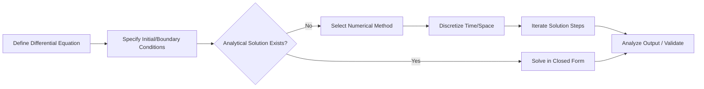

## Differential Equation-Based Modeling

### Overview

Differential equation-based modeling represents system dynamics using equations that relate a quantity to its rate of change with respect to time (or another independent variable). This approach is foundational to continuous simulation, in contrast to the discrete-event approach, and is used extensively to model physical, biological, chemical, economic, and engineering systems where state variables change smoothly rather than at discrete points in time.

### Ordinary Differential Equations (ODEs)

An ordinary differential equation involves derivatives of a function of a single independent variable (typically time).

#### General Form

A first-order ODE can be written as:

$$\frac{dx}{dt} = f(x, t)$$

where $x$ is the state variable and $t$ is time. Higher-order systems can typically be reduced to a system of first-order equations by introducing auxiliary variables.

#### Order and Linearity

- **Order**: determined by the highest derivative present (first-order, second-order, etc.).
- **Linear vs. nonlinear**: a linear ODE has the dependent variable and its derivatives appearing only to the first power and without products between them; nonlinear ODEs involve products, powers, or transcendental functions of the state variable.

### Partial Differential Equations (PDEs)

PDEs involve derivatives with respect to more than one independent variable, typically space and time, and are used when a quantity varies across both dimensions (e.g., temperature distribution across a rod over time).

#### Common PDE Classes

- **Parabolic** (e.g., heat/diffusion equation): $\frac{\partial u}{\partial t} = \alpha \frac{\partial^2 u}{\partial x^2}$
- **Hyperbolic** (e.g., wave equation): $\frac{\partial^2 u}{\partial t^2} = c^2 \frac{\partial^2 u}{\partial x^2}$
- **Elliptic** (e.g., Laplace's equation, steady-state problems): $\frac{\partial^2 u}{\partial x^2} + \frac{\partial^2 u}{\partial y^2} = 0$

[Inference] Classifying a specific real-world PDE into exactly one of these categories can be ambiguous when the equation has mixed characteristics; the classification above reflects canonical textbook forms rather than every possible variant.

### Analytical vs. Numerical Solutions

**Key Points**

- Analytical (closed-form) solutions exist only for a limited class of differential equations, typically linear equations with constant coefficients or specific well-studied nonlinear forms.
- Most real-world systems of practical interest involve nonlinearity, coupling between multiple variables, or complex boundary conditions that preclude closed-form solutions.
- Numerical methods approximate the solution at discrete time steps or grid points, trading exactness for general applicability.

### Numerical Methods for ODEs

#### Euler's Method

The simplest numerical integration technique, using the forward difference approximation:

$$x_{n+1} = x_n + h \cdot f(x_n, t_n)$$

where $h$ is the step size. Euler's method is easy to implement but has low accuracy (first-order) and can become unstable for stiff systems or large step sizes.

#### Improved Euler / Heun's Method

A second-order method that averages the slope at the beginning and (predicted) end of the interval, improving accuracy over basic Euler's method while remaining relatively simple to implement.

#### Runge-Kutta Methods

The fourth-order Runge-Kutta method (RK4) is widely used due to its favorable balance of accuracy and computational cost:

$$k_1 = f(x_n, t_n)$$

$$k_2 = f(x_n + \frac{h}{2}k_1, t_n + \frac{h}{2})$$

$$k_3 = f(x_n + \frac{h}{2}k_2, t_n + \frac{h}{2})$$

$$k_4 = f(x_n + h \cdot k_3, t_n + h)$$

$$x_{n+1} = x_n + \frac{h}{6}(k_1 + 2k_2 + 2k_3 + k_4)$$

RK4 achieves fourth-order accuracy, meaning the local truncation error scales with $h^5$ and the global error scales with $h^4$.

#### Adaptive Step-Size Methods

Methods such as Runge-Kutta-Fehlberg (RKF45) adjust the step size dynamically based on estimated local error, taking larger steps when the solution changes slowly and smaller steps when it changes rapidly, improving efficiency without sacrificing accuracy.

#### Implicit Methods and Stiff Systems

- **Stiff systems**: ODE systems containing widely varying time scales (some components changing very rapidly, others slowly), which cause explicit methods like standard Euler or RK4 to require impractically small step sizes for numerical stability.
- **Implicit methods** (e.g., backward Euler, implicit Runge-Kutta methods): solve an equation involving the unknown future state on both sides, generally offering better numerical stability for stiff systems at the cost of requiring iterative solution of algebraic equations at each step.

[Inference] Whether a given system is "stiff" in practice depends on the specific parameter values and time scales involved, and stiffness is typically identified empirically (e.g., by observing that explicit solvers require extremely small step sizes) rather than always being obvious from the equation's symbolic form alone.

### Numerical Methods for PDEs

- **Finite Difference Method (FDM)**: approximates derivatives using difference quotients on a discretized grid; conceptually straightforward and widely used for regular geometries.
- **Finite Element Method (FEM)**: divides the domain into small elements with piecewise-defined basis functions; well-suited to complex geometries and boundary conditions, common in structural and mechanical engineering simulation.
- **Finite Volume Method (FVM)**: based on conservation laws applied over discrete control volumes; widely used in computational fluid dynamics due to its natural enforcement of conservation properties.
- **Method of Lines**: discretizes spatial derivatives first, converting a PDE into a system of ODEs that can then be solved using standard ODE solvers.

### System Dynamics and State-Space Representation

Many differential equation models are expressed as a system of coupled first-order equations in state-space form:

$$\dot{\mathbf{x}} = A\mathbf{x} + B\mathbf{u}$$

where $\mathbf{x}$ is the state vector, $\mathbf{u}$ is the input vector, and $A$, $B$ are matrices defining system dynamics — a representation heavily used in control systems engineering and system dynamics simulation.

### Example: Population Growth Model

**Example**

The logistic growth equation models population growth with a carrying capacity constraint:

$$\frac{dP}{dt} = rP\left(1 - \frac{P}{K}\right)$$

Where $P$ is population size, $r$ is the intrinsic growth rate, and $K$ is the carrying capacity. Unlike the unconstrained exponential growth model ($\frac{dP}{dt} = rP$), the logistic model has a known closed-form analytical solution:

$$P(t) = \frac{K P_0 e^{rt}}{K + P_0(e^{rt}-1)}$$

This closed-form solution allows direct validation of numerical solvers applied to the same equation, making it a standard benchmark problem in introductory differential-equation-based modeling coursework.

### Solution Behavior Diagram

flowchart LR (svg_diagram)

A[Define Differential Equation] --> B[Specify Initial/Boundary Conditions]

B --> C{Analytical Solution Exists?}

C -- Yes --> D[Solve in Closed Form]

C -- No --> E[Select Numerical Method]

E --> F[Discretize Time/Space]

F --> G[Iterate Solution Steps]

G --> H[Analyze Output / Validate]

D --> H

### Stability and Convergence

- **Stability**: a numerical method is stable if small errors introduced at one step do not grow uncontrollably in subsequent steps; stability regions differ across methods and are often analyzed using test equations such as $\frac{dx}{dt} = \lambda x$.
- **Convergence**: as step size $h \to 0$, the numerical solution should approach the true analytical solution.
- **Consistency**: the discretized equation should approximate the original differential equation increasingly well as $h \to 0$.

[Inference] The Lax Equivalence Theorem (consistency + stability implies convergence) applies specifically to well-posed linear PDE problems; its direct applicability to nonlinear systems requires additional theoretical justification not covered by the basic theorem.

### Boundary and Initial Conditions

- **Initial Value Problems (IVPs)**: conditions specified at a single starting point, common in ODEs describing time evolution.
- **Boundary Value Problems (BVPs)**: conditions specified at multiple points (often the domain's boundaries), common in spatial PDE problems (e.g., temperature fixed at both ends of a rod).
- **Dirichlet conditions**: specify the value of the function at the boundary.
- **Neumann conditions**: specify the value of the derivative (e.g., flux) at the boundary.
- **Mixed/Robin conditions**: a linear combination of function value and derivative at the boundary.

### Applications in Modeling and Simulation

| Domain | Example Application |
| --- | --- |
| Physics/Engineering | Heat transfer, structural mechanics, fluid dynamics |
| Biology/Epidemiology | Population dynamics, compartmental disease models (SIR) |
| Chemistry | Reaction kinetics, concentration over time |
| Economics | Growth models, capital accumulation |
| Control Systems | Feedback control, stability analysis |
| Electrical Engineering | Circuit dynamics (RLC circuits) |

### Common Software Tools

Widely used tools for differential equation-based modeling include MATLAB/Simulink, Python (SciPy's `solve_ivp`, and specialized packages), Mathematica, COMSOL Multiphysics (particularly for PDE/FEM applications), and Modelica-based environments. [Unverified] Specific solver algorithms, default tolerances, and licensing details for these tools change across versions and should be verified against current official documentation rather than assumed.

### Related Topics

- System Dynamics Modeling (Stocks and Flows)
- Numerical Stability Analysis of Solvers
- Compartmental Models in Epidemiology (SIR/SEIR)
- Finite Element Method Fundamentals
- Computational Fluid Dynamics Basics
- Hybrid Simulation (Combining Continuous and Discrete Event Methods)
- Sensitivity Analysis for Parameter Estimation in Dynamic Models
- Control Theory and State-Space Modeling