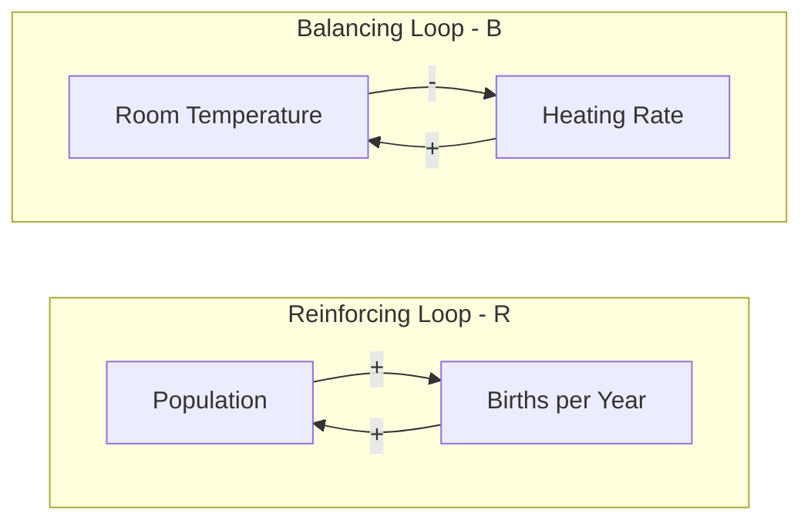
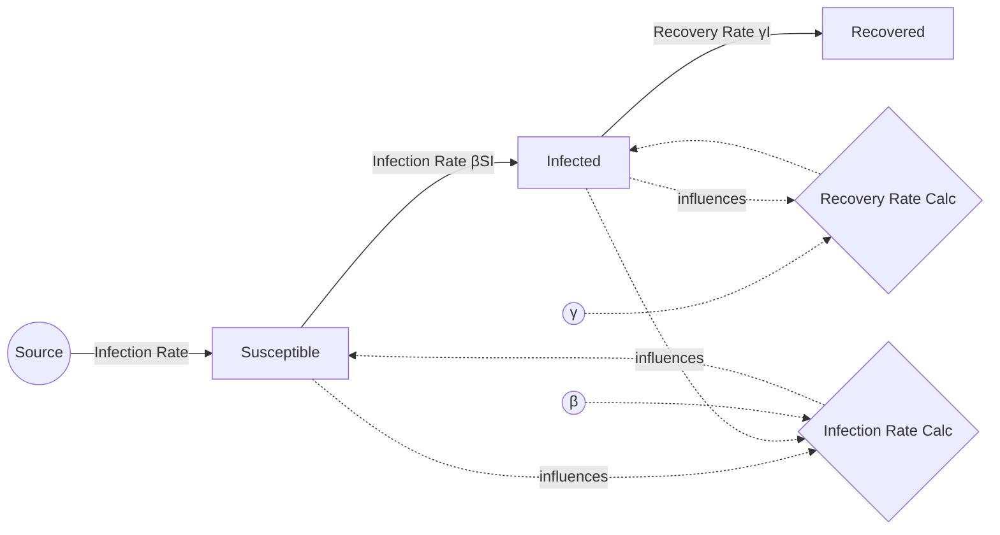

## Stock and Flow Diagrams

### Overview

Stock and flow diagrams are the primary structural notation for System Dynamics, a modeling paradigm distinct from discrete event simulation. Where DES tracks individual discrete entities moving through queues and resources, System Dynamics represents a system as continuous quantities that accumulate and drain over time, governed by feedback loops. Stock and flow diagrams provide the visual and mathematical language for building these models, making them foundational for representing systems where the aggregate level of something — population, inventory, capital, pollution concentration — matters more than the identity of any individual unit within it.

### Core Building Blocks

#### Stocks (Levels)

A stock, also called a level or accumulation, represents a quantity that has built up over time and persists in the absence of any flow. Stocks are the state variables of a System Dynamics model — they are what the system "remembers" from one moment to the next.

Characteristics of stocks:

- Measured at a single point in time (a snapshot quantity)
- Changed only by flows into or out of them
- Represented visually as a rectangle
- Examples: population size, water volume in a reservoir, inventory on hand, accumulated debt, number of infected individuals

Mathematically, a stock's value at time $t$ is the accumulation of net flow since some initial time:

$$\text{Stock}(t) = \text{Stock}(t_0) + \int_{t_0}^{t} \left[ \text{Inflow}(s) - \text{Outflow}(s) \right] ds$$

#### Flows (Rates)

A flow represents the rate of change of a stock — the speed at which material, information, or value moves into or out of a stock per unit time. Flows are the only mechanism by which a stock's value changes.

Characteristics of flows:

- Measured over an interval of time (a rate, not a snapshot)
- Represented visually as a pipe or arrow with a valve symbol, flowing into or out of a stock
- Examples: births per year, water flowing out of a reservoir, units shipped per day, infection rate

The relationship between a stock and its flows is expressed as a differential equation:

$$\frac{d(\text{Stock})}{dt} = \text{Inflow}(t) - \text{Outflow}(t)$$

This is the defining equation of System Dynamics: every stock in a model has an associated equation of exactly this form, summing all inflows and subtracting all outflows.

#### Converters (Auxiliary Variables)

Converters, also called auxiliaries, hold intermediate calculations, constants, or converted values that influence flow rates but are not themselves accumulations. A converter might represent a fixed parameter (e.g., a birth rate percentage) or a computed value derived from one or more stocks (e.g., a fractional growth rate computed from current population and carrying capacity).

- Represented visually as a circle
- Do not accumulate; recalculated at each simulation time step based on current inputs
- Often used to encode nonlinear relationships, such as a graphical lookup function relating one variable to another

#### Connectors (Information Links)

Connectors are arrows that indicate one variable's value influences another, without representing a physical or material flow. A connector might link a stock's current value to a converter that computes a flow rate, showing that the flow depends on the current level of the stock — a common feedback mechanism.

### Stock and Flow Notation Summary

| Element | Symbol | Role |
|---|---|---|
| Stock | Rectangle | Accumulation; state variable; changes only via flows |
| Flow | Pipe with valve, arrow | Rate of change; fills or drains a stock |
| Converter | Circle | Auxiliary calculation, constant, or parameter |
| Connector | Thin arrow | Information influence, not material flow |
| Source/Sink | Cloud | Represents a boundary of the model; an infinite, unmodeled origin or destination |

### Basic Stock and Flow Structure (svg_diagram)

<svg xmlns="http://www.w3.org/2000/svg" viewBox="0 0 800 260">
  <text x="400" y="25" text-anchor="middle" font-size="16" font-weight="bold" fill="#1a1a2e">Stock with Inflow and Outflow (svg_diagram)</text>

  
  <path d="M 40 130 q -15 -20 10 -25 q 5 -20 25 -12 q 15 -18 30 0 q 20 -8 22 12 q 15 5 5 22 q -5 15 -20 10 q -15 10 -30 0 q -20 8 -30 -5 q -15 0 -12 -12 z" fill="#e8e8e8" stroke="#888" stroke-width="1.5" />

  <line x1="105" y1="130" x2="220" y2="130" stroke="#3a5a9c" stroke-width="4" />
  <polygon points="220,120 220,140 240,130" fill="#3a5a9c" />
  <rect x="205" y="115" width="30" height="30" fill="#3a5a9c" opacity="0.15" stroke="#3a5a9c" stroke-width="1.5" transform="rotate(45 220 130)" />
  <text x="215" y="105" text-anchor="middle" font-size="11" fill="#333">Inflow</text>

  
  <rect x="250" y="105" width="140" height="55" fill="#eef3fb" stroke="#1a1a2e" stroke-width="2.5" />
  <text x="320" y="137" text-anchor="middle" font-size="13" font-weight="bold" fill="#1a1a2e">Stock</text>

  <line x1="390" y1="130" x2="505" y2="130" stroke="#c96a1f" stroke-width="4" />
  <polygon points="505,120 505,140 525,130" fill="#c96a1f" />
  <rect x="490" y="115" width="30" height="30" fill="#c96a1f" opacity="0.15" stroke="#c96a1f" stroke-width="1.5" transform="rotate(45 505 130)" />
  <text x="500" y="105" text-anchor="middle" font-size="11" fill="#333">Outflow</text>

  
  <path d="M 545 130 q -15 -20 10 -25 q 5 -20 25 -12 q 15 -18 30 0 q 20 -8 22 12 q 15 5 5 22 q -5 15 -20 10 q -15 10 -30 0 q -20 8 -30 -5 q -15 0 -12 -12 z" fill="#e8e8e8" stroke="#888" stroke-width="1.5" transform="translate(60,0)" />

  
  <circle cx="450" cy="200" r="26" fill="#fdf6e0" stroke="#b8860b" stroke-width="2" />
  <text x="450" y="204" text-anchor="middle" font-size="10" fill="#333">Rate</text>
  <line x1="450" y1="174" x2="470" y2="150" stroke="#b8860b" stroke-width="1.2" stroke-dasharray="3,2" marker-end="url(#arrowC)" />

  
  <line x1="320" y1="160" x2="410" y2="200" stroke="#666" stroke-width="1.2" stroke-dasharray="3,2" marker-end="url(#arrowC)" />
  <text x="365" y="195" font-size="9" fill="#555">influences</text>

  </svg>

### Feedback Loops

Feedback loops are the mechanism by which stock and flow structures generate the characteristic dynamic behaviors of System Dynamics models — growth, decline, oscillation, and equilibrium-seeking. A feedback loop exists whenever a stock's value, directly or through intermediate converters, influences one of its own flows.

#### Balancing (Negative) Feedback Loops

A balancing loop counteracts change, pushing the system toward a goal or equilibrium. As the stock moves away from a target, the loop generates a flow that pushes it back.

**Example**: A thermostat-controlled heating system. As room temperature (stock) falls below a target, the heating rate (inflow) increases; as temperature rises toward the target, heating rate decreases. This structure produces stabilizing, goal-seeking behavior.

#### Reinforcing (Positive) Feedback Loops

A reinforcing loop amplifies change, pushing the system further in whatever direction it is already moving, producing exponential growth or exponential decline.

**Example**: Population growth without constraint. A larger population (stock) produces more births (inflow), which further increases the population, which produces still more births. Left unchecked, this structure produces exponential growth.

#### Loop Polarity Notation

Feedback loops are typically annotated with a polarity symbol at their center:

- **R** (reinforcing) or **+**: indicates a self-amplifying loop
- **B** (balancing) or **−**: indicates a self-correcting loop

Individual connector arrows within a loop are also often marked with a polarity: a **+** connector means the two variables move in the same direction (an increase in the source increases the target), while a **−** connector means they move in opposite directions.

### Balancing vs. Reinforcing Loop Comparison (Mermaid)

### Combining Multiple Loops: The Logistic Growth Structure

Many real systems combine a reinforcing loop with a balancing loop acting on the same stock, producing S-shaped (logistic) growth rather than unchecked exponential growth. A classic example is population growth constrained by a carrying capacity.

**Structure**:
- **Reinforcing loop**: Population → Births → Population (larger population produces more births)
- **Balancing loop**: Population → (fraction of carrying capacity used) → Effective growth rate → Births → Population (as population approaches carrying capacity, the effective birth contribution shrinks)

Early in the simulation, when population is small relative to carrying capacity, the reinforcing loop dominates and growth resembles exponential behavior. As population approaches carrying capacity, the balancing loop's influence strengthens and growth decelerates, asymptotically approaching a stable equilibrium.

The classic logistic growth differential equation captures this structure:

$$\frac{dP}{dt} = rP\left(1 - \frac{P}{K}\right)$$

Where:
- $P$ = population (stock)
- $r$ = intrinsic growth rate
- $K$ = carrying capacity

[Inference] In a stock and flow implementation of this equation, $r$ and $K$ are typically represented as converters (constants), while the term $rP(1 - P/K)$ is computed by an intermediate converter that feeds the single inflow to the population stock — though the exact decomposition into converters is a modeling choice rather than a fixed requirement, since equivalent formulations of the same equation can be structured differently.

### Multi-Stock Structures

Real-world models typically involve multiple interconnected stocks, where the outflow of one stock is the inflow of another — analogous to a network of queues in DES, but with continuous accumulation rather than discrete entities.

**Example: Epidemic Model (SIR structure)**

A classic multi-stock structure used in epidemiology divides a population into three stocks:

- **Susceptible (S)**: individuals who can become infected
- **Infected (I)**: individuals currently infectious
- **Recovered (R)**: individuals who have recovered and gained immunity

Flows connect them sequentially: an infection flow moves individuals from Susceptible to Infected, and a recovery flow moves individuals from Infected to Recovered. The infection flow rate typically depends on both the Susceptible and Infected stock values simultaneously (since transmission requires contact between the two groups), making it a nonlinear flow driven by connectors from both stocks.

$$\frac{dS}{dt} = -\beta S I, \qquad \frac{dI}{dt} = \beta S I - \gamma I, \qquad \frac{dR}{dt} = \gamma I$$

Where $\beta$ is the transmission rate and $\gamma$ is the recovery rate, both typically represented as converters.

### SIR Stock and Flow Structure (Mermaid)

**Key Points**
- A stock is an accumulation, changed only by flows; a flow is a rate of change acting on a stock
- The defining relationship for every stock is $d(\text{Stock})/dt = \text{Inflow} - \text{Outflow}$
- Converters hold constants and intermediate calculations; connectors represent information influence rather than material transfer
- Reinforcing loops amplify change (exponential behavior); balancing loops counteract change (goal-seeking, stabilizing behavior)
- Complex dynamic behaviors, such as S-shaped growth or epidemic curves, typically emerge from the interaction of multiple simple loops rather than from any single loop in isolation

### Stock and Flow Diagrams vs. Discrete Event Simulation

| Aspect | Stock and Flow (System Dynamics) | Discrete Event Simulation |
|---|---|---|
| Representation | Continuous, aggregate quantities | Discrete, individually tracked entities |
| Time handling | Typically fixed time-step integration | Event-driven, variable time advance |
| Focus | Feedback structure and long-run dynamic behavior | Individual entity paths, queueing, resource contention |
| Typical output | Smooth trajectories of stock levels over time | Distributions of entity-level wait times, utilization statistics |
| Underlying math | Systems of differential (or difference) equations | Discrete-event scheduling and random variate generation |

[Inference] Hybrid models that combine both paradigms are increasingly common in practice, using System Dynamics to represent aggregate population-level or resource-level trends while using DES to represent detailed entity-level processes within the same overall model, though the specific integration technique (e.g., how a DES entity count feeds into a System Dynamics stock, or vice versa) varies by simulation software and problem context.

### Common Modeling Pitfalls

- **Modeling a rate as a stock or a level as a flow**: confusing units is a frequent conceptual error; a stock must have units that make sense as a static quantity (e.g., "liters"), while a flow's units must include a time dimension (e.g., "liters per minute")
- **Omitting the source/sink cloud**: forgetting to represent the boundary of the model with a cloud implies an inflow or outflow has no defined origin or destination, which can obscure where quantities are assumed to come from or go
- **Building unintended feedback loops**: an accidental connector between a stock and a flow that was not intended to be state-dependent can silently introduce feedback behavior not present in the intended model design
- **Ignoring stock-flow consistency**: every unit gained by one stock through a flow should correspond to a unit lost by the connected source, stock, or converter; violating this conservation principle produces models that generate or destroy quantity without a defined cause

**Related Topics**
- Feedback Loop Dynamics and Behavior Modes (Growth, Decline, Oscillation, Overshoot)
- Numerical Integration Methods for System Dynamics (Euler, Runge-Kutta)
- Building and Calibrating SIR/SEIR Epidemic Models
- Delays in System Dynamics: Material and Information Delays
- Hybrid Simulation: Combining System Dynamics with Discrete Event Simulation
- Sensitivity Analysis and Policy Testing in System Dynamics Models
- Causal Loop Diagrams as a Precursor to Stock and Flow Modeling
- Verification and Validation Techniques for Simulation Models