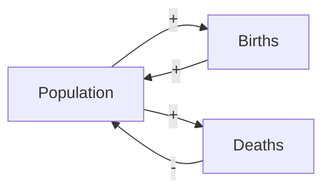
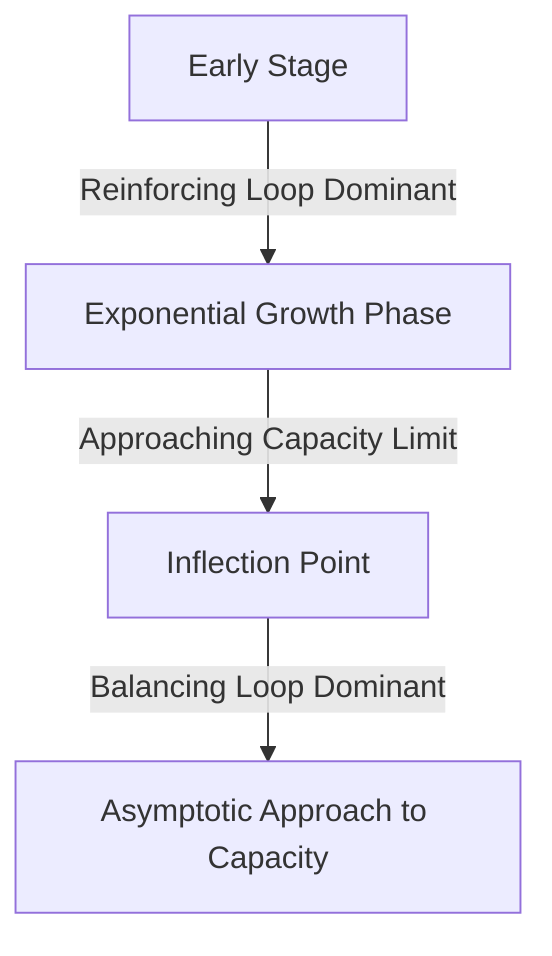

## Feedback Loop Analysis in System Dynamics

### Overview

Feedback loop analysis is the process of identifying, classifying, and interpreting the closed causal chains within a system dynamics model that drive its behavior over time. While stock and flow diagrams provide the structural representation of a system, feedback loop analysis focuses specifically on understanding how loops interact, which loop dominates behavior at a given time, and how loop structure explains observed patterns such as growth, decline, oscillation, or equilibrium-seeking behavior.

### Causal Loop Diagrams (CLDs)

Causal loop diagrams are a simplified, pre-quantitative notation used to map feedback structure before (or instead of) building a full stock and flow model. They consist of variables connected by arrows indicating causal influence, each labeled with a polarity.

#### Link Polarity

- **Positive link (+ or "s" for "same")**: an increase in the cause produces an increase in the effect (or a decrease produces a decrease) — the effect moves in the same direction as the cause.
- **Negative link (− or "o" for "opposite")**: an increase in the cause produces a decrease in the effect, or vice versa — the effect moves in the opposite direction.

#### Loop Polarity

A loop's overall polarity is determined by the product of the polarities of all links within it:

- An **even number of negative links** (including zero) results in a **reinforcing (positive) loop**.
- An **odd number of negative links** results in a **balancing (negative) loop**.

### Causal Loop Diagram Example

**Example**

flowchart LR (svg_diagram)
    A[Population] -->|+| B[Births]
    B -->|+| A
    A -->|+| C[Deaths]
    C -->|-| A

In this diagram, the Population-Births loop has zero negative links (reinforcing), while the Population-Deaths loop has one negative link (balancing).

### Reinforcing Loops (R)

Reinforcing loops amplify an initial change, producing exponential growth or exponential decline depending on the direction of the initial disturbance. They are typically labeled with an "R" and a clockwise or counterclockwise arrow in diagrams.

**Key Points**
- Reinforcing loops are the source of exponential behavior in dynamic systems.
- Left unchecked by any balancing influence, reinforcing loops drive a system toward unbounded growth or collapse.
- Examples: compound interest (capital generates interest, interest adds to capital), word-of-mouth adoption (adopters generate more adopters), viral epidemic spread in early stages.

### Balancing Loops (B)

Balancing loops counteract change, driving a system toward a goal, equilibrium, or capacity limit. They are typically labeled with a "B" in diagrams.

**Key Points**
- Balancing loops are the source of goal-seeking behavior, oscillation (when combined with delays), and equilibrium.
- Examples: thermostat control, inventory replenishment toward a target level, population growth constrained by carrying capacity.

### Loop Dominance

**Key Points**
- Most real systems contain multiple feedback loops operating simultaneously, often with competing effects.
- **Loop dominance** refers to which loop(s) have the strongest influence on system behavior at a given point in time.
- Dominance can shift over the course of a simulation — a reinforcing loop may dominate early behavior (e.g., early-stage epidemic growth), while a balancing loop dominates later behavior (e.g., depletion of susceptible population slowing infection spread).
- Identifying shifts in loop dominance is often key to explaining characteristic system dynamics behavior patterns such as S-shaped growth.

[Inference] Formally quantifying "which loop dominates" at a given moment (e.g., via loop elasticity or eigenvalue-based dominance analysis) requires either analytical decomposition of the underlying equations or specialized simulation software features; visual inspection of simulation output alone often only suggests, rather than rigorously proves, dominance shifts.

### Common Behavior Patterns from Loop Interaction

| Behavior Pattern | Typical Loop Structure |
|---|---|
| Exponential growth | Single dominant reinforcing loop |
| Goal-seeking / asymptotic approach | Single dominant balancing loop |
| S-shaped growth | Reinforcing loop dominant early, balancing loop dominant later |
| Oscillation | Balancing loop combined with a significant time delay |
| Overshoot and collapse | Reinforcing loop drives growth beyond a capacity limit enforced by a delayed balancing loop |
| Growth with overshoot and oscillation | Multiple balancing loops with delays interacting with a reinforcing loop |

### S-Shaped Growth Diagram

flowchart TD (svg_diagram)
    Start[Early Stage] -->|Reinforcing Loop Dominant| Growth[Exponential Growth Phase]
    Growth -->|Approaching Capacity Limit| Transition[Inflection Point]
    Transition -->|Balancing Loop Dominant| Saturation[Asymptotic Approach to Capacity]

### The Role of Delays in Feedback Loops

Time delays within balancing loops are a primary source of oscillatory behavior:

- A balancing loop without significant delay tends to smoothly approach its goal.
- A balancing loop with a substantial delay tends to overshoot the goal before correcting, and may oscillate around it before settling (or, in extreme cases, oscillate indefinitely or with growing amplitude if the delay is long relative to the loop's adjustment rate).

[Inference] Whether a specific delayed balancing loop produces damped oscillation, sustained oscillation, or divergent oscillation depends on the specific relationship between delay length and adjustment/correction rate parameters, and generally requires either simulation or formal stability analysis (e.g., examining eigenvalues of the linearized system) to determine definitively for a given parameter set.

### Analytical Techniques for Feedback Loop Analysis

#### Loop Identification

Systematically tracing all closed paths through a causal loop diagram or stock-flow diagram, ensuring no significant feedback path is overlooked.

#### Polarity Analysis

Assigning and verifying link polarities to classify each loop as reinforcing or balancing, as described above.

#### Eigenvalue Analysis (for Linear or Linearized Systems)

For systems that can be approximated by linear differential equations, the eigenvalues of the system matrix indicate:
- **Real, negative eigenvalues**: exponential decay toward equilibrium (balancing behavior).
- **Real, positive eigenvalues**: exponential growth away from equilibrium (reinforcing behavior).
- **Complex eigenvalues with negative real parts**: damped oscillation.
- **Complex eigenvalues with positive real parts**: growing oscillation (instability).
- **Purely imaginary eigenvalues**: sustained, undamped oscillation (a special/idealized case).

[Inference] Eigenvalue-based interpretation applies rigorously to linear systems; for nonlinear system dynamics models (which are common in practice), this analysis is typically only valid as a local approximation around a specific operating point or equilibrium, not as a global description of behavior across the full range of the simulation.

#### Simulation-Based Structural Testing

Deliberately disabling or attenuating specific loops within a simulation model (e.g., by fixing a normally variable parameter to a constant) to observe how removing that loop's influence changes overall system behavior, thereby inferring its contribution to the observed dynamics.

### Feedback Loops vs. Open-Loop (Causal Chain) Structures

A key distinction in system dynamics is between:
- **Open-loop (causal chain)** structures, where influence flows in one direction without returning to affect the originating variable.
- **Closed-loop (feedback)** structures, where the effect eventually influences its own cause, either directly or through intermediate variables.

Only closed-loop structures qualify as feedback loops; a long causal chain that never returns to influence its starting point, no matter how many variables it passes through, is not a feedback loop.

### Common Pitfalls in Feedback Loop Analysis

- **Missing loops**: failing to trace all paths through a complex diagram, leading to an incomplete understanding of system behavior drivers.
- **Polarity errors**: incorrectly assigning link polarity, which can flip a loop's classification from reinforcing to balancing or vice versa.
- **Assuming static dominance**: treating a loop identified as dominant at one point in the simulation as permanently dominant, when dominance may shift as state variables evolve.
- **Conflating causal loop diagrams with stock-flow rigor**: causal loop diagrams do not distinguish stocks from flows and cannot be directly simulated; they are a conceptual/communication tool that generally must be elaborated into a full stock and flow model before quantitative simulation.

### Relationship to Stock and Flow Diagrams

Feedback loop analysis and stock and flow diagrams are complementary: causal loop diagrams are often used in early conceptualization to map hypothesized feedback structure, while stock and flow diagrams add the quantitative rigor (distinguishing accumulations from rates) needed to actually simulate the system and empirically test which loops dominate under given parameter values.

### Common Software Tools

Feedback loop analysis is typically performed using the same system dynamics software used for stock and flow modeling, including Vensim (which offers specific loop dominance and eigenvalue analysis features), Stella, and Powersim. [Unverified] The availability and specific implementation of automated loop dominance or eigenvalue analysis features varies by tool and version and should be confirmed against current vendor documentation.

### Related Topics

- Stock and Flow Diagrams
- System Dynamics Modeling Methodology
- Differential Equation-Based Modeling
- Behavior Pattern Analysis (Growth, Oscillation, Overshoot, Collapse)
- Model Calibration and Parameter Estimation in System Dynamics
- Sensitivity Analysis in Dynamic Systems
- Bifurcation Analysis in Nonlinear Dynamic Systems