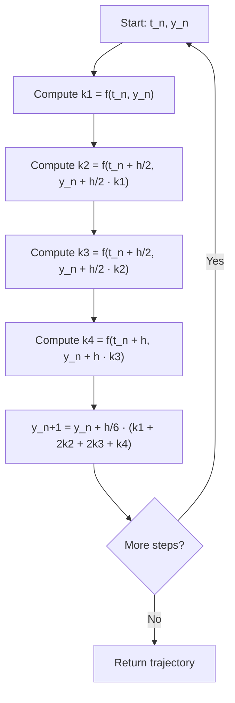

## Numerical Integration Techniques

### Overview

Numerical integration techniques are the computational methods used to solve differential equations that lack closed-form analytical solutions — which describes the vast majority of real-world System Dynamics, continuous simulation, and physics-based models. Given a system defined by one or more differential equations, such as the stock and flow relationships covered previously, a numerical integration method approximates the system's trajectory over time by advancing the solution in small discrete steps. The choice of integration method directly affects a simulation's accuracy, stability, and computational cost, making it a foundational decision in continuous and hybrid simulation design.

### The Initial Value Problem

Numerical integration methods solve initial value problems of the general form:

$$\frac{dy}{dt} = f(t, y), \qquad y(t_0) = y_0$$

Where $f(t, y)$ defines the rate of change of the state variable $y$ as a function of time and the current state, and $y_0$ is the known starting condition. In a stock and flow model, $y$ corresponds to a stock, and $f(t, y)$ corresponds to the net flow (inflow minus outflow) as a function of current stock values and time. Since $f(t, y)$ is typically nonlinear or otherwise not analytically integrable in practical models, numerical methods approximate $y(t)$ at a sequence of discrete time points $t_0, t_1, t_2, \dots$ separated by a step size $h$.

### Euler's Method

Euler's Method is the simplest numerical integration technique, approximating the solution by taking a linear step in the direction of the current derivative.

$$y_{n+1} = y_n + h \cdot f(t_n, y_n)$$

**Characteristics**

- Requires only one function evaluation per step, making it computationally cheap
- Local truncation error per step is $O(h^2)$; global accumulated error is $O(h)$, meaning halving the step size roughly halves the total error
- Geometrically, it approximates the true curve using the tangent line at the start of each interval, which systematically drifts away from the true trajectory when the function's curvature is significant within a single step

**Example**

Consider the simple exponential growth equation $\frac{dy}{dt} = 0.5y$, with $y(0) = 100$ and step size $h = 1$.

$$y_1 = 100 + 1 \cdot (0.5 \times 100) = 150$$

$$y_2 = 150 + 1 \cdot (0.5 \times 150) = 225$$

The exact analytical solution is $y(t) = 100e^{0.5t}$, giving $y(1) \approx 164.87$ and $y(2) \approx 271.83$. The Euler approximation at $t=2$ (225) diverges noticeably from the true value (271.83), illustrating the method's tendency to underestimate growth in this case due to using only the starting slope of each interval.

[Inference] Euler's Method's error compounds across steps, so its practical usability depends heavily on step size relative to how quickly the system's rate of change itself changes; systems with fast dynamics or high curvature generally require impractically small step sizes for Euler's Method to achieve acceptable accuracy, which is why higher-order methods are typically preferred for anything beyond illustrative or pedagogical use.

### Euler's Method Geometric Interpretation (svg_diagram)

<svg xmlns="http://www.w3.org/2000/svg" viewBox="0 0 700 320">
  <text x="350" y="25" text-anchor="middle" font-size="16" font-weight="bold" fill="#1a1a2e">Euler's Method: Tangent-Line Steps (svg_diagram)</text>

  
  <line x1="60" y1="270" x2="650" y2="270" stroke="#333" stroke-width="1.5" />
  <line x1="60" y1="270" x2="60" y2="50" stroke="#333" stroke-width="1.5" />
  <text x="655" y="275" font-size="11" fill="#333">t</text>
  <text x="50" y="45" font-size="11" fill="#333">y</text>

  
  <path d="M 60 250 C 200 235, 350 190, 500 100 C 550 75, 600 55, 630 45" stroke="#2f8a4b" stroke-width="2.5" fill="none" />
  <text x="500" y="70" font-size="11" fill="#2f8a4b">True solution</text>

  
  <line x1="60" y1="250" x2="220" y2="220" stroke="#c96a1f" stroke-width="2.5" />
  <line x1="220" y1="220" x2="380" y2="175" stroke="#c96a1f" stroke-width="2.5" />
  <line x1="380" y1="175" x2="540" y2="110" stroke="#c96a1f" stroke-width="2.5" />

  <circle cx="60" cy="250" r="4" fill="#c96a1f" />
  <circle cx="220" cy="220" r="4" fill="#c96a1f" />
  <circle cx="380" cy="175" r="4" fill="#c96a1f" />
  <circle cx="540" cy="110" r="4" fill="#c96a1f" />

  <text x="220" y="240" text-anchor="middle" font-size="10" fill="#c96a1f">y₁</text>
  <text x="380" y="195" text-anchor="middle" font-size="10" fill="#c96a1f">y₂</text>
  <text x="540" y="130" text-anchor="middle" font-size="10" fill="#c96a1f">y₃</text>

  <text x="150" y="290" font-size="10" fill="#555">Approximation follows tangent lines, drifting from true curve</text>
</svg>

### Improved Euler / Heun's Method

Heun's Method (also called the Improved Euler Method or a second-order Runge-Kutta method) reduces error by averaging the slope at the beginning and end of the interval, rather than relying solely on the starting slope.

**Procedure**

1. Compute a predictor step using standard Euler: $\tilde{y}_{n+1} = y_n + h \cdot f(t_n, y_n)$
2. Evaluate the slope at this predicted endpoint: $f(t_{n+1}, \tilde{y}_{n+1})$
3. Average the two slopes and apply the corrected step:

$$y_{n+1} = y_n + \frac{h}{2}\left[f(t_n, y_n) + f(t_{n+1}, \tilde{y}_{n+1})\right]$$

**Characteristics**

- Requires two function evaluations per step
- Global error is $O(h^2)$, a substantial accuracy improvement over standard Euler for the same step size
- Belongs to the broader family of predictor-corrector methods, which use an initial rough estimate followed by a refinement step

### Runge-Kutta 4th Order (RK4)

The classical fourth-order Runge-Kutta method is among the most widely used general-purpose numerical integration techniques, offering a strong balance between accuracy and computational cost for a broad range of problems.

**Procedure**

RK4 evaluates the derivative function at four points within each step and combines them with specific weights:

$$k_1 = f(t_n, y_n)$$
$$k_2 = f\left(t_n + \frac{h}{2}, y_n + \frac{h}{2}k_1\right)$$
$$k_3 = f\left(t_n + \frac{h}{2}, y_n + \frac{h}{2}k_2\right)$$
$$k_4 = f(t_n + h, y_n + h k_3)$$

$$y_{n+1} = y_n + \frac{h}{6}\left(k_1 + 2k_2 + 2k_3 + k_4\right)$$

**Interpretation**

- $k_1$: the slope at the start of the interval (standard Euler direction)
- $k_2$: the slope at the midpoint, estimated using $k_1$ to step halfway
- $k_3$: a refined midpoint slope, estimated using $k_2$
- $k_4$: the slope at the end of the interval, estimated using $k_3$ to step the full interval

The final update is a weighted average that gives double weight to the two midpoint estimates, reflecting their generally greater reliability for approximating the interval's true average slope.

**Characteristics**

- Requires four function evaluations per step
- Global error is $O(h^4)$, meaning halving the step size reduces error by roughly a factor of 16, a dramatically faster convergence rate than Euler's Method
- Widely regarded as a strong default choice for smooth, well-behaved systems without stiff dynamics

### RK4 Step Structure (Mermaid)

### Comparison of Common Methods

| Method | Function Evals/Step | Global Error Order | Relative Accuracy | Relative Cost |
|---|---|---|---|---|
| Euler | 1 | $O(h)$ | Low | Lowest |
| Heun's (RK2) | 2 | $O(h^2)$ | Moderate | Low |
| RK4 | 4 | $O(h^4)$ | High | Moderate |
| Adaptive RK (e.g., RK45) | Variable | Effectively higher via step control | Very high | Variable |

### Step Size Selection

The choice of step size $h$ involves a direct tradeoff between accuracy and computational cost:

- **Too large**: truncation error accumulates rapidly, and for some methods the solution can become numerically unstable, producing wildly inaccurate or oscillating results that bear no resemblance to the true system behavior
- **Too small**: computational cost increases proportionally (more steps required to cover the same simulated time span), and for methods sensitive to floating-point precision, excessively small step sizes can introduce their own rounding-related errors

[Inference] A common practical approach is to run the simulation at progressively smaller step sizes and compare output trajectories; if results converge to a stable trajectory as step size decreases, the chosen step size is likely small enough for the required accuracy, though the specific threshold for "close enough" convergence is a modeling judgment call rather than a fixed rule.

### Adaptive Step Size Methods

Adaptive methods (such as the Runge-Kutta-Fehlberg method, commonly denoted RK45) automatically adjust the step size during simulation based on estimated local error, taking larger steps when the solution changes slowly and smaller steps when it changes rapidly.

**Procedure Concept**

1. At each step, compute the solution using two methods of different order (e.g., a 4th-order and 5th-order estimate) using largely shared function evaluations for efficiency
2. Compare the two estimates to approximate the local truncation error
3. If the error exceeds a specified tolerance, reduce the step size and retry the step
4. If the error is well within tolerance, accept the step and potentially increase the step size for the next iteration

**Advantages**

- Automatically allocates computational effort where it is needed, improving efficiency for systems with varying dynamics (e.g., rapid transients followed by slow settling)
- Reduces the burden on the modeler to manually tune a fixed step size

[Unverified] The specific tolerance settings and step-adjustment algorithm vary across simulation software implementations, so behavior at the boundary between accepting and rejecting a step, as well as default tolerance values, should be checked against the documentation of the specific tool or library being used.

### Stiff Systems

A system of differential equations is described as stiff when it contains components that change on very different time scales — some very fast, some very slow — within the same model. Stiff systems pose a particular challenge for explicit methods like standard Euler and RK4, which may require impractically small step sizes to remain numerically stable, even when the slow-changing components would tolerate a much larger step.

**Implicit Methods**

Implicit methods, such as the Backward Euler Method, address stiffness by formulating the update step so that $y_{n+1}$ appears on both sides of the equation:

$$y_{n+1} = y_n + h \cdot f(t_{n+1}, y_{n+1})$$

Because $y_{n+1}$ appears inside $f$, this equation must generally be solved using an iterative root-finding technique (such as Newton's method) at each step, rather than computed directly. This added computational cost per step is often outweighed by the ability to take much larger step sizes while remaining stable, making implicit methods generally preferred for stiff systems despite their higher per-step cost.

**Key Points**
- Numerical integration approximates the solution to a differential equation by advancing in discrete time steps, since most practical rate equations lack closed-form solutions
- Euler's Method is simple but low-accuracy ($O(h)$ global error); RK4 offers substantially higher accuracy ($O(h^4)$) at moderate additional computational cost
- Adaptive step size methods automatically balance accuracy and efficiency by adjusting $h$ based on estimated local error
- Stiff systems, containing widely different time scales, typically require implicit methods to remain numerically stable at practical step sizes

### Method Selection Guidance

| Scenario | Suggested Approach |
|---|---|
| Quick prototyping, pedagogical demonstration | Euler's Method |
| General-purpose smooth, non-stiff systems | RK4 |
| Systems with variable dynamics (fast transients, slow settling) | Adaptive RK (RK45 or similar) |
| Stiff systems (widely varying time scales) | Implicit methods (Backward Euler, implicit RK variants) |
| High precision required, computational cost less constrained | Higher-order adaptive methods |

[Inference] Most commercial and open-source System Dynamics and continuous simulation software defaults to either fixed-step RK4 or an adaptive RK method for general use, reserving explicit Euler primarily for educational contexts or situations demanding maximum computational speed at the cost of accuracy — though the specific default varies by tool and should be confirmed against that tool's documentation rather than assumed.

### Common Pitfalls

- **Using Euler's Method for production models without validating accuracy**: Euler's simplicity makes it tempting for quick implementation, but its low accuracy can produce misleading results, particularly for systems with reinforcing feedback loops where small errors compound over many steps
- **Fixed step size on a stiff or highly variable system**: applying a fixed step size to a system with mixed fast and slow dynamics forces an unfavorable tradeoff — either the step is too large for the fast components (instability) or too small for the slow components (unnecessary computational cost)
- **Ignoring numerical stability limits**: even accurate methods can become unstable if the step size exceeds a method-specific stability threshold relative to the system's dynamics, producing results that diverge or oscillate unrealistically regardless of the method's nominal error order
- **Conflating small step size with high accuracy universally**: for stiff systems, reducing step size in an explicit method improves accuracy up to the point of instability, but does not resolve the fundamental stiffness problem the way switching to an implicit method would

**Related Topics**
- Stability Analysis of Numerical Integration Methods
- Stiff Differential Equation Solvers in Practice
- Discrete-Time vs. Continuous-Time Simulation Formulations
- Sensitivity Analysis and Policy Testing in System Dynamics Models
- Delays in System Dynamics: Material and Information Delays
- Hybrid Simulation: Combining System Dynamics with Discrete Event Simulation
- Monte Carlo Methods and Random Variate Generation
- Verification and Validation Techniques for Simulation Models