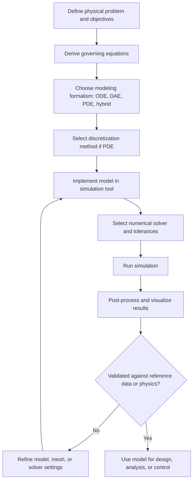

## Simulation of Physical and Engineering Systems

### Overview

Simulation of physical and engineering systems is the practice of building computational models of real-world mechanical, electrical, thermal, fluid, and multidomain systems, then executing those models to predict behavior, verify designs, and study performance without building physical prototypes. It sits at the intersection of physics, numerical methods, and software engineering, and it is one of the primary applied outlets of continuous and system dynamics modeling.

This is a broad umbrella topic. The treatment below covers the conceptual foundations, the major modeling formalisms, domain-specific modeling patterns, numerical solution methods, tooling, verification/validation practices, and common pitfalls, with worked examples throughout.

### Why Simulate Physical Systems

**Key Points**
- Physical prototyping is expensive, slow, and sometimes dangerous (e.g., aircraft flutter, nuclear reactor transients, crash testing).
- Simulation allows exploration of a much larger design space than physical testing permits.
- Simulation enables "what-if" analysis: parameter sweeps, sensitivity analysis, and failure-mode exploration.
- Simulation supports control system design and tuning before hardware exists ("virtual commissioning").
- Digital twins extend simulation into operational use, mirroring a live physical asset for monitoring and predictive maintenance.

[Inference] The specific cost/time savings attributed to simulation-driven design vary heavily by industry and project maturity, so any quoted percentage reduction in prototyping cost should be treated as context-dependent rather than universal.

### Foundational Concepts

#### Systems, States, and Signals

A physical system is modeled as a set of **state variables** (e.g., position, velocity, temperature, voltage, charge) that evolve over time according to physical laws. The **state-space representation** is the standard mathematical backbone:

$$\dot{x}(t) = f(x(t), u(t), t)$$
$$y(t) = g(x(t), u(t), t)$$

Where $x(t)$ is the state vector, $u(t)$ is the input (control/disturbance) vector, $y(t)$ is the output (measured/observed) vector, $f$ is the state transition function, and $g$ is the output/observation function.

For linear time-invariant (LTI) systems, this reduces to the familiar matrix form:

$$\dot{x} = Ax + Bu$$
$$y = Cx + Du$$

#### Lumped-Parameter vs. Distributed-Parameter Models

- **Lumped-parameter models** treat spatial variation as negligible, collapsing a system into a finite set of ordinary differential equations (ODEs). Example: a mass-spring-damper system, an RLC circuit, a single-node thermal mass.
- **Distributed-parameter models** account for spatial variation explicitly, resulting in partial differential equations (PDEs). Example: heat conduction along a rod, stress distribution in a beam, fluid flow in a pipe.

Choice between the two is a modeling decision driven by the length scales of interest relative to the phenomena being studied.

#### Continuous, Discrete, and Hybrid Systems

- **Continuous-time systems**: state evolves smoothly, governed by ODEs/PDEs (e.g., a pendulum swinging).
- **Discrete-event systems**: state changes only at specific event times (e.g., a queueing network, a digital logic circuit).
- **Hybrid systems**: combine continuous dynamics with discrete mode switches (e.g., a bouncing ball, a thermostat-controlled HVAC system, power electronics with switching devices). Hybrid systems require careful handling of **state events** — points where continuous integration must pause because a discrete transition occurs.

### Domain-Specific Modeling Patterns

#### Mechanical Systems

Mechanical systems are typically derived using Newtonian mechanics (force/torque balance) or Lagrangian mechanics (energy-based formulation).

**Example — Mass-Spring-Damper System**

Governing equation:

$$m\ddot{x} + c\dot{x} + kx = F(t)$$

Converting to state-space with $x_1 = x$, $x_2 = \dot{x}$:

$$\dot{x}_1 = x_2$$
$$\dot{x}_2 = \frac{1}{m}\left(F(t) - c x_2 - k x_1\right)$$

This second-order ODE models a huge range of physical phenomena: vehicle suspensions, building response to earthquakes, vibration isolation mounts, and even simplified models of human tissue response to impact.

**Lagrangian approach** (useful for multibody systems with constraints):

$$\frac{d}{dt}\left(\frac{\partial L}{\partial \dot{q}_i}\right) - \frac{\partial L}{\partial q_i} = Q_i$$

where $L = T - V$ (kinetic minus potential energy), $q_i$ are generalized coordinates, and $Q_i$ are generalized non-conservative forces. This is the standard method for robotic arms, multibody linkages, and vehicle dynamics models.

#### Electrical and Electronic Systems

Electrical circuits are modeled using Kirchhoff's laws (KVL/KCL), producing systems of differential-algebraic equations (DAEs) when both dynamic elements (inductors, capacitors) and algebraic constraints (ideal wires, switches) are present.

**Example — RLC Series Circuit**

$$L\frac{di}{dt} + Ri + \frac{1}{C}\int i\, dt = V(t)$$

Differentiating and converting to state-space using charge $q$ and current $i = \dot{q}$:

$$\dot{q} = i$$
$$\dot{i} = \frac{1}{L}\left(V(t) - Ri - \frac{q}{C}\right)$$

Power electronics simulations (switching converters, inverters) are hybrid by nature: each switch state defines a different linear circuit topology, and the simulator must detect switching events and re-linearize.

#### Thermal Systems

Thermal systems use lumped thermal capacitance and resistance analogous to RC electrical circuits:

$$C_{th}\frac{dT}{dt} = \frac{T_{ambient} - T}{R_{th}} + \dot{Q}_{gen}(t)$$

For distributed thermal problems (e.g., heat conduction in a solid), the governing PDE is the heat equation:

$$\frac{\partial T}{\partial t} = \alpha \nabla^2 T$$

where $\alpha$ is thermal diffusivity. Solving this numerically typically requires spatial discretization via finite difference or finite element methods, discussed below.

#### Fluid and Hydraulic Systems

Fluid systems range from simple lumped hydraulic circuits (analogous to electrical circuits, with pressure as "voltage" and flow rate as "current") to full computational fluid dynamics (CFD) governed by the Navier-Stokes equations:

$$\rho\left(\frac{\partial \mathbf{v}}{\partial t} + \mathbf{v}\cdot\nabla\mathbf{v}\right) = -\nabla p + \mu\nabla^2\mathbf{v} + \rho\mathbf{g}$$

Lumped hydraulic models are common in system-level simulation (e.g., hydraulic actuators, brake systems), while full CFD is reserved for detailed aerodynamic or internal flow studies due to its computational cost.

#### Multidomain and Multiphysics Systems

Many real engineering systems couple multiple domains — e.g., an electric motor (electrical + magnetic + mechanical + thermal), a hybrid vehicle powertrain (mechanical + electrical + thermal + control), or a MEMS sensor (mechanical + electrical). Multidomain modeling requires either:

- **Unified acausal modeling languages** (e.g., Modelica) that let each domain's equations coexist and be solved simultaneously, or
- **Co-simulation**, where separate domain-specific solvers exchange data at synchronized time steps (commonly via the Functional Mock-up Interface, FMI, standard).

[Inference] Co-simulation stability and accuracy are sensitive to the chosen coupling step size and coupling scheme (e.g., Jacobi vs. Gauss-Seidel); appropriate settings are problem-dependent and generally require empirical tuning.

### System Diagram: Physical Domains and Coupling

<svg xmlns="http://www.w3.org/2000/svg" viewBox="0 0 900 500">
  <text x="450" y="30" font-size="20" font-weight="bold" text-anchor="middle" fill="#222">Multidomain Physical System Coupling (svg_diagram)</text>

  <rect x="60" y="80" width="180" height="90" rx="10" fill="#dbeafe" stroke="#2563eb" stroke-width="2" />
  <text x="150" y="115" font-size="15" text-anchor="middle" fill="#1e3a8a" font-weight="bold">Mechanical</text>
  <text x="150" y="138" font-size="12" text-anchor="middle" fill="#1e3a8a">Newton / Lagrange</text>
  <text x="150" y="155" font-size="12" text-anchor="middle" fill="#1e3a8a">x, v, F, T</text>

  <rect x="360" y="80" width="180" height="90" rx="10" fill="#fef3c7" stroke="#d97706" stroke-width="2" />
  <text x="450" y="115" font-size="15" text-anchor="middle" fill="#78350f" font-weight="bold">Electrical</text>
  <text x="450" y="138" font-size="12" text-anchor="middle" fill="#78350f">Kirchhoff KVL/KCL</text>
  <text x="450" y="155" font-size="12" text-anchor="middle" fill="#78350f">V, I, Q</text>

  <rect x="660" y="80" width="180" height="90" rx="10" fill="#fee2e2" stroke="#dc2626" stroke-width="2" />
  <text x="750" y="115" font-size="15" text-anchor="middle" fill="#7f1d1d" font-weight="bold">Thermal</text>
  <text x="750" y="138" font-size="12" text-anchor="middle" fill="#7f1d1d">Fourier / Lumped RC</text>
  <text x="750" y="155" font-size="12" text-anchor="middle" fill="#7f1d1d">T, Q̇</text>

  <rect x="360" y="260" width="180" height="90" rx="10" fill="#dcfce7" stroke="#16a34a" stroke-width="2" />
  <text x="450" y="295" font-size="15" text-anchor="middle" fill="#14532d" font-weight="bold">Fluid / Hydraulic</text>
  <text x="450" y="318" font-size="12" text-anchor="middle" fill="#14532d">Navier-Stokes / Lumped</text>
  <text x="450" y="335" font-size="12" text-anchor="middle" fill="#14532d">p, Q, v</text>

  <rect x="330" y="410" width="240" height="70" rx="10" fill="#ede9fe" stroke="#7c3aed" stroke-width="2" />
  <text x="450" y="440" font-size="15" text-anchor="middle" fill="#4c1d95" font-weight="bold">Coupling Layer</text>
  <text x="450" y="462" font-size="12" text-anchor="middle" fill="#4c1d95">Unified equations or FMI co-sim</text>

  <line x1="240" y1="125" x2="360" y2="125" stroke="#555" stroke-width="2" marker-end="url(#arrow)" />
  <line x1="360" y1="140" x2="240" y2="140" stroke="#555" stroke-width="2" marker-end="url(#arrow)" />
  <line x1="540" y1="125" x2="660" y2="125" stroke="#555" stroke-width="2" marker-end="url(#arrow)" />
  <line x1="660" y1="140" x2="540" y2="140" stroke="#555" stroke-width="2" marker-end="url(#arrow)" />

  <line x1="150" y1="170" x2="410" y2="260" stroke="#555" stroke-width="2" marker-end="url(#arrow)" />
  <line x1="450" y1="170" x2="450" y2="260" stroke="#555" stroke-width="2" marker-end="url(#arrow)" />
  <line x1="750" y1="170" x2="490" y2="260" stroke="#555" stroke-width="2" marker-end="url(#arrow)" />

  <line x1="450" y1="350" x2="450" y2="410" stroke="#555" stroke-width="2" marker-end="url(#arrow)" />
</svg>

### Numerical Solution Methods

Once a system is expressed as ODEs, DAEs, or PDEs, it must be solved numerically because closed-form solutions rarely exist for nontrivial systems.

#### ODE Integration (Time-Stepping) Methods

- **Explicit Euler**: $x_{n+1} = x_n + h\,f(x_n, t_n)$. Simple, computationally cheap, but conditionally stable and only first-order accurate.
- **Runge-Kutta methods** (e.g., RK4): higher-order accuracy achieved by evaluating $f$ at multiple points within a step. RK4 is a common default for non-stiff systems.
- **Implicit methods** (e.g., Backward Euler, trapezoidal rule): require solving an algebraic equation at each step, but offer much better stability for **stiff systems** — systems with widely separated time constants (common in chemical kinetics, power electronics, and thermal networks).
- **Variable-step, variable-order solvers** (e.g., Dormand-Prince, BDF-based solvers like those in LSODA): automatically adjust step size and sometimes method order to balance accuracy and computational cost.

**Stiffness** deserves particular attention: a system is stiff when its Jacobian has eigenvalues of very different magnitudes, forcing explicit methods to use impractically small step sizes for stability even though the solution itself is smooth. [Unverified] The exact stiffness ratio threshold at which a solver should switch from explicit to implicit is not a fixed universal number — it depends on the solver implementation, tolerance settings, and desired accuracy.

#### Differential-Algebraic Equations (DAEs)

Many physical systems (especially multidomain and constrained mechanical systems) naturally produce DAEs of the form:

$$F(\dot{x}, x, t) = 0$$

DAEs are characterized by an **index**, roughly describing how many times the algebraic constraints must be differentiated to reduce the system to a pure ODE. Higher-index DAEs (index 2+) are numerically more difficult and often require index reduction techniques (e.g., Pantelides algorithm) before simulation.

#### Spatial Discretization for PDEs

- **Finite Difference Method (FDM)**: approximates derivatives using difference quotients on a structured grid. Simple to implement, well-suited to regular geometries.
- **Finite Element Method (FEM)**: divides the domain into elements and uses weighted-residual (weak form) formulations. Handles complex geometries and boundary conditions well; dominant in structural and thermal analysis.
- **Finite Volume Method (FVM)**: enforces conservation laws over discrete control volumes; the standard approach in CFD due to its natural handling of flux conservation.

After spatial discretization, PDEs are converted into large systems of ODEs or DAEs (the "method of lines"), which are then solved using the time-integration techniques above.

### Simulation Workflow

### Tools and Environments

**Key Points**
- **Modelica-based tools** (e.g., OpenModelica, Dymola): acausal, equation-based, multidomain modeling — well suited for physical systems where causality is not fixed in advance.
- **MATLAB/Simulink**: block-diagram, causal simulation environment; dominant in control system design and signal-flow modeling.
- **SPICE-family tools**: specialized for electrical/electronic circuit simulation.
- **FEA packages** (e.g., ANSYS, Abaqus, COMSOL): specialized for structural, thermal, and multiphysics PDE-based simulation.
- **CFD packages** (e.g., ANSYS Fluent, OpenFOAM): specialized for fluid flow simulation using FVM.
- **General-purpose scientific computing** (Python with SciPy/NumPy, Julia with DifferentialEquations.jl): flexible, code-first modeling suited for custom or research-oriented simulations.

[Inference] The "best" tool choice depends on the specific domain, required fidelity, existing organizational tooling, and licensing constraints; no single tool is universally superior across all physical/engineering simulation tasks.

### Verification and Validation (V&V)

- **Verification** asks: "Are we solving the equations correctly?" — checked via convergence studies (mesh/step-size refinement), comparison against analytical solutions for simplified cases, and code-to-code comparison.
- **Validation** asks: "Are we solving the correct equations?" — checked via comparison against physical experimental data, sensitivity analysis, and uncertainty quantification.
- **Model calibration**: adjusting unknown parameters (e.g., damping coefficients, friction coefficients, heat transfer coefficients) so the model output matches observed data, often via optimization (least-squares fitting, Bayesian calibration).

V&V is not optional polish — a simulation that has not been verified and validated provides false confidence and can propagate errors into downstream engineering decisions. [Inference] The rigor required for V&V scales with the consequence of the decisions the simulation informs (e.g., safety-critical aerospace hardware warrants far more extensive V&V than an early-stage conceptual design study), though specific regulatory or process requirements vary by industry and jurisdiction.

### Common Pitfalls

- **Ignoring stiffness**, leading to unstable or excessively slow simulations with explicit solvers.
- **Poor mesh/grid quality** in FEM/CFD, producing inaccurate or non-converging results.
- **Mismatched time scales** in multidomain co-simulation, causing instability at the coupling interface.
- **Over-reliance on default solver tolerances**, masking convergence issues.
- **Neglecting units and dimensional consistency**, a frequent source of silent, hard-to-detect errors.
- **Treating simulation output as ground truth** without validation against physical data or analytical limits.
- **Chattering in hybrid/event-based simulations**, where rapid, physically meaningless switching between discrete states occurs near an event threshold.

### Worked Example: Simulating a Damped Pendulum

Governing nonlinear ODE for a simple pendulum with damping:

$$\ddot{\theta} + \frac{c}{mL^2}\dot{\theta} + \frac{g}{L}\sin\theta = 0$$

State-space form with $x_1 = \theta$, $x_2 = \dot{\theta}$:

$$\dot{x}_1 = x_2$$
$$\dot{x}_2 = -\frac{c}{mL^2}x_2 - \frac{g}{L}\sin x_1$$

**Output**

Using RK4 with a fixed step of $h = 0.01\,s$, a pendulum released from $\theta_0 = 45°$ with light damping shows amplitude decaying approximately exponentially, with oscillation frequency slightly below the small-angle natural frequency $\omega_n = \sqrt{g/L}$ due to the nonlinearity of $\sin\theta$ at large angles. [Inference] The precise decay rate and frequency shift depend on the exact damping coefficient and initial angle chosen; the qualitative behavior described (slower-than-linear frequency, exponential-like envelope decay) is a well-established property of the nonlinear damped pendulum model.

### Conclusion

Simulation of physical and engineering systems translates governing physical laws — mechanical, electrical, thermal, fluid, or coupled multidomain — into computable models, solved using appropriate numerical methods (ODE/DAE integration for lumped systems, FDM/FEM/FVM for distributed systems). Success depends not just on writing correct equations but on selecting appropriate solvers for the system's stiffness and structure, rigorously verifying and validating the model, and remaining alert to common numerical and modeling pitfalls. This forms the practical backbone connecting system dynamics theory to real engineering design, analysis, and control applications.

### Related Topics

- State-space representation and linearization techniques
- Modelica and acausal/equation-based modeling
- Stiff ODE solvers and implicit integration methods
- Finite Element Method fundamentals
- Computational Fluid Dynamics fundamentals
- Functional Mock-up Interface (FMI) and co-simulation
- Digital twins and real-time simulation
- Model-based control system design (PID, state feedback, MPC)
- Uncertainty quantification and stochastic simulation
- Discrete-event simulation and hybrid systems modeling
- Model order reduction techniques