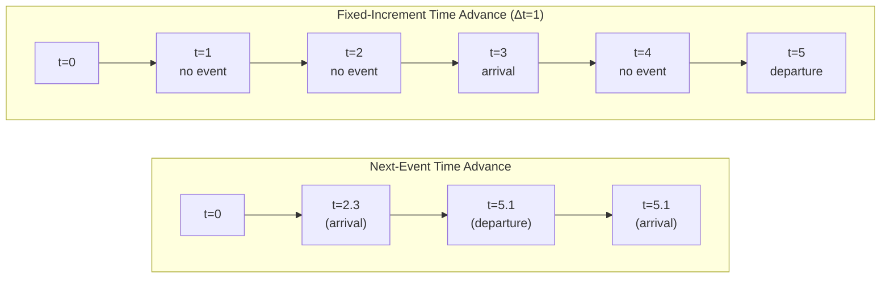

## General-Purpose Languages for Simulation

### Overview

General-purpose programming languages (GPLs) — as opposed to specialized simulation languages like GPSS, SIMSCRIPT, or Arena's process modules — are languages such as C, C++, Java, Python, and FORTRAN that were not designed exclusively for simulation but are widely used to build simulation models from the ground up. A modeler using a GPL implements the simulation's clock advancement, event scheduling, random variate generation, statistics collection, and output reporting manually or through supporting libraries, rather than relying on built-in simulation-specific constructs.

**Key Points**
- GPLs offer maximum flexibility and control over model logic, data structures, and performance.
- They require the modeler to build simulation infrastructure (event lists, clock mechanisms, random number streams) that specialized languages provide natively.
- They are often chosen when a simulation must integrate tightly with existing software systems, when execution speed is critical, or when no existing simulation package fits the problem's structure.

### Why Use a General-Purpose Language

**Key Points**
- **Integration** — GPLs allow direct embedding of simulation logic into larger software systems (e.g., a factory's control software, a financial trading platform, or a game engine).
- **Performance control** — Low-level languages like C and C++ allow fine-tuned memory management and computational efficiency, important for large-scale or real-time simulations.
- **No licensing cost** — Unlike many commercial simulation packages, GPLs (and their compilers/interpreters) are typically free or open source.
- **Unlimited flexibility** — No constraints imposed by a vendor's modeling paradigm; the modeler can implement any logic, data structure, or algorithm.
- **Availability of libraries** — Mature ecosystems (e.g., Python's SciPy, Java's Apache Commons Math) supply statistical and numerical tools that reduce development burden.
- **Reproducibility and transparency** — Because the model is plain code, every mechanism is visible and auditable, which matters in scientific and regulatory contexts.

### Why GPLs Are Harder to Use for Simulation

**Key Points**
- **No built-in simulation clock or event scheduler** — must be implemented manually.
- **No built-in statistical collection** — the modeler must code counters, accumulators, and summary statistics from scratch.
- **No built-in random variate generators for standard distributions** — although many languages now ship basic random number libraries, generating exponential, Erlang, triangular, or empirical distributions correctly often requires additional code or third-party libraries.
- **Longer development time** — building simulation infrastructure before the actual model logic can dominate project time.
- **Higher risk of subtle errors** — event-list management, floating-point clock advancement, and random stream synchronization are easy to implement incorrectly, and such errors can silently corrupt results.
- **No built-in animation or visualization** — most GPLs require external libraries or custom code to visualize simulation dynamics.

### Core Components a Modeler Must Build

When using a GPL for discrete-event simulation, the modeler is generally responsible for implementing each of the following components manually.

**Key Points**
- **Simulation clock** — a variable tracking current simulated time, advanced according to the time-advance mechanism (fixed-increment or next-event).
- **Event list (future event list, FEL)** — an ordered data structure (commonly a priority queue or sorted list) holding scheduled future events by time stamp.
- **Event routines** — functions or methods executed when a given event's time arrives, which update system state and may schedule further events.
- **State variables** — data representing the system's current condition (e.g., number of customers in queue, server busy/idle status).
- **Random number generator** — a source of uniform pseudo-random numbers, ideally from a well-tested generator (e.g., Mersenne Twister).
- **Random variate generators** — transformations (inverse transform, acceptance-rejection, convolution) applied to uniform numbers to produce values from specific distributions.
- **Statistics collectors** — accumulators for time-averages, counts, sums of squares, and other quantities needed for performance measures.
- **Report generator** — logic to compute and format final summary statistics at the end of a run.

(diagram showing the standard discrete-event simulation loop that a modeler must implement in a GPL)

<svg xmlns="http://www.w3.org/2000/svg" viewBox="0 0 760 520" font-family="Arial, sans-serif">
  <text x="380" y="30" text-anchor="middle" font-size="18" font-weight="bold" fill="#1a1a1a">Discrete-Event Simulation Loop in a GPL (svg_diagram)</text>

  <rect x="290" y="55" width="180" height="50" rx="8" fill="#dbeafe" stroke="#2563eb" stroke-width="2" />
  <text x="380" y="85" text-anchor="middle" font-size="13" fill="#1e3a8a">Initialize state,</text>
  <text x="380" y="100" text-anchor="middle" font-size="13" fill="#1e3a8a">clock = 0, seed FEL</text>

  <line x1="380" y1="105" x2="380" y2="135" stroke="#333" stroke-width="2" marker-end="url(#arrow1)" />

  <polygon points="380,140 470,175 380,210 290,175" fill="#fef3c7" stroke="#d97706" stroke-width="2" />
  <text x="380" y="171" text-anchor="middle" font-size="12" fill="#78350f">FEL empty or</text>
  <text x="380" y="186" text-anchor="middle" font-size="12" fill="#78350f">stop condition met?</text>

  <line x1="470" y1="175" x2="640" y2="175" stroke="#333" stroke-width="2" marker-end="url(#arrow1)" />
  <text x="555" y="165" text-anchor="middle" font-size="12" fill="#065f46">Yes</text>
  <rect x="600" y="150" width="140" height="50" rx="8" fill="#d1fae5" stroke="#059669" stroke-width="2" />
  <text x="670" y="180" text-anchor="middle" font-size="13" fill="#064e3b">Generate final</text>
  <text x="670" y="195" text-anchor="middle" font-size="13" fill="#064e3b">report, end run</text>

  <line x1="380" y1="210" x2="380" y2="240" stroke="#333" stroke-width="2" marker-end="url(#arrow1)" />
  <text x="395" y="228" font-size="12" fill="#991b1b">No</text>

  <rect x="270" y="240" width="220" height="50" rx="8" fill="#fee2e2" stroke="#dc2626" stroke-width="2" />
  <text x="380" y="262" text-anchor="middle" font-size="13" fill="#7f1d1d">Remove smallest time-</text>
  <text x="380" y="277" text-anchor="middle" font-size="13" fill="#7f1d1d">stamped event from FEL</text>

  <line x1="380" y1="290" x2="380" y2="320" stroke="#333" stroke-width="2" marker-end="url(#arrow1)" />

  <rect x="270" y="320" width="220" height="50" rx="8" fill="#ede9fe" stroke="#7c3aed" stroke-width="2" />
  <text x="380" y="342" text-anchor="middle" font-size="13" fill="#4c1d95">Advance clock to</text>
  <text x="380" y="357" text-anchor="middle" font-size="13" fill="#4c1d95">that event's time</text>

  <line x1="380" y1="370" x2="380" y2="400" stroke="#333" stroke-width="2" marker-end="url(#arrow1)" />

  <rect x="250" y="400" width="260" height="60" rx="8" fill="#e0f2fe" stroke="#0284c7" stroke-width="2" />
  <text x="380" y="422" text-anchor="middle" font-size="13" fill="#0c4a6e">Execute event routine:</text>
  <text x="380" y="437" text-anchor="middle" font-size="13" fill="#0c4a6e">update state, collect stats,</text>
  <text x="380" y="452" text-anchor="middle" font-size="13" fill="#0c4a6e">schedule new events</text>

  <path d="M 250 430 C 150 430, 150 175, 290 175" fill="none" stroke="#333" stroke-width="2" marker-end="url(#arrow1)" />

  </svg>

### Commonly Used General-Purpose Languages

#### C and C++

**Key Points**
- Preferred for performance-critical simulations (e.g., large-scale agent-based models, physics engines, military/aerospace simulations) due to low-level memory control and compiled execution speed.
- C++'s object-oriented features (classes, inheritance, polymorphism) support clean representation of entities such as customers, machines, or agents.
- The Standard Template Library (STL) provides containers (`priority_queue`, `map`, `vector`) directly useful for implementing an event list.
- Libraries such as Boost (`boost::random`) supply high-quality random number generation and distribution support.
- Historically, C++ has been the implementation language underlying many commercial simulation packages (e.g., early versions of Arena were built on SIMAN, itself implemented in a compiled language), reflecting the performance rationale for choosing it.

**Example**

```cpp
#include <queue>
#include <random>
#include <iostream>

struct Event {
    double time;
    int type; // 0 = arrival, 1 = departure
    bool operator>(const Event& other) const { return time > other.time; }
};

int main() {
    std::priority_queue<Event, std::vector<Event>, std::greater<Event>> FEL;
    std::mt19937 rng(42);
    std::exponential_distribution<double> interarrival(1.0 / 5.0); // mean 5

    double clock = 0.0;
    int customersServed = 0;

    FEL.push({interarrival(rng), 0});

    while (!FEL.empty() && customersServed < 100) {
        Event ev = FEL.top();
        FEL.pop();
        clock = ev.time;

        if (ev.type == 0) {
            customersServed++;
            FEL.push({clock + interarrival(rng), 0}); // next arrival
        }
    }

    std::cout << "Simulation ended at time " << clock << "\n";
    return 0;
}
```

**Output**
This minimal example generates arrivals from an exponential interarrival distribution and advances the clock event-by-event until 100 customers have arrived, printing the final simulated clock time.

#### Java

**Key Points**
- Platform-independent (via the JVM), which supports distributed and cross-platform simulation deployment.
- Strong object-oriented design support, making entity-based and agent-based models straightforward to structure.
- `java.util.PriorityQueue` provides a ready-made event list structure.
- `java.util.Random` and libraries like Apache Commons Math or Colt provide random variate generation for standard distributions.
- Used as the implementation basis for several simulation frameworks and libraries (e.g., DSOL, JaamSim, and portions of Repast for agent-based modeling), illustrating Java's role as both a GPL for direct model-building and a foundation for simulation-specific toolkits.

**Example**

```java
import java.util.PriorityQueue;
import java.util.Random;

class Event implements Comparable<Event> {
    double time;
    int type;
    Event(double time, int type) { this.time = time; this.type = type; }
    public int compareTo(Event other) { return Double.compare(this.time, other.time); }
}

public class SimpleQueueSim {
    public static void main(String[] args) {
        PriorityQueue<Event> FEL = new PriorityQueue<>();
        Random rng = new Random(42);
        double clock = 0.0;
        int served = 0;

        FEL.add(new Event(nextInterarrival(rng), 0));

        while (!FEL.isEmpty() && served < 100) {
            Event ev = FEL.poll();
            clock = ev.time;
            if (ev.type == 0) {
                served++;
                FEL.add(new Event(clock + nextInterarrival(rng), 0));
            }
        }
        System.out.println("Simulation ended at time " + clock);
    }

    static double nextInterarrival(Random rng) {
        double mean = 5.0;
        return -mean * Math.log(1 - rng.nextDouble());
    }
}
```

**Output**
Structurally identical to the C++ example: an exponential-arrival process drives the event list until 100 customers have arrived, and the final clock value is printed. The manual inverse-transform calculation for the exponential distribution illustrates the kind of variate-generation code a GPL modeler must write when a ready-made distribution function is unavailable.

#### Python

**Key Points**
- Rapid development and readable syntax make Python attractive for prototyping and educational simulation work.
- The `random` module and `numpy.random` / `scipy.stats` provide extensive built-in distributions (exponential, normal, gamma, triangular, empirical, etc.), reducing the variate-generation burden relative to C++ or Java.
- `heapq` provides a lightweight priority-queue implementation suitable for a future event list.
- Libraries such as **SimPy** exist specifically to layer discrete-event simulation abstractions (processes, resources, events) on top of Python, blurring the line between "general-purpose language" and "simulation language" — SimPy is a library, not a separate language, so simulations built with it are still technically GPL-based.
- Slower raw execution speed compared to compiled languages (C, C++) is a common trade-off, though this is often acceptable for small-to-medium models or for prototyping before porting to a faster language. [Inference] The magnitude of this performance gap depends heavily on model complexity, library choice (e.g., NumPy-vectorized operations narrow the gap), and implementation quality, so specific benchmark figures should not be assumed without measurement.

**Example**

```python
import heapq
import random

random.seed(42)
FEL = []
clock = 0.0
served = 0

def interarrival():
    return random.expovariate(1.0 / 5.0)  # mean 5

heapq.heappush(FEL, (interarrival(), 0))

while FEL and served < 100:
    time, event_type = heapq.heappop(FEL)
    clock = time
    if event_type == 0:
        served += 1
        heapq.heappush(FEL, (clock + interarrival(), 0))

print(f"Simulation ended at time {clock:.4f}")
```

**Output**
The same conceptual model as the C++ and Java versions, but Python's `random.expovariate` supplies the exponential variate directly, eliminating the need for a manual inverse-transform calculation. This compactness is a recurring reason Python is favored for teaching simulation concepts before moving to performance-oriented languages.

#### FORTRAN

**Key Points**
- Historically significant: FORTRAN was among the earliest languages used for scientific and simulation computing, and many legacy simulation codebases (particularly in engineering, physics, and defense) remain in FORTRAN.
- Strong numerical computation performance, particularly for array and matrix operations, which benefits continuous simulation (systems of differential equations) more than discrete-event simulation.
- Modern FORTRAN standards (FORTRAN 90/95, 2003, 2008, 2018) added structured programming, modules, and object-oriented features, improving maintainability relative to FORTRAN 77.
- Less commonly chosen for new simulation projects today, largely due to smaller developer talent pools and fewer modern libraries compared to Python, Java, or C++, though it persists in legacy scientific computing environments. [Inference] The degree of ongoing new development in FORTRAN varies substantially by industry sector, and precise current adoption figures are not well established in public data.

#### C#

**Key Points**
- Similar in capability to Java: object-oriented, managed memory, strong standard library support.
- Commonly used in Windows-centric or game-engine-adjacent simulation contexts (e.g., Unity, which uses C# for scripting, has been used for visualization-heavy or agent-based simulations).
- `System.Collections.Generic` provides collections usable for building a future event list; `System.Random` provides basic uniform generation, though higher-quality or distribution-specific generation typically requires additional code or libraries such as Math.NET Numerics.

### Discrete-Event Simulation in a GPL: Time-Advance Mechanisms

**Key Points**
- **Next-event time advance** — the clock jumps directly to the time of the next scheduled event, skipping any interval with no state changes. This is the standard approach in GPL-based discrete-event simulation and is what all the code examples above implement.
- **Fixed-increment time advance** — the clock advances by a small constant step (Δt), and at each step the model checks whether any events should occur. This is simpler to implement but computationally wasteful when events are sparse, and risks missing or double-counting events if Δt is not chosen carefully relative to event timing. It is more common in continuous or hybrid simulation than in pure discrete-event simulation.



### Random Number and Variate Generation Considerations

**Key Points**
- **Uniform generator quality matters** — the underlying pseudo-random number generator (PRNG) should have a long period, good statistical properties, and reproducibility via seeding. Mersenne Twister (used by default in Python's `random`, and available in C++11's `<random>` and Java via third-party libraries) is a widely used choice due to its long period and generally good statistical performance for simulation purposes. [Inference] Whether it is the *best* choice for a specific study depends on the application's sensitivity to particular statistical weaknesses of Mersenne Twister (e.g., in some cryptographic or highly adversarial contexts), which is a judgment specific to that study rather than a universal ranking.
- **Stream separation** — best practice assigns independent random number streams to different stochastic elements of a model (e.g., one stream for interarrival times, another for service times) to support variance reduction techniques such as common random numbers when comparing scenarios.
- **Inverse transform method** — a common technique for generating variates from a known distribution's cumulative distribution function (CDF), used manually in languages lacking built-in support (as shown in the C++ and Java examples above).
- **Library-provided distributions** — Python's `random` and `numpy.random`, Java's Apache Commons Math, and C++'s `<random>` header reduce the need for manual inverse-transform coding for standard distributions, though custom or empirical distributions often still require manual implementation regardless of language.

### Comparing GPLs to Simulation-Specific Languages and Packages

**Key Points**
- **Development time** — simulation-specific packages (Arena, AnyLogic, Simio) typically allow faster model construction for standard queueing/process-flow problems because event scheduling, statistics, and animation are built in.
- **Flexibility ceiling** — GPLs have no upper bound on model complexity or logic imposed by a vendor's paradigm; simulation packages may struggle with highly novel or non-standard model structures.
- **Learning curve** — GPLs require general programming competence plus simulation methodology knowledge; simulation packages often trade some flexibility for a gentler learning curve on standard problem types.
- **Verification and validation** — code written in a GPL is fully inspectable, which can aid verification, but the burden of correctly implementing simulation mechanics (and catching subtle event-list or clock-advancement bugs) falls entirely on the modeler.
- **Hybrid approach** — many organizations use simulation-specific packages for standard models and switch to (or embed) GPL code for custom logic, optimization routines, or integration with external systems — several commercial packages explicitly support this by allowing embedded code blocks (e.g., VBA in Arena, Java in AnyLogic).

### Choosing a Language: Practical Factors

**Key Points**
- **Team expertise** — existing programming skill within the team often dominates the decision, since simulation-specific methodology can be layered onto a familiar language more easily than a new language can be learned from scratch.
- **Performance requirements** — real-time or extremely large-scale models favor compiled languages (C, C++); prototyping and analysis-heavy work favors interpreted languages (Python) for development speed.
- **Integration needs** — if the simulation must interface with existing enterprise software, databases, or hardware, the host language of that ecosystem is often the pragmatic choice.
- **Availability of simulation libraries** — the presence of a mature simulation library (e.g., SimPy for Python, DSOL or JaamSim for Java) can substantially reduce the GPL's inherent disadvantages by supplying event-list, clock, and statistics infrastructure pre-built.
- **Longevity and maintenance** — long-lived scientific/engineering codebases (e.g., in FORTRAN) may continue in their original language to preserve validated numerical behavior rather than risk reimplementation errors.

### Conclusion

General-purpose languages remain a foundational option for simulation development, trading the convenience of built-in simulation constructs for flexibility, performance control, and integration capability. C and C++ dominate performance-critical and legacy scientific contexts; Java and C# serve object-oriented, cross-platform, or enterprise-integrated needs; Python has become a leading choice for rapid prototyping and education, particularly when paired with libraries like SimPy, NumPy, and SciPy; and FORTRAN persists mainly in legacy numerical and scientific simulation code. The core burden in any GPL-based simulation project is that the modeler — not the language — must correctly implement the simulation clock, event list, random variate generation, and statistics collection, making methodological rigor as important as programming skill.

**Related Topics**
- Simulation-Specific Languages (GPSS, SIMSCRIPT, SLAM)
- Discrete-Event Simulation Software Packages (Arena, AnyLogic, Simio)
- SimPy and Python-Based Discrete-Event Simulation Frameworks
- Random Number Generation and Pseudo-Random Number Generators
- Random Variate Generation Techniques (Inverse Transform, Acceptance-Rejection, Composition)
- Future Event List Data Structures and Algorithms
- Variance Reduction Techniques (Common Random Numbers, Antithetic Variates)
- Verification and Validation of Simulation Models
- Continuous Simulation and Numerical Integration Methods
- Hybrid Simulation Modeling (Combining Discrete-Event and Continuous Approaches)