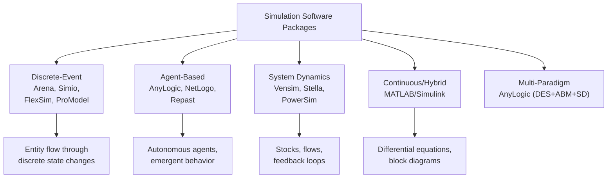

## Simulation Software Packages and Environments

### Overview

Simulation software packages and environments are commercial or open-source platforms purpose-built for constructing, executing, and analyzing simulation models without requiring the modeler to implement low-level infrastructure such as event lists, clocks, or random variate generators from scratch. Unlike general-purpose languages, these tools provide pre-built modeling paradigms — process-flow diagrams, entity-flow blocks, agent templates, or system-dynamics stock-and-flow diagrams — along with built-in statistics collection, animation, experimentation, and optimization features.

**Key Points**
- Packages trade some flexibility for substantially faster model development on standard problem types.
- Most packages fall into one or more of three simulation paradigms: discrete-event, agent-based, and system dynamics; several modern platforms support multiple paradigms within a single environment.
- Packages typically include a graphical modeling interface, a simulation engine, statistical output/analysis tools, and often 2D/3D animation.

### Categories of Simulation Software

**Key Points**
- **Discrete-event simulation (DES) packages** — model systems as sequences of discrete events changing system state at specific points in time (e.g., queues, manufacturing lines, service systems). Examples: Arena, Simio, FlexSim, ProModel.
- **Agent-based modeling (ABM) platforms** — model systems as populations of autonomous, interacting agents with individual behaviors and rules, from which aggregate system behavior emerges. Examples: AnyLogic, NetLogo, Repast.
- **System dynamics (SD) tools** — model systems using stocks, flows, and feedback loops, typically for continuous, aggregate-level behavior over time (e.g., population dynamics, supply chains, policy analysis). Examples: Vensim, Stella, PowerSim.
- **Multi-paradigm platforms** — support combining two or more of the above paradigms in a single model (e.g., an agent-based model that includes discrete-event process logic). AnyLogic is the most commonly cited example of this category.
- **Domain-specific simulation tools** — built for a narrow application area rather than general modeling, such as MATLAB/Simulink for continuous dynamic systems and control engineering, or specialized packages for traffic (VISSIM), logistics, or healthcare.

### Discrete-Event Simulation Packages

#### Arena

**Key Points**
- Developed by Systems Modeling Corporation and later acquired by Rockwell Automation; historically one of the most widely taught and used DES packages in industrial engineering education and practice.
- Built on the SIMAN simulation language and processor, with a graphical flowchart-style modeling interface layered on top.
- Models are constructed by dragging and connecting "modules" (blocks) representing processes such as Create, Process, Decide, Assign, and Dispose, each configured through dialog boxes rather than code.
- Supports embedded Visual Basic for Applications (VBA) code for custom logic beyond the standard module set.
- Commonly used for manufacturing systems, healthcare process flow, call centers, and logistics/supply chain modeling.
- **Output** typically includes standard statistical reports (queue lengths, wait times, resource utilization) generated automatically at the end of a run, along with optional animation of entity flow through the modeled system.

#### Simio

**Key Points**
- A more recent DES package built around an object-oriented, 3D-animation-first design philosophy, where models are constructed from reusable, customizable "objects" rather than flowchart blocks alone.
- Supports both process-based and object-based modeling paradigms within the same environment.
- Includes built-in support for risk-based planning and scheduling in addition to traditional discrete-event analysis.
- Strong native 3D visualization is a frequently cited differentiator relative to older DES packages whose animation capabilities were originally 2D.

#### FlexSim

**Key Points**
- Emphasizes high-fidelity 3D animation and is commonly applied to manufacturing, warehousing, and material-handling system design.
- Uses a drag-and-drop object library (conveyors, queues, processors, sources, sinks) combined with an underlying scripting language (FlexScript, C++-like syntax) for custom logic.
- Frequently used for facility layout validation, where visual/spatial realism aids stakeholder communication in addition to statistical analysis.

#### ProModel

**Key Points**
- Targeted primarily at manufacturing and process-industry simulation, with modeling constructs oriented around production lines, resources, and shift schedules.
- Offers a family of related products (ProModel, MedModel for healthcare, ServiceModel for service industries) tailoring the base engine to specific domains.

### Agent-Based Modeling Platforms

#### AnyLogic

**Key Points**
- A Java-based multi-paradigm platform supporting discrete-event, agent-based, and system dynamics modeling, including combinations of all three within a single model.
- Uses UML-inspired statecharts to define agent behavior, alongside Java code for custom logic — a notable case of a simulation-specific environment being built directly atop a general-purpose language.
- Widely applied in supply chain, healthcare, pedestrian/traffic flow, market/consumer behavior, and epidemiological modeling due to its multi-method flexibility.
- Available in a free Personal Learning Edition alongside commercial Professional and University editions, which has contributed to its adoption in academic settings. [Inference] Specific current licensing terms and edition capabilities should be verified against AnyLogic's official documentation, as vendor licensing structures change over time.

#### NetLogo

**Key Points**
- A free, open-source agent-based modeling environment originally developed for educational use, using a simplified, Logo-derived programming language.
- Well suited to modeling decentralized, emergent phenomena — flocking behavior, epidemic spread, ecological dynamics, segregation models (e.g., the Schelling segregation model is a commonly used built-in example).
- Ships with an extensive "Models Library" of pre-built example models covering biology, social science, physics, and chemistry, making it a common entry point for teaching agent-based modeling concepts.
- Lower performance ceiling for very large agent populations compared to compiled or commercially optimized platforms, though this is generally acceptable given its educational and exploratory focus. [Inference] Precise performance thresholds depend on model complexity, agent count, and hardware, and are not fixed figures.

#### Repast

**Key Points**
- An open-source, Java-based (Repast Simphony) and Python-scriptable agent-based modeling toolkit, oriented more toward research-grade and large-scale agent-based simulation than NetLogo's educational focus.
- Supports geographic information system (GIS) integration, useful for spatially explicit social science and ecological models.
- Offers more programming flexibility than NetLogo at the cost of a steeper learning curve, reflecting a general trade-off between accessibility and control seen across ABM platforms.

### System Dynamics Tools

#### Vensim

**Key Points**
- Widely used for building causal loop diagrams and stock-and-flow models representing feedback structures in systems such as supply chains, epidemiology, corporate strategy, and environmental policy.
- Supports sensitivity analysis, optimization, and model calibration against real-world data.
- Offers a free Personal Learning Edition (PLE) in addition to commercial versions with expanded features. [Inference] As with other vendor products, exact current edition distinctions should be checked against Vensim's official documentation.

#### Stella (and Stella Architect)

**Key Points**
- Known for an intuitive, highly visual stock-and-flow diagramming interface, frequently used in educational contexts to teach systems thinking as much as formal simulation.
- Commonly applied to environmental, ecological, and business dynamics modeling, where communicating feedback structure to non-technical stakeholders is valued alongside quantitative output.

### Multi-Paradigm and Domain-Specific Tools

#### MATLAB/Simulink

**Key Points**
- Simulink, built atop MATLAB, is primarily used for continuous-time and hybrid (continuous/discrete) dynamic system simulation via block-diagram modeling of differential and difference equations.
- Dominant in control systems engineering, signal processing, and embedded systems design, where the underlying models are typically physics-based rather than queueing- or agent-based.
- Distinguishes itself from DES/ABM packages by its origin in numerical computing (MATLAB) rather than discrete-event or agent modeling paradigms, though toolboxes exist for extending it toward discrete-event (SimEvents) and stateflow-based logic modeling.

### Comparing Simulation Paradigms Across Packages

### Core Features Common Across Packages

**Key Points**
- **Graphical model builder** — drag-and-drop or diagram-based construction replacing hand-written event-scheduling code.
- **Built-in statistics engine** — automatic collection of standard performance measures (utilization, queue length, cycle time, throughput) without manual accumulator coding.
- **Random number and distribution support** — built-in libraries of standard probability distributions (exponential, normal, triangular, empirical) selectable through dialog boxes rather than manual variate-generation code.
- **Animation** — 2D or 3D visual representation of the simulated system's dynamics, aiding validation, debugging, and stakeholder communication.
- **Experimentation and scenario management** — tools for running multiple replications, varying input parameters systematically, and comparing scenario outputs.
- **Optimization integration** — many modern packages embed or interface with optimization engines (e.g., OptQuest, embedded in Arena, Simio, and others) to search for parameter settings that optimize a defined objective.
- **Embedded scripting/coding** — nearly all major packages allow custom code (VBA, Java, C++-like scripting, or Python) to extend built-in modules when standard blocks cannot express required logic, reflecting the practical hybridization between simulation-specific and general-purpose approaches noted in the prior topic.

### Choosing a Simulation Software Package

**Key Points**
- **Problem domain fit** — a manufacturing line problem is generally better matched to a DES package like Arena, FlexSim, or ProModel; a social/behavioral emergence problem to an ABM platform like NetLogo or Repast; and a policy/feedback problem to an SD tool like Vensim or Stella.
- **Required visual fidelity** — stakeholder-facing projects (e.g., facility layout approval) may favor packages with strong 3D animation, such as FlexSim or Simio.
- **Budget and licensing** — free/open-source options (NetLogo, Repast, PLE editions of Vensim/AnyLogic) lower the barrier to entry for education and research relative to fully commercial licenses.
- **Need for multi-paradigm modeling** — problems spanning individual behavior and system-level process flow (e.g., a hospital emergency department combining patient-agent behavior with discrete resource/process flow) are natural candidates for AnyLogic's multi-method support.
- **Team familiarity and organizational standardization** — many organizations standardize on a single package to preserve model reusability, training investment, and internal expertise, similarly to how GPL choice is often driven by team background.
- **Extensibility needs** — projects anticipating substantial custom logic beyond standard modules benefit from packages with robust embedded scripting (AnyLogic's Java, Simio's or FlexSim's scripting layers) rather than pure drag-and-drop tools with limited extension points.

### Conclusion

Simulation software packages and environments provide purpose-built alternatives to general-purpose languages by embedding the modeling paradigm, statistics collection, random variate generation, and often animation directly into the tool, substantially reducing development time for standard problem classes. Discrete-event packages (Arena, Simio, FlexSim, ProModel) dominate manufacturing and service-process modeling; agent-based platforms (AnyLogic, NetLogo, Repast) suit systems where emergent behavior from individual agent interactions is the focus; system dynamics tools (Vensim, Stella) address feedback-driven, aggregate-level policy and strategic questions; and multi-paradigm platforms like AnyLogic increasingly blur these boundaries. The choice among them depends on problem domain fit, required visualization, budget, and the anticipated need for custom logic beyond built-in modeling constructs.

**Related Topics**
- Discrete-Event Simulation Fundamentals (Entities, Resources, Queues)
- Agent-Based Modeling Concepts and Emergence
- System Dynamics: Stocks, Flows, and Feedback Loops
- Simulation Optimization Techniques (OptQuest, Genetic Algorithms in Simulation)
- Verification and Validation of Simulation Models
- Output Analysis and Statistical Techniques for Simulation
- Animation and Visualization in Simulation Software
- Hybrid Simulation Modeling (Combining Multiple Paradigms)
- Simulation Software Licensing Models (Commercial vs. Open Source)
- Domain-Specific Simulation Tools (Traffic, Healthcare, Logistics)