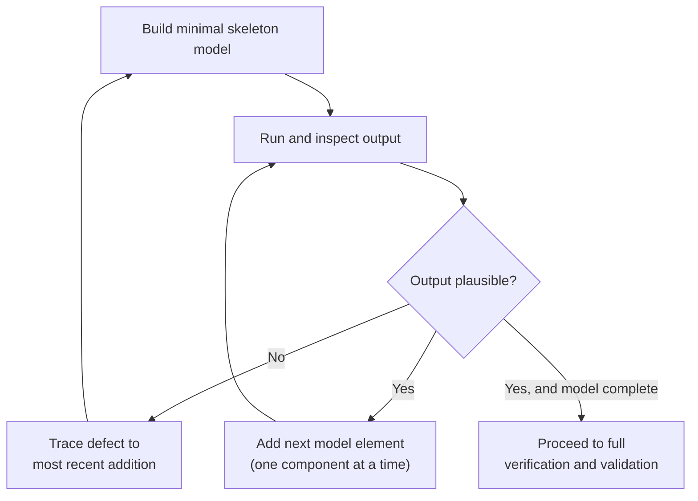
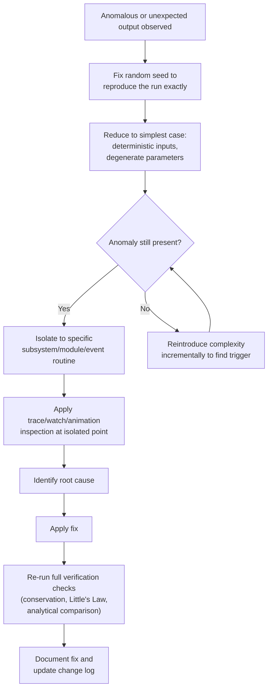

## Model Building and Debugging Practices

### Overview

Model building and debugging practices encompass the systematic methods used to construct a simulation model incrementally, identify defects in its logic or implementation, and verify that it behaves as intended before it is used for analysis or decision-making. These practices apply regardless of whether the model is implemented in a general-purpose language or a simulation-specific package, though the specific techniques used differ somewhat between the two.

**Key Points**
- Model building and debugging are distinct from validation: debugging confirms the model does what the modeler *intended* to program, while validation confirms the model *represents reality* accurately.
- Errors in simulation models are often subtler than in conventional software because incorrect logic can still produce plausible-looking output, making bugs easy to miss without deliberate verification effort.
- Good model-building discipline substantially reduces debugging effort later, since incremental construction isolates where a defect was introduced.

### Incremental Model Construction

**Key Points**
- **Build in stages** — start with a minimal skeleton (e.g., a single entity type flowing through a single process with no resource constraints) and add complexity one element at a time, rather than writing the complete model before running it once.
- **Test after each addition** — run and inspect the model after each incremental change, so that any defect is immediately traceable to the most recently added component.
- **Isolate subsystems** — for large models, build and verify logically separate subsystems independently (e.g., the arrival process, the service process, the routing logic) before integrating them.
- **Start simple, then add stochastic elements** — many practitioners first build and verify a model using deterministic (fixed) input values, confirming the logic is structurally correct, before introducing random variates, since deterministic behavior is far easier to trace and predict by hand.
- **Use simplified or degenerate cases** — test the model with extreme or trivial parameter values (e.g., zero arrival rate, a single server, infinite capacity) where the correct output is obvious or analytically calculable, to catch structural errors that might be masked under typical operating conditions.



### Common Sources of Error in Simulation Models

**Key Points**
- **Logical errors** — incorrect conditional branching, wrong routing decisions, or misapplied business rules that cause entities or agents to behave differently than the modeler intended.
- **Event ordering errors** — particularly in general-purpose language implementations, ties in event time stamps or incorrect priority handling in the event list can cause events to process in an unintended order, subtly corrupting downstream state.
- **Off-by-one and boundary errors** — miscounting entities, resources, or array indices at capacity limits (e.g., a queue that should hold "at most N" instead permitting N+1).
- **Distribution parameter errors** — swapping mean and standard deviation, using the wrong parameterization of a distribution (e.g., rate versus scale for the exponential distribution), or applying a distribution intended for interarrival times to service times or vice versa.
- **Unit and scale mismatches** — mixing time units (e.g., minutes versus hours) between different parts of a model, or between the model and its input data.
- **Uninitialized or incorrectly reset state variables** — particularly relevant when running multiple replications, where state variables, statistics accumulators, or random number seeds must be properly reset (or intentionally carried forward) between runs.
- **Resource leakage or deadlock** — entities that seize a resource but never release it, or circular waiting conditions where entities block each other indefinitely — errors that will typically manifest as the simulation stalling or utilization statistics exceeding logically possible bounds.
- **Copy-paste and template errors** — in package-based modeling, duplicating a module or block for a similar but distinct entity type or process step, and failing to update all relevant parameters in the copy.

### Debugging Techniques for General-Purpose Language Implementations

**Key Points**
- **Trace/print statements** — inserting output statements at key points (event execution, state changes) to print the simulation clock, event type, and relevant state variables, allowing the modeler to manually verify the sequence of events against expectations.
- **Interactive debuggers** — using language-native debugging tools (breakpoints, step-through execution, variable watches) to pause execution at specific events and inspect program state directly.
- **Assertions** — embedding runtime checks (e.g., "queue length must never be negative") that immediately flag logically impossible states rather than allowing them to silently propagate and produce misleading output.
- **Unit testing individual components** — testing random variate generators, individual event routines, or statistics-collection functions in isolation against known expected outputs before integrating them into the full model.
- **Deterministic replay** — fixing the random number seed so that a run can be repeated exactly, which is essential for reproducing and isolating an intermittent-seeming bug that is actually a deterministic consequence of a particular random number sequence.

**Example**

```python
import heapq
import random

random.seed(42)
FEL = []
clock = 0.0
queue_length = 0
served = 0

def interarrival():
    return random.expovariate(1.0 / 5.0)

heapq.heappush(FEL, (interarrival(), "arrival"))

while FEL and served < 20:
    time, event_type = heapq.heappop(FEL)
    clock = time

    # Trace statement: verify event sequence during debugging
    print(f"[DEBUG] t={clock:.3f} event={event_type} queue={queue_length}")

    if event_type == "arrival":
        queue_length += 1
        assert queue_length >= 0, "Queue length went negative"  # assertion check
        served += 1
        heapq.heappush(FEL, (clock + interarrival(), "arrival"))

print(f"Final queue length: {queue_length}")
```

**Output**
Each iteration prints the current clock time, event type, and queue length before processing, allowing the modeler to manually verify that arrivals occur in strictly increasing time order and that the queue length evolves as expected. The `assert` statement will halt execution immediately with a traceback if the queue length ever becomes logically impossible, pinpointing the exact iteration where the error occurred rather than allowing it to surface only in final summary statistics.

### Debugging Techniques for Simulation Software Packages

**Key Points**
- **Animation-based inspection** — visually watching entities move through the model (Arena, Simio, FlexSim, AnyLogic) often reveals logical errors immediately and intuitively — an entity routing to the wrong path, or a resource appearing to serve two entities simultaneously, is often obvious on screen in a way it would not be in raw numeric output.
- **Step/pause execution controls** — most packages allow pausing the simulation at a specific time or event and stepping forward one event at a time, analogous to a breakpoint/step debugger in a GPL.
- **Watch windows / variable inspectors** — built-in panels showing current values of state variables, queue contents, and resource status at the paused simulation time.
- **Trace/event logs** — many packages can generate a textual log of every event processed, serving the same diagnostic role as manually inserted print statements in a GPL implementation.
- **Module-level testing** — verifying a small submodel (e.g., a single Process module with its associated Decide and Assign logic) in isolation, using a simplified upstream Create module with controlled, deterministic entity generation, before embedding it into the larger flow.

### Statistical and Output-Based Debugging Checks

**Key Points**
- **Little's Law consistency checks** — comparing simulation output for average number in system ($L$), average arrival rate ($\lambda$), and average time in system ($W$) against the relationship $L = \lambda W$ can reveal certain classes of bugs, since a substantial and unexplained deviation from this relationship suggests something in the model is misrepresenting flow, timing, or counting.
- **Conservation checks** — verifying that entities are conserved (e.g., total entities created equals total entities disposed plus entities still in system at run end), catching bugs where entities are lost or duplicated.
- **Utilization sanity bounds** — checking that resource utilization statistics fall within logically possible bounds (between 0 and 1 for a single-capacity resource) and are consistent with the input load (a resource with very high offered load but implausibly low utilization may indicate a modeling error rather than a real result).
- **Warm-up period inspection** — plotting a time-series of a key output statistic (e.g., queue length over time) to visually confirm the model reaches steady-state behavior as expected, and to identify an appropriate warm-up period before initialization bias affects analysis. [Inference] The appropriate warm-up length is problem-specific and typically determined through methods such as Welch's graphical procedure rather than a fixed rule.
- **Comparing against known analytical results** — for simplified special cases where a closed-form analytical solution exists (e.g., an M/M/1 queue), running the simulation under those simplified conditions and comparing simulated output against the known analytical formula.

### Debugging Stochastic Models Specifically

**Key Points**
- **Fix random seeds during debugging** — as with GPL implementations, package-based models typically allow fixing or controlling random number seeds so that a specific run can be reproduced exactly while isolating a suspected defect.
- **Distinguish bugs from natural variability** — an unusual-looking single-run result may reflect genuine (if unlikely) stochastic variation rather than a defect; running multiple replications and examining the distribution of outcomes helps distinguish a true anomaly from ordinary randomness.
- **Test with degenerate distributions first** — temporarily replacing a random distribution with its mean value (a constant) removes stochastic noise and makes structural logic errors far easier to detect, before reintroducing randomness once the deterministic logic is confirmed correct.
- **Check random stream independence** — confirming that separate stochastic processes in the model (e.g., interarrival times and service times) are not inadvertently drawing from the same random number stream in a way that introduces spurious correlation between them.

### Documentation and Reproducibility Practices

**Key Points**
- **Version control** — maintaining a history of model changes (particularly important for GPL-based models using standard tools like Git, but also relevant to saved package model files) so that a newly introduced bug can be isolated by comparing against a known-working prior version.
- **Change logs** — recording what was modified, when, and why at each stage of model development, supporting both debugging and later validation/audit needs.
- **Documenting assumptions and known limitations** — recording simplifying assumptions made during model construction, since a result that looks like a bug may actually be the correct consequence of a documented simplification.
- **Recording random seed and configuration per run** — ensuring that any specific simulation run (and any anomalous or bug-triggering result) can be exactly reproduced for later inspection.

### A Structured Debugging Workflow



### Conclusion

Effective model building and debugging in simulation rests on disciplined incremental construction, deliberate use of simplified and deterministic test cases to isolate structural errors from stochastic noise, and systematic verification against logical and statistical consistency checks such as conservation of entities and Little's Law. General-purpose language implementations rely more heavily on conventional software debugging tools (trace statements, debuggers, assertions, unit tests), while simulation packages leverage built-in animation, step execution, and trace logs to achieve the same diagnostic goals through largely visual means. In both cases, reproducibility — through fixed random seeds, version control, and documented assumptions — is what allows a modeler to reliably trace an anomalous result back to its root cause rather than treating each debugging session as a fresh investigation.

**Related Topics**
- Verification versus Validation of Simulation Models
- Warm-Up Period Determination and Initialization Bias
- Output Analysis: Confidence Intervals and Replications
- Little's Law and Queueing Theory Consistency Checks
- Random Number Stream Management and Common Random Numbers
- Analytical Queueing Models for Benchmarking (M/M/1, M/M/c)
- Version Control Practices for Simulation Models
- Sensitivity Analysis in Simulation
- Animation and Visualization Techniques for Model Inspection
- Documentation Standards for Simulation Studies